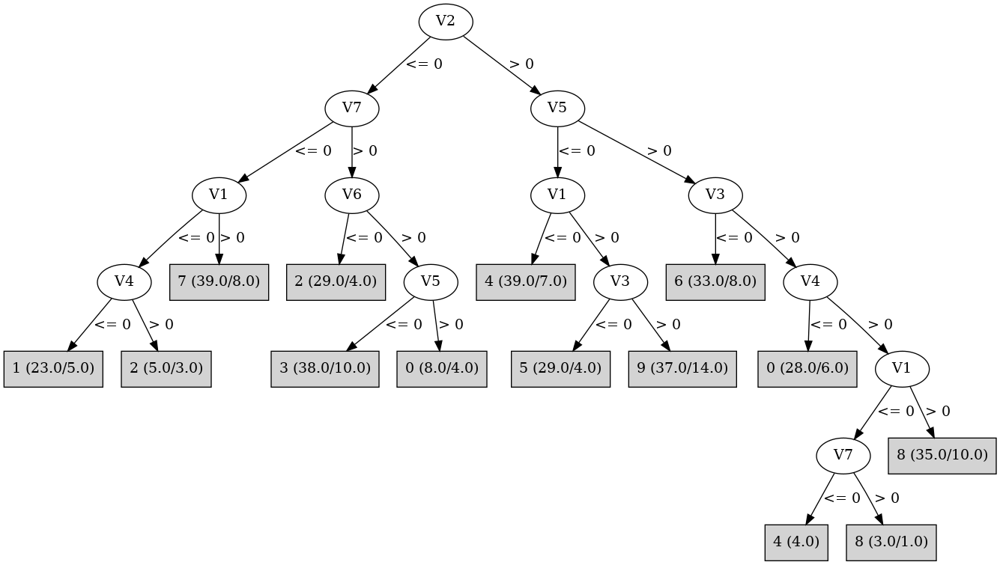

# J48

# SimpleCart Decision Tree

V2 < 0.5

* V7 < 0.5

*   * V1 < 0.5

*   *   * V4 < 0.5

*   *   *   * V6 < 0.5: 1(2.0/1.0)

*   *   *   * V6 >= 0.5: 1(16.0/4.0)

*   *   * V4 >= 0.5: 2(2.0/3.0)

*   * V1 >= 0.5

*   *   * V4 < 0.5

*   *   *   * V5 < 0.5

*   *   *   *   * V6 < 0.5: 7(5.0/0.0)

*   *   *   *   * V6 >= 0.5: 7(19.0/1.0)

*   *   *   * V5 >= 0.5: 7(4.0/1.0)

*   *   * V4 >= 0.5

*   *   *   * V5 < 0.5: 7(3.0/1.0)

*   *   *   * V5 >= 0.5: 2(3.0/2.0)

* V7 >= 0.5

*   * V6 < 0.5

*   *   * V5 < 0.5: 2(5.0/4.0)

*   *   * V5 >= 0.5: 2(20.0/0.0)

*   * V6 >= 0.5

*   *   * V4 < 0.5

*   *   *   * V5 < 0.5: 3(3.0/7.0)

*   *   *   * V5 >= 0.5

*   *   *   *   * V3 < 0.5: 0(1.0/2.0)

*   *   *   *   * V3 >= 0.5: 0(3.0/0.0)

*   *   * V4 >= 0.5: 3(25.0/5.0)

V2 >= 0.5

* V5 < 0.5

*   * V1 < 0.5

*   *   * V7 < 0.5

*   *   *   * V4 < 0.5: 4(2.0/1.0)

*   *   *   * V4 >= 0.5: 4(25.0/0.0)

*   *   * V7 >= 0.5: 4(5.0/6.0)

*   * V1 >= 0.5

*   *   * V3 < 0.5

*   *   *   * V4 < 0.5: 5(3.0/1.0)

*   *   *   * V4 >= 0.5

*   *   *   *   * V6 < 0.5: 5(3.0/0.0)

*   *   *   *   * V6 >= 0.5

*   *   *   *   *   * V7 < 0.5: 5(3.0/0.0)

*   *   *   *   *   * V7 >= 0.5: 5(16.0/3.0)

*   *   * V3 >= 0.5

*   *   *   * V4 < 0.5: 9(4.0/3.0)

*   *   *   * V4 >= 0.5

*   *   *   *   * V7 < 0.5: 9(3.0/1.0)

*   *   *   *   * V7 >= 0.5: 9(16.0/10.0)

* V5 >= 0.5

*   * V3 < 0.5: 6(25.0/8.0)

*   * V3 >= 0.5

*   *   * V4 < 0.5

*   *   *   * V6 < 0.5: 0(2.0/1.0)

*   *   *   * V6 >= 0.5

*   *   *   *   * V1 < 0.5: 0(3.0/1.0)

*   *   *   *   * V1 >= 0.5: 0(17.0/4.0)

*   *   * V4 >= 0.5

*   *   *   * V1 < 0.5

*   *   *   *   * V7 < 0.5: 4(4.0/0.0)

*   *   *   *   * V7 >= 0.5: 8(2.0/1.0)

*   *   *   * V1 >= 0.5

*   *   *   *   * V6 < 0.5: 8(4.0/3.0)

*   *   *   *   * V6 >= 0.5: 8(21.0/7.0)

# PART

Decision list:

conditions|predicted class
---|---
V2 <= 0.0 AND V7 <= 0.0 AND V1 > 0.0 AND V5 <= 0.0| 7 (29.0/2.0)
V5 > 0.0 AND V6 <= 0.0 AND V2 <= 0.0 AND V4 > 0.0| 2 (23.0/1.0)
V5 > 0.0 AND V3 <= 0.0 AND V6 > 0.0| 6 (35.0/8.0)
V2 <= 0.0 AND V4 > 0.0 AND V3 > 0.0| 3 (39.0/10.0)
V2 <= 0.0 AND V1 <= 0.0 AND V5 <= 0.0| 1 (23.0/5.0)
V1 <= 0.0 AND V4 > 0.0 AND V7 <= 0.0| 4 (29.0)
V3 <= 0.0 AND V5 <= 0.0| 5 (38.0/9.0)
V5 > 0.0 AND V2 > 0.0 AND V4 > 0.0| 8 (39.0/12.0)
V5 > 0.0 AND V7 > 0.0 AND V6 > 0.0| 0 (26.0/5.0)
V5 > 0.0 AND V2 > 0.0| 0 (6.0/2.0)
V5 > 0.0 AND V7 <= 0.0 AND V1 > 0.0| 7 (5.0/1.0)
V6 <= 0.0 AND V2 <= 0.0| 2 (4.0)
V1 <= 0.0 AND V4 > 0.0| 4 (6.0/3.0)
V1 <= 0.0 AND V2 > 0.0| 4 (4.0/2.0)
V1 > 0.0| 9 (42.0/18.0)
| 1 (2.0)

# JRip

Decision list:

conditions|predicted class
---|---
(V1 <= 0) and (V4 <= 0) and (V2 <= 0)|1 (28.0/8.0)
(V3 <= 0) and (V5 >= 1) and (V6 >= 1)|6 (35.0/8.0)
(V4 <= 0) and (V5 >= 1) and (V2 >= 1)|0 (29.0/7.0)
(V2 >= 1) and (V3 >= 1) and (V5 <= 0) and (V1 >= 1)|9 (37.0/14.0)
(V3 <= 0) and (V2 >= 1) and (V1 >= 1)|5 (30.0/5.0)
(V2 <= 0) and (V7 >= 1) and (V6 >= 1) and (V4 >= 1)|3 (29.0/4.0)
(V4 <= 0) and (V7 <= 0)|7 (33.0/5.0)
(V6 <= 0) and (V5 >= 1)|2 (31.0/5.0)
(V1 <= 0) and (V7 <= 0)|4 (32.0/1.0)
|8 (66.0/42.0)

# Decision Table

Non matches covered by Majority class

v1|v2|v3|v4|v5|target
---|---|---|---|---|---
(-inf-0.5]|(0.5-inf)|(0.5-inf)|(0.5-inf)|(0.5-inf)|4
(0.5-inf)|(0.5-inf)|(0.5-inf)|(0.5-inf)|(0.5-inf)|8
(0.5-inf)|(-inf-0.5]|(0.5-inf)|(0.5-inf)|(0.5-inf)|2
(-inf-0.5]|(-inf-0.5]|(0.5-inf)|(0.5-inf)|(0.5-inf)|2
(-inf-0.5]|(0.5-inf)|(-inf-0.5]|(0.5-inf)|(0.5-inf)|6
(0.5-inf)|(0.5-inf)|(-inf-0.5]|(0.5-inf)|(0.5-inf)|6
(-inf-0.5]|(-inf-0.5]|(-inf-0.5]|(0.5-inf)|(0.5-inf)|0
(0.5-inf)|(-inf-0.5]|(-inf-0.5]|(0.5-inf)|(0.5-inf)|2
(0.5-inf)|(0.5-inf)|(0.5-inf)|(-inf-0.5]|(0.5-inf)|0
(-inf-0.5]|(0.5-inf)|(0.5-inf)|(-inf-0.5]|(0.5-inf)|0
(-inf-0.5]|(0.5-inf)|(0.5-inf)|(0.5-inf)|(-inf-0.5]|4
(-inf-0.5]|(-inf-0.5]|(0.5-inf)|(-inf-0.5]|(0.5-inf)|1
(0.5-inf)|(0.5-inf)|(0.5-inf)|(0.5-inf)|(-inf-0.5]|9
(0.5-inf)|(-inf-0.5]|(0.5-inf)|(-inf-0.5]|(0.5-inf)|7
(0.5-inf)|(0.5-inf)|(-inf-0.5]|(-inf-0.5]|(0.5-inf)|6
(-inf-0.5]|(-inf-0.5]|(0.5-inf)|(0.5-inf)|(-inf-0.5]|3
(0.5-inf)|(-inf-0.5]|(0.5-inf)|(0.5-inf)|(-inf-0.5]|3
(0.5-inf)|(-inf-0.5]|(-inf-0.5]|(-inf-0.5]|(0.5-inf)|0
(0.5-inf)|(0.5-inf)|(-inf-0.5]|(0.5-inf)|(-inf-0.5]|5
(-inf-0.5]|(0.5-inf)|(-inf-0.5]|(0.5-inf)|(-inf-0.5]|4
(-inf-0.5]|(0.5-inf)|(0.5-inf)|(-inf-0.5]|(-inf-0.5]|4
(0.5-inf)|(-inf-0.5]|(-inf-0.5]|(0.5-inf)|(-inf-0.5]|6
(0.5-inf)|(0.5-inf)|(0.5-inf)|(-inf-0.5]|(-inf-0.5]|9
(-inf-0.5]|(-inf-0.5]|(0.5-inf)|(-inf-0.5]|(-inf-0.5]|1
(0.5-inf)|(-inf-0.5]|(0.5-inf)|(-inf-0.5]|(-inf-0.5]|7
(0.5-inf)|(0.5-inf)|(-inf-0.5]|(-inf-0.5]|(-inf-0.5]|5
(-inf-0.5]|(-inf-0.5]|(-inf-0.5]|(-inf-0.5]|(-inf-0.5]|1
(0.5-inf)|(-inf-0.5]|(-inf-0.5]|(-inf-0.5]|(-inf-0.5]|7

