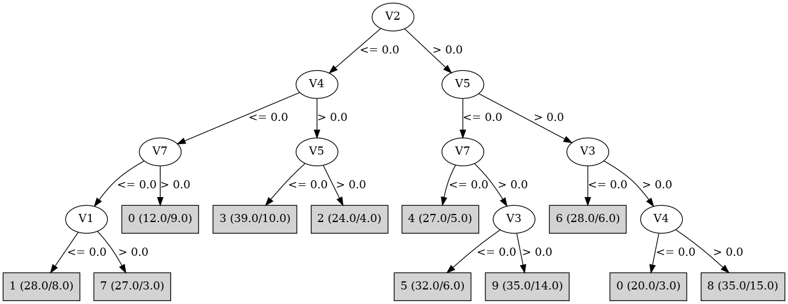

# J48

# SimpleCart Decision Tree

V2 < 0.5

* V7 < 0.5

*   * V1 < 0.5

*   *   * V4 < 0.5: 1(23.0/8.0)

*   *   * V4 >= 0.5: 4(2.0/2.0)

*   * V1 >= 0.5

*   *   * V4 < 0.5

*   *   *   * V3 < 0.5: 7(2.0/1.0)

*   *   *   * V3 >= 0.5

*   *   *   *   * V6 < 0.5: 7(4.0/1.0)

*   *   *   *   * V6 >= 0.5

*   *   *   *   *   * V5 < 0.5: 7(19.0/2.0)

*   *   *   *   *   * V5 >= 0.5: 7(3.0/0.0)

*   *   * V4 >= 0.5: 2(3.0/2.0)

* V7 >= 0.5

*   * V6 < 0.5

*   *   * V5 < 0.5: 2(5.0/7.0)

*   *   * V5 >= 0.5: 2(20.0/0.0)

*   * V6 >= 0.5

*   *   * V5 < 0.5

*   *   *   * V4 < 0.5: 3(3.0/5.0)

*   *   *   * V4 >= 0.5: 3(24.0/2.0)

*   *   * V5 >= 0.5

*   *   *   * V4 < 0.5: 0(4.0/1.0)

*   *   *   * V4 >= 0.5: 8(2.0/2.0)

V2 >= 0.5

* V5 < 0.5

*   * V1 < 0.5

*   *   * V7 < 0.5: 4(23.0/1.0)

*   *   * V7 >= 0.5

*   *   *   * V3 < 0.5: 4(2.0/1.0)

*   *   *   * V3 >= 0.5: 9(5.0/3.0)

*   * V1 >= 0.5

*   *   * V3 < 0.5: 5(28.0/6.0)

*   *   * V3 >= 0.5

*   *   *   * V7 < 0.5: 9(3.0/4.0)

*   *   *   * V7 >= 0.5

*   *   *   *   * V4 < 0.5: 9(3.0/2.0)

*   *   *   *   * V4 >= 0.5: 9(16.0/12.0)

* V5 >= 0.5

*   * V3 < 0.5: 6(24.0/6.0)

*   * V3 >= 0.5

*   *   * V4 < 0.5: 0(20.0/3.0)

*   *   * V4 >= 0.5

*   *   *   * V7 < 0.5

*   *   *   *   * V1 < 0.5: 4(4.0/0.0)

*   *   *   *   * V1 >= 0.5: 8(2.0/1.0)

*   *   *   * V7 >= 0.5

*   *   *   *   * V6 < 0.5: 8(4.0/2.0)

*   *   *   *   * V6 >= 0.5

*   *   *   *   *   * V1 < 0.5: 8(2.0/2.0)

*   *   *   *   *   * V1 >= 0.5: 8(16.0/8.0)

# PART

Decision list:

conditions|predicted class
---|---
V2 <= 0.0 AND V4 > 0.0 AND V5 > 0.0 AND V6 <= 0.0| 2 (21.0)
V2 <= 0.0 AND V7 <= 0.0 AND V4 <= 0.0 AND V1 > 0.0| 7 (32.0/4.0)
V5 > 0.0 AND V3 <= 0.0| 6 (33.0/8.0)
V5 > 0.0 AND V4 <= 0.0 AND V1 > 0.0| 0 (24.0/3.0)
V7 <= 0.0 AND V4 > 0.0 AND V1 <= 0.0| 4 (29.0/1.0)
V2 <= 0.0 AND V7 > 0.0 AND V5 <= 0.0| 3 (46.0/14.0)
V2 <= 0.0 AND V7 <= 0.0| 1 (33.0/10.0)
V3 > 0.0 AND V5 > 0.0 AND V4 > 0.0| 8 (41.0/15.0)
V3 > 0.0 AND V4 > 0.0| 9 (41.0/17.0)
V3 <= 0.0| 5 (37.0/8.0)
V7 > 0.0 AND V1 > 0.0| 9 (5.0/2.0)
V5 <= 0.0| 4 (4.0/2.0)
| 0 (4.0/2.0)

# JRip

Decision list:

conditions|predicted class
---|---
(V4 <= 0) and (V1 <= 0)|1 (40.0/14.0)
(V3 <= 0) and (V5 >= 1)|6 (35.0/10.0)
(V5 >= 1) and (V4 <= 0) and (V2 >= 1)|0 (22.0/3.0)
(V2 >= 1) and (V3 >= 1) and (V5 <= 0) and (V7 >= 1)|9 (41.0/17.0)
(V3 <= 0) and (V7 >= 1)|5 (41.0/10.0)
(V5 >= 1) and (V2 >= 1) and (V1 >= 1)|8 (32.0/11.0)
(V2 >= 1) and (V7 <= 0) and (V1 <= 0)|4 (26.0/0.0)
(V6 <= 0) and (V5 >= 1)|2 (22.0/2.0)
(V7 <= 0) and (V2 <= 0) and (V1 >= 1)|7 (32.0/4.0)
|3 (59.0/28.0)

# Decision Table

Non matches covered by IB1

v2|v3|v5|v7|target
---|---|---|---|---
(-inf-0.5]|(0.5-inf)|(0.5-inf)|(0.5-inf)|2
(0.5-inf)|(0.5-inf)|(0.5-inf)|(0.5-inf)|8
(-inf-0.5]|(-inf-0.5]|(0.5-inf)|(0.5-inf)|2
(0.5-inf)|(-inf-0.5]|(0.5-inf)|(0.5-inf)|6
(0.5-inf)|(0.5-inf)|(-inf-0.5]|(0.5-inf)|9
(-inf-0.5]|(0.5-inf)|(-inf-0.5]|(0.5-inf)|3
(0.5-inf)|(-inf-0.5]|(-inf-0.5]|(0.5-inf)|5
(-inf-0.5]|(0.5-inf)|(0.5-inf)|(-inf-0.5]|2
(0.5-inf)|(0.5-inf)|(0.5-inf)|(-inf-0.5]|4
(-inf-0.5]|(-inf-0.5]|(-inf-0.5]|(0.5-inf)|3
(0.5-inf)|(-inf-0.5]|(0.5-inf)|(-inf-0.5]|6
(-inf-0.5]|(0.5-inf)|(-inf-0.5]|(-inf-0.5]|7
(0.5-inf)|(0.5-inf)|(-inf-0.5]|(-inf-0.5]|4
(0.5-inf)|(-inf-0.5]|(-inf-0.5]|(-inf-0.5]|4
(-inf-0.5]|(-inf-0.5]|(-inf-0.5]|(-inf-0.5]|1

