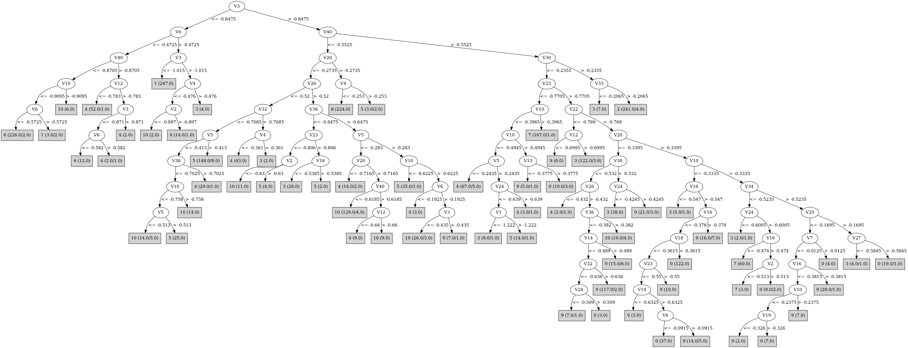

# J48

# SimpleCart Decision Tree

V23 < -0.235

* V3 < -0.944

*   * V6 < -0.5005

*   *   * V40 < -0.8494999999999999: 6(333.0/6.0)

*   *   * V40 >= -0.8494999999999999

*   *   *   * V12 < -0.859: 4(16.0/0.0)

*   *   *   * V12 >= -0.859: 6(7.0/1.0)

*   * V6 >= -0.5005: 1(372.0/5.0)

* V3 >= -0.944

*   * V30 < -1.0510000000000002

*   *   * V3 < -0.624

*   *   *   * V24 < -0.978: 5(11.0/0.0)

*   *   *   * V24 >= -0.978

*   *   *   *   * V27 < -0.862: 4(24.0/0.0)

*   *   *   *   * V27 >= -0.862: 6(6.0/1.0)

*   *   * V3 >= -0.624: 8(322.0/0.0)

*   * V30 >= -1.0510000000000002

*   *   * V40 < -0.5455000000000001

*   *   *   * V26 < -0.466

*   *   *   *   * V5 < -0.4125

*   *   *   *   *   * V38 < -0.7024999999999999

*   *   *   *   *   *   * V10 < -0.855

*   *   *   *   *   *   *   * V3 < -0.8145

*   *   *   *   *   *   *   *   * V22 < -0.8385: 4(16.0/4.0)

*   *   *   *   *   *   *   *   * V22 >= -0.8385: 6(9.0/0.0)

*   *   *   *   *   *   *   * V3 >= -0.8145: 5(13.0/0.0)

*   *   *   *   *   *   * V10 >= -0.855

*   *   *   *   *   *   *   * V24 < -0.9035: 5(11.0/5.0)

*   *   *   *   *   *   *   * V24 >= -0.9035: 10(70.0/6.0)

*   *   *   *   *   * V38 >= -0.7024999999999999

*   *   *   *   *   *   * V9 < -0.4085: 4(136.0/7.0)

*   *   *   *   *   *   * V9 >= -0.4085: 10(8.0/0.0)

*   *   *   *   * V5 >= -0.4125

*   *   *   *   *   * V33 < -0.5275000000000001

*   *   *   *   *   *   * V30 < -0.7585

*   *   *   *   *   *   *   * V10 < -0.5985: 5(242.0/18.0)

*   *   *   *   *   *   *   * V10 >= -0.5985: 10(6.0/4.0)

*   *   *   *   *   *   * V30 >= -0.7585: 3(11.0/1.0)

*   *   *   *   *   * V33 >= -0.5275000000000001: 4(28.0/6.0)

*   *   *   * V26 >= -0.466

*   *   *   *   * V10 < -0.719

*   *   *   *   *   * V23 < -0.696

*   *   *   *   *   *   * V2 < -0.573

*   *   *   *   *   *   *   * V38 < -0.677: 10(10.0/2.0)

*   *   *   *   *   *   *   * V38 >= -0.677: 4(21.0/5.0)

*   *   *   *   *   *   * V2 >= -0.573: 5(10.0/0.0)

*   *   *   *   *   * V23 >= -0.696: 3(32.0/2.0)

*   *   *   *   * V10 >= -0.719

*   *   *   *   *   * V3 < -0.385

*   *   *   *   *   *   * V8 < -0.405: 10(159.0/6.0)

*   *   *   *   *   *   * V8 >= -0.405

*   *   *   *   *   *   *   * V10 < -0.6085: 5(13.0/7.0)

*   *   *   *   *   *   *   * V10 >= -0.6085: 10(42.0/10.0)

*   *   *   *   *   * V3 >= -0.385

*   *   *   *   *   *   * V1 < -1.0685: 8(16.0/0.0)

*   *   *   *   *   *   * V1 >= -1.0685: 9(8.0/2.0)

*   *   * V40 >= -0.5455000000000001

*   *   *   * V10 < -0.3185

*   *   *   *   * V20 < -0.3405

*   *   *   *   *   * V36 < -0.5754999999999999: 3(155.0/11.0)

*   *   *   *   *   * V36 >= -0.5754999999999999

*   *   *   *   *   *   * V23 < -0.7885

*   *   *   *   *   *   *   * V3 < -0.535: 4(79.0/8.0)

*   *   *   *   *   *   *   * V3 >= -0.535

*   *   *   *   *   *   *   *   * V24 < -0.6765000000000001: 5(15.0/0.0)

*   *   *   *   *   *   *   *   * V24 >= -0.6765000000000001: 7(6.0/11.0)

*   *   *   *   *   *   * V23 >= -0.7885

*   *   *   *   *   *   *   * V22 < -0.825: 3(32.0/4.0)

*   *   *   *   *   *   *   * V22 >= -0.825

*   *   *   *   *   *   *   *   * V30 < -0.4265

*   *   *   *   *   *   *   *   *   * V14 < -0.553

*   *   *   *   *   *   *   *   *   *   * V32 < -0.6715: 0(6.0/2.0)

*   *   *   *   *   *   *   *   *   *   * V32 >= -0.6715: 9(156.0/7.0)

*   *   *   *   *   *   *   *   *   * V14 >= -0.553

*   *   *   *   *   *   *   *   *   *   * V23 < -0.655

*   *   *   *   *   *   *   *   *   *   *   * V3 < -0.4725: 10(16.0/1.0)

*   *   *   *   *   *   *   *   *   *   *   * V3 >= -0.4725: 0(3.0/6.0)

*   *   *   *   *   *   *   *   *   *   * V23 >= -0.655: 9(42.0/13.0)

*   *   *   *   *   *   *   *   * V30 >= -0.4265: 3(17.0/0.0)

*   *   *   *   * V20 >= -0.3405

*   *   *   *   *   * V24 < -0.598: 3(29.0/6.0)

*   *   *   *   *   * V24 >= -0.598

*   *   *   *   *   *   * V30 < -0.579

*   *   *   *   *   *   *   * V2 < -0.6165: 7(11.0/3.0)

*   *   *   *   *   *   *   * V2 >= -0.6165

*   *   *   *   *   *   *   *   * V12 < -0.631: 9(8.0/2.0)

*   *   *   *   *   *   *   *   * V12 >= -0.631: 0(233.0/17.0)

*   *   *   *   *   *   * V30 >= -0.579

*   *   *   *   *   *   *   * V36 < -0.3935

*   *   *   *   *   *   *   *   * V30 < -0.417: 9(27.0/7.0)

*   *   *   *   *   *   *   *   * V30 >= -0.417: 3(7.0/2.0)

*   *   *   *   *   *   *   * V36 >= -0.3935: 0(23.0/1.0)

*   *   *   * V10 >= -0.3185

*   *   *   *   * V34 < -0.522

*   *   *   *   *   * V23 < -0.618

*   *   *   *   *   *   * V16 < -0.4595: 7(323.0/3.0)

*   *   *   *   *   *   * V16 >= -0.4595: 0(7.0/6.0)

*   *   *   *   *   * V23 >= -0.618: 3(8.0/1.0)

*   *   *   *   * V34 >= -0.522

*   *   *   *   *   * V20 < -0.255: 9(51.0/7.0)

*   *   *   *   *   * V20 >= -0.255

*   *   *   *   *   *   * V39 < -0.365: 9(10.0/0.0)

*   *   *   *   *   *   * V39 >= -0.365

*   *   *   *   *   *   *   * V22 < -0.5705: 3(6.0/2.0)

*   *   *   *   *   *   *   * V22 >= -0.5705

*   *   *   *   *   *   *   *   * V23 < -0.472: 0(28.0/0.0)

*   *   *   *   *   *   *   *   * V23 >= -0.472: 0(8.0/6.0)

V23 >= -0.235

* V20 < -0.35: 3(7.0/0.0)

* V20 >= -0.35

*   * V2 < -0.1015: 2(353.0/1.0)

*   * V2 >= -0.1015: 0(2.0/5.0)

# PART

Decision list:

conditions|predicted class
---|---
V3 <= -0.833 AND V6 <= -0.558 AND V40 <= -0.85 AND V30 <= -0.994 AND V12 > -0.994| 6 (330.0/1.0)
V40 <= -0.553 AND V3 <= -1.021 AND V9 > -0.717| 1 (372.0)
V40 <= -0.55 AND V20 > -0.267 AND V14 <= -0.485| 8 (335.0)
V20 > -0.353 AND V23 > -0.288 AND V34 <= -0.276 AND V2 <= -0.161| 2 (352.0/1.0)
V40 <= -0.55 AND V20 <= -0.729 AND V38 > -0.8 AND V3 <= -0.725 AND V27 <= -0.792 AND V30 <= -0.886 AND V33 > -0.778 AND V38 > -0.767| 4 (139.0)
V40 <= -0.55 AND V20 <= -0.794 AND V24 > -0.984 AND V6 > -0.696 AND V37 > -0.932 AND V40 > -0.806 AND V35 > -0.538| 4 (31.0)
V40 <= -0.55 AND V20 <= -0.869 AND V38 > -0.863 AND V28 <= -0.801| 4 (17.0/1.0)
V40 <= -0.55 AND V33 > -0.53 AND V25 <= -0.571 AND V36 > -0.59| 4 (41.0)
V40 <= -0.551 AND V3 <= -0.809 AND V4 <= -0.51 AND V10 <= -0.904 AND V13 <= -0.816| 6 (23.0)
V40 <= -0.55 AND V10 > -0.639 AND V26 > -0.571 AND V3 <= -0.491 AND V32 <= -0.523 AND V20 <= -0.373 AND V14 > -0.696| 10 (129.0/1.0)
V40 <= -0.55 AND V30 <= -0.749 AND V5 > -0.416 AND V33 <= -0.528 AND V1 <= -1.088 AND V10 <= -0.592 AND V13 > -0.643 AND V40 <= -0.607 AND V2 > -0.74 AND V1 <= -1.136| 5 (202.0)
V6 <= -0.221 AND V24 <= -0.89 AND V2 > -0.918| 5 (41.0/1.0)
V6 <= -0.221 AND V40 <= -0.691 AND V10 > -0.852 AND V8 <= -0.504 AND V29 > -0.719| 10 (105.0)
V20 > -0.353 AND V23 <= -0.723 AND V33 > -0.453 AND V10 > -0.341 AND V14 <= -0.491 AND V29 > -0.573| 7 (285.0/1.0)
V30 > -0.781 AND V22 <= -0.797 AND V23 > -0.762| 3 (207.0/1.0)
V30 > -0.79 AND V33 > -0.458 AND V20 <= -0.347 AND V30 <= -0.534 AND V14 <= -0.57 AND V37 > -0.817 AND V23 > -0.77| 9 (153.0)
V20 > -0.424 AND V40 <= -0.558 AND V16 <= -0.397| 5 (22.0/1.0)
V20 > -0.424 AND V16 <= -0.514 AND V30 <= -0.608 AND V10 > -0.389 AND V22 <= -0.583| 7 (52.0)
V20 > -0.424 AND V33 > -0.451 AND V30 <= -0.608 AND V10 <= -0.202 AND V23 > -0.816 AND V36 > -0.529 AND V14 > -0.626 AND V40 > -0.531 AND V18 > -0.365 AND V6 <= -0.01| 0 (167.0)
V23 <= -0.818 AND V34 > -0.864 AND V5 <= -0.244 AND V36 > -0.625 AND V30 <= -0.847 AND V40 > -0.703| 4 (89.0/1.0)
V33 <= -0.451 AND V5 <= -0.342 AND V10 > -0.852 AND V20 > -0.663| 10 (31.0/1.0)
V26 > -0.412 AND V10 <= -0.638 AND V23 > -0.659 AND V24 <= -0.438| 3 (40.0)
V26 > -0.412 AND V10 <= -0.638 AND V5 > -0.242| 3 (10.0/3.0)
V26 > -0.412 AND V10 <= -0.638 AND V1 <= -0.965 AND V30 <= -0.819| 4 (9.0)
V26 > -0.412 AND V40 <= -0.509 AND V3 > -0.385 AND V24 > -0.297| 9 (19.0/1.0)
V26 > -0.412 AND V40 <= -0.509 AND V1 > -1.112 AND V36 > -0.586 AND V8 <= -0.272 AND V23 > -0.829| 10 (34.0)
V10 <= -0.643 AND V34 <= -0.864| 10 (20.0)
V26 > -0.412 AND V20 > -0.353 AND V23 <= -0.485 AND V10 <= -0.151 AND V22 > -0.776 AND V6 <= -0.093 AND V23 <= -0.552 AND V16 <= -0.429| 0 (63.0)
V26 > -0.412 AND V26 > -0.103 AND V36 > -0.415 AND V23 <= -0.366| 0 (32.0)
V26 > -0.412 AND V20 <= -0.181 AND V37 <= -0.762 AND V19 > -0.448 AND V15 > -0.381| 0 (13.0)
V26 > -0.412 AND V20 <= -0.181 AND V32 > -0.643 AND V30 > -0.452 AND V34 <= -0.433| 3 (37.0/1.0)
V26 > -0.412 AND V20 <= -0.181 AND V30 > -0.705 AND V22 <= -0.73 AND V3 <= -0.433| 3 (8.0)
V26 > -0.412 AND V20 <= -0.181 AND V10 > -0.641 AND V4 > -0.33 AND V30 > -0.753 AND V27 > -0.679 AND V20 <= -0.29 AND V16 > -0.49 AND V20 > -0.445| 9 (85.0)
V26 <= -0.412 AND V10 > -0.513 AND V23 > -0.819| 9 (10.0)
V26 <= -0.412 AND V23 <= -0.966 AND V10 <= -0.868| 6 (7.0/1.0)
V26 <= -0.412 AND V27 <= -0.938 AND V23 > -0.887| 3 (25.0)
V26 <= -0.412 AND V1 > -1.002 AND V6 <= -0.225| 4 (8.0)
V26 <= -0.412 AND V1 <= -1.002 AND V13 > -0.574 AND V26 <= -0.451 AND V10 <= -0.579| 5 (55.0)
V30 > -0.712 AND V20 <= -0.169 AND V24 > -0.574 AND V20 <= -0.443 AND V27 > -0.551 AND V9 > -0.218| 9 (17.0)
V30 > -0.712 AND V27 <= -0.676 AND V12 > -0.517| 3 (14.0)
V25 > -0.496 AND V20 > -0.181 AND V16 > -0.467 AND V23 <= -0.076 AND V10 <= -0.191| 0 (17.0/1.0)
V33 <= -0.478 AND V24 <= -0.577 AND V9 > -0.519 AND V6 > -0.284| 5 (9.0/2.0)
V23 <= -0.839 AND V10 <= -0.443 AND V35 > -0.618 AND V6 <= -0.149 AND V13 <= -0.581| 4 (8.0)
V23 > -0.839 AND V23 <= -0.008 AND V20 > -0.442 AND V20 <= -0.18 AND V4 <= -0.33| 0 (8.0/2.0)
V23 > -0.839 AND V23 <= -0.008 AND V20 > -0.18 AND V1 <= -0.904| 7 (9.0)
V23 > -0.839 AND V23 <= -0.008 AND V20 > -0.426 AND V40 > -0.453 AND V36 <= -0.499 AND V7 > -0.293| 9 (7.0)
V23 > -0.839 AND V23 <= -0.008 AND V20 > -0.426 AND V40 > -0.453 AND V18 <= -0.242 AND V10 > -0.265| 9 (19.0)
V23 > -0.839 AND V30 > -0.395 AND V36 > -0.313| 0 (7.0/1.0)
V23 > -0.839 AND V30 <= -0.33 AND V20 > -0.383 AND V24 <= -0.429 AND V30 > -0.697| 9 (11.0)
V23 > -0.839 AND V26 <= -0.1 AND V20 > -0.383 AND V16 <= -0.38 AND V25 > -0.41 AND V20 > -0.308| 0 (26.0)
V25 <= -0.156 AND V23 > -0.839 AND V29 > -0.41 AND V36 <= -0.344 AND V30 > -0.636 AND V38 > -0.433| 9 (21.0/1.0)
V30 <= -0.341 AND V30 <= -0.869 AND V23 <= -0.926| 8 (6.0/4.0)
V26 <= -0.1 AND V30 <= -0.869| 5 (6.0/1.0)
V26 <= -0.1 AND V14 <= -0.642 AND V2 <= -0.647| 9 (6.0/3.0)
V23 <= -0.345 AND V14 > -0.642 AND V3 <= -0.456 AND V33 > -0.45 AND V30 <= -0.719 AND V17 > -0.696| 4 (8.0)
V26 <= -0.1 AND V36 <= -0.514 AND V30 > -0.791| 9 (11.0)
V26 <= -0.1 AND V1 > -0.986 AND V40 <= -0.43| 10 (18.0/2.0)
V25 <= -0.156 AND V26 > -0.384 AND V6 <= -0.078| 0 (6.0/1.0)
V25 <= -0.171 AND V10 <= -0.472| 4 (6.0/4.0)
V4 <= -0.097| 0 (6.0/3.0)
| 2 (6.0/1.0)

# JRip

Decision list:

conditions|predicted class
---|---
(V26 <= -0.454) and (V33 <= -0.621) and (V3 >= -0.653) and (V10 <= -0.728)|5 (117.0/0.0)
(V26 <= -0.602) and (V33 <= -0.564) and (V3 >= -0.661)|5 (42.0/0.0)
(V3 >= -0.769) and (V33 <= -0.629) and (V26 <= -0.635) and (V10 <= -0.774) and (V4 >= -0.693)|5 (44.0/0.0)
(V32 <= -0.663) and (V2 >= -0.57) and (V40 <= -0.567) and (V16 >= -0.567) and (V23 >= -0.905)|5 (67.0/0.0)
(V6 >= -0.234) and (V26 <= -0.524) and (V27 >= -0.95) and (V1 <= -1.156) and (V37 <= -0.764)|5 (35.0/0.0)
(V26 <= -0.413) and (V6 >= -0.263) and (V10 <= -0.578) and (V3 >= -0.487) and (V23 <= -0.713)|5 (14.0/0.0)
(V32 <= -0.786) and (V5 >= -0.503) and (V10 <= -0.739) and (V13 >= -0.672) and (V38 <= -0.726) and (V1 <= -1.217)|5 (7.0/0.0)
(V10 <= -0.615) and (V3 >= -0.615) and (V32 <= -0.754) and (V7 >= -0.705) and (V26 <= -0.467)|5 (4.0/0.0)
(V30 >= -0.89) and (V10 >= -0.721) and (V40 <= -0.648) and (V32 <= -0.66)|10 (150.0/0.0)
(V40 <= -0.525) and (V30 >= -0.943) and (V24 >= -0.586) and (V36 >= -0.559) and (V39 <= -0.503) and (V25 >= -0.567)|10 (55.0/0.0)
(V20 <= -0.409) and (V10 >= -0.85) and (V40 <= -0.729) and (V38 <= -0.738)|10 (57.0/0.0)
(V1 >= -1.009) and (V40 <= -0.502) and (V36 >= -0.485) and (V26 >= -0.43) and (V1 <= -0.274)|10 (37.0/0.0)
(V20 <= -0.453) and (V10 >= -0.804) and (V40 <= -0.689) and (V26 >= -0.584) and (V2 <= -0.662)|10 (17.0/0.0)
(V32 <= -0.587) and (V16 >= -0.532) and (V1 >= -0.964)|10 (10.0/0.0)
(V37 <= -1.075) and (V10 >= -0.897)|10 (4.0/0.0)
(V23 <= -1.117) and (V2 >= -0.667)|8 (278.0/0.0)
(V12 >= -0.348) and (V23 <= -0.962)|8 (59.0/0.0)
(V20 >= -0.35) and (V30 <= -0.58) and (V26 >= -0.281) and (V19 >= -0.331) and (V10 <= -0.353)|0 (116.0/0.0)
(V20 >= -0.35) and (V23 <= -0.552) and (V24 >= -0.527) and (V6 <= -0.092) and (V10 <= -0.376)|0 (71.0/0.0)
(V14 >= -0.5) and (V23 <= -0.425) and (V26 >= -0.188) and (V40 >= -0.356) and (V36 >= -0.367)|0 (46.0/0.0)
(V20 >= -0.404) and (V10 <= -0.295) and (V30 <= -0.631) and (V36 >= -0.466) and (V2 >= -0.547) and (V34 <= -0.516) and (V12 >= -0.584)|0 (37.0/0.0)
(V14 >= -0.494) and (V30 <= -0.515) and (V20 >= -0.241) and (V6 <= -0.012) and (V17 <= -0.508)|0 (17.0/0.0)
(V16 >= -0.54) and (V37 <= -0.79) and (V29 >= -0.449) and (V7 >= -0.645)|0 (15.0/0.0)
(V2 >= -0.393) and (V35 >= -0.042) and (V4 >= 0.162)|0 (7.0/0.0)
(V2 >= -0.393) and (V30 <= -0.561) and (V26 >= -0.213) and (V37 <= -0.613)|0 (7.0/0.0)
(V19 >= -0.388) and (V40 <= -0.324) and (V37 <= -0.847) and (V1 <= -1.247)|0 (4.0/0.0)
(V14 >= -0.51) and (V23 <= -0.527) and (V36 >= -0.497) and (V35 <= -0.351) and (V40 >= -0.42)|0 (5.0/0.0)
(V7 >= -0.407) and (V6 <= -0.1) and (V9 >= -0.125) and (V2 >= -0.338)|0 (4.0/0.0)
(V7 >= -0.488) and (V36 >= -0.388) and (V33 <= -0.091) and (V13 >= -0.087)|0 (6.0/0.0)
(V23 >= -0.751) and (V24 <= -0.596) and (V22 <= -0.809) and (V12 >= -0.767)|3 (198.0/0.0)
(V2 >= -0.437) and (V10 <= -0.491) and (V36 <= -0.527) and (V16 <= -0.434)|3 (67.0/0.0)
(V2 >= -0.512) and (V10 <= -0.427) and (V34 <= -0.574) and (V16 <= -0.506)|3 (24.0/0.0)
(V2 >= -0.405) and (V24 <= -0.292) and (V23 >= -0.483) and (V12 >= -0.418)|3 (19.0/0.0)
(V9 >= -0.375) and (V27 <= -0.911) and (V4 >= -0.465)|3 (17.0/0.0)
(V23 >= -0.563) and (V24 <= -0.438) and (V1 >= -1.007)|3 (9.0/0.0)
(V10 >= -0.338) and (V30 <= -0.68) and (V16 <= -0.47)|7 (310.0/0.0)
(V10 >= -0.425) and (V23 <= -0.623) and (V39 >= -0.323) and (V1 <= -1.015)|7 (26.0/0.0)
(V10 >= -0.425) and (V37 <= -0.739) and (V7 <= -0.618)|7 (12.0/0.0)
(V10 >= -0.387) and (V3 <= -0.428) and (V32 <= -0.556)|7 (4.0/0.0)
(V30 >= -0.278) and (V20 >= -0.216)|2 (342.0/0.0)
(V23 >= -0.266) and (V1 <= -0.947)|2 (14.0/0.0)
(V30 <= -0.824) and (V40 >= -0.786) and (V6 <= -0.257) and (V27 <= -0.699)|4 (242.0/0.0)
(V40 >= -0.888) and (V36 >= -0.549) and (V6 <= -0.151) and (V30 <= -0.783)|4 (51.0/0.0)
(V40 >= -0.898) and (V27 <= -0.867) and (V33 >= -0.782) and (V30 <= -0.951)|4 (35.0/0.0)
(V40 >= -0.88) and (V30 <= -0.763) and (V34 >= -0.574) and (V3 <= -0.529) and (V13 <= -0.271)|4 (12.0/0.0)
(V40 >= -0.88) and (V28 <= -0.703) and (V12 <= -0.891)|4 (6.0/0.0)
(V6 <= -0.584) and (V27 >= -1.075)|6 (350.0/0.0)
(V6 <= -0.491) and (V23 <= -1.038) and (V1 >= -1.16)|6 (4.0/0.0)
(V33 >= -0.502) and (V15 <= -0.338) and (V10 >= -0.568) and (V23 >= -0.838)|9 (202.0/0.0)
(V23 >= -0.759) and (V27 >= -0.652) and (V1 <= -0.755)|9 (65.0/0.0)
(V23 >= -0.759) and (V32 >= -0.312) and (V30 >= -0.723)|9 (52.0/0.0)
(V23 >= -0.759) and (V12 <= -0.594) and (V3 >= -0.676)|9 (25.0/0.0)
(V30 >= -0.665) and (V10 >= -0.261) and (V1 <= -0.533)|9 (11.0/0.0)
(V23 >= -0.644) and (V5 <= -0.174) and (V2 >= -0.47)|9 (5.0/0.0)
|1 (416.0/44.0)

# Decision Table

Non matches covered by IB1

v23|v24|v31|target
---|---|---|---
(-0.6225--0.4965]|(0.179-inf)|(-0.2735-inf)|0
(-0.175-inf)|(0.179-inf)|(-0.2735-inf)|0
(-0.4965--0.235]|(0.179-inf)|(-0.2735-inf)|0
(-0.175-inf)|(-0.2735-0.179]|(-0.2735-inf)|2
(-0.7055--0.6225]|(-0.2735-0.179]|(-0.2735-inf)|9
(-0.6225--0.4965]|(-0.2735-0.179]|(-0.2735-inf)|0
(-0.235--0.175]|(-0.2735-0.179]|(-0.2735-inf)|9
(-0.7705--0.7055]|(-0.2735-0.179]|(-0.2735-inf)|9
(-0.4965--0.235]|(-0.2735-0.179]|(-0.2735-inf)|9
(-0.175-inf)|(0.179-inf)|(-0.7455--0.2735]|2
(-0.8185--0.7705]|(-0.2735-0.179]|(-0.7455--0.2735]|0
(-0.235--0.175]|(-0.2735-0.179]|(-0.7455--0.2735]|0
(-0.175-inf)|(-0.2735-0.179]|(-0.7455--0.2735]|2
(-0.7705--0.7055]|(-0.2735-0.179]|(-0.7455--0.2735]|9
(-0.6225--0.4965]|(-0.2735-0.179]|(-0.7455--0.2735]|0
(-0.7055--0.6225]|(-0.2735-0.179]|(-0.7455--0.2735]|9
(-0.4965--0.235]|(-0.2735-0.179]|(-0.7455--0.2735]|9
(-0.4965--0.235]|(-0.3045--0.2735]|(-0.7455--0.2735]|0
(-0.235--0.175]|(-0.3045--0.2735]|(-0.7455--0.2735]|0
(-0.7055--0.6225]|(-0.3045--0.2735]|(-0.7455--0.2735]|10
(-0.6225--0.4965]|(-0.3045--0.2735]|(-0.7455--0.2735]|4
(-0.8185--0.7705]|(-0.3045--0.2735]|(-0.7455--0.2735]|0
(-0.175-inf)|(-0.4335--0.3045]|(-0.7455--0.2735]|0
(-0.7055--0.6225]|(-0.2735-0.179]|(-0.9855--0.7455]|0
(-0.4965--0.235]|(-0.2735-0.179]|(-0.9855--0.7455]|0
(-0.7705--0.7055]|(-0.4335--0.3045]|(-0.7455--0.2735]|4
(-0.7055--0.6225]|(-0.4335--0.3045]|(-0.7455--0.2735]|10
(-0.8185--0.7705]|(-0.4335--0.3045]|(-0.7455--0.2735]|0
(-0.4965--0.235]|(-0.4335--0.3045]|(-0.7455--0.2735]|3
(-0.235--0.175]|(-0.4335--0.3045]|(-0.7455--0.2735]|3
(-0.175-inf)|(-0.2735-0.179]|(-0.9855--0.7455]|2
(-0.6225--0.4965]|(-0.2735-0.179]|(-0.9855--0.7455]|0
(-0.6225--0.4965]|(-0.4335--0.3045]|(-0.7455--0.2735]|9
(-0.8185--0.7705]|(-0.3045--0.2735]|(-0.9855--0.7455]|0
(-1.1145--1.0665]|(-0.3045--0.2735]|(-0.9855--0.7455]|0
(-0.7705--0.7055]|(-0.3045--0.2735]|(-0.9855--0.7455]|0
(-1.0665--1.0085]|(-0.3045--0.2735]|(-0.9855--0.7455]|0
(-0.175-inf)|(-0.3045--0.2735]|(-0.9855--0.7455]|2
(-0.6225--0.4965]|(-0.3045--0.2735]|(-0.9855--0.7455]|0
(-0.7055--0.6225]|(-0.3045--0.2735]|(-0.9855--0.7455]|0
(-0.4965--0.235]|(-0.3045--0.2735]|(-0.9855--0.7455]|0
(-0.235--0.175]|(-0.2735-0.179]|(-1.0845--0.9855]|0
(-0.235--0.175]|(-0.4335--0.3045]|(-0.9855--0.7455]|0
(-0.8185--0.7705]|(-0.4335--0.3045]|(-0.9855--0.7455]|0
(-0.7705--0.7055]|(-0.4335--0.3045]|(-0.9855--0.7455]|10
(-0.4965--0.235]|(-0.4335--0.3045]|(-0.9855--0.7455]|3
(-0.175-inf)|(-0.2735-0.179]|(-1.0845--0.9855]|2
(-0.6225--0.4965]|(-0.4335--0.3045]|(-0.9855--0.7455]|9
(-0.7055--0.6225]|(-0.4335--0.3045]|(-0.9855--0.7455]|0
(-1.1145--1.0665]|(-0.4335--0.3045]|(-0.9855--0.7455]|8
(-1.1875--1.1145]|(-0.4335--0.3045]|(-0.9855--0.7455]|8
(-0.8185--0.7705]|(-0.4915--0.4335]|(-0.9855--0.7455]|10
(-0.6225--0.4965]|(-0.3045--0.2735]|(-1.0845--0.9855]|0
(-0.7055--0.6225]|(-0.4915--0.4335]|(-0.9855--0.7455]|9
(-1.0665--1.0085]|(-0.3045--0.2735]|(-1.0845--0.9855]|8
(-0.7705--0.7055]|(-0.4915--0.4335]|(-0.9855--0.7455]|10
(-0.9615--0.8905]|(-0.4915--0.4335]|(-0.9855--0.7455]|10
(-0.8905--0.8185]|(-0.4915--0.4335]|(-0.9855--0.7455]|10
(-0.4965--0.235]|(-0.4915--0.4335]|(-0.9855--0.7455]|3
(-0.175-inf)|(-0.3045--0.2735]|(-1.0845--0.9855]|2
(-0.6225--0.4965]|(-0.4915--0.4335]|(-0.9855--0.7455]|9
(-0.8905--0.8185]|(-0.4335--0.3045]|(-1.0845--0.9855]|0
(-1.0085--0.9615]|(-0.4335--0.3045]|(-1.0845--0.9855]|0
(-1.1145--1.0665]|(-0.4335--0.3045]|(-1.0845--0.9855]|8
(-0.9615--0.8905]|(-0.5975--0.4915]|(-0.9855--0.7455]|4
(-1.0085--0.9615]|(-0.5975--0.4915]|(-0.9855--0.7455]|6
(-1.1875--1.1145]|(-0.4335--0.3045]|(-1.0845--0.9855]|8
(-inf--1.2395]|(-0.4335--0.3045]|(-1.0845--0.9855]|8
(-0.8185--0.7705]|(-0.5975--0.4915]|(-0.9855--0.7455]|10
(-0.7705--0.7055]|(-0.5975--0.4915]|(-0.9855--0.7455]|10
(-0.8905--0.8185]|(-0.5975--0.4915]|(-0.9855--0.7455]|10
(-0.6225--0.4965]|(-0.5975--0.4915]|(-0.9855--0.7455]|3
(-0.4965--0.235]|(-0.5975--0.4915]|(-0.9855--0.7455]|3
(-0.175-inf)|(-0.4335--0.3045]|(-1.0845--0.9855]|2
(-0.175-inf)|(-0.2735-0.179]|(-1.1735--1.0845]|2
(-0.7055--0.6225]|(-0.5975--0.4915]|(-0.9855--0.7455]|10
(-0.6225--0.4965]|(-0.4335--0.3045]|(-1.0845--0.9855]|0
(-1.0665--1.0085]|(-0.4335--0.3045]|(-1.0845--0.9855]|8
(-1.2395--1.1875]|(-0.4335--0.3045]|(-1.0845--0.9855]|8
(-0.8185--0.7705]|(-0.4335--0.3045]|(-1.0845--0.9855]|0
(-0.7055--0.6225]|(-0.4335--0.3045]|(-1.0845--0.9855]|0
(-0.7705--0.7055]|(-0.4335--0.3045]|(-1.0845--0.9855]|0
(-0.8905--0.8185]|(-0.4915--0.4335]|(-1.0845--0.9855]|0
(-0.8185--0.7705]|(-0.6485--0.5975]|(-0.9855--0.7455]|10
(-0.175-inf)|(-0.4915--0.4335]|(-1.0845--0.9855]|0
(-0.9615--0.8905]|(-0.6485--0.5975]|(-0.9855--0.7455]|4
(-0.8905--0.8185]|(-0.6485--0.5975]|(-0.9855--0.7455]|4
(-0.175-inf)|(-0.3045--0.2735]|(-1.1735--1.0845]|2
(-1.0085--0.9615]|(-0.6485--0.5975]|(-0.9855--0.7455]|4
(-0.6225--0.4965]|(-0.6485--0.5975]|(-0.9855--0.7455]|3
(-0.7055--0.6225]|(-0.6485--0.5975]|(-0.9855--0.7455]|0
(-0.9615--0.8905]|(-0.4915--0.4335]|(-1.0845--0.9855]|7
(-0.7055--0.6225]|(-0.4915--0.4335]|(-1.0845--0.9855]|9
(-0.4965--0.235]|(-0.6485--0.5975]|(-0.9855--0.7455]|3
(-0.6225--0.4965]|(-0.4915--0.4335]|(-1.0845--0.9855]|9
(-0.7705--0.7055]|(-0.4915--0.4335]|(-1.0845--0.9855]|0
(-1.2395--1.1875]|(-0.3045--0.2735]|(-1.1735--1.0845]|8
(-0.8185--0.7705]|(-0.4915--0.4335]|(-1.0845--0.9855]|7
(-0.8905--0.8185]|(-0.7275--0.6485]|(-0.9855--0.7455]|0
(-0.8185--0.7705]|(-0.4335--0.3045]|(-1.1735--1.0845]|0
(-0.9615--0.8905]|(-0.5975--0.4915]|(-1.0845--0.9855]|10
(-0.235--0.175]|(-0.4335--0.3045]|(-1.1735--1.0845]|2
(-0.8905--0.8185]|(-0.4335--0.3045]|(-1.1735--1.0845]|0
(-0.9615--0.8905]|(-0.4335--0.3045]|(-1.1735--1.0845]|0
(-0.6225--0.4965]|(-0.7275--0.6485]|(-0.9855--0.7455]|3
(-0.4965--0.235]|(-0.5975--0.4915]|(-1.0845--0.9855]|3
(-1.0665--1.0085]|(-0.4335--0.3045]|(-1.1735--1.0845]|8
(-0.7705--0.7055]|(-0.4335--0.3045]|(-1.1735--1.0845]|7
(-0.7055--0.6225]|(-0.7275--0.6485]|(-0.9855--0.7455]|1
(-0.175-inf)|(-0.4335--0.3045]|(-1.1735--1.0845]|2
(-1.0085--0.9615]|(-0.5975--0.4915]|(-1.0845--0.9855]|10
(-0.9615--0.8905]|(-0.7275--0.6485]|(-0.9855--0.7455]|4
(-0.8905--0.8185]|(-0.5975--0.4915]|(-1.0845--0.9855]|10
(-0.235--0.175]|(-0.2735-0.179]|(-1.2695--1.1735]|2
(-0.175-inf)|(-0.2735-0.179]|(-1.2695--1.1735]|2
(-0.6225--0.4965]|(-0.4335--0.3045]|(-1.1735--1.0845]|0
(-0.6225--0.4965]|(-0.5975--0.4915]|(-1.0845--0.9855]|9
(-0.7055--0.6225]|(-0.5975--0.4915]|(-1.0845--0.9855]|9
(-1.0085--0.9615]|(-0.4335--0.3045]|(-1.1735--1.0845]|8
(-1.1875--1.1145]|(-0.4335--0.3045]|(-1.1735--1.0845]|8
(-inf--1.2395]|(-0.4335--0.3045]|(-1.1735--1.0845]|8
(-1.1145--1.0665]|(-0.4335--0.3045]|(-1.1735--1.0845]|8
(-1.2395--1.1875]|(-0.4335--0.3045]|(-1.1735--1.0845]|8
(-0.7705--0.7055]|(-0.5975--0.4915]|(-1.0845--0.9855]|9
(-0.8185--0.7705]|(-0.5975--0.4915]|(-1.0845--0.9855]|10
(-0.7055--0.6225]|(-0.4335--0.3045]|(-1.1735--1.0845]|0
(-1.1145--1.0665]|(-0.3045--0.2735]|(-1.2695--1.1735]|0
(-0.4965--0.235]|(-0.6485--0.5975]|(-1.0845--0.9855]|3
(-1.0665--1.0085]|(-0.6485--0.5975]|(-1.0845--0.9855]|6
(-0.6225--0.4965]|(-0.6485--0.5975]|(-1.0845--0.9855]|3
(-0.175-inf)|(-0.3045--0.2735]|(-1.2695--1.1735]|2
(-1.0085--0.9615]|(-0.4915--0.4335]|(-1.1735--1.0845]|0
(-1.0085--0.9615]|(-0.6485--0.5975]|(-1.0845--0.9855]|6
(-0.8185--0.7705]|(-0.6485--0.5975]|(-1.0845--0.9855]|10
(-0.8905--0.8185]|(-0.6485--0.5975]|(-1.0845--0.9855]|10
(-0.8185--0.7705]|(-0.4915--0.4335]|(-1.1735--1.0845]|7
(-0.7055--0.6225]|(-0.4915--0.4335]|(-1.1735--1.0845]|0
(-0.9615--0.8905]|(-0.6485--0.5975]|(-1.0845--0.9855]|4
(-0.7055--0.6225]|(-0.6485--0.5975]|(-1.0845--0.9855]|3
(-0.235--0.175]|(-0.3045--0.2735]|(-1.2695--1.1735]|2
(-0.6225--0.4965]|(-0.4915--0.4335]|(-1.1735--1.0845]|9
(-0.7705--0.7055]|(-0.6485--0.5975]|(-1.0845--0.9855]|10
(-0.9615--0.8905]|(-0.4915--0.4335]|(-1.1735--1.0845]|7
(-0.8905--0.8185]|(-0.4915--0.4335]|(-1.1735--1.0845]|7
(-0.7705--0.7055]|(-0.4915--0.4335]|(-1.1735--1.0845]|7
(-1.0085--0.9615]|(-0.5975--0.4915]|(-1.1735--1.0845]|0
(-0.8185--0.7705]|(-0.7275--0.6485]|(-1.0845--0.9855]|5
(-0.7705--0.7055]|(-0.4335--0.3045]|(-1.2695--1.1735]|0
(-0.8185--0.7705]|(-0.4335--0.3045]|(-1.2695--1.1735]|7
(-0.175-inf)|(-0.4335--0.3045]|(-1.2695--1.1735]|2
(-0.9615--0.8905]|(-0.5975--0.4915]|(-1.1735--1.0845]|7
(-0.4965--0.235]|(-0.7275--0.6485]|(-1.0845--0.9855]|3
(-0.7055--0.6225]|(-0.7275--0.6485]|(-1.0845--0.9855]|3
(-0.4965--0.235]|(-0.4335--0.3045]|(-1.2695--1.1735]|0
(-0.235--0.175]|(-0.4335--0.3045]|(-1.2695--1.1735]|0
(-0.7705--0.7055]|(-0.7275--0.6485]|(-1.0845--0.9855]|5
(-1.0665--1.0085]|(-0.4335--0.3045]|(-1.2695--1.1735]|8
(-1.1145--1.0665]|(-0.7275--0.6485]|(-1.0845--0.9855]|6
(-1.1875--1.1145]|(-0.7275--0.6485]|(-1.0845--0.9855]|0
(-0.8905--0.8185]|(-0.7275--0.6485]|(-1.0845--0.9855]|10
(-0.7055--0.6225]|(-0.4335--0.3045]|(-1.2695--1.1735]|0
(-0.9615--0.8905]|(-0.7275--0.6485]|(-1.0845--0.9855]|4
(-1.0665--1.0085]|(-0.7275--0.6485]|(-1.0845--0.9855]|4
(-1.0085--0.9615]|(-0.7275--0.6485]|(-1.0845--0.9855]|4
(-0.6225--0.4965]|(-0.7275--0.6485]|(-1.0845--0.9855]|3
(-0.235--0.175]|(-0.2735-0.179]|(-inf--1.2695]|0
(-0.4965--0.235]|(-0.5975--0.4915]|(-1.1735--1.0845]|0
(-0.175-inf)|(-0.2735-0.179]|(-inf--1.2695]|2
(-0.6225--0.4965]|(-0.5975--0.4915]|(-1.1735--1.0845]|9
(-inf--1.2395]|(-0.4335--0.3045]|(-1.2695--1.1735]|8
(-1.1875--1.1145]|(-0.4335--0.3045]|(-1.2695--1.1735]|8
(-1.2395--1.1875]|(-0.4335--0.3045]|(-1.2695--1.1735]|8
(-1.1145--1.0665]|(-0.4335--0.3045]|(-1.2695--1.1735]|8
(-0.8905--0.8185]|(-0.5975--0.4915]|(-1.1735--1.0845]|7
(-0.7055--0.6225]|(-0.5975--0.4915]|(-1.1735--1.0845]|9
(-0.7705--0.7055]|(-0.5975--0.4915]|(-1.1735--1.0845]|7
(-0.8185--0.7705]|(-0.5975--0.4915]|(-1.1735--1.0845]|7
(-0.8905--0.8185]|(-0.8155--0.7275]|(-1.0845--0.9855]|0
(-0.235--0.175]|(-0.4915--0.4335]|(-1.2695--1.1735]|0
(-0.235--0.175]|(-0.3045--0.2735]|(-inf--1.2695]|0
(-1.0085--0.9615]|(-0.4915--0.4335]|(-1.2695--1.1735]|0
(-0.9615--0.8905]|(-0.4915--0.4335]|(-1.2695--1.1735]|0
(-0.6225--0.4965]|(-0.6485--0.5975]|(-1.1735--1.0845]|3
(-1.0085--0.9615]|(-0.6485--0.5975]|(-1.1735--1.0845]|6
(-1.1145--1.0665]|(-0.6485--0.5975]|(-1.1735--1.0845]|0
(-1.0085--0.9615]|(-0.8155--0.7275]|(-1.0845--0.9855]|4
(-0.8185--0.7705]|(-0.8155--0.7275]|(-1.0845--0.9855]|1
(-0.4965--0.235]|(-0.6485--0.5975]|(-1.1735--1.0845]|3
(-0.175-inf)|(-0.3045--0.2735]|(-inf--1.2695]|2
(-1.2395--1.1875]|(-0.4915--0.4335]|(-1.2695--1.1735]|8
(-0.8185--0.7705]|(-0.4915--0.4335]|(-1.2695--1.1735]|7
(-1.0665--1.0085]|(-0.6485--0.5975]|(-1.1735--1.0845]|6
(-1.1875--1.1145]|(-0.6485--0.5975]|(-1.1735--1.0845]|0
(-0.7055--0.6225]|(-0.4915--0.4335]|(-1.2695--1.1735]|0
(-0.7705--0.7055]|(-0.4915--0.4335]|(-1.2695--1.1735]|0
(-0.9615--0.8905]|(-0.8155--0.7275]|(-1.0845--0.9855]|10
(-0.9615--0.8905]|(-0.6485--0.5975]|(-1.1735--1.0845]|4
(-1.0665--1.0085]|(-0.8155--0.7275]|(-1.0845--0.9855]|4
(-0.7055--0.6225]|(-0.6485--0.5975]|(-1.1735--1.0845]|3
(-0.8185--0.7705]|(-0.6485--0.5975]|(-1.1735--1.0845]|5
(-1.1875--1.1145]|(-0.4915--0.4335]|(-1.2695--1.1735]|8
(-inf--1.2395]|(-0.4915--0.4335]|(-1.2695--1.1735]|8
(-0.7705--0.7055]|(-0.6485--0.5975]|(-1.1735--1.0845]|5
(-0.8905--0.8185]|(-0.6485--0.5975]|(-1.1735--1.0845]|10
(-0.8905--0.8185]|(-0.4915--0.4335]|(-1.2695--1.1735]|7
(-1.0665--1.0085]|(-0.4335--0.3045]|(-inf--1.2695]|0
(-1.1875--1.1145]|(-0.4335--0.3045]|(-inf--1.2695]|8
(-1.0085--0.9615]|(-0.5975--0.4915]|(-1.2695--1.1735]|7
(-0.7055--0.6225]|(-0.7275--0.6485]|(-1.1735--1.0845]|3
(-0.4965--0.235]|(-0.7275--0.6485]|(-1.1735--1.0845]|3
(-0.175-inf)|(-0.4335--0.3045]|(-inf--1.2695]|2
(-0.6225--0.4965]|(-0.5975--0.4915]|(-1.2695--1.1735]|9
(-1.1145--1.0665]|(-0.4335--0.3045]|(-inf--1.2695]|8
(-1.1145--1.0665]|(-0.7275--0.6485]|(-1.1735--1.0845]|6
(-1.1875--1.1145]|(-0.7275--0.6485]|(-1.1735--1.0845]|6
(-0.7055--0.6225]|(-0.5975--0.4915]|(-1.2695--1.1735]|0
(-1.0665--1.0085]|(-0.7275--0.6485]|(-1.1735--1.0845]|6
(-1.0085--0.9615]|(-0.7275--0.6485]|(-1.1735--1.0845]|4
(-0.9615--0.8905]|(-0.7275--0.6485]|(-1.1735--1.0845]|4
(-0.8185--0.7705]|(-0.9085--0.8155]|(-1.0845--0.9855]|1
(-0.9615--0.8905]|(-0.9085--0.8155]|(-1.0845--0.9855]|1
(-0.8905--0.8185]|(-0.9085--0.8155]|(-1.0845--0.9855]|1
(-0.6225--0.4965]|(-0.7275--0.6485]|(-1.1735--1.0845]|3
(-0.7705--0.7055]|(-0.7275--0.6485]|(-1.1735--1.0845]|5
(-0.8905--0.8185]|(-0.7275--0.6485]|(-1.1735--1.0845]|10
(-0.8185--0.7705]|(-0.7275--0.6485]|(-1.1735--1.0845]|5
(-0.7705--0.7055]|(-0.5975--0.4915]|(-1.2695--1.1735]|7
(-0.8905--0.8185]|(-0.5975--0.4915]|(-1.2695--1.1735]|7
(-0.9615--0.8905]|(-0.5975--0.4915]|(-1.2695--1.1735]|7
(-0.8185--0.7705]|(-0.5975--0.4915]|(-1.2695--1.1735]|7
(-1.1145--1.0665]|(-0.6485--0.5975]|(-1.2695--1.1735]|0
(-0.6225--0.4965]|(-0.6485--0.5975]|(-1.2695--1.1735]|0
(-0.8905--0.8185]|(-0.4915--0.4335]|(-inf--1.2695]|7
(-1.0665--1.0085]|(-0.6485--0.5975]|(-1.2695--1.1735]|0
(-1.0085--0.9615]|(-0.6485--0.5975]|(-1.2695--1.1735]|0
(-0.9615--0.8905]|(-0.9845--0.9085]|(-1.0845--0.9855]|1
(-0.4965--0.235]|(-0.6485--0.5975]|(-1.2695--1.1735]|3
(-0.6225--0.4965]|(-0.8155--0.7275]|(-1.1735--1.0845]|3
(-0.7705--0.7055]|(-0.6485--0.5975]|(-1.2695--1.1735]|3
(-1.1145--1.0665]|(-0.8155--0.7275]|(-1.1735--1.0845]|6
(-0.8185--0.7705]|(-0.8155--0.7275]|(-1.1735--1.0845]|5
(-0.8185--0.7705]|(-0.6485--0.5975]|(-1.2695--1.1735]|7
(-1.0085--0.9615]|(-0.8155--0.7275]|(-1.1735--1.0845]|4
(-1.1875--1.1145]|(-0.8155--0.7275]|(-1.1735--1.0845]|6
(-0.9615--0.8905]|(-0.8155--0.7275]|(-1.1735--1.0845]|10
(-1.0665--1.0085]|(-0.8155--0.7275]|(-1.1735--1.0845]|4
(-0.7055--0.6225]|(-0.6485--0.5975]|(-1.2695--1.1735]|9
(-0.7055--0.6225]|(-0.8155--0.7275]|(-1.1735--1.0845]|3
(-0.8905--0.8185]|(-0.8155--0.7275]|(-1.1735--1.0845]|5
(-0.9615--0.8905]|(-0.6485--0.5975]|(-1.2695--1.1735]|7
(-0.8905--0.8185]|(-0.6485--0.5975]|(-1.2695--1.1735]|7
(-1.1875--1.1145]|(-0.9085--0.8155]|(-1.1735--1.0845]|0
(-1.1875--1.1145]|(-0.7275--0.6485]|(-1.2695--1.1735]|6
(-1.1145--1.0665]|(-0.9085--0.8155]|(-1.1735--1.0845]|0
(-0.8185--0.7705]|(-0.5975--0.4915]|(-inf--1.2695]|7
(-0.7705--0.7055]|(-0.9085--0.8155]|(-1.1735--1.0845]|0
(-1.0085--0.9615]|(-0.9085--0.8155]|(-1.1735--1.0845]|4
(-1.0665--1.0085]|(-0.9085--0.8155]|(-1.1735--1.0845]|0
(-0.7705--0.7055]|(-0.7275--0.6485]|(-1.2695--1.1735]|9
(-1.0665--1.0085]|(-0.7275--0.6485]|(-1.2695--1.1735]|6
(-1.1145--1.0665]|(-0.7275--0.6485]|(-1.2695--1.1735]|6
(-1.0085--0.9615]|(-0.7275--0.6485]|(-1.2695--1.1735]|4
(-0.9615--0.8905]|(-0.7275--0.6485]|(-1.2695--1.1735]|4
(-0.8185--0.7705]|(-0.9085--0.8155]|(-1.1735--1.0845]|1
(-0.6225--0.4965]|(-0.7275--0.6485]|(-1.2695--1.1735]|3
(-0.7055--0.6225]|(-0.7275--0.6485]|(-1.2695--1.1735]|3
(-0.8185--0.7705]|(-0.7275--0.6485]|(-1.2695--1.1735]|5
(-0.9615--0.8905]|(-0.9085--0.8155]|(-1.1735--1.0845]|1
(-0.8905--0.8185]|(-0.9085--0.8155]|(-1.1735--1.0845]|1
(-0.8905--0.8185]|(-0.7275--0.6485]|(-1.2695--1.1735]|10
(-0.8905--0.8185]|(-0.5975--0.4915]|(-inf--1.2695]|7
(-0.9615--0.8905]|(-0.5975--0.4915]|(-inf--1.2695]|7
(-0.8185--0.7705]|(-0.6485--0.5975]|(-inf--1.2695]|0
(-1.0665--1.0085]|(-0.6485--0.5975]|(-inf--1.2695]|0
(-0.9615--0.8905]|(-0.6485--0.5975]|(-inf--1.2695]|7
(-1.2395--1.1875]|(-0.8155--0.7275]|(-1.2695--1.1735]|6
(-0.7705--0.7055]|(-0.8155--0.7275]|(-1.2695--1.1735]|3
(-1.1145--1.0665]|(-0.8155--0.7275]|(-1.2695--1.1735]|6
(-1.1875--1.1145]|(-0.8155--0.7275]|(-1.2695--1.1735]|6
(-1.0085--0.9615]|(-0.8155--0.7275]|(-1.2695--1.1735]|4
(-1.0665--1.0085]|(-0.8155--0.7275]|(-1.2695--1.1735]|4
(-1.0085--0.9615]|(-0.9845--0.9085]|(-1.1735--1.0845]|1
(-0.9615--0.8905]|(-0.9845--0.9085]|(-1.1735--1.0845]|1
(-0.8905--0.8185]|(-0.9845--0.9085]|(-1.1735--1.0845]|1
(-0.8185--0.7705]|(-0.8155--0.7275]|(-1.2695--1.1735]|5
(-0.6225--0.4965]|(-0.8155--0.7275]|(-1.2695--1.1735]|3
(-0.7055--0.6225]|(-0.8155--0.7275]|(-1.2695--1.1735]|3
(-0.8905--0.8185]|(-0.8155--0.7275]|(-1.2695--1.1735]|5
(-0.9615--0.8905]|(-0.8155--0.7275]|(-1.2695--1.1735]|5
(-0.8905--0.8185]|(-0.6485--0.5975]|(-inf--1.2695]|7
(-0.8185--0.7705]|(-0.9085--0.8155]|(-1.2695--1.1735]|0
(-0.7055--0.6225]|(-0.9085--0.8155]|(-1.2695--1.1735]|3
(-1.0085--0.9615]|(-0.7275--0.6485]|(-inf--1.2695]|0
(-0.8185--0.7705]|(-0.7275--0.6485]|(-inf--1.2695]|0
(-0.9615--0.8905]|(-0.7275--0.6485]|(-inf--1.2695]|7
(-1.0665--1.0085]|(-0.7275--0.6485]|(-inf--1.2695]|0
(-1.1145--1.0665]|(-0.7275--0.6485]|(-inf--1.2695]|0
(-1.2395--1.1875]|(-0.9085--0.8155]|(-1.2695--1.1735]|6
(-1.1875--1.1145]|(-0.9085--0.8155]|(-1.2695--1.1735]|6
(-1.1145--1.0665]|(-0.9085--0.8155]|(-1.2695--1.1735]|4
(-1.0665--1.0085]|(-0.9085--0.8155]|(-1.2695--1.1735]|4
(-1.0665--1.0085]|(-inf--0.9845]|(-1.1735--1.0845]|1
(-0.9615--0.8905]|(-inf--0.9845]|(-1.1735--1.0845]|1
(-1.0085--0.9615]|(-inf--0.9845]|(-1.1735--1.0845]|1
(-0.7705--0.7055]|(-0.9085--0.8155]|(-1.2695--1.1735]|3
(-0.7705--0.7055]|(-0.7275--0.6485]|(-inf--1.2695]|3
(-0.8905--0.8185]|(-0.9085--0.8155]|(-1.2695--1.1735]|5
(-1.0085--0.9615]|(-0.9085--0.8155]|(-1.2695--1.1735]|5
(-0.9615--0.8905]|(-0.9085--0.8155]|(-1.2695--1.1735]|5
(-0.6225--0.4965]|(-0.8155--0.7275]|(-inf--1.2695]|3
(-0.7055--0.6225]|(-0.8155--0.7275]|(-inf--1.2695]|3
(-0.8905--0.8185]|(-0.8155--0.7275]|(-inf--1.2695]|5
(-1.2395--1.1875]|(-0.8155--0.7275]|(-inf--1.2695]|0
(-1.1145--1.0665]|(-0.8155--0.7275]|(-inf--1.2695]|6
(-1.0085--0.9615]|(-0.8155--0.7275]|(-inf--1.2695]|4
(-1.1875--1.1145]|(-0.8155--0.7275]|(-inf--1.2695]|6
(-1.0665--1.0085]|(-0.8155--0.7275]|(-inf--1.2695]|4
(-1.0665--1.0085]|(-0.9845--0.9085]|(-1.2695--1.1735]|5
(-0.9615--0.8905]|(-0.8155--0.7275]|(-inf--1.2695]|4
(-0.9615--0.8905]|(-0.9845--0.9085]|(-1.2695--1.1735]|1
(-0.8185--0.7705]|(-0.8155--0.7275]|(-inf--1.2695]|3
(-0.7705--0.7055]|(-0.8155--0.7275]|(-inf--1.2695]|3
(-0.8185--0.7705]|(-0.9845--0.9085]|(-1.2695--1.1735]|3
(-1.0085--0.9615]|(-0.9845--0.9085]|(-1.2695--1.1735]|5
(-0.8185--0.7705]|(-0.9085--0.8155]|(-inf--1.2695]|3
(-0.8905--0.8185]|(-0.9085--0.8155]|(-inf--1.2695]|3
(-1.2395--1.1875]|(-0.9085--0.8155]|(-inf--1.2695]|6
(-1.1875--1.1145]|(-0.9085--0.8155]|(-inf--1.2695]|6
(-1.1145--1.0665]|(-0.9085--0.8155]|(-inf--1.2695]|4
(-1.0665--1.0085]|(-0.9085--0.8155]|(-inf--1.2695]|4
(-1.0085--0.9615]|(-inf--0.9845]|(-1.2695--1.1735]|1
(-1.1145--1.0665]|(-inf--0.9845]|(-1.2695--1.1735]|1
(-0.9615--0.8905]|(-inf--0.9845]|(-1.2695--1.1735]|1
(-1.0665--1.0085]|(-inf--0.9845]|(-1.2695--1.1735]|1
(-0.7055--0.6225]|(-0.9085--0.8155]|(-inf--1.2695]|0
(-0.7705--0.7055]|(-0.9085--0.8155]|(-inf--1.2695]|3
(-1.0085--0.9615]|(-0.9085--0.8155]|(-inf--1.2695]|4
(-0.9615--0.8905]|(-0.9085--0.8155]|(-inf--1.2695]|5
(-0.9615--0.8905]|(-0.9845--0.9085]|(-inf--1.2695]|5
(-1.2395--1.1875]|(-0.9845--0.9085]|(-inf--1.2695]|6
(-1.1875--1.1145]|(-0.9845--0.9085]|(-inf--1.2695]|6
(-1.1145--1.0665]|(-0.9845--0.9085]|(-inf--1.2695]|4
(-0.8905--0.8185]|(-0.9845--0.9085]|(-inf--1.2695]|3
(-1.0085--0.9615]|(-0.9845--0.9085]|(-inf--1.2695]|5
(-1.0665--1.0085]|(-0.9845--0.9085]|(-inf--1.2695]|5
(-0.9615--0.8905]|(-inf--0.9845]|(-inf--1.2695]|3
(-1.2395--1.1875]|(-inf--0.9845]|(-inf--1.2695]|0
(-1.0085--0.9615]|(-inf--0.9845]|(-inf--1.2695]|1
(-1.0665--1.0085]|(-inf--0.9845]|(-inf--1.2695]|1
(-1.1145--1.0665]|(-inf--0.9845]|(-inf--1.2695]|1
(-1.1875--1.1145]|(-inf--0.9845]|(-inf--1.2695]|1

