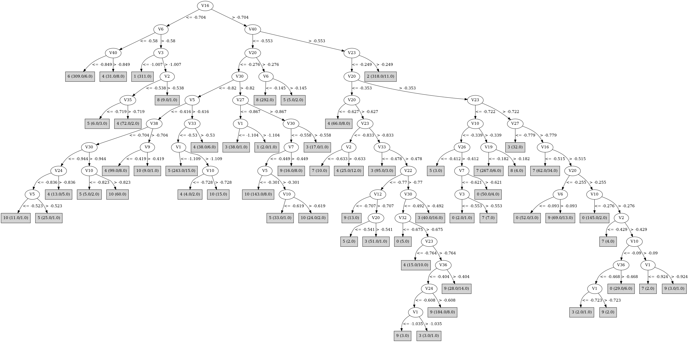

# J48

# SimpleCart Decision Tree

V23 < -0.2415

* V3 < -0.9444999999999999

*   * V6 < -0.5215000000000001

*   *   * V40 < -0.8494999999999999

*   *   *   * V17 < -1.104

*   *   *   *   * V3 < -1.076: 6(10.0/0.0)

*   *   *   *   * V3 >= -1.076: 4(4.0/0.0)

*   *   *   * V17 >= -1.104

*   *   *   *   * V20 < -0.865: 6(325.0/0.0)

*   *   *   *   * V20 >= -0.865

*   *   *   *   *   * V3 < -1.057: 6(2.0/0.0)

*   *   *   *   *   * V3 >= -1.057: 4(2.0/0.0)

*   *   * V40 >= -0.8494999999999999

*   *   *   * V1 < -1.2255: 4(15.0/0.0)

*   *   *   * V1 >= -1.2255: 6(7.0/1.0)

*   * V6 >= -0.5215000000000001

*   *   * V3 < -1.0154999999999998: 1(351.0/0.0)

*   *   * V3 >= -1.0154999999999998: 4(4.0/1.0)

* V3 >= -0.9444999999999999

*   * V23 < -1.088

*   *   * V2 < -0.655

*   *   *   * V22 < -1.115: 5(6.0/0.0)

*   *   *   * V22 >= -1.115: 4(9.0/1.0)

*   *   * V2 >= -0.655: 8(301.0/0.0)

*   * V23 >= -1.088

*   *   * V40 < -0.5565

*   *   *   * V26 < -0.466

*   *   *   *   * V6 < -0.2855

*   *   *   *   *   * V38 < -0.7024999999999999

*   *   *   *   *   *   * V10 < -0.797

*   *   *   *   *   *   *   * V5 < -0.532

*   *   *   *   *   *   *   *   * V37 < -1.017: 10(12.0/0.0)

*   *   *   *   *   *   *   *   * V37 >= -1.017

*   *   *   *   *   *   *   *   *   * V27 < -0.848: 4(24.0/0.0)

*   *   *   *   *   *   *   *   *   * V27 >= -0.848: 6(10.0/1.0)

*   *   *   *   *   *   *   * V5 >= -0.532

*   *   *   *   *   *   *   *   * V1 < -1.166: 5(34.0/0.0)

*   *   *   *   *   *   *   *   * V1 >= -1.166: 10(2.0/1.0)

*   *   *   *   *   *   * V10 >= -0.797

*   *   *   *   *   *   *   * V5 < -0.4305

*   *   *   *   *   *   *   *   * V1 < -1.3125: 4(1.0/1.0)

*   *   *   *   *   *   *   *   * V1 >= -1.3125: 10(52.0/0.0)

*   *   *   *   *   *   *   * V5 >= -0.4305

*   *   *   *   *   *   *   *   * V1 < -1.1895: 5(6.0/0.0)

*   *   *   *   *   *   *   *   * V1 >= -1.1895: 10(3.0/0.0)

*   *   *   *   *   * V38 >= -0.7024999999999999

*   *   *   *   *   *   * V30 < -0.808: 4(157.0/5.0)

*   *   *   *   *   *   * V30 >= -0.808: 3(2.0/1.0)

*   *   *   *   * V6 >= -0.2855

*   *   *   *   *   * V33 < -0.528

*   *   *   *   *   *   * V30 < -0.797

*   *   *   *   *   *   *   * V1 < -1.3235000000000001

*   *   *   *   *   *   *   *   * V4 < -0.492: 5(3.0/0.0)

*   *   *   *   *   *   *   *   * V4 >= -0.492: 3(8.0/0.0)

*   *   *   *   *   *   *   * V1 >= -1.3235000000000001

*   *   *   *   *   *   *   *   * V5 < -0.358

*   *   *   *   *   *   *   *   *   * V24 < -0.7685: 5(32.0/1.0)

*   *   *   *   *   *   *   *   *   * V24 >= -0.7685

*   *   *   *   *   *   *   *   *   *   * V26 < -0.5805: 4(4.0/1.0)

*   *   *   *   *   *   *   *   *   *   * V26 >= -0.5805: 10(15.0/0.0)

*   *   *   *   *   *   *   *   * V5 >= -0.358: 5(220.0/3.0)

*   *   *   *   *   *   * V30 >= -0.797

*   *   *   *   *   *   *   * V22 < -0.8625: 3(17.0/0.0)

*   *   *   *   *   *   *   * V22 >= -0.8625

*   *   *   *   *   *   *   *   * V2 < -0.6134999999999999: 9(1.0/1.0)

*   *   *   *   *   *   *   *   * V2 >= -0.6134999999999999: 5(5.0/0.0)

*   *   *   *   *   * V33 >= -0.528

*   *   *   *   *   *   * V16 < -0.591: 3(1.0/1.0)

*   *   *   *   *   *   * V16 >= -0.591

*   *   *   *   *   *   *   * V25 < -0.5565: 4(17.0/0.0)

*   *   *   *   *   *   *   * V25 >= -0.5565: 4(1.0/1.0)

*   *   *   * V26 >= -0.466

*   *   *   *   * V36 < -0.684

*   *   *   *   *   * V10 < -0.5895

*   *   *   *   *   *   * V30 < -0.7695000000000001

*   *   *   *   *   *   *   * V2 < -0.6375: 10(2.0/0.0)

*   *   *   *   *   *   *   * V2 >= -0.6375: 5(2.0/0.0)

*   *   *   *   *   *   * V30 >= -0.7695000000000001: 3(24.0/0.0)

*   *   *   *   *   * V10 >= -0.5895: 8(41.0/0.0)

*   *   *   *   * V36 >= -0.684

*   *   *   *   *   * V18 < -0.4175

*   *   *   *   *   *   * V10 < -0.822

*   *   *   *   *   *   *   * V4 < -0.5235: 4(13.0/0.0)

*   *   *   *   *   *   *   * V4 >= -0.5235: 3(3.0/0.0)

*   *   *   *   *   *   * V10 >= -0.822

*   *   *   *   *   *   *   * V23 < -0.6685000000000001

*   *   *   *   *   *   *   *   * V24 < -0.6465000000000001

*   *   *   *   *   *   *   *   *   * V32 < -0.761: 10(21.0/1.0)

*   *   *   *   *   *   *   *   *   * V32 >= -0.761

*   *   *   *   *   *   *   *   *   *   * V23 < -0.8605: 4(7.0/0.0)

*   *   *   *   *   *   *   *   *   *   * V23 >= -0.8605

*   *   *   *   *   *   *   *   *   *   *   * V2 < -0.608: 9(3.0/1.0)

*   *   *   *   *   *   *   *   *   *   *   * V2 >= -0.608: 5(3.0/0.0)

*   *   *   *   *   *   *   *   * V24 >= -0.6465000000000001

*   *   *   *   *   *   *   *   *   * V3 < -0.428: 10(190.0/5.0)

*   *   *   *   *   *   *   *   *   * V3 >= -0.428: 9(2.0/1.0)

*   *   *   *   *   *   *   * V23 >= -0.6685000000000001

*   *   *   *   *   *   *   *   * V10 < -0.6975: 3(7.0/0.0)

*   *   *   *   *   *   *   *   * V10 >= -0.6975

*   *   *   *   *   *   *   *   *   * V2 < -0.3885: 10(3.0/0.0)

*   *   *   *   *   *   *   *   *   * V2 >= -0.3885: 4(1.0/1.0)

*   *   *   *   *   * V18 >= -0.4175

*   *   *   *   *   *   * V1 < -0.9795: 5(22.0/1.0)

*   *   *   *   *   *   * V1 >= -0.9795

*   *   *   *   *   *   *   * V19 < -0.367: 9(3.0/1.0)

*   *   *   *   *   *   *   * V19 >= -0.367: 10(9.0/0.0)

*   *   * V40 >= -0.5565

*   *   *   * V10 < -0.2735

*   *   *   *   * V20 < -0.3385

*   *   *   *   *   * V36 < -0.5794999999999999

*   *   *   *   *   *   * V27 < -0.5874999999999999

*   *   *   *   *   *   *   * V12 < -0.7335: 9(2.0/0.0)

*   *   *   *   *   *   *   * V12 >= -0.7335: 3(142.0/3.0)

*   *   *   *   *   *   * V27 >= -0.5874999999999999: 9(5.0/1.0)

*   *   *   *   *   * V36 >= -0.5794999999999999

*   *   *   *   *   *   * V23 < -0.7855000000000001

*   *   *   *   *   *   *   * V3 < -0.545: 4(84.0/4.0)

*   *   *   *   *   *   *   * V3 >= -0.545

*   *   *   *   *   *   *   *   * V10 < -0.556: 5(14.0/0.0)

*   *   *   *   *   *   *   *   * V10 >= -0.556

*   *   *   *   *   *   *   *   *   * V10 < -0.4175

*   *   *   *   *   *   *   *   *   *   * V30 < -0.8160000000000001: 4(6.0/0.0)

*   *   *   *   *   *   *   *   *   *   * V30 >= -0.8160000000000001

*   *   *   *   *   *   *   *   *   *   *   * V10 < -0.475: 0(2.0/0.0)

*   *   *   *   *   *   *   *   *   *   *   * V10 >= -0.475: 9(5.0/0.0)

*   *   *   *   *   *   *   *   *   * V10 >= -0.4175: 7(12.0/1.0)

*   *   *   *   *   *   * V23 >= -0.7855000000000001

*   *   *   *   *   *   *   * V22 < -0.83

*   *   *   *   *   *   *   *   * V12 < -0.7215: 9(3.0/0.0)

*   *   *   *   *   *   *   *   * V12 >= -0.7215: 3(33.0/0.0)

*   *   *   *   *   *   *   * V22 >= -0.83

*   *   *   *   *   *   *   *   * V30 < -0.4165

*   *   *   *   *   *   *   *   *   * V17 < -0.7164999999999999

*   *   *   *   *   *   *   *   *   *   * V32 < -0.6745000000000001

*   *   *   *   *   *   *   *   *   *   *   * V4 < -0.3955: 0(4.0/0.0)

*   *   *   *   *   *   *   *   *   *   *   * V4 >= -0.3955: 5(1.0/1.0)

*   *   *   *   *   *   *   *   *   *   * V32 >= -0.6745000000000001

*   *   *   *   *   *   *   *   *   *   *   * V12 < -0.532

*   *   *   *   *   *   *   *   *   *   *   *   * V4 < -0.456: 4(2.0/0.0)

*   *   *   *   *   *   *   *   *   *   *   *   * V4 >= -0.456

*   *   *   *   *   *   *   *   *   *   *   *   *   * V33 < -0.4575: 5(2.0/0.0)

*   *   *   *   *   *   *   *   *   *   *   *   *   * V33 >= -0.4575: 9(157.0/0.0)

*   *   *   *   *   *   *   *   *   *   *   * V12 >= -0.532

*   *   *   *   *   *   *   *   *   *   *   *   * V1 < -0.8655: 3(4.0/0.0)

*   *   *   *   *   *   *   *   *   *   *   *   * V1 >= -0.8655: 9(3.0/0.0)

*   *   *   *   *   *   *   *   *   * V17 >= -0.7164999999999999

*   *   *   *   *   *   *   *   *   *   * V10 < -0.4595

*   *   *   *   *   *   *   *   *   *   *   * V40 < -0.4675

*   *   *   *   *   *   *   *   *   *   *   *   * V1 < -1.012: 0(1.0/1.0)

*   *   *   *   *   *   *   *   *   *   *   *   * V1 >= -1.012: 10(13.0/0.0)

*   *   *   *   *   *   *   *   *   *   *   * V40 >= -0.4675

*   *   *   *   *   *   *   *   *   *   *   *   * V36 < -0.513: 3(6.0/0.0)

*   *   *   *   *   *   *   *   *   *   *   *   * V36 >= -0.513

*   *   *   *   *   *   *   *   *   *   *   *   *   * V23 < -0.655

*   *   *   *   *   *   *   *   *   *   *   *   *   *   * V20 < -0.40900000000000003

*   *   *   *   *   *   *   *   *   *   *   *   *   *   *   * V1 < -0.8275: 10(2.0/1.0)

*   *   *   *   *   *   *   *   *   *   *   *   *   *   *   * V1 >= -0.8275: 4(2.0/0.0)

*   *   *   *   *   *   *   *   *   *   *   *   *   *   * V20 >= -0.40900000000000003: 0(5.0/0.0)

*   *   *   *   *   *   *   *   *   *   *   *   *   * V23 >= -0.655

*   *   *   *   *   *   *   *   *   *   *   *   *   *   * V6 < -0.15: 0(3.0/0.0)

*   *   *   *   *   *   *   *   *   *   *   *   *   *   * V6 >= -0.15: 9(13.0/1.0)

*   *   *   *   *   *   *   *   *   *   * V10 >= -0.4595

*   *   *   *   *   *   *   *   *   *   *   * V32 < -0.5734999999999999

*   *   *   *   *   *   *   *   *   *   *   *   * V2 < -0.5345: 7(3.0/0.0)

*   *   *   *   *   *   *   *   *   *   *   *   * V2 >= -0.5345: 0(2.0/0.0)

*   *   *   *   *   *   *   *   *   *   *   * V32 >= -0.5734999999999999

*   *   *   *   *   *   *   *   *   *   *   *   * V36 < -0.3715

*   *   *   *   *   *   *   *   *   *   *   *   *   * V26 < -0.165: 9(44.0/0.0)

*   *   *   *   *   *   *   *   *   *   *   *   *   * V26 >= -0.165: 9(2.0/1.0)

*   *   *   *   *   *   *   *   *   *   *   *   * V36 >= -0.3715

*   *   *   *   *   *   *   *   *   *   *   *   *   * V23 < -0.535: 0(5.0/0.0)

*   *   *   *   *   *   *   *   *   *   *   *   *   * V23 >= -0.535: 9(4.0/1.0)

*   *   *   *   *   *   *   *   * V30 >= -0.4165: 3(17.0/0.0)

*   *   *   *   * V20 >= -0.3385

*   *   *   *   *   * V24 < -0.6005

*   *   *   *   *   *   * V23 < -0.753

*   *   *   *   *   *   *   * V2 < -0.582: 7(4.0/0.0)

*   *   *   *   *   *   *   * V2 >= -0.582

*   *   *   *   *   *   *   *   * V1 < -1.2315: 0(2.0/0.0)

*   *   *   *   *   *   *   *   * V1 >= -1.2315: 5(2.0/0.0)

*   *   *   *   *   *   * V23 >= -0.753: 3(27.0/1.0)

*   *   *   *   *   * V24 >= -0.6005

*   *   *   *   *   *   * V16 < -0.5365

*   *   *   *   *   *   *   * V7 < -0.5165: 7(23.0/0.0)

*   *   *   *   *   *   *   * V7 >= -0.5165

*   *   *   *   *   *   *   *   * V23 < -0.589

*   *   *   *   *   *   *   *   *   * V20 < -0.2385: 0(10.0/0.0)

*   *   *   *   *   *   *   *   *   * V20 >= -0.2385: 7(4.0/0.0)

*   *   *   *   *   *   *   *   * V23 >= -0.589: 3(6.0/0.0)

*   *   *   *   *   *   * V16 >= -0.5365

*   *   *   *   *   *   *   * V20 < -0.2545

*   *   *   *   *   *   *   *   * V6 < -0.0765

*   *   *   *   *   *   *   *   *   * V30 < -0.5785: 0(75.0/2.0)

*   *   *   *   *   *   *   *   *   * V30 >= -0.5785

*   *   *   *   *   *   *   *   *   *   * V20 < -0.2945: 9(5.0/0.0)

*   *   *   *   *   *   *   *   *   *   * V20 >= -0.2945

*   *   *   *   *   *   *   *   *   *   *   * V1 < -1.021: 9(2.0/0.0)

*   *   *   *   *   *   *   *   *   *   *   * V1 >= -1.021: 0(5.0/0.0)

*   *   *   *   *   *   *   *   * V6 >= -0.0765

*   *   *   *   *   *   *   *   *   * V17 < -0.6074999999999999

*   *   *   *   *   *   *   *   *   *   * V1 < -1.1925: 0(2.0/0.0)

*   *   *   *   *   *   *   *   *   *   * V1 >= -1.1925: 9(37.0/1.0)

*   *   *   *   *   *   *   *   *   * V17 >= -0.6074999999999999

*   *   *   *   *   *   *   *   *   *   * V16 < -0.4025: 0(10.0/1.0)

*   *   *   *   *   *   *   *   *   *   * V16 >= -0.4025: 9(5.0/0.0)

*   *   *   *   *   *   *   * V20 >= -0.2545

*   *   *   *   *   *   *   *   * V2 < -0.587: 7(6.0/1.0)

*   *   *   *   *   *   *   *   * V2 >= -0.587: 0(197.0/3.0)

*   *   *   * V10 >= -0.2735

*   *   *   *   * V34 < -0.522

*   *   *   *   *   * V23 < -0.6

*   *   *   *   *   *   * V16 < -0.4505

*   *   *   *   *   *   *   * V22 < -0.9015: 3(2.0/0.0)

*   *   *   *   *   *   *   * V22 >= -0.9015: 7(298.0/1.0)

*   *   *   *   *   *   * V16 >= -0.4505

*   *   *   *   *   *   *   * V1 < -1.085: 7(2.0/1.0)

*   *   *   *   *   *   *   * V1 >= -1.085: 0(4.0/0.0)

*   *   *   *   *   * V23 >= -0.6: 3(5.0/1.0)

*   *   *   *   * V34 >= -0.522

*   *   *   *   *   * V18 < -0.2945: 9(28.0/1.0)

*   *   *   *   *   * V18 >= -0.2945

*   *   *   *   *   *   * V40 < -0.344: 9(9.0/0.0)

*   *   *   *   *   *   * V40 >= -0.344

*   *   *   *   *   *   *   * V22 < -0.5435000000000001

*   *   *   *   *   *   *   *   * V4 < -0.0675: 0(2.0/1.0)

*   *   *   *   *   *   *   *   * V4 >= -0.0675: 3(6.0/0.0)

*   *   *   *   *   *   *   * V22 >= -0.5435000000000001

*   *   *   *   *   *   *   *   * V13 < -0.0075

*   *   *   *   *   *   *   *   *   * V23 < -0.5135000000000001: 0(6.0/0.0)

*   *   *   *   *   *   *   *   *   * V23 >= -0.5135000000000001: 9(4.0/1.0)

*   *   *   *   *   *   *   *   * V13 >= -0.0075: 0(20.0/0.0)

V23 >= -0.2415

* V20 < -0.353: 3(9.0/0.0)

* V20 >= -0.353

*   * V2 < -0.07200000000000001: 2(346.0/1.0)

*   * V2 >= -0.07200000000000001: 3(2.0/1.0)

# PART

Decision list:

conditions|predicted class
---|---
V16 <= -0.704 AND V6 <= -0.558 AND V40 <= -0.85 AND V17 > -1.104 AND V6 <= -0.645| 6 (320.0)
V40 <= -0.557 AND V20 > -0.276 AND V14 <= -0.513| 8 (333.0)
V40 <= -0.557 AND V3 <= -1.023 AND V9 > -0.724| 1 (351.0)
V20 > -0.353 AND V23 > -0.265 AND V14 <= -0.307| 2 (340.0)
V40 <= -0.557 AND V20 <= -0.776 AND V40 > -0.853 AND V5 <= -0.42 AND V38 > -0.755 AND V5 > -0.669 AND V17 <= -0.852| 4 (131.0/1.0)
V40 <= -0.557 AND V9 <= -0.591 AND V10 > -0.9| 10 (12.0/3.0)
V40 <= -0.557 AND V9 <= -0.596 AND V22 > -0.863 AND V6 <= -0.626| 6 (11.0)
V40 <= -0.557 AND V9 <= -0.596 AND V36 <= -0.775 AND V1 <= -1.31| 6 (10.0/2.0)
V40 <= -0.557 AND V26 > -0.482 AND V36 <= -0.676 AND V30 > -0.77| 3 (31.0)
V40 <= -0.557 AND V9 <= -0.596 AND V36 > -0.775 AND V1 <= -1.224| 4 (26.0)
V40 <= -0.557 AND V26 > -0.482 AND V18 <= -0.418 AND V10 > -0.715 AND V7 <= -0.447 AND V29 > -0.588 AND V14 > -0.699 AND V3 <= -0.527 AND V1 > -1.139| 10 (162.0)
V40 <= -0.557 AND V33 > -0.53 AND V25 <= -0.571| 4 (54.0/1.0)
V40 <= -0.568 AND V5 > -0.416 AND V10 <= -0.601 AND V3 > -0.689 AND V5 > -0.36 AND V16 > -0.598| 5 (214.0/1.0)
V39 <= -0.544 AND V9 <= -0.596 AND V33 <= -0.781| 6 (13.0)
V20 > -0.353 AND V23 <= -0.723 AND V30 > -0.921 AND V10 > -0.326 AND V16 <= -0.462| 7 (283.0/1.0)
V30 <= -0.82 AND V20 <= -0.469 AND V38 > -0.652 AND V5 <= -0.246 AND V32 > -0.762| 4 (104.0/2.0)
V23 <= -0.839 AND V10 > -0.506 AND V2 <= -0.599| 7 (20.0)
V23 <= -0.839 AND V24 <= -0.776 AND V5 > -0.482 AND V1 > -1.32 AND V26 <= -0.591| 5 (92.0/1.0)
V23 <= -0.839 AND V19 <= -0.343 AND V27 > -1.044 AND V10 > -0.851 AND V40 <= -0.65 AND V30 > -0.955 AND V24 > -0.755| 10 (82.0/1.0)
V22 <= -0.79 AND V7 > -0.737 AND V38 > -0.687 AND V12 > -0.715 AND V4 > -0.395 AND V23 > -0.735| 3 (155.0)
V33 > -0.456 AND V20 > -0.351 AND V10 <= -0.172 AND V16 > -0.525 AND V30 <= -0.579 AND V36 > -0.52 AND V19 > -0.331 AND V6 <= 0.001| 0 (173.0/1.0)
V9 <= -0.381 AND V10 > -0.827 AND V8 <= -0.553 AND V1 > -1.317 AND V10 > -0.789| 10 (34.0)
V23 > -0.839 AND V36 <= -0.616 AND V39 > -0.639| 3 (63.0/1.0)
V23 > -0.839 AND V33 > -0.458 AND V20 <= -0.351 AND V30 > -0.476 AND V32 <= -0.318| 3 (34.0/1.0)
V26 > -0.458 AND V33 > -0.463 AND V20 <= -0.351 AND V23 > -0.764 AND V24 > -0.608 AND V32 > -0.646 AND V14 <= -0.561| 9 (153.0)
V23 <= -0.839 AND V26 <= -0.344 AND V6 > -0.411 AND V33 <= -0.686| 5 (26.0/1.0)
V23 > -0.839 AND V33 > -0.454 AND V20 <= -0.424 AND V6 > -0.205 AND V16 <= -0.424 AND V36 <= -0.494 AND V39 <= -0.422| 9 (28.0)
V23 > -0.807 AND V40 > -0.459 AND V36 <= -0.51 AND V16 > -0.457| 9 (16.0)
V23 > -0.807 AND V20 > -0.352 AND V16 <= -0.507 AND V4 <= -0.251 AND V10 > -0.381| 7 (35.0)
V6 <= -0.249 AND V13 <= -0.503 AND V32 > -0.892 AND V35 > -0.595| 4 (20.0)
V30 > -0.808 AND V24 <= -0.599 AND V14 <= -0.615 AND V3 <= -0.539| 9 (10.0/3.0)
V30 > -0.799 AND V40 > -0.43 AND V36 > -0.511 AND V30 <= -0.688 AND V10 <= -0.346 AND V14 > -0.59 AND V5 > -0.224| 0 (24.0)
V26 > -0.4 AND V40 > -0.512 AND V20 <= -0.181 AND V4 <= -0.272 AND V15 > -0.389 AND V34 <= -0.541| 0 (55.0/1.0)
V26 > -0.403 AND V30 > -0.686 AND V27 <= -0.679 AND V1 > -0.998| 3 (11.0)
V26 > -0.403 AND V38 <= -0.462 AND V23 > -0.832 AND V1 > -1.062 AND V5 <= -0.211 AND V35 <= -0.382| 10 (16.0)
V26 > -0.403 AND V33 > -0.504 AND V30 > -0.686 AND V23 <= -0.335 AND V22 > -0.679 AND V26 <= -0.186 AND V40 > -0.459 AND V23 > -0.63 AND V18 <= -0.343 AND V36 <= -0.39| 9 (58.0)
V26 > -0.403 AND V33 > -0.504 AND V20 <= -0.394 AND V9 > -0.233 AND V2 <= -0.258| 10 (18.0/8.0)
V26 > -0.402 AND V33 > -0.504 AND V30 > -0.69 AND V30 <= -0.239 AND V24 > -0.521 AND V9 > -0.234 AND V40 <= -0.429 AND V3 > -0.365| 9 (21.0)
V26 > -0.402 AND V30 > -0.69 AND V30 <= -0.239 AND V9 > -0.234 AND V22 > -0.652 AND V23 <= -0.417 AND V17 > -0.612 AND V16 <= -0.357 AND V20 > -0.326| 0 (55.0)
V10 > -0.512 AND V36 > -0.586 AND V40 > -0.538 AND V13 <= 0.191 AND V30 > -0.688 AND V22 > -0.652 AND V30 <= -0.374 AND V20 <= -0.202 AND V16 > -0.451 AND V18 <= -0.309| 9 (23.0)
V40 > -0.414 AND V30 <= -0.688 AND V10 > -0.35| 7 (16.0/1.0)
V10 > -0.512 AND V23 > -0.865 AND V40 > -0.538 AND V30 <= -0.239 AND V13 > -0.317 AND V24 > -0.421 AND V8 <= -0.227| 0 (15.0)
V40 > -0.413 AND V30 <= -0.239 AND V36 > -0.433 AND V20 > -0.202| 0 (19.0/2.0)
V40 > -0.413 AND V20 <= -0.193 AND V36 > -0.425 AND V16 <= -0.392| 0 (16.0/6.0)
V40 > -0.413 AND V30 <= -0.239 AND V16 <= -0.438| 3 (17.0/5.0)
V20 > -0.223 AND V23 > -0.597| 2 (15.0/8.0)
V23 <= -0.934 AND V28 <= -0.758| 4 (17.0/8.0)
V23 > -0.934 AND V24 <= -0.691 AND V22 > -0.941| 5 (19.0)
V23 > -0.934 AND V28 > -0.706 AND V38 <= -0.395 AND V1 > -1.002 AND V30 <= -0.719| 4 (16.0/5.0)
V23 > -0.934 AND V1 > -1.27 AND V10 > -0.485 AND V26 <= -0.337| 9 (14.0/1.0)
V23 > -0.934 AND V1 > -1.27 AND V35 > -0.382| 10 (19.0/8.0)
V23 > -0.934 AND V27 <= -0.806| 3 (16.0/4.0)
V23 <= -0.907| 8 (13.0/4.0)
V10 > -0.582| 0 (11.0/1.0)
| 5 (10.0/2.0)

# JRip

Decision list:

conditions|predicted class
---|---
(V24 <= -0.601) and (V22 <= -0.809) and (V23 >= -0.73)|3 (169.0/0.0)
(V30 >= -0.564) and (V24 <= -0.49)|3 (67.0/0.0)
(V23 >= -0.826) and (V22 <= -0.91) and (V9 >= -0.401)|3 (40.0/0.0)
(V2 >= -0.38) and (V10 <= -0.584) and (V20 <= -0.425) and (V3 >= -0.634)|3 (18.0/0.0)
(V5 >= -0.144) and (V10 <= -0.402) and (V30 >= -0.381) and (V40 <= -0.227)|3 (11.0/0.0)
(V1 <= -1.321) and (V4 >= -0.486) and (V3 <= -0.562)|3 (9.0/0.0)
(V6 >= 0.002) and (V17 <= -0.515) and (V12 >= -0.3) and (V7 >= -0.292)|3 (5.0/0.0)
(V4 >= -0.296) and (V27 <= -0.78) and (V23 >= -0.748) and (V37 >= -0.72)|3 (8.0/0.0)
(V20 <= -0.382) and (V40 <= -0.624) and (V26 >= -0.443) and (V37 <= -0.829) and (V3 >= -0.92)|10 (102.0/0.0)
(V20 <= -0.382) and (V10 >= -0.766) and (V40 <= -0.647) and (V26 >= -0.521) and (V2 <= -0.586) and (V30 >= -0.911)|10 (90.0/0.0)
(V1 >= -0.969) and (V40 <= -0.495) and (V36 >= -0.517) and (V30 >= -0.755) and (V1 <= -0.274)|10 (48.0/0.0)
(V3 <= -0.501) and (V10 >= -0.827) and (V8 <= -0.596) and (V38 <= -0.741) and (V1 >= -1.296)|10 (40.0/0.0)
(V1 >= -1.07) and (V40 <= -0.553) and (V29 >= -0.513) and (V12 <= -0.483) and (V10 <= -0.403)|10 (27.0/0.0)
(V2 <= -0.674) and (V10 >= -0.897) and (V7 <= -0.922)|10 (7.0/0.0)
(V20 <= -0.363) and (V16 >= -0.447) and (V2 <= -0.674)|10 (4.0/0.0)
(V20 <= -0.459) and (V13 >= -0.614) and (V2 <= -0.728) and (V1 >= -1.158) and (V16 <= -0.547)|10 (9.0/0.0)
(V1 >= -0.993) and (V20 <= -0.459) and (V19 >= -0.433) and (V26 >= -0.261)|10 (4.0/0.0)
(V32 <= -0.586) and (V16 >= -0.462) and (V1 >= -0.935)|10 (3.0/0.0)
(V18 <= -0.576) and (V18 >= -0.594) and (V24 >= -0.695) and (V2 <= -0.682)|10 (2.0/0.0)
(V23 <= -1.113) and (V2 >= -0.641)|8 (288.0/0.0)
(V12 >= -0.348) and (V23 <= -0.962)|8 (53.0/0.0)
(V30 >= -0.239) and (V1 <= -0.171)|2 (347.0/0.0)
(V26 <= -0.769) and (V32 >= -0.885) and (V3 <= -1.032)|1 (287.0/0.0)
(V3 <= -1.057) and (V4 >= -0.73)|1 (60.0/0.0)
(V3 <= -1.023) and (V1 >= -1.066)|1 (4.0/0.0)
(V23 >= -0.763) and (V20 <= -0.336) and (V32 >= -0.62) and (V17 <= -0.684) and (V14 <= -0.527)|9 (168.0/0.0)
(V30 >= -0.682) and (V9 >= -0.184) and (V16 >= -0.461) and (V20 <= -0.31)|9 (54.0/0.0)
(V18 <= -0.359) and (V6 >= -0.107) and (V30 >= -0.606)|9 (34.0/0.0)
(V23 >= -0.784) and (V36 <= -0.477) and (V14 <= -0.638)|9 (26.0/0.0)
(V34 >= -0.526) and (V36 <= -0.472) and (V3 >= -0.383)|9 (26.0/0.0)
(V23 >= -0.647) and (V18 <= -0.339) and (V6 >= -0.08) and (V16 >= -0.467)|9 (15.0/0.0)
(V30 >= -0.754) and (V20 <= -0.355) and (V6 >= -0.078) and (V5 <= -0.186)|9 (7.0/0.0)
(V28 >= -0.384) and (V16 >= -0.349) and (V20 <= -0.206) and (V18 <= -0.242)|9 (8.0/0.0)
(V34 >= -0.601) and (V19 <= -0.344) and (V10 >= -0.475) and (V36 <= -0.534) and (V2 <= -0.444)|9 (6.0/0.0)
(V28 >= -0.381) and (V12 <= -0.46) and (V7 <= -0.454)|9 (3.0/0.0)
(V16 >= -0.422) and (V12 <= -0.654) and (V2 >= -0.537)|9 (2.0/0.0)
(V10 >= -0.318) and (V34 <= -0.571) and (V16 <= -0.452)|7 (304.0/0.0)
(V10 >= -0.425) and (V23 <= -0.754) and (V2 <= -0.527)|7 (28.0/0.0)
(V10 >= -0.234) and (V34 <= -0.524)|7 (17.0/0.0)
(V10 >= -0.345) and (V8 <= -0.316) and (V1 >= -1.157)|7 (4.0/0.0)
(V6 >= 0.043) and (V6 <= 0.053)|7 (2.0/0.0)
(V6 <= -0.584) and (V40 <= -0.907) and (V12 >= -1.007)|6 (298.0/0.0)
(V5 <= -0.669) and (V22 >= -0.875) and (V3 <= -0.926)|6 (45.0/0.0)
(V40 <= -0.893) and (V36 <= -0.799)|6 (6.0/0.0)
(V3 <= -0.911) and (V12 >= -0.889) and (V10 <= -0.996) and (V2 <= -0.755)|6 (5.0/0.0)
(V40 <= -0.788) and (V27 >= -0.78) and (V23 <= -0.936)|6 (3.0/0.0)
(V6 <= -0.277) and (V32 >= -0.841)|4 (243.0/0.0)
(V6 <= -0.19) and (V3 <= -0.811)|4 (42.0/0.0)
(V6 <= -0.184) and (V35 >= -0.568) and (V26 <= -0.352) and (V33 >= -0.525)|4 (49.0/0.0)
(V3 <= -0.651) and (V35 >= -0.567) and (V23 <= -0.727)|4 (12.0/0.0)
(V19 <= -0.376) and (V16 >= -0.426) and (V10 >= -0.656)|4 (6.0/0.0)
(V23 <= -1.083) and (V33 >= -0.689)|4 (3.0/0.0)
(V23 <= -0.879) and (V1 >= -1.109)|4 (3.0/0.0)
(V33 >= -0.444) and (V13 >= -0.336) and (V5 <= -0.074)|0 (312.0/0.0)
(V26 >= -0.332) and (V2 >= -0.367)|0 (36.0/0.0)
(V29 >= -0.47) and (V33 >= -0.477) and (V35 <= -0.375)|0 (9.0/0.0)
(V10 >= -0.311) and (V1 <= -0.966)|0 (4.0/0.0)
|5 (368.0/7.0)

# Decision Table

Non matches covered by Majority class

v1|v21|v31|v37|v40|target
---|---|---|---|---|---
(-0.636-inf)|(-0.636-inf)|(-0.636-inf)|(-0.3435-inf)|(-0.0595-inf)|0
(-0.9865--0.636]|(-0.9865--0.636]|(-0.9865--0.636]|(-0.3435-inf)|(-0.0595-inf)|2
(-0.636-inf)|(-0.636-inf)|(-0.636-inf)|(-0.5735--0.3435]|(-0.0595-inf)|2
(-0.636-inf)|(-0.636-inf)|(-0.636-inf)|(-0.3435-inf)|(-0.1335--0.0595]|0
(-0.9865--0.636]|(-0.9865--0.636]|(-0.9865--0.636]|(-0.5735--0.3435]|(-0.0595-inf)|2
(-0.636-inf)|(-0.636-inf)|(-0.636-inf)|(-0.5735--0.3435]|(-0.1335--0.0595]|2
(-0.636-inf)|(-0.636-inf)|(-0.636-inf)|(-0.3435-inf)|(-0.2025--0.1335]|0
(-0.9865--0.636]|(-0.9865--0.636]|(-0.9865--0.636]|(-0.6285--0.5735]|(-0.0595-inf)|2
(-1.0805--0.9865]|(-1.0805--0.9865]|(-1.0805--0.9865]|(-0.5735--0.3435]|(-0.0595-inf)|2
(-0.636-inf)|(-0.636-inf)|(-0.636-inf)|(-0.6285--0.5735]|(-0.1335--0.0595]|0
(-0.9865--0.636]|(-0.9865--0.636]|(-0.9865--0.636]|(-0.5735--0.3435]|(-0.1335--0.0595]|2
(-0.636-inf)|(-0.636-inf)|(-0.636-inf)|(-0.5735--0.3435]|(-0.2025--0.1335]|0
(-0.636-inf)|(-0.636-inf)|(-0.636-inf)|(-0.3435-inf)|(-0.2825--0.2025]|0
(-1.1545--1.0805]|(-1.1545--1.0805]|(-1.1545--1.0805]|(-0.5735--0.3435]|(-0.0595-inf)|2
(-1.0805--0.9865]|(-1.0805--0.9865]|(-1.0805--0.9865]|(-0.6285--0.5735]|(-0.0595-inf)|2
(-0.9865--0.636]|(-0.9865--0.636]|(-0.9865--0.636]|(-0.6285--0.5735]|(-0.1335--0.0595]|2
(-1.0805--0.9865]|(-1.0805--0.9865]|(-1.0805--0.9865]|(-0.5735--0.3435]|(-0.1335--0.0595]|2
(-0.636-inf)|(-0.636-inf)|(-0.636-inf)|(-0.6285--0.5735]|(-0.2025--0.1335]|0
(-0.9865--0.636]|(-0.9865--0.636]|(-0.9865--0.636]|(-0.5735--0.3435]|(-0.2025--0.1335]|2
(-1.2595--1.1545]|(-1.2595--1.1545]|(-1.2595--1.1545]|(-0.5735--0.3435]|(-0.0595-inf)|2
(-1.1545--1.0805]|(-1.1545--1.0805]|(-1.1545--1.0805]|(-0.6285--0.5735]|(-0.0595-inf)|2
(-0.636-inf)|(-0.636-inf)|(-0.636-inf)|(-0.5735--0.3435]|(-0.2825--0.2025]|0
(-1.1545--1.0805]|(-1.1545--1.0805]|(-1.1545--1.0805]|(-0.5735--0.3435]|(-0.1335--0.0595]|2
(-1.0805--0.9865]|(-1.0805--0.9865]|(-1.0805--0.9865]|(-0.6285--0.5735]|(-0.1335--0.0595]|2
(-0.636-inf)|(-0.636-inf)|(-0.636-inf)|(-0.3435-inf)|(-0.3765--0.2825]|9
(-0.9865--0.636]|(-0.9865--0.636]|(-0.9865--0.636]|(-0.6285--0.5735]|(-0.2025--0.1335]|0
(-1.0805--0.9865]|(-1.0805--0.9865]|(-1.0805--0.9865]|(-0.5735--0.3435]|(-0.2025--0.1335]|0
(-1.1545--1.0805]|(-1.1545--1.0805]|(-1.1545--1.0805]|(-0.7155--0.6285]|(-0.0595-inf)|2
(-1.3335--1.2595]|(-1.3335--1.2595]|(-1.3335--1.2595]|(-0.5735--0.3435]|(-0.0595-inf)|2
(-1.2595--1.1545]|(-1.2595--1.1545]|(-1.2595--1.1545]|(-0.6285--0.5735]|(-0.0595-inf)|2
(-0.636-inf)|(-0.636-inf)|(-0.636-inf)|(-0.6285--0.5735]|(-0.2825--0.2025]|9
(-0.9865--0.636]|(-0.9865--0.636]|(-0.9865--0.636]|(-0.5735--0.3435]|(-0.2825--0.2025]|9
(-1.0805--0.9865]|(-1.0805--0.9865]|(-1.0805--0.9865]|(-0.7155--0.6285]|(-0.1335--0.0595]|2
(-1.2595--1.1545]|(-1.2595--1.1545]|(-1.2595--1.1545]|(-0.5735--0.3435]|(-0.1335--0.0595]|2
(-1.1545--1.0805]|(-1.1545--1.0805]|(-1.1545--1.0805]|(-0.6285--0.5735]|(-0.1335--0.0595]|2
(-0.636-inf)|(-0.636-inf)|(-0.636-inf)|(-0.5735--0.3435]|(-0.3765--0.2825]|0
(-0.9865--0.636]|(-0.9865--0.636]|(-0.9865--0.636]|(-0.7155--0.6285]|(-0.2025--0.1335]|2
(-1.0805--0.9865]|(-1.0805--0.9865]|(-1.0805--0.9865]|(-0.6285--0.5735]|(-0.2025--0.1335]|2
(-0.636-inf)|(-0.636-inf)|(-0.636-inf)|(-0.3435-inf)|(-0.4685--0.3765]|9
(-1.1545--1.0805]|(-1.1545--1.0805]|(-1.1545--1.0805]|(-0.5735--0.3435]|(-0.2025--0.1335]|0
(-0.636-inf)|(-0.636-inf)|(-0.636-inf)|(-0.7155--0.6285]|(-0.2825--0.2025]|0
(-1.3335--1.2595]|(-1.3335--1.2595]|(-1.3335--1.2595]|(-0.6285--0.5735]|(-0.0595-inf)|2
(-1.2595--1.1545]|(-1.2595--1.1545]|(-1.2595--1.1545]|(-0.7155--0.6285]|(-0.0595-inf)|2
(-0.9865--0.636]|(-0.9865--0.636]|(-0.9865--0.636]|(-0.6285--0.5735]|(-0.2825--0.2025]|0
(-0.636-inf)|(-0.636-inf)|(-0.636-inf)|(-0.6285--0.5735]|(-0.3765--0.2825]|9
(-1.3335--1.2595]|(-1.3335--1.2595]|(-1.3335--1.2595]|(-0.5735--0.3435]|(-0.1335--0.0595]|2
(-1.2595--1.1545]|(-1.2595--1.1545]|(-1.2595--1.1545]|(-0.6285--0.5735]|(-0.1335--0.0595]|2
(-0.9865--0.636]|(-0.9865--0.636]|(-0.9865--0.636]|(-0.5735--0.3435]|(-0.3765--0.2825]|9
(-1.2595--1.1545]|(-1.2595--1.1545]|(-1.2595--1.1545]|(-0.5735--0.3435]|(-0.2025--0.1335]|2
(-1.0805--0.9865]|(-1.0805--0.9865]|(-1.0805--0.9865]|(-0.7155--0.6285]|(-0.2025--0.1335]|7
(-1.1545--1.0805]|(-1.1545--1.0805]|(-1.1545--1.0805]|(-0.6285--0.5735]|(-0.2025--0.1335]|2
(-0.636-inf)|(-0.636-inf)|(-0.636-inf)|(-0.5735--0.3435]|(-0.4685--0.3765]|9
(-0.9865--0.636]|(-0.9865--0.636]|(-0.9865--0.636]|(-0.7155--0.6285]|(-0.2825--0.2025]|0
(-1.3335--1.2595]|(-1.3335--1.2595]|(-1.3335--1.2595]|(-0.7155--0.6285]|(-0.0595-inf)|2
(-1.0805--0.9865]|(-1.0805--0.9865]|(-1.0805--0.9865]|(-0.6285--0.5735]|(-0.2825--0.2025]|3
(-1.2595--1.1545]|(-1.2595--1.1545]|(-1.2595--1.1545]|(-0.7155--0.6285]|(-0.1335--0.0595]|2
(-1.3335--1.2595]|(-1.3335--1.2595]|(-1.3335--1.2595]|(-0.6285--0.5735]|(-0.1335--0.0595]|2
(-0.9865--0.636]|(-0.9865--0.636]|(-0.9865--0.636]|(-0.6285--0.5735]|(-0.3765--0.2825]|9
(-1.3335--1.2595]|(-1.3335--1.2595]|(-1.3335--1.2595]|(-0.5735--0.3435]|(-0.2025--0.1335]|0
(-1.2595--1.1545]|(-1.2595--1.1545]|(-1.2595--1.1545]|(-0.6285--0.5735]|(-0.2025--0.1335]|7
(-0.636-inf)|(-0.636-inf)|(-0.636-inf)|(-0.6285--0.5735]|(-0.4685--0.3765]|0
(-1.1545--1.0805]|(-1.1545--1.0805]|(-1.1545--1.0805]|(-0.7155--0.6285]|(-0.2025--0.1335]|7
(-0.9865--0.636]|(-0.9865--0.636]|(-0.9865--0.636]|(-0.5735--0.3435]|(-0.4685--0.3765]|9
(-0.636-inf)|(-0.636-inf)|(-0.636-inf)|(-0.5735--0.3435]|(-0.5565--0.4685]|9
(-1.0805--0.9865]|(-1.0805--0.9865]|(-1.0805--0.9865]|(-0.7155--0.6285]|(-0.2825--0.2025]|7
(-1.1545--1.0805]|(-1.1545--1.0805]|(-1.1545--1.0805]|(-0.6285--0.5735]|(-0.2825--0.2025]|9
(-1.3335--1.2595]|(-1.3335--1.2595]|(-1.3335--1.2595]|(-0.7155--0.6285]|(-0.1335--0.0595]|0
(-1.0805--0.9865]|(-1.0805--0.9865]|(-1.0805--0.9865]|(-0.6285--0.5735]|(-0.3765--0.2825]|9
(-0.9865--0.636]|(-0.9865--0.636]|(-0.9865--0.636]|(-0.7155--0.6285]|(-0.3765--0.2825]|0
(-1.3335--1.2595]|(-1.3335--1.2595]|(-1.3335--1.2595]|(-0.6285--0.5735]|(-0.2025--0.1335]|2
(-0.636-inf)|(-0.636-inf)|(-0.636-inf)|(-0.7155--0.6285]|(-0.4685--0.3765]|0
(-1.1545--1.0805]|(-1.1545--1.0805]|(-1.1545--1.0805]|(-0.7805--0.7155]|(-0.2025--0.1335]|2
(-0.9865--0.636]|(-0.9865--0.636]|(-0.9865--0.636]|(-0.6285--0.5735]|(-0.4685--0.3765]|9
(-1.2595--1.1545]|(-1.2595--1.1545]|(-1.2595--1.1545]|(-0.7155--0.6285]|(-0.2025--0.1335]|7
(-0.636-inf)|(-0.636-inf)|(-0.636-inf)|(-0.6285--0.5735]|(-0.5565--0.4685]|0
(-1.0805--0.9865]|(-1.0805--0.9865]|(-1.0805--0.9865]|(-0.7805--0.7155]|(-0.2825--0.2025]|0
(-0.9865--0.636]|(-0.9865--0.636]|(-0.9865--0.636]|(-0.5735--0.3435]|(-0.5565--0.4685]|9
(-1.2595--1.1545]|(-1.2595--1.1545]|(-1.2595--1.1545]|(-0.6285--0.5735]|(-0.2825--0.2025]|2
(-1.1545--1.0805]|(-1.1545--1.0805]|(-1.1545--1.0805]|(-0.7155--0.6285]|(-0.2825--0.2025]|7
(-1.3335--1.2595]|(-1.3335--1.2595]|(-1.3335--1.2595]|(-0.7805--0.7155]|(-0.1335--0.0595]|0
(-0.636-inf)|(-0.636-inf)|(-0.636-inf)|(-0.5735--0.3435]|(-0.6485--0.5565]|10
(-0.9865--0.636]|(-0.9865--0.636]|(-0.9865--0.636]|(-0.7805--0.7155]|(-0.3765--0.2825]|0
(-1.0805--0.9865]|(-1.0805--0.9865]|(-1.0805--0.9865]|(-0.7155--0.6285]|(-0.3765--0.2825]|0
(-1.2595--1.1545]|(-1.2595--1.1545]|(-1.2595--1.1545]|(-0.7805--0.7155]|(-0.2025--0.1335]|0
(-1.3335--1.2595]|(-1.3335--1.2595]|(-1.3335--1.2595]|(-0.7155--0.6285]|(-0.2025--0.1335]|2
(-1.0805--0.9865]|(-1.0805--0.9865]|(-1.0805--0.9865]|(-0.6285--0.5735]|(-0.4685--0.3765]|3
(-0.9865--0.636]|(-0.9865--0.636]|(-0.9865--0.636]|(-0.7155--0.6285]|(-0.4685--0.3765]|9
(-1.3335--1.2595]|(-1.3335--1.2595]|(-1.3335--1.2595]|(-0.6285--0.5735]|(-0.2825--0.2025]|0
(-1.1545--1.0805]|(-1.1545--1.0805]|(-1.1545--1.0805]|(-0.7805--0.7155]|(-0.2825--0.2025]|7
(-0.9865--0.636]|(-0.9865--0.636]|(-0.9865--0.636]|(-0.6285--0.5735]|(-0.5565--0.4685]|3
(-1.2595--1.1545]|(-1.2595--1.1545]|(-1.2595--1.1545]|(-0.7155--0.6285]|(-0.2825--0.2025]|7
(-1.0805--0.9865]|(-1.0805--0.9865]|(-1.0805--0.9865]|(-0.7805--0.7155]|(-0.3765--0.2825]|0
(-0.636-inf)|(-0.636-inf)|(-0.636-inf)|(-0.6285--0.5735]|(-0.6485--0.5565]|9
(-1.1545--1.0805]|(-1.1545--1.0805]|(-1.1545--1.0805]|(-0.7155--0.6285]|(-0.3765--0.2825]|9
(-0.9865--0.636]|(-0.9865--0.636]|(-0.9865--0.636]|(-0.7805--0.7155]|(-0.4685--0.3765]|9
(-1.0805--0.9865]|(-1.0805--0.9865]|(-1.0805--0.9865]|(-0.7155--0.6285]|(-0.4685--0.3765]|9
(-1.3335--1.2595]|(-1.3335--1.2595]|(-1.3335--1.2595]|(-0.7155--0.6285]|(-0.2825--0.2025]|7
(-1.2595--1.1545]|(-1.2595--1.1545]|(-1.2595--1.1545]|(-0.7805--0.7155]|(-0.2825--0.2025]|7
(-1.0805--0.9865]|(-1.0805--0.9865]|(-1.0805--0.9865]|(-0.6285--0.5735]|(-0.5565--0.4685]|0
(-0.9865--0.636]|(-0.9865--0.636]|(-0.9865--0.636]|(-0.7155--0.6285]|(-0.5565--0.4685]|4
(-0.636-inf)|(-0.636-inf)|(-0.636-inf)|(-0.7155--0.6285]|(-0.6485--0.5565]|10
(-0.9865--0.636]|(-0.9865--0.636]|(-0.9865--0.636]|(-0.6285--0.5735]|(-0.6485--0.5565]|10
(-1.2595--1.1545]|(-1.2595--1.1545]|(-1.2595--1.1545]|(-0.7155--0.6285]|(-0.3765--0.2825]|7
(-1.1545--1.0805]|(-1.1545--1.0805]|(-1.1545--1.0805]|(-0.7805--0.7155]|(-0.3765--0.2825]|7
(-0.636-inf)|(-0.636-inf)|(-0.636-inf)|(-0.6285--0.5735]|(-0.8315--0.6485]|0
(-0.9865--0.636]|(-0.9865--0.636]|(-0.9865--0.636]|(-0.5735--0.3435]|(-0.8315--0.6485]|0
(-1.0805--0.9865]|(-1.0805--0.9865]|(-1.0805--0.9865]|(-0.7805--0.7155]|(-0.4685--0.3765]|0
(-1.1545--1.0805]|(-1.1545--1.0805]|(-1.1545--1.0805]|(-0.7155--0.6285]|(-0.4685--0.3765]|9
(-1.3335--1.2595]|(-1.3335--1.2595]|(-1.3335--1.2595]|(-0.7805--0.7155]|(-0.2825--0.2025]|7
(-0.9865--0.636]|(-0.9865--0.636]|(-0.9865--0.636]|(-0.7805--0.7155]|(-0.5565--0.4685]|10
(-1.0805--0.9865]|(-1.0805--0.9865]|(-1.0805--0.9865]|(-0.7155--0.6285]|(-0.5565--0.4685]|3
(-1.1545--1.0805]|(-1.1545--1.0805]|(-1.1545--1.0805]|(-0.8125--0.7805]|(-0.3765--0.2825]|0
(-1.3335--1.2595]|(-1.3335--1.2595]|(-1.3335--1.2595]|(-0.7155--0.6285]|(-0.3765--0.2825]|3
(-0.9865--0.636]|(-0.9865--0.636]|(-0.9865--0.636]|(-0.7155--0.6285]|(-0.6485--0.5565]|10
(-1.2595--1.1545]|(-1.2595--1.1545]|(-1.2595--1.1545]|(-0.7805--0.7155]|(-0.3765--0.2825]|7
(-1.0805--0.9865]|(-1.0805--0.9865]|(-1.0805--0.9865]|(-0.8125--0.7805]|(-0.4685--0.3765]|0
(-1.2595--1.1545]|(-1.2595--1.1545]|(-1.2595--1.1545]|(-0.7155--0.6285]|(-0.4685--0.3765]|3
(-1.1545--1.0805]|(-1.1545--1.0805]|(-1.1545--1.0805]|(-0.7805--0.7155]|(-0.4685--0.3765]|9
(-1.0805--0.9865]|(-1.0805--0.9865]|(-1.0805--0.9865]|(-0.7805--0.7155]|(-0.5565--0.4685]|4
(-1.1545--1.0805]|(-1.1545--1.0805]|(-1.1545--1.0805]|(-0.7155--0.6285]|(-0.5565--0.4685]|3
(-1.0805--0.9865]|(-1.0805--0.9865]|(-1.0805--0.9865]|(-0.7155--0.6285]|(-0.6485--0.5565]|8
(-1.2595--1.1545]|(-1.2595--1.1545]|(-1.2595--1.1545]|(-0.8125--0.7805]|(-0.3765--0.2825]|7
(-inf--1.3335]|(-inf--1.3335]|(-inf--1.3335]|(-0.7155--0.6285]|(-0.3765--0.2825]|0
(-0.9865--0.636]|(-0.9865--0.636]|(-0.9865--0.636]|(-0.7805--0.7155]|(-0.6485--0.5565]|10
(-1.3335--1.2595]|(-1.3335--1.2595]|(-1.3335--1.2595]|(-0.7805--0.7155]|(-0.3765--0.2825]|7
(-0.9865--0.636]|(-0.9865--0.636]|(-0.9865--0.636]|(-0.7155--0.6285]|(-0.8315--0.6485]|3
(-1.1545--1.0805]|(-1.1545--1.0805]|(-1.1545--1.0805]|(-0.8125--0.7805]|(-0.4685--0.3765]|0
(-1.3335--1.2595]|(-1.3335--1.2595]|(-1.3335--1.2595]|(-0.7155--0.6285]|(-0.4685--0.3765]|0
(-1.2595--1.1545]|(-1.2595--1.1545]|(-1.2595--1.1545]|(-0.7805--0.7155]|(-0.4685--0.3765]|3
(-1.0805--0.9865]|(-1.0805--0.9865]|(-1.0805--0.9865]|(-0.8125--0.7805]|(-0.5565--0.4685]|4
(-1.1545--1.0805]|(-1.1545--1.0805]|(-1.1545--1.0805]|(-0.7805--0.7155]|(-0.5565--0.4685]|4
(-1.2595--1.1545]|(-1.2595--1.1545]|(-1.2595--1.1545]|(-0.7155--0.6285]|(-0.5565--0.4685]|8
(-0.9865--0.636]|(-0.9865--0.636]|(-0.9865--0.636]|(-0.8125--0.7805]|(-0.6485--0.5565]|10
(-1.2595--1.1545]|(-1.2595--1.1545]|(-1.2595--1.1545]|(-0.8485--0.8125]|(-0.3765--0.2825]|0
(-1.1545--1.0805]|(-1.1545--1.0805]|(-1.1545--1.0805]|(-0.7155--0.6285]|(-0.6485--0.5565]|8
(-1.3335--1.2595]|(-1.3335--1.2595]|(-1.3335--1.2595]|(-0.8125--0.7805]|(-0.3765--0.2825]|7
(-1.0805--0.9865]|(-1.0805--0.9865]|(-1.0805--0.9865]|(-0.7805--0.7155]|(-0.6485--0.5565]|4
(-1.1545--1.0805]|(-1.1545--1.0805]|(-1.1545--1.0805]|(-0.8485--0.8125]|(-0.4685--0.3765]|0
(-0.9865--0.636]|(-0.9865--0.636]|(-0.9865--0.636]|(-0.7805--0.7155]|(-0.8315--0.6485]|10
(-1.0805--0.9865]|(-1.0805--0.9865]|(-1.0805--0.9865]|(-0.7155--0.6285]|(-0.8315--0.6485]|8
(-1.3335--1.2595]|(-1.3335--1.2595]|(-1.3335--1.2595]|(-0.7805--0.7155]|(-0.4685--0.3765]|3
(-1.2595--1.1545]|(-1.2595--1.1545]|(-1.2595--1.1545]|(-0.8125--0.7805]|(-0.4685--0.3765]|0
(-1.3335--1.2595]|(-1.3335--1.2595]|(-1.3335--1.2595]|(-0.7155--0.6285]|(-0.5565--0.4685]|0
(-0.9865--0.636]|(-0.9865--0.636]|(-0.9865--0.636]|(-0.7155--0.6285]|(-0.8925--0.8315]|8
(-1.1545--1.0805]|(-1.1545--1.0805]|(-1.1545--1.0805]|(-0.8125--0.7805]|(-0.5565--0.4685]|0
(-1.2595--1.1545]|(-1.2595--1.1545]|(-1.2595--1.1545]|(-0.7805--0.7155]|(-0.5565--0.4685]|3
(-0.9865--0.636]|(-0.9865--0.636]|(-0.9865--0.636]|(-0.8485--0.8125]|(-0.6485--0.5565]|10
(-1.0805--0.9865]|(-1.0805--0.9865]|(-1.0805--0.9865]|(-0.8125--0.7805]|(-0.6485--0.5565]|4
(-1.2595--1.1545]|(-1.2595--1.1545]|(-1.2595--1.1545]|(-0.7155--0.6285]|(-0.6485--0.5565]|8
(-1.1545--1.0805]|(-1.1545--1.0805]|(-1.1545--1.0805]|(-0.7805--0.7155]|(-0.6485--0.5565]|8
(-0.9865--0.636]|(-0.9865--0.636]|(-0.9865--0.636]|(-0.8125--0.7805]|(-0.8315--0.6485]|10
(-1.1545--1.0805]|(-1.1545--1.0805]|(-1.1545--1.0805]|(-0.7155--0.6285]|(-0.8315--0.6485]|8
(-1.0805--0.9865]|(-1.0805--0.9865]|(-1.0805--0.9865]|(-0.7805--0.7155]|(-0.8315--0.6485]|8
(-1.3335--1.2595]|(-1.3335--1.2595]|(-1.3335--1.2595]|(-0.8125--0.7805]|(-0.4685--0.3765]|3
(-1.2595--1.1545]|(-1.2595--1.1545]|(-1.2595--1.1545]|(-0.8485--0.8125]|(-0.4685--0.3765]|0
(-inf--1.3335]|(-inf--1.3335]|(-inf--1.3335]|(-0.7805--0.7155]|(-0.4685--0.3765]|3
(-1.1545--1.0805]|(-1.1545--1.0805]|(-1.1545--1.0805]|(-0.8485--0.8125]|(-0.5565--0.4685]|0
(-1.3335--1.2595]|(-1.3335--1.2595]|(-1.3335--1.2595]|(-0.7805--0.7155]|(-0.5565--0.4685]|3
(-1.2595--1.1545]|(-1.2595--1.1545]|(-1.2595--1.1545]|(-0.8125--0.7805]|(-0.5565--0.4685]|3
(-0.9865--0.636]|(-0.9865--0.636]|(-0.9865--0.636]|(-0.7155--0.6285]|(-0.946--0.8925]|0
(-1.0805--0.9865]|(-1.0805--0.9865]|(-1.0805--0.9865]|(-0.8485--0.8125]|(-0.6485--0.5565]|4
(-1.3335--1.2595]|(-1.3335--1.2595]|(-1.3335--1.2595]|(-0.7155--0.6285]|(-0.6485--0.5565]|8
(-1.1545--1.0805]|(-1.1545--1.0805]|(-1.1545--1.0805]|(-0.8125--0.7805]|(-0.6485--0.5565]|5
(-1.2595--1.1545]|(-1.2595--1.1545]|(-1.2595--1.1545]|(-0.7805--0.7155]|(-0.6485--0.5565]|8
(-1.0805--0.9865]|(-1.0805--0.9865]|(-1.0805--0.9865]|(-0.8125--0.7805]|(-0.8315--0.6485]|4
(-0.9865--0.636]|(-0.9865--0.636]|(-0.9865--0.636]|(-0.8485--0.8125]|(-0.8315--0.6485]|10
(-1.2595--1.1545]|(-1.2595--1.1545]|(-1.2595--1.1545]|(-0.8925--0.8485]|(-0.4685--0.3765]|0
(-1.1545--1.0805]|(-1.1545--1.0805]|(-1.1545--1.0805]|(-0.7805--0.7155]|(-0.8315--0.6485]|8
(-1.2595--1.1545]|(-1.2595--1.1545]|(-1.2595--1.1545]|(-0.7155--0.6285]|(-0.8315--0.6485]|8
(-1.3335--1.2595]|(-1.3335--1.2595]|(-1.3335--1.2595]|(-0.8485--0.8125]|(-0.4685--0.3765]|7
(-1.2595--1.1545]|(-1.2595--1.1545]|(-1.2595--1.1545]|(-0.8485--0.8125]|(-0.5565--0.4685]|4
(-1.3335--1.2595]|(-1.3335--1.2595]|(-1.3335--1.2595]|(-0.8125--0.7805]|(-0.5565--0.4685]|3
(-inf--1.3335]|(-inf--1.3335]|(-inf--1.3335]|(-0.7805--0.7155]|(-0.5565--0.4685]|3
(-1.0805--0.9865]|(-1.0805--0.9865]|(-1.0805--0.9865]|(-0.8925--0.8485]|(-0.6485--0.5565]|4
(-1.3335--1.2595]|(-1.3335--1.2595]|(-1.3335--1.2595]|(-0.7805--0.7155]|(-0.6485--0.5565]|3
(-1.2595--1.1545]|(-1.2595--1.1545]|(-1.2595--1.1545]|(-0.8125--0.7805]|(-0.6485--0.5565]|3
(-1.1545--1.0805]|(-1.1545--1.0805]|(-1.1545--1.0805]|(-0.8485--0.8125]|(-0.6485--0.5565]|4
(-1.3335--1.2595]|(-1.3335--1.2595]|(-1.3335--1.2595]|(-0.8925--0.8485]|(-0.4685--0.3765]|0
(-0.9865--0.636]|(-0.9865--0.636]|(-0.9865--0.636]|(-0.8925--0.8485]|(-0.8315--0.6485]|10
(-1.2595--1.1545]|(-1.2595--1.1545]|(-1.2595--1.1545]|(-0.7805--0.7155]|(-0.8315--0.6485]|8
(-1.1545--1.0805]|(-1.1545--1.0805]|(-1.1545--1.0805]|(-0.8125--0.7805]|(-0.8315--0.6485]|4
(-1.0805--0.9865]|(-1.0805--0.9865]|(-1.0805--0.9865]|(-0.8485--0.8125]|(-0.8315--0.6485]|4
(-1.0805--0.9865]|(-1.0805--0.9865]|(-1.0805--0.9865]|(-0.8125--0.7805]|(-0.8925--0.8315]|0
(-1.1545--1.0805]|(-1.1545--1.0805]|(-1.1545--1.0805]|(-0.7805--0.7155]|(-0.8925--0.8315]|8
(-1.2595--1.1545]|(-1.2595--1.1545]|(-1.2595--1.1545]|(-0.8925--0.8485]|(-0.5565--0.4685]|0
(-inf--1.3335]|(-inf--1.3335]|(-inf--1.3335]|(-0.8125--0.7805]|(-0.5565--0.4685]|0
(-1.3335--1.2595]|(-1.3335--1.2595]|(-1.3335--1.2595]|(-0.8485--0.8125]|(-0.5565--0.4685]|4
(-0.9865--0.636]|(-0.9865--0.636]|(-0.9865--0.636]|(-0.8125--0.7805]|(-0.946--0.8925]|1
(-1.3335--1.2595]|(-1.3335--1.2595]|(-1.3335--1.2595]|(-0.8125--0.7805]|(-0.6485--0.5565]|0
(-1.1545--1.0805]|(-1.1545--1.0805]|(-1.1545--1.0805]|(-0.8925--0.8485]|(-0.6485--0.5565]|5
(-1.2595--1.1545]|(-1.2595--1.1545]|(-1.2595--1.1545]|(-0.8485--0.8125]|(-0.6485--0.5565]|5
(-1.1545--1.0805]|(-1.1545--1.0805]|(-1.1545--1.0805]|(-0.8485--0.8125]|(-0.8315--0.6485]|4
(-1.0805--0.9865]|(-1.0805--0.9865]|(-1.0805--0.9865]|(-0.8925--0.8485]|(-0.8315--0.6485]|10
(-1.2595--1.1545]|(-1.2595--1.1545]|(-1.2595--1.1545]|(-0.8125--0.7805]|(-0.8315--0.6485]|8
(-1.3335--1.2595]|(-1.3335--1.2595]|(-1.3335--1.2595]|(-0.7805--0.7155]|(-0.8315--0.6485]|8
(-1.3335--1.2595]|(-1.3335--1.2595]|(-1.3335--1.2595]|(-0.8925--0.8485]|(-0.5565--0.4685]|0
(-1.2595--1.1545]|(-1.2595--1.1545]|(-1.2595--1.1545]|(-0.7805--0.7155]|(-0.8925--0.8315]|8
(-inf--1.3335]|(-inf--1.3335]|(-inf--1.3335]|(-0.8485--0.8125]|(-0.5565--0.4685]|3
(-1.0805--0.9865]|(-1.0805--0.9865]|(-1.0805--0.9865]|(-0.8485--0.8125]|(-0.8925--0.8315]|1
(-1.1545--1.0805]|(-1.1545--1.0805]|(-1.1545--1.0805]|(-0.9975--0.8925]|(-0.6485--0.5565]|0
(-1.3335--1.2595]|(-1.3335--1.2595]|(-1.3335--1.2595]|(-0.8485--0.8125]|(-0.6485--0.5565]|0
(-0.9865--0.636]|(-0.9865--0.636]|(-0.9865--0.636]|(-0.8485--0.8125]|(-0.946--0.8925]|0
(-1.0805--0.9865]|(-1.0805--0.9865]|(-1.0805--0.9865]|(-0.8125--0.7805]|(-0.946--0.8925]|0
(-1.2595--1.1545]|(-1.2595--1.1545]|(-1.2595--1.1545]|(-0.8925--0.8485]|(-0.6485--0.5565]|5
(-1.0805--0.9865]|(-1.0805--0.9865]|(-1.0805--0.9865]|(-0.9975--0.8925]|(-0.8315--0.6485]|10
(-1.3335--1.2595]|(-1.3335--1.2595]|(-1.3335--1.2595]|(-0.8125--0.7805]|(-0.8315--0.6485]|8
(-1.2595--1.1545]|(-1.2595--1.1545]|(-1.2595--1.1545]|(-0.8485--0.8125]|(-0.8315--0.6485]|5
(-1.1545--1.0805]|(-1.1545--1.0805]|(-1.1545--1.0805]|(-0.8925--0.8485]|(-0.8315--0.6485]|10
(-1.1545--1.0805]|(-1.1545--1.0805]|(-1.1545--1.0805]|(-0.8485--0.8125]|(-0.8925--0.8315]|0
(-1.3335--1.2595]|(-1.3335--1.2595]|(-1.3335--1.2595]|(-0.9975--0.8925]|(-0.5565--0.4685]|0
(-1.2595--1.1545]|(-1.2595--1.1545]|(-1.2595--1.1545]|(-0.8125--0.7805]|(-0.8925--0.8315]|8
(-1.0805--0.9865]|(-1.0805--0.9865]|(-1.0805--0.9865]|(-0.8925--0.8485]|(-0.8925--0.8315]|4
(-inf--1.3335]|(-inf--1.3335]|(-inf--1.3335]|(-0.8485--0.8125]|(-0.6485--0.5565]|0
(-1.2595--1.1545]|(-1.2595--1.1545]|(-1.2595--1.1545]|(-0.9975--0.8925]|(-0.6485--0.5565]|5
(-1.3335--1.2595]|(-1.3335--1.2595]|(-1.3335--1.2595]|(-0.8925--0.8485]|(-0.6485--0.5565]|3
(-1.0805--0.9865]|(-1.0805--0.9865]|(-1.0805--0.9865]|(-0.8485--0.8125]|(-0.946--0.8925]|6
(-1.2595--1.1545]|(-1.2595--1.1545]|(-1.2595--1.1545]|(-0.8925--0.8485]|(-0.8315--0.6485]|5
(-1.1545--1.0805]|(-1.1545--1.0805]|(-1.1545--1.0805]|(-0.9975--0.8925]|(-0.8315--0.6485]|10
(-1.0805--0.9865]|(-1.0805--0.9865]|(-1.0805--0.9865]|(-0.9975--0.8925]|(-0.8925--0.8315]|10
(-1.1545--1.0805]|(-1.1545--1.0805]|(-1.1545--1.0805]|(-0.8925--0.8485]|(-0.8925--0.8315]|1
(-1.0805--0.9865]|(-1.0805--0.9865]|(-1.0805--0.9865]|(-0.8925--0.8485]|(-0.946--0.8925]|6
(-1.3335--1.2595]|(-1.3335--1.2595]|(-1.3335--1.2595]|(-0.9975--0.8925]|(-0.6485--0.5565]|5
(-inf--1.3335]|(-inf--1.3335]|(-inf--1.3335]|(-0.8925--0.8485]|(-0.6485--0.5565]|3
(-1.3335--1.2595]|(-1.3335--1.2595]|(-1.3335--1.2595]|(-0.8925--0.8485]|(-0.8315--0.6485]|5
(-0.9865--0.636]|(-0.9865--0.636]|(-0.9865--0.636]|(-0.8925--0.8485]|(-1.1065--0.946]|0
(-1.0805--0.9865]|(-1.0805--0.9865]|(-1.0805--0.9865]|(-0.8485--0.8125]|(-1.1065--0.946]|1
(-1.2595--1.1545]|(-1.2595--1.1545]|(-1.2595--1.1545]|(-0.9975--0.8925]|(-0.8315--0.6485]|5
(-1.1545--1.0805]|(-1.1545--1.0805]|(-1.1545--1.0805]|(-0.9975--0.8925]|(-0.8925--0.8315]|6
(-inf--1.3335]|(-inf--1.3335]|(-inf--1.3335]|(-0.9975--0.8925]|(-0.6485--0.5565]|0
(-1.1545--1.0805]|(-1.1545--1.0805]|(-1.1545--1.0805]|(-0.8925--0.8485]|(-0.946--0.8925]|1
(-1.0805--0.9865]|(-1.0805--0.9865]|(-1.0805--0.9865]|(-0.9975--0.8925]|(-0.946--0.8925]|6
(-1.2595--1.1545]|(-1.2595--1.1545]|(-1.2595--1.1545]|(-1.0735--0.9975]|(-0.8315--0.6485]|5
(-1.1545--1.0805]|(-1.1545--1.0805]|(-1.1545--1.0805]|(-0.8485--0.8125]|(-1.1065--0.946]|0
(-1.3335--1.2595]|(-1.3335--1.2595]|(-1.3335--1.2595]|(-0.9975--0.8925]|(-0.8315--0.6485]|5
(-1.0805--0.9865]|(-1.0805--0.9865]|(-1.0805--0.9865]|(-0.8925--0.8485]|(-1.1065--0.946]|1
(-1.1545--1.0805]|(-1.1545--1.0805]|(-1.1545--1.0805]|(-1.0735--0.9975]|(-0.8925--0.8315]|10
(-1.2595--1.1545]|(-1.2595--1.1545]|(-1.2595--1.1545]|(-0.9975--0.8925]|(-0.8925--0.8315]|6
(-1.2595--1.1545]|(-1.2595--1.1545]|(-1.2595--1.1545]|(-0.8925--0.8485]|(-0.946--0.8925]|0
(-1.1545--1.0805]|(-1.1545--1.0805]|(-1.1545--1.0805]|(-0.9975--0.8925]|(-0.946--0.8925]|6
(-inf--1.3335]|(-inf--1.3335]|(-inf--1.3335]|(-0.9975--0.8925]|(-0.8315--0.6485]|4
(-1.3335--1.2595]|(-1.3335--1.2595]|(-1.3335--1.2595]|(-1.0735--0.9975]|(-0.8315--0.6485]|5
(-1.0805--0.9865]|(-1.0805--0.9865]|(-1.0805--0.9865]|(-0.9975--0.8925]|(-1.1065--0.946]|6
(-1.1545--1.0805]|(-1.1545--1.0805]|(-1.1545--1.0805]|(-0.8925--0.8485]|(-1.1065--0.946]|1
(-1.2595--1.1545]|(-1.2595--1.1545]|(-1.2595--1.1545]|(-1.0735--0.9975]|(-0.8925--0.8315]|10
(-1.3335--1.2595]|(-1.3335--1.2595]|(-1.3335--1.2595]|(-0.9975--0.8925]|(-0.8925--0.8315]|4
(-1.1545--1.0805]|(-1.1545--1.0805]|(-1.1545--1.0805]|(-1.0735--0.9975]|(-0.946--0.8925]|6
(-1.2595--1.1545]|(-1.2595--1.1545]|(-1.2595--1.1545]|(-0.9975--0.8925]|(-0.946--0.8925]|6
(-1.2595--1.1545]|(-1.2595--1.1545]|(-1.2595--1.1545]|(-0.8925--0.8485]|(-1.1065--0.946]|1
(-inf--1.3335]|(-inf--1.3335]|(-inf--1.3335]|(-1.0735--0.9975]|(-0.8315--0.6485]|4
(-1.1545--1.0805]|(-1.1545--1.0805]|(-1.1545--1.0805]|(-0.9975--0.8925]|(-1.1065--0.946]|1
(-1.2595--1.1545]|(-1.2595--1.1545]|(-1.2595--1.1545]|(-inf--1.0735]|(-0.8925--0.8315]|0
(-1.3335--1.2595]|(-1.3335--1.2595]|(-1.3335--1.2595]|(-1.0735--0.9975]|(-0.8925--0.8315]|5
(-1.3335--1.2595]|(-1.3335--1.2595]|(-1.3335--1.2595]|(-0.9975--0.8925]|(-0.946--0.8925]|1
(-1.2595--1.1545]|(-1.2595--1.1545]|(-1.2595--1.1545]|(-1.0735--0.9975]|(-0.946--0.8925]|6
(-1.1545--1.0805]|(-1.1545--1.0805]|(-1.1545--1.0805]|(-1.0735--0.9975]|(-1.1065--0.946]|6
(-1.2595--1.1545]|(-1.2595--1.1545]|(-1.2595--1.1545]|(-0.9975--0.8925]|(-1.1065--0.946]|1
(-1.3335--1.2595]|(-1.3335--1.2595]|(-1.3335--1.2595]|(-inf--1.0735]|(-0.8925--0.8315]|5
(-inf--1.3335]|(-inf--1.3335]|(-inf--1.3335]|(-1.0735--0.9975]|(-0.8925--0.8315]|4
(-inf--1.3335]|(-inf--1.3335]|(-inf--1.3335]|(-0.9975--0.8925]|(-0.946--0.8925]|0
(-1.3335--1.2595]|(-1.3335--1.2595]|(-1.3335--1.2595]|(-1.0735--0.9975]|(-0.946--0.8925]|6
(-1.3335--1.2595]|(-1.3335--1.2595]|(-1.3335--1.2595]|(-0.9975--0.8925]|(-1.1065--0.946]|1
(-1.2595--1.1545]|(-1.2595--1.1545]|(-1.2595--1.1545]|(-1.0735--0.9975]|(-1.1065--0.946]|6
(-1.1545--1.0805]|(-1.1545--1.0805]|(-1.1545--1.0805]|(-1.0735--0.9975]|(-inf--1.1065]|6
(-inf--1.3335]|(-inf--1.3335]|(-inf--1.3335]|(-inf--1.0735]|(-0.8925--0.8315]|5
(-inf--1.3335]|(-inf--1.3335]|(-inf--1.3335]|(-1.0735--0.9975]|(-0.946--0.8925]|0
(-1.3335--1.2595]|(-1.3335--1.2595]|(-1.3335--1.2595]|(-inf--1.0735]|(-0.946--0.8925]|10
(-1.2595--1.1545]|(-1.2595--1.1545]|(-1.2595--1.1545]|(-inf--1.0735]|(-1.1065--0.946]|10
(-1.3335--1.2595]|(-1.3335--1.2595]|(-1.3335--1.2595]|(-1.0735--0.9975]|(-1.1065--0.946]|6
(-1.2595--1.1545]|(-1.2595--1.1545]|(-1.2595--1.1545]|(-1.0735--0.9975]|(-inf--1.1065]|6
(-inf--1.3335]|(-inf--1.3335]|(-inf--1.3335]|(-inf--1.0735]|(-0.946--0.8925]|5
(-inf--1.3335]|(-inf--1.3335]|(-inf--1.3335]|(-1.0735--0.9975]|(-1.1065--0.946]|1
(-1.3335--1.2595]|(-1.3335--1.2595]|(-1.3335--1.2595]|(-inf--1.0735]|(-1.1065--0.946]|6
(-1.2595--1.1545]|(-1.2595--1.1545]|(-1.2595--1.1545]|(-inf--1.0735]|(-inf--1.1065]|6
(-inf--1.3335]|(-inf--1.3335]|(-inf--1.3335]|(-inf--1.0735]|(-1.1065--0.946]|6
(-1.3335--1.2595]|(-1.3335--1.2595]|(-1.3335--1.2595]|(-inf--1.0735]|(-inf--1.1065]|6
(-inf--1.3335]|(-inf--1.3335]|(-inf--1.3335]|(-inf--1.0735]|(-inf--1.1065]|6

