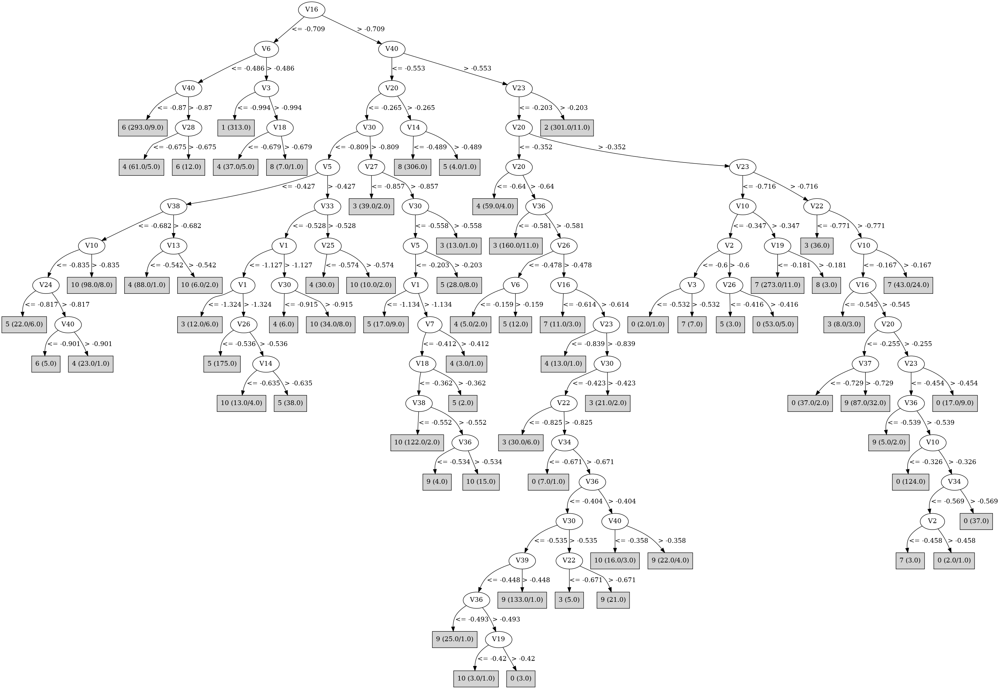

# J48

# SimpleCart Decision Tree

V3 < -0.9655

* V6 < -0.502

*   * V40 < -0.8474999999999999: 6(311.0/6.0)

*   * V40 >= -0.8474999999999999: 4(13.0/5.0)

* V6 >= -0.502: 1(355.0/0.0)

V3 >= -0.9655

* V23 < -0.2025

*   * V30 < -1.0514999999999999

*   *   * V3 < -0.624

*   *   *   * V22 < -1.073: 5(15.0/0.0)

*   *   *   * V22 >= -1.073

*   *   *   *   * V27 < -0.8314999999999999: 4(30.0/3.0)

*   *   *   *   * V27 >= -0.8314999999999999: 6(8.0/0.0)

*   *   * V3 >= -0.624: 8(340.0/0.0)

*   * V30 >= -1.0514999999999999

*   *   * V40 < -0.5565

*   *   *   * V5 < -0.3435

*   *   *   *   * V30 < -0.8935

*   *   *   *   *   * V38 < -0.7064999999999999

*   *   *   *   *   *   * V5 < -0.466

*   *   *   *   *   *   *   * V10 < -0.8545

*   *   *   *   *   *   *   *   * V22 < -0.8334999999999999: 4(25.0/6.0)

*   *   *   *   *   *   *   *   * V22 >= -0.8334999999999999: 6(13.0/0.0)

*   *   *   *   *   *   *   * V10 >= -0.8545: 10(42.0/3.0)

*   *   *   *   *   *   * V5 >= -0.466: 5(50.0/4.0)

*   *   *   *   *   * V38 >= -0.7064999999999999: 4(151.0/14.0)

*   *   *   *   * V30 >= -0.8935

*   *   *   *   *   * V10 < -0.81

*   *   *   *   *   *   * V32 < -0.726: 5(8.0/8.0)

*   *   *   *   *   *   * V32 >= -0.726: 4(10.0/1.0)

*   *   *   *   *   * V10 >= -0.81: 10(202.0/28.0)

*   *   *   * V5 >= -0.3435

*   *   *   *   * V10 < -0.6154999999999999

*   *   *   *   *   * V3 < -0.6315

*   *   *   *   *   *   * V37 < -0.892: 5(13.0/1.0)

*   *   *   *   *   *   * V37 >= -0.892: 3(41.0/9.0)

*   *   *   *   *   * V3 >= -0.6315

*   *   *   *   *   *   * V33 < -0.5155000000000001: 5(212.0/10.0)

*   *   *   *   *   *   * V33 >= -0.5155000000000001: 4(7.0/1.0)

*   *   *   *   * V10 >= -0.6154999999999999

*   *   *   *   *   * V20 < -0.1475

*   *   *   *   *   *   * V36 < -0.5575000000000001

*   *   *   *   *   *   *   * V10 < -0.4945: 10(7.0/15.0)

*   *   *   *   *   *   *   * V10 >= -0.4945: 9(12.0/0.0)

*   *   *   *   *   *   * V36 >= -0.5575000000000001: 10(47.0/9.0)

*   *   *   *   *   * V20 >= -0.1475: 8(14.0/0.0)

*   *   * V40 >= -0.5565

*   *   *   * V20 < -0.3405

*   *   *   *   * V36 < -0.5805

*   *   *   *   *   * V22 < -0.6295: 3(168.0/2.0)

*   *   *   *   *   * V22 >= -0.6295: 9(9.0/4.0)

*   *   *   *   * V36 >= -0.5805

*   *   *   *   *   * V23 < -0.7885

*   *   *   *   *   *   * V3 < -0.5445: 4(79.0/5.0)

*   *   *   *   *   *   * V3 >= -0.5445

*   *   *   *   *   *   *   * V10 < -0.554: 5(13.0/0.0)

*   *   *   *   *   *   *   * V10 >= -0.554: 7(12.0/11.0)

*   *   *   *   *   * V23 >= -0.7885

*   *   *   *   *   *   * V24 < -0.643

*   *   *   *   *   *   *   * V12 < -0.7084999999999999: 9(9.0/0.0)

*   *   *   *   *   *   *   * V12 >= -0.7084999999999999: 3(46.0/2.0)

*   *   *   *   *   *   * V24 >= -0.643

*   *   *   *   *   *   *   * V30 < -0.42

*   *   *   *   *   *   *   *   * V36 < -0.382: 9(210.0/28.0)

*   *   *   *   *   *   *   *   * V36 >= -0.382

*   *   *   *   *   *   *   *   *   * V40 < -0.357: 10(14.0/3.0)

*   *   *   *   *   *   *   *   *   * V40 >= -0.357: 9(14.0/4.0)

*   *   *   *   *   *   *   * V30 >= -0.42: 3(20.0/2.0)

*   *   *   * V20 >= -0.3405

*   *   *   *   * V23 < -0.7224999999999999

*   *   *   *   *   * V10 < -0.3705: 0(42.0/9.0)

*   *   *   *   *   * V10 >= -0.3705: 7(289.0/14.0)

*   *   *   *   * V23 >= -0.7224999999999999

*   *   *   *   *   * V22 < -0.771: 3(38.0/0.0)

*   *   *   *   *   * V22 >= -0.771

*   *   *   *   *   *   * V10 < -0.167

*   *   *   *   *   *   *   * V20 < -0.275

*   *   *   *   *   *   *   *   * V16 < -0.4365

*   *   *   *   *   *   *   *   *   * V23 < -0.6065: 0(39.0/7.0)

*   *   *   *   *   *   *   *   *   * V23 >= -0.6065

*   *   *   *   *   *   *   *   *   *   * V25 < -0.276: 9(13.0/1.0)

*   *   *   *   *   *   *   *   *   *   * V25 >= -0.276: 0(6.0/3.0)

*   *   *   *   *   *   *   *   * V16 >= -0.4365: 9(33.0/5.0)

*   *   *   *   *   *   *   * V20 >= -0.275: 0(226.0/35.0)

*   *   *   *   *   *   * V10 >= -0.167

*   *   *   *   *   *   *   * V1 < -1.007: 7(24.0/0.0)

*   *   *   *   *   *   *   * V1 >= -1.007: 9(17.0/7.0)

* V23 >= -0.2025: 2(327.0/11.0)

# PART

Decision list:

conditions|predicted class
---|---
V16 <= -0.719 AND V6 > -0.497 AND V3 <= -0.994| 1 (302.0)
V40 <= -0.553 AND V19 > -0.284 AND V6 <= -0.175| 8 (299.0)
V40 <= -0.553 AND V6 <= -0.558 AND V40 <= -0.85| 6 (288.0/8.0)
V20 > -0.341 AND V23 > -0.277| 2 (287.0/5.0)
V40 <= -0.553 AND V20 <= -0.725 AND V39 > -0.738 AND V3 <= -0.724| 4 (187.0/24.0)
V40 <= -0.562 AND V33 > -0.53 AND V25 > -0.571 AND V36 > -0.571| 10 (65.0/3.0)
V40 <= -0.588 AND V33 <= -0.528 AND V5 > -0.331 AND V23 <= -0.705 AND V10 <= -0.636 AND V24 <= -0.597 AND V3 > -0.683| 5 (161.0/2.0)
V38 <= -0.561 AND V23 <= -0.76 AND V33 <= -0.528 AND V24 > -0.78 AND V30 > -0.947| 10 (193.0/19.0)
V6 <= -0.221 AND V35 <= -0.584 AND V2 > -0.856| 5 (78.0/5.0)
V6 <= -0.221 AND V2 > -0.848 AND V36 > -0.624 AND V23 <= -0.789| 4 (115.0/6.0)
V20 > -0.341 AND V23 <= -0.723 AND V33 > -0.424 AND V10 > -0.341| 7 (250.0/6.0)
V23 > -0.827 AND V22 <= -0.775 AND V12 > -0.707| 3 (225.0/10.0)
V23 > -0.827 AND V20 > -0.341 AND V33 > -0.449 AND V10 <= -0.167 AND V16 > -0.523 AND V20 > -0.255| 0 (195.0/13.0)
V23 > -0.827 AND V33 <= -0.448 AND V20 <= -0.359 AND V36 <= -0.593| 3 (34.0/1.0)
V26 <= -0.486 AND V5 > -0.494 AND V1 > -1.297 AND V24 <= -0.765| 5 (24.0/1.0)
V33 <= -0.507 AND V6 <= -0.228| 10 (30.0/3.0)
V23 > -0.827 AND V23 > -0.463 AND V32 <= -0.313| 3 (40.0/1.0)
V23 > -0.827 AND V33 > -0.455 AND V20 <= -0.351 AND V36 <= -0.406 AND V23 > -0.761 AND V37 > -0.783| 9 (180.0/8.0)
V23 > -0.827 AND V33 > -0.445 AND V20 > -0.411 AND V20 <= -0.191 AND V16 <= -0.471 AND V2 > -0.624 AND V10 <= -0.322 AND V30 <= -0.58| 0 (63.0)
V33 <= -0.493 AND V1 <= -1.236| 3 (11.0/4.0)
V23 <= -0.827 AND V10 <= -0.409| 4 (26.0/5.0)
V33 <= -0.454| 5 (22.0/11.0)
V20 <= -0.439 AND V14 <= -0.565| 9 (20.0)
V20 <= -0.431 AND V30 > -0.684 AND V10 <= -0.465| 10 (10.0/1.0)
V16 <= -0.511 AND V1 <= -1.009| 7 (42.0/1.0)
V20 > -0.411 AND V19 <= -0.231 AND V4 > -0.332 AND V26 <= -0.103 AND V32 > -0.598 AND V36 <= -0.435| 9 (43.0)
V20 > -0.411 AND V19 <= -0.231 AND V16 <= -0.389 AND V7 > -0.52 AND V18 <= -0.349| 9 (31.0/7.0)
V20 > -0.411 AND V16 <= -0.389| 0 (44.0/4.0)
V29 > -0.356| 9 (24.0/3.0)
| 10 (11.0/5.0)

# JRip

Decision list:

conditions|predicted class
---|---
(V23 >= -0.202) and (V1 <= -0.779)|2 (293.0/0.0)
(V30 >= -0.151) and (V20 >= -0.068)|2 (30.0/0.0)
(V10 >= -0.316) and (V22 <= -0.641) and (V34 <= -0.6) and (V23 <= -0.704)|7 (225.0/0.0)
(V10 >= -0.346) and (V22 <= -0.614) and (V39 >= -0.33) and (V23 <= -0.651) and (V1 >= -1.22)|7 (61.0/0.0)
(V10 >= -0.422) and (V2 <= -0.608) and (V34 <= -0.627) and (V16 <= -0.517)|7 (27.0/0.0)
(V10 >= -0.089) and (V1 <= -1.012)|7 (15.0/0.0)
(V10 >= -0.387) and (V22 <= -0.654) and (V16 <= -0.524) and (V1 >= -1.164)|7 (10.0/0.0)
(V26 <= -0.464) and (V5 >= -0.426) and (V35 <= -0.567) and (V3 >= -0.628) and (V2 >= -0.7)|5 (133.0/0.0)
(V3 >= -0.737) and (V26 <= -0.602) and (V33 <= -0.677)|5 (61.0/0.0)
(V32 <= -0.668) and (V5 >= -0.381) and (V1 >= -1.234) and (V8 >= -0.419) and (V26 <= -0.505)|5 (42.0/0.0)
(V10 <= -0.578) and (V5 >= -0.415) and (V40 <= -0.589) and (V1 <= -1.089) and (V3 >= -0.576) and (V10 >= -0.766)|5 (38.0/0.0)
(V26 <= -0.454) and (V5 >= -0.468) and (V34 <= -0.749) and (V10 <= -0.721) and (V35 <= -0.603) and (V3 >= -0.784)|5 (28.0/0.0)
(V10 <= -0.578) and (V26 <= -0.405) and (V3 >= -0.527) and (V36 >= -0.584)|5 (13.0/0.0)
(V10 <= -0.663) and (V3 >= -0.678) and (V40 <= -0.564) and (V6 >= -0.225) and (V26 <= -0.499)|5 (13.0/0.0)
(V6 <= -0.584) and (V40 <= -0.9) and (V22 >= -0.963)|6 (247.0/0.0)
(V6 <= -0.695) and (V12 >= -1.007)|6 (65.0/0.0)
(V6 <= -0.558) and (V27 >= -0.852) and (V10 <= -0.916) and (V22 >= -0.814)|6 (20.0/0.0)
(V6 <= -0.491) and (V23 <= -1.1)|6 (16.0/8.0)
(V8 <= -0.397) and (V10 >= -0.8) and (V40 <= -0.662) and (V30 >= -0.899) and (V26 >= -0.523)|10 (174.0/0.0)
(V32 <= -0.884) and (V10 >= -0.897) and (V8 <= -0.674)|10 (35.0/0.0)
(V1 >= -1.003) and (V40 <= -0.509) and (V36 >= -0.517) and (V30 >= -0.782) and (V5 <= -0.149)|10 (53.0/0.0)
(V2 <= -0.585) and (V10 >= -0.8) and (V38 <= -0.686) and (V8 <= -0.545)|10 (32.0/0.0)
(V1 >= -1.113) and (V32 <= -0.659) and (V24 >= -0.638) and (V10 >= -0.65) and (V2 <= -0.543)|10 (22.0/0.0)
(V1 >= -0.997) and (V32 <= -0.587) and (V10 >= -0.735) and (V36 >= -0.556)|10 (8.0/0.0)
(V16 >= -0.447) and (V20 <= -0.457)|10 (27.0/18.0)
(V33 >= -0.429) and (V20 <= -0.299) and (V27 >= -0.698) and (V12 <= -0.55) and (V4 >= -0.333) and (V14 <= -0.543)|9 (100.0/0.0)
(V33 >= -0.457) and (V32 >= -0.473) and (V20 <= -0.255) and (V30 <= -0.422) and (V16 >= -0.428)|9 (55.0/0.0)
(V33 >= -0.457) and (V19 <= -0.4) and (V10 >= -0.522) and (V27 >= -0.801) and (V15 <= -0.394)|9 (56.0/0.0)
(V35 >= -0.455) and (V32 >= -0.429) and (V40 <= -0.36) and (V3 >= -0.41) and (V36 <= -0.382)|9 (30.0/0.0)
(V33 >= -0.477) and (V19 <= -0.4) and (V16 >= -0.542) and (V14 <= -0.655) and (V13 >= -0.475)|9 (21.0/0.0)
(V35 >= -0.404) and (V20 <= -0.282) and (V28 >= -0.457) and (V30 <= -0.459) and (V23 >= -0.586) and (V26 <= -0.174)|9 (29.0/0.0)
(V23 >= -0.762) and (V22 >= -0.828) and (V12 <= -0.654)|9 (16.0/0.0)
(V6 >= -0.074) and (V32 >= -0.263) and (V26 <= -0.112) and (V25 >= -0.255)|9 (12.0/0.0)
(V19 <= -0.354) and (V7 >= -0.525) and (V1 <= -0.928) and (V16 >= -0.45) and (V3 >= -0.509)|9 (8.0/0.0)
(V36 >= -0.509) and (V20 >= -0.35) and (V30 <= -0.609) and (V24 >= -0.592) and (V6 <= -0.089)|0 (126.0/0.0)
(V36 >= -0.474) and (V20 >= -0.307) and (V40 <= -0.247) and (V6 <= -0.01) and (V8 >= -0.356)|0 (112.0/0.0)
(V29 >= -0.407) and (V36 >= -0.361) and (V19 >= -0.34) and (V23 <= -0.39)|0 (41.0/0.0)
(V28 >= -0.547) and (V30 <= -0.558) and (V33 >= -0.41) and (V13 >= -0.138) and (V14 <= -0.382)|0 (25.0/0.0)
(V29 >= -0.437) and (V36 >= -0.531) and (V23 <= -0.639) and (V28 <= -0.453) and (V3 >= -0.666)|0 (21.0/0.0)
(V29 >= -0.405) and (V36 >= -0.371) and (V17 >= -0.412)|0 (9.0/0.0)
(V3 <= -1.022) and (V1 >= -1.394)|1 (355.0/0.0)
(V19 >= -0.264) and (V5 <= -0.161)|8 (353.0/0.0)
(V23 >= -0.784) and (V22 <= -0.765) and (V32 >= -0.736)|3 (225.0/0.0)
(V6 >= -0.214) and (V36 <= -0.598) and (V39 >= -0.56) and (V20 <= -0.379)|3 (70.0/0.0)
(V23 >= -0.591) and (V36 <= -0.426) and (V1 >= -0.978)|3 (37.0/0.0)
(V30 >= -0.817) and (V27 <= -0.864)|3 (12.0/0.0)
(V23 >= -0.556) and (V28 <= -0.424)|3 (9.0/0.0)
|4 (440.0/90.0)

# Decision Table

Non matches covered by Majority class

v20|v23|v27|target
---|---|---|---
(-0.1365--0.0695]|(-0.085-inf)|(0.1195-inf)|0
(-0.3405--0.2395]|(-0.2025--0.085]|(0.1195-inf)|0
(-0.1365--0.0695]|(-0.4945--0.2025]|(0.1195-inf)|0
(-0.4405--0.3405]|(-0.4945--0.2025]|(0.1195-inf)|0
(-0.1365--0.0695]|(-0.085-inf)|(-0.2675-0.1195]|0
(-0.2395--0.1365]|(-0.085-inf)|(-0.2675-0.1195]|0
(-0.2395--0.1365]|(-0.4945--0.2025]|(0.1195-inf)|0
(-0.0315-0.0685]|(-0.4945--0.2025]|(0.1195-inf)|0
(-0.3405--0.2395]|(-0.4945--0.2025]|(0.1195-inf)|0
(0.0685-inf)|(-0.085-inf)|(-0.2675-0.1195]|2
(-0.0695--0.0315]|(-0.085-inf)|(-0.2675-0.1195]|2
(-0.0315-0.0685]|(-0.085-inf)|(-0.2675-0.1195]|2
(-0.0315-0.0685]|(-0.2025--0.085]|(-0.2675-0.1195]|0
(-0.2395--0.1365]|(-0.6155--0.4945]|(0.1195-inf)|0
(-0.3405--0.2395]|(-0.2025--0.085]|(-0.2675-0.1195]|0
(-0.2395--0.1365]|(-0.2025--0.085]|(-0.2675-0.1195]|0
(-0.4405--0.3405]|(-0.6155--0.4945]|(0.1195-inf)|0
(-0.2395--0.1365]|(-0.4945--0.2025]|(-0.2675-0.1195]|0
(-0.1365--0.0695]|(-0.4945--0.2025]|(-0.2675-0.1195]|0
(-0.3405--0.2395]|(-0.4945--0.2025]|(-0.2675-0.1195]|0
(-0.0695--0.0315]|(-0.085-inf)|(-0.4305--0.2675]|2
(-0.4405--0.3405]|(-0.4945--0.2025]|(-0.2675-0.1195]|9
(-0.5735--0.4405]|(-0.085-inf)|(-0.4305--0.2675]|0
(0.0685-inf)|(-0.085-inf)|(-0.4305--0.2675]|2
(-0.1365--0.0695]|(-0.085-inf)|(-0.4305--0.2675]|2
(-0.0315-0.0685]|(-0.085-inf)|(-0.4305--0.2675]|2
(-0.2395--0.1365]|(-0.085-inf)|(-0.4305--0.2675]|2
(-0.5735--0.4405]|(-0.4945--0.2025]|(-0.2675-0.1195]|9
(-0.3405--0.2395]|(-0.2025--0.085]|(-0.4305--0.2675]|3
(-0.0315-0.0685]|(-0.6155--0.4945]|(-0.2675-0.1195]|0
(-0.2395--0.1365]|(-0.2025--0.085]|(-0.4305--0.2675]|0
(-0.5735--0.4405]|(-0.6155--0.4945]|(-0.2675-0.1195]|0
(-0.2395--0.1365]|(-0.6155--0.4945]|(-0.2675-0.1195]|0
(-0.4405--0.3405]|(-0.6155--0.4945]|(-0.2675-0.1195]|9
(-0.3405--0.2395]|(-0.6155--0.4945]|(-0.2675-0.1195]|0
(-0.0315-0.0685]|(-0.2025--0.085]|(-0.4305--0.2675]|2
(-0.5735--0.4405]|(-0.7115--0.6155]|(-0.2675-0.1195]|0
(-0.0695--0.0315]|(-0.7115--0.6155]|(-0.2675-0.1195]|0
(-0.1365--0.0695]|(-0.7115--0.6155]|(-0.2675-0.1195]|0
(-0.5735--0.4405]|(-0.4945--0.2025]|(-0.4305--0.2675]|9
(-0.2395--0.1365]|(-0.7115--0.6155]|(-0.2675-0.1195]|9
(-0.3405--0.2395]|(-0.7115--0.6155]|(-0.2675-0.1195]|9
(-0.3405--0.2395]|(-0.4945--0.2025]|(-0.4305--0.2675]|9
(-0.2395--0.1365]|(-0.4945--0.2025]|(-0.4305--0.2675]|9
(-0.2395--0.1365]|(-0.085-inf)|(-0.5765--0.4305]|2
(-0.1365--0.0695]|(-0.085-inf)|(-0.5765--0.4305]|2
(-0.0695--0.0315]|(-0.085-inf)|(-0.5765--0.4305]|2
(-0.0315-0.0685]|(-0.085-inf)|(-0.5765--0.4305]|2
(0.0685-inf)|(-0.085-inf)|(-0.5765--0.4305]|2
(-0.4405--0.3405]|(-0.4945--0.2025]|(-0.4305--0.2675]|9
(-0.4405--0.3405]|(-0.7115--0.6155]|(-0.2675-0.1195]|9
(-0.0315-0.0685]|(-0.6155--0.4945]|(-0.4305--0.2675]|0
(-0.4405--0.3405]|(-0.2025--0.085]|(-0.5765--0.4305]|0
(-0.2395--0.1365]|(-0.2025--0.085]|(-0.5765--0.4305]|2
(-0.5735--0.4405]|(-0.2025--0.085]|(-0.5765--0.4305]|3
(-0.5735--0.4405]|(-0.7885--0.7115]|(-0.2675-0.1195]|9
(-0.1365--0.0695]|(-0.6155--0.4945]|(-0.4305--0.2675]|0
(-0.2395--0.1365]|(-0.6155--0.4945]|(-0.4305--0.2675]|0
(-0.0695--0.0315]|(-0.2025--0.085]|(-0.5765--0.4305]|2
(-0.1365--0.0695]|(-0.2025--0.085]|(-0.5765--0.4305]|2
(0.0685-inf)|(-0.2025--0.085]|(-0.5765--0.4305]|0
(-0.5735--0.4405]|(-0.6155--0.4945]|(-0.4305--0.2675]|9
(-0.3405--0.2395]|(-0.2025--0.085]|(-0.5765--0.4305]|2
(-0.0315-0.0685]|(-0.2025--0.085]|(-0.5765--0.4305]|2
(-0.4405--0.3405]|(-0.7885--0.7115]|(-0.2675-0.1195]|0
(-0.4405--0.3405]|(-0.6155--0.4945]|(-0.4305--0.2675]|9
(-0.3405--0.2395]|(-0.6155--0.4945]|(-0.4305--0.2675]|0
(-0.5735--0.4405]|(-0.4945--0.2025]|(-0.5765--0.4305]|0
(-0.4405--0.3405]|(-0.7115--0.6155]|(-0.4305--0.2675]|0
(-0.6385--0.5735]|(-0.4945--0.2025]|(-0.5765--0.4305]|0
(-0.2395--0.1365]|(-0.4945--0.2025]|(-0.5765--0.4305]|0
(-0.5735--0.4405]|(-0.8275--0.7885]|(-0.2675-0.1195]|0
(-0.1365--0.0695]|(-0.4945--0.2025]|(-0.5765--0.4305]|3
(-0.1365--0.0695]|(-0.085-inf)|(-0.6305--0.5765]|2
(-0.3405--0.2395]|(-0.7115--0.6155]|(-0.4305--0.2675]|9
(-0.3405--0.2395]|(-0.4945--0.2025]|(-0.5765--0.4305]|9
(-0.2395--0.1365]|(-0.7115--0.6155]|(-0.4305--0.2675]|0
(-0.1365--0.0695]|(-0.7115--0.6155]|(-0.4305--0.2675]|0
(-0.7245--0.6385]|(-0.7115--0.6155]|(-0.4305--0.2675]|0
(-0.4405--0.3405]|(-0.4945--0.2025]|(-0.5765--0.4305]|3
(-0.0695--0.0315]|(-0.085-inf)|(-0.6305--0.5765]|2
(-0.2395--0.1365]|(-0.085-inf)|(-0.6305--0.5765]|2
(-0.0315-0.0685]|(-0.085-inf)|(-0.6305--0.5765]|2
(-0.5735--0.4405]|(-0.7115--0.6155]|(-0.4305--0.2675]|9
(-0.0695--0.0315]|(-0.6155--0.4945]|(-0.5765--0.4305]|0
(-0.2395--0.1365]|(-0.7885--0.7115]|(-0.4305--0.2675]|0
(-0.0315-0.0685]|(-0.2025--0.085]|(-0.6305--0.5765]|2
(-0.6385--0.5735]|(-0.7885--0.7115]|(-0.4305--0.2675]|0
(-0.0315-0.0685]|(-0.6155--0.4945]|(-0.5765--0.4305]|0
(-0.0695--0.0315]|(-0.2025--0.085]|(-0.6305--0.5765]|2
(-0.5735--0.4405]|(-0.7885--0.7115]|(-0.4305--0.2675]|9
(-0.1365--0.0695]|(-0.2025--0.085]|(-0.6305--0.5765]|2
(-0.5735--0.4405]|(-0.6155--0.4945]|(-0.5765--0.4305]|10
(-0.3405--0.2395]|(-0.7885--0.7115]|(-0.4305--0.2675]|9
(-0.4405--0.3405]|(-0.7885--0.7115]|(-0.4305--0.2675]|0
(-0.2395--0.1365]|(-0.2025--0.085]|(-0.6305--0.5765]|2
(-0.1365--0.0695]|(-0.6155--0.4945]|(-0.5765--0.4305]|0
(-0.6385--0.5735]|(-0.6155--0.4945]|(-0.5765--0.4305]|0
(-0.2395--0.1365]|(-0.6155--0.4945]|(-0.5765--0.4305]|0
(-0.3405--0.2395]|(-0.6155--0.4945]|(-0.5765--0.4305]|9
(-0.4405--0.3405]|(-0.6155--0.4945]|(-0.5765--0.4305]|9
(-0.3405--0.2395]|(-0.8275--0.7885]|(-0.4305--0.2675]|0
(-0.7245--0.6385]|(-0.7115--0.6155]|(-0.5765--0.4305]|10
(-0.5735--0.4405]|(-0.4945--0.2025]|(-0.6305--0.5765]|3
(-0.6385--0.5735]|(-0.8275--0.7885]|(-0.4305--0.2675]|0
(-0.6385--0.5735]|(-0.4945--0.2025]|(-0.6305--0.5765]|0
(-0.1365--0.0695]|(-0.085-inf)|(-0.7595--0.6305]|0
(-0.0695--0.0315]|(-0.7115--0.6155]|(-0.5765--0.4305]|0
(-0.4405--0.3405]|(-0.4945--0.2025]|(-0.6305--0.5765]|3
(-0.0695--0.0315]|(-0.085-inf)|(-0.7595--0.6305]|0
(-0.2395--0.1365]|(-0.4945--0.2025]|(-0.6305--0.5765]|0
(-0.1365--0.0695]|(-0.7115--0.6155]|(-0.5765--0.4305]|0
(-0.3405--0.2395]|(-0.7115--0.6155]|(-0.5765--0.4305]|0
(-0.2395--0.1365]|(-0.7115--0.6155]|(-0.5765--0.4305]|0
(-0.6385--0.5735]|(-0.7115--0.6155]|(-0.5765--0.4305]|10
(-0.3405--0.2395]|(-0.4945--0.2025]|(-0.6305--0.5765]|2
(-0.0315-0.0685]|(-0.085-inf)|(-0.7595--0.6305]|2
(-0.2395--0.1365]|(-0.085-inf)|(-0.7595--0.6305]|0
(-0.5735--0.4405]|(-0.7115--0.6155]|(-0.5765--0.4305]|10
(-0.4405--0.3405]|(-0.7115--0.6155]|(-0.5765--0.4305]|9
(-0.1365--0.0695]|(-0.7885--0.7115]|(-0.5765--0.4305]|0
(-0.2395--0.1365]|(-0.7885--0.7115]|(-0.5765--0.4305]|0
(-0.933--0.8515]|(-0.7885--0.7115]|(-0.5765--0.4305]|0
(-0.7245--0.6385]|(-0.7885--0.7115]|(-0.5765--0.4305]|10
(-0.2395--0.1365]|(-0.2025--0.085]|(-0.7595--0.6305]|2
(0.0685-inf)|(-0.2025--0.085]|(-0.7595--0.6305]|0
(-0.1365--0.0695]|(-0.6155--0.4945]|(-0.6305--0.5765]|0
(-0.0315-0.0685]|(-0.2025--0.085]|(-0.7595--0.6305]|2
(-0.6385--0.5735]|(-0.7885--0.7115]|(-0.5765--0.4305]|4
(-0.5735--0.4405]|(-0.6155--0.4945]|(-0.6305--0.5765]|9
(-0.3405--0.2395]|(-0.6155--0.4945]|(-0.6305--0.5765]|9
(-0.3405--0.2395]|(-0.7885--0.7115]|(-0.5765--0.4305]|0
(-0.2395--0.1365]|(-0.6155--0.4945]|(-0.6305--0.5765]|0
(-0.4405--0.3405]|(-0.7885--0.7115]|(-0.5765--0.4305]|10
(-0.5735--0.4405]|(-0.7885--0.7115]|(-0.5765--0.4305]|10
(-0.4405--0.3405]|(-0.6155--0.4945]|(-0.6305--0.5765]|9
(-0.0695--0.0315]|(-0.7115--0.6155]|(-0.6305--0.5765]|0
(-0.2395--0.1365]|(-0.4945--0.2025]|(-0.7595--0.6305]|3
(-0.0315-0.0685]|(-0.7115--0.6155]|(-0.6305--0.5765]|7
(-0.6385--0.5735]|(-0.7115--0.6155]|(-0.6305--0.5765]|0
(-0.3405--0.2395]|(-0.4945--0.2025]|(-0.7595--0.6305]|3
(-0.7245--0.6385]|(-0.4945--0.2025]|(-0.7595--0.6305]|3
(-0.3405--0.2395]|(-0.8275--0.7885]|(-0.5765--0.4305]|0
(-0.7245--0.6385]|(-0.8275--0.7885]|(-0.5765--0.4305]|0
(-0.1365--0.0695]|(-0.4945--0.2025]|(-0.7595--0.6305]|3
(-0.6385--0.5735]|(-0.4945--0.2025]|(-0.7595--0.6305]|3
(-0.4405--0.3405]|(-0.8275--0.7885]|(-0.5765--0.4305]|0
(-0.4405--0.3405]|(-0.7115--0.6155]|(-0.6305--0.5765]|9
(-0.1365--0.0695]|(-0.7115--0.6155]|(-0.6305--0.5765]|0
(-0.2395--0.1365]|(-0.7115--0.6155]|(-0.6305--0.5765]|0
(-0.4405--0.3405]|(-0.4945--0.2025]|(-0.7595--0.6305]|3
(-0.5735--0.4405]|(-0.4945--0.2025]|(-0.7595--0.6305]|3
(-0.6385--0.5735]|(-0.8275--0.7885]|(-0.5765--0.4305]|0
(-0.5735--0.4405]|(-0.7115--0.6155]|(-0.6305--0.5765]|9
(-0.3405--0.2395]|(-0.7115--0.6155]|(-0.6305--0.5765]|0
(-0.2395--0.1365]|(-0.8925--0.8275]|(-0.5765--0.4305]|0
(-0.5735--0.4405]|(-0.7885--0.7115]|(-0.6305--0.5765]|10
(-0.6385--0.5735]|(-0.7885--0.7115]|(-0.6305--0.5765]|10
(-0.4405--0.3405]|(-0.7885--0.7115]|(-0.6305--0.5765]|10
(-0.1365--0.0695]|(-0.7885--0.7115]|(-0.6305--0.5765]|0
(-0.3405--0.2395]|(-0.7885--0.7115]|(-0.6305--0.5765]|7
(-0.2395--0.1365]|(-0.7885--0.7115]|(-0.6305--0.5765]|7
(-0.3405--0.2395]|(-0.6155--0.4945]|(-0.7595--0.6305]|9
(-0.2395--0.1365]|(-0.6155--0.4945]|(-0.7595--0.6305]|0
(-0.5735--0.4405]|(-0.6155--0.4945]|(-0.7595--0.6305]|3
(-0.7245--0.6385]|(-0.6155--0.4945]|(-0.7595--0.6305]|0
(-0.4405--0.3405]|(-0.6155--0.4945]|(-0.7595--0.6305]|9
(-0.6385--0.5735]|(-0.6155--0.4945]|(-0.7595--0.6305]|9
(-0.2395--0.1365]|(-0.9735--0.8925]|(-0.5765--0.4305]|0
(-0.1365--0.0695]|(-0.7115--0.6155]|(-0.7595--0.6305]|0
(-0.2395--0.1365]|(-0.8275--0.7885]|(-0.6305--0.5765]|7
(-0.3405--0.2395]|(-0.4945--0.2025]|(-0.8395--0.7595]|3
(-0.6385--0.5735]|(-0.8275--0.7885]|(-0.6305--0.5765]|10
(-0.0695--0.0315]|(-0.7115--0.6155]|(-0.7595--0.6305]|0
(-0.4405--0.3405]|(-0.8275--0.7885]|(-0.6305--0.5765]|10
(-0.8515--0.7245]|(-0.8275--0.7885]|(-0.6305--0.5765]|0
(-0.5735--0.4405]|(-0.4945--0.2025]|(-0.8395--0.7595]|3
(-0.6385--0.5735]|(-0.4945--0.2025]|(-0.8395--0.7595]|3
(-0.0315-0.0685]|(-0.7115--0.6155]|(-0.7595--0.6305]|7
(-0.4405--0.3405]|(-0.4945--0.2025]|(-0.8395--0.7595]|0
(-0.3405--0.2395]|(-0.9735--0.8925]|(-0.5765--0.4305]|7
(-0.4405--0.3405]|(-0.7115--0.6155]|(-0.7595--0.6305]|9
(-0.3405--0.2395]|(-0.8275--0.7885]|(-0.6305--0.5765]|7
(-0.2395--0.1365]|(-0.7115--0.6155]|(-0.7595--0.6305]|0
(-0.3405--0.2395]|(-0.7115--0.6155]|(-0.7595--0.6305]|0
(-0.7245--0.6385]|(-0.8275--0.7885]|(-0.6305--0.5765]|0
(-0.5735--0.4405]|(-0.8275--0.7885]|(-0.6305--0.5765]|4
(-0.6385--0.5735]|(-0.7115--0.6155]|(-0.7595--0.6305]|9
(-0.2395--0.1365]|(-0.4945--0.2025]|(-0.8395--0.7595]|3
(-0.5735--0.4405]|(-0.7115--0.6155]|(-0.7595--0.6305]|9
(-0.2395--0.1365]|(-0.6155--0.4945]|(-0.8395--0.7595]|0
(-0.4405--0.3405]|(-0.8925--0.8275]|(-0.6305--0.5765]|0
(-0.7245--0.6385]|(-0.7885--0.7115]|(-0.7595--0.6305]|0
(-0.5735--0.4405]|(-0.8925--0.8275]|(-0.6305--0.5765]|10
(-0.4405--0.3405]|(-1.0225--0.9735]|(-0.5765--0.4305]|0
(-0.2395--0.1365]|(-0.8925--0.8275]|(-0.6305--0.5765]|7
(-0.8515--0.7245]|(-0.7885--0.7115]|(-0.7595--0.6305]|4
(-0.3405--0.2395]|(-0.6155--0.4945]|(-0.8395--0.7595]|3
(-0.6385--0.5735]|(-0.6155--0.4945]|(-0.8395--0.7595]|3
(-0.3405--0.2395]|(-0.8925--0.8275]|(-0.6305--0.5765]|7
(-0.0695--0.0315]|(-0.7885--0.7115]|(-0.7595--0.6305]|7
(-0.0695--0.0315]|(-1.0225--0.9735]|(-0.5765--0.4305]|0
(-0.1365--0.0695]|(-1.0225--0.9735]|(-0.5765--0.4305]|8
(-0.7245--0.6385]|(-0.6155--0.4945]|(-0.8395--0.7595]|0
(-0.1365--0.0695]|(-0.7885--0.7115]|(-0.7595--0.6305]|7
(-0.0315-0.0685]|(-0.7885--0.7115]|(-0.7595--0.6305]|7
(-0.3405--0.2395]|(-0.7885--0.7115]|(-0.7595--0.6305]|0
(-0.2395--0.1365]|(-0.7885--0.7115]|(-0.7595--0.6305]|7
(-0.2395--0.1365]|(-1.0225--0.9735]|(-0.5765--0.4305]|8
(-0.6385--0.5735]|(-0.7885--0.7115]|(-0.7595--0.6305]|10
(-0.5735--0.4405]|(-0.6155--0.4945]|(-0.8395--0.7595]|3
(-0.4405--0.3405]|(-0.6155--0.4945]|(-0.8395--0.7595]|3
(-0.4405--0.3405]|(-0.7885--0.7115]|(-0.7595--0.6305]|9
(-0.5735--0.4405]|(-0.7885--0.7115]|(-0.7595--0.6305]|10
(-0.0315-0.0685]|(-0.8275--0.7885]|(-0.7595--0.6305]|7
(-0.5735--0.4405]|(-0.4945--0.2025]|(-0.9615--0.8395]|3
(-0.933--0.8515]|(-0.7115--0.6155]|(-0.8395--0.7595]|0
(-0.0315-0.0685]|(-1.0725--1.0225]|(-0.5765--0.4305]|8
(-0.0695--0.0315]|(-0.8275--0.7885]|(-0.7595--0.6305]|7
(-0.4405--0.3405]|(-0.9735--0.8925]|(-0.6305--0.5765]|7
(-0.1365--0.0695]|(-1.0725--1.0225]|(-0.5765--0.4305]|8
(-0.2395--0.1365]|(-0.9735--0.8925]|(-0.6305--0.5765]|0
(-0.4405--0.3405]|(-0.7115--0.6155]|(-0.8395--0.7595]|3
(-0.4405--0.3405]|(-0.8275--0.7885]|(-0.7595--0.6305]|10
(-0.8515--0.7245]|(-0.8275--0.7885]|(-0.7595--0.6305]|4
(-0.4405--0.3405]|(-0.4945--0.2025]|(-0.9615--0.8395]|0
(-0.3405--0.2395]|(-0.9735--0.8925]|(-0.6305--0.5765]|0
(-0.2395--0.1365]|(-0.8275--0.7885]|(-0.7595--0.6305]|7
(-0.2395--0.1365]|(-1.0725--1.0225]|(-0.5765--0.4305]|8
(-0.933--0.8515]|(-0.8275--0.7885]|(-0.7595--0.6305]|0
(-0.6385--0.5735]|(-0.7115--0.6155]|(-0.8395--0.7595]|0
(-0.1365--0.0695]|(-0.8275--0.7885]|(-0.7595--0.6305]|7
(-0.3405--0.2395]|(-0.8275--0.7885]|(-0.7595--0.6305]|7
(-0.0695--0.0315]|(-1.0725--1.0225]|(-0.5765--0.4305]|8
(-0.6385--0.5735]|(-0.8275--0.7885]|(-0.7595--0.6305]|10
(-0.5735--0.4405]|(-0.8275--0.7885]|(-0.7595--0.6305]|10
(-0.7245--0.6385]|(-0.8275--0.7885]|(-0.7595--0.6305]|10
(-0.3405--0.2395]|(-0.7115--0.6155]|(-0.8395--0.7595]|0
(-0.5735--0.4405]|(-0.7115--0.6155]|(-0.8395--0.7595]|3
(-0.933--0.8515]|(-0.7885--0.7115]|(-0.8395--0.7595]|0
(-0.1365--0.0695]|(-0.6155--0.4945]|(-0.9615--0.8395]|0
(-0.2395--0.1365]|(-inf--1.2025]|(-0.4305--0.2675]|0
(-0.2395--0.1365]|(-1.0225--0.9735]|(-0.6305--0.5765]|8
(-0.2395--0.1365]|(-1.1295--1.0725]|(-0.5765--0.4305]|8
(-0.7245--0.6385]|(-0.7885--0.7115]|(-0.8395--0.7595]|9
(-0.0315-0.0685]|(-0.7885--0.7115]|(-0.8395--0.7595]|0
(-0.3405--0.2395]|(-0.7885--0.7115]|(-0.8395--0.7595]|5
(-0.1365--0.0695]|(-1.1295--1.0725]|(-0.5765--0.4305]|8
(-0.3405--0.2395]|(-1.1295--1.0725]|(-0.5765--0.4305]|8
(-0.6385--0.5735]|(-0.8925--0.8275]|(-0.7595--0.6305]|10
(-0.933--0.8515]|(-0.8925--0.8275]|(-0.7595--0.6305]|4
(-0.7245--0.6385]|(-0.8925--0.8275]|(-0.7595--0.6305]|4
(-0.6385--0.5735]|(-0.6155--0.4945]|(-0.9615--0.8395]|3
(-0.1365--0.0695]|(-0.7885--0.7115]|(-0.8395--0.7595]|7
(-0.2395--0.1365]|(-0.8925--0.8275]|(-0.7595--0.6305]|7
(-0.3405--0.2395]|(-0.8925--0.8275]|(-0.7595--0.6305]|7
(-0.1365--0.0695]|(-0.8925--0.8275]|(-0.7595--0.6305]|7
(-0.2395--0.1365]|(-0.7885--0.7115]|(-0.8395--0.7595]|7
(-0.4405--0.3405]|(-0.7885--0.7115]|(-0.8395--0.7595]|5
(-0.0695--0.0315]|(-1.1295--1.0725]|(-0.5765--0.4305]|8
(-0.1365--0.0695]|(-inf--1.2025]|(-0.4305--0.2675]|0
(-0.0315-0.0685]|(-1.1295--1.0725]|(-0.5765--0.4305]|8
(-0.4405--0.3405]|(-0.8925--0.8275]|(-0.7595--0.6305]|10
(-0.8515--0.7245]|(-0.8925--0.8275]|(-0.7595--0.6305]|4
(-0.5735--0.4405]|(-0.8925--0.8275]|(-0.7595--0.6305]|10
(-0.2395--0.1365]|(-0.6155--0.4945]|(-0.9615--0.8395]|3
(-0.3405--0.2395]|(-0.6155--0.4945]|(-0.9615--0.8395]|3
(-0.5735--0.4405]|(-0.6155--0.4945]|(-0.9615--0.8395]|3
(-0.4405--0.3405]|(-0.6155--0.4945]|(-0.9615--0.8395]|3
(-0.6385--0.5735]|(-0.7885--0.7115]|(-0.8395--0.7595]|9
(-0.5735--0.4405]|(-0.7885--0.7115]|(-0.8395--0.7595]|5
(-0.8515--0.7245]|(-0.8275--0.7885]|(-0.8395--0.7595]|0
(-0.7245--0.6385]|(-0.7115--0.6155]|(-0.9615--0.8395]|0
(-0.0695--0.0315]|(-0.8275--0.7885]|(-0.8395--0.7595]|0
(-1.0975--0.933]|(-0.9735--0.8925]|(-0.7595--0.6305]|0
(-0.0315-0.0685]|(-0.9735--0.8925]|(-0.7595--0.6305]|0
(-0.1365--0.0695]|(-1.0725--1.0225]|(-0.6305--0.5765]|8
(-0.1365--0.0695]|(-0.8275--0.7885]|(-0.8395--0.7595]|7
(-0.2395--0.1365]|(-1.0725--1.0225]|(-0.6305--0.5765]|0
(-0.4405--0.3405]|(-0.8275--0.7885]|(-0.8395--0.7595]|5
(0.0685-inf)|(-1.2025--1.1295]|(-0.5765--0.4305]|8
(-0.3405--0.2395]|(-1.2025--1.1295]|(-0.5765--0.4305]|8
(-0.5735--0.4405]|(-0.9735--0.8925]|(-0.7595--0.6305]|10
(-0.2395--0.1365]|(-0.7115--0.6155]|(-0.9615--0.8395]|3
(-0.3405--0.2395]|(-0.7115--0.6155]|(-0.9615--0.8395]|3
(-0.2395--0.1365]|(-0.9735--0.8925]|(-0.7595--0.6305]|7
(-0.1365--0.0695]|(-0.9735--0.8925]|(-0.7595--0.6305]|0
(-0.3405--0.2395]|(-0.8275--0.7885]|(-0.8395--0.7595]|7
(-0.0695--0.0315]|(-1.0725--1.0225]|(-0.6305--0.5765]|8
(-0.8515--0.7245]|(-0.9735--0.8925]|(-0.7595--0.6305]|4
(-0.5735--0.4405]|(-0.8275--0.7885]|(-0.8395--0.7595]|5
(-0.6385--0.5735]|(-0.7115--0.6155]|(-0.9615--0.8395]|3
(-0.2395--0.1365]|(-0.8275--0.7885]|(-0.8395--0.7595]|7
(-0.0315-0.0685]|(-0.8275--0.7885]|(-0.8395--0.7595]|7
(-0.4405--0.3405]|(-0.9735--0.8925]|(-0.7595--0.6305]|7
(-0.3405--0.2395]|(-0.9735--0.8925]|(-0.7595--0.6305]|7
(-0.2395--0.1365]|(-1.2025--1.1295]|(-0.5765--0.4305]|8
(-0.0315-0.0685]|(-1.2025--1.1295]|(-0.5765--0.4305]|8
(-0.0695--0.0315]|(-1.2025--1.1295]|(-0.5765--0.4305]|8
(-0.1365--0.0695]|(-1.2025--1.1295]|(-0.5765--0.4305]|8
(-0.7245--0.6385]|(-0.8275--0.7885]|(-0.8395--0.7595]|10
(-0.6385--0.5735]|(-0.8275--0.7885]|(-0.8395--0.7595]|10
(-0.6385--0.5735]|(-0.9735--0.8925]|(-0.7595--0.6305]|10
(-0.933--0.8515]|(-0.9735--0.8925]|(-0.7595--0.6305]|4
(-0.7245--0.6385]|(-0.9735--0.8925]|(-0.7595--0.6305]|4
(-0.4405--0.3405]|(-0.7115--0.6155]|(-0.9615--0.8395]|3
(-0.5735--0.4405]|(-0.7115--0.6155]|(-0.9615--0.8395]|3
(-0.933--0.8515]|(-0.7885--0.7115]|(-0.9615--0.8395]|0
(-0.4405--0.3405]|(-1.0225--0.9735]|(-0.7595--0.6305]|0
(-0.3405--0.2395]|(-inf--1.2025]|(-0.5765--0.4305]|8
(-0.1365--0.0695]|(-1.1295--1.0725]|(-0.6305--0.5765]|8
(-0.0695--0.0315]|(-0.8925--0.8275]|(-0.8395--0.7595]|0
(-0.7245--0.6385]|(-0.7885--0.7115]|(-0.9615--0.8395]|5
(-0.4405--0.3405]|(-0.8925--0.8275]|(-0.8395--0.7595]|5
(-0.0695--0.0315]|(-inf--1.2025]|(-0.5765--0.4305]|8
(-0.3405--0.2395]|(-0.8925--0.8275]|(-0.8395--0.7595]|7
(-0.2395--0.1365]|(-1.1295--1.0725]|(-0.6305--0.5765]|0
(-1.0975--0.933]|(-1.0225--0.9735]|(-0.7595--0.6305]|6
(-0.933--0.8515]|(-1.0225--0.9735]|(-0.7595--0.6305]|6
(-0.4405--0.3405]|(-0.7885--0.7115]|(-0.9615--0.8395]|3
(-0.6385--0.5735]|(-0.7885--0.7115]|(-0.9615--0.8395]|5
(-0.1365--0.0695]|(-0.8925--0.8275]|(-0.8395--0.7595]|7
(-0.0315-0.0685]|(-0.8925--0.8275]|(-0.8395--0.7595]|7
(-0.2395--0.1365]|(-0.8925--0.8275]|(-0.8395--0.7595]|7
(-0.0315-0.0685]|(-inf--1.2025]|(-0.5765--0.4305]|8
(-0.0695--0.0315]|(-1.1295--1.0725]|(-0.6305--0.5765]|8
(-0.1365--0.0695]|(-inf--1.2025]|(-0.5765--0.4305]|8
(-0.0315-0.0685]|(-1.1295--1.0725]|(-0.6305--0.5765]|8
(-0.2395--0.1365]|(-inf--1.2025]|(-0.5765--0.4305]|8
(0.0685-inf)|(-1.1295--1.0725]|(-0.6305--0.5765]|8
(-0.8515--0.7245]|(-1.0225--0.9735]|(-0.7595--0.6305]|4
(-0.8515--0.7245]|(-0.8925--0.8275]|(-0.8395--0.7595]|4
(-0.6385--0.5735]|(-0.8925--0.8275]|(-0.8395--0.7595]|10
(-0.7245--0.6385]|(-0.8925--0.8275]|(-0.8395--0.7595]|10
(-0.5735--0.4405]|(-0.7885--0.7115]|(-0.9615--0.8395]|3
(-0.5735--0.4405]|(-0.8925--0.8275]|(-0.8395--0.7595]|10
(-0.6385--0.5735]|(-0.8275--0.7885]|(-0.9615--0.8395]|0
(-0.0315-0.0685]|(-0.9735--0.8925]|(-0.8395--0.7595]|0
(-0.8515--0.7245]|(-0.8275--0.7885]|(-0.9615--0.8395]|0
(-0.2395--0.1365]|(-0.9735--0.8925]|(-0.8395--0.7595]|7
(-0.4405--0.3405]|(-0.9735--0.8925]|(-0.8395--0.7595]|4
(-0.7245--0.6385]|(-0.7115--0.6155]|(-1.0475--0.9615]|3
(-0.5735--0.4405]|(-0.7115--0.6155]|(-1.0475--0.9615]|3
(-0.6385--0.5735]|(-0.7115--0.6155]|(-1.0475--0.9615]|0
(-0.2395--0.1365]|(-0.7115--0.6155]|(-1.0475--0.9615]|3
(-0.0695--0.0315]|(-0.9735--0.8925]|(-0.8395--0.7595]|7
(-0.933--0.8515]|(-0.8275--0.7885]|(-0.9615--0.8395]|1
(-0.4405--0.3405]|(-0.7115--0.6155]|(-1.0475--0.9615]|3
(-0.1365--0.0695]|(-0.9735--0.8925]|(-0.8395--0.7595]|7
(-1.0975--0.933]|(-0.8275--0.7885]|(-0.9615--0.8395]|1
(-0.2395--0.1365]|(-1.2025--1.1295]|(-0.6305--0.5765]|0
(-1.0975--0.933]|(-1.0725--1.0225]|(-0.7595--0.6305]|6
(-0.933--0.8515]|(-1.0725--1.0225]|(-0.7595--0.6305]|6
(-0.5735--0.4405]|(-0.9735--0.8925]|(-0.8395--0.7595]|10
(-0.8515--0.7245]|(-0.9735--0.8925]|(-0.8395--0.7595]|4
(-1.0975--0.933]|(-0.9735--0.8925]|(-0.8395--0.7595]|0
(-0.933--0.8515]|(-0.9735--0.8925]|(-0.8395--0.7595]|4
(-0.3405--0.2395]|(-0.9735--0.8925]|(-0.8395--0.7595]|0
(-0.7245--0.6385]|(-0.8275--0.7885]|(-0.9615--0.8395]|5
(-0.3405--0.2395]|(-0.8275--0.7885]|(-0.9615--0.8395]|5
(-0.4405--0.3405]|(-0.8275--0.7885]|(-0.9615--0.8395]|5
(-0.5735--0.4405]|(-0.8275--0.7885]|(-0.9615--0.8395]|5
(-0.1365--0.0695]|(-1.2025--1.1295]|(-0.6305--0.5765]|8
(-0.0695--0.0315]|(-1.2025--1.1295]|(-0.6305--0.5765]|8
(-0.0315-0.0685]|(-1.2025--1.1295]|(-0.6305--0.5765]|8
(-0.7245--0.6385]|(-0.9735--0.8925]|(-0.8395--0.7595]|4
(-0.6385--0.5735]|(-0.9735--0.8925]|(-0.8395--0.7595]|10
(-0.1365--0.0695]|(-inf--1.2025]|(-0.6305--0.5765]|0
(-0.1365--0.0695]|(-0.7885--0.7115]|(-1.0475--0.9615]|0
(-0.933--0.8515]|(-1.1295--1.0725]|(-0.7595--0.6305]|6
(-0.8515--0.7245]|(-0.8925--0.8275]|(-0.9615--0.8395]|10
(-0.7245--0.6385]|(-0.7885--0.7115]|(-1.0475--0.9615]|0
(-0.0695--0.0315]|(-1.0225--0.9735]|(-0.8395--0.7595]|0
(-0.3405--0.2395]|(-0.8925--0.8275]|(-0.9615--0.8395]|5
(-0.0695--0.0315]|(-inf--1.2025]|(-0.6305--0.5765]|8
(-0.7245--0.6385]|(-1.0225--0.9735]|(-0.8395--0.7595]|4
(-0.3405--0.2395]|(-0.7885--0.7115]|(-1.0475--0.9615]|0
(-0.6385--0.5735]|(-0.7885--0.7115]|(-1.0475--0.9615]|3
(-0.933--0.8515]|(-0.8925--0.8275]|(-0.9615--0.8395]|1
(-0.8515--0.7245]|(-1.0225--0.9735]|(-0.8395--0.7595]|4
(-0.7245--0.6385]|(-0.8925--0.8275]|(-0.9615--0.8395]|5
(-0.4405--0.3405]|(-0.8925--0.8275]|(-0.9615--0.8395]|5
(-0.5735--0.4405]|(-0.8925--0.8275]|(-0.9615--0.8395]|5
(-0.6385--0.5735]|(-0.8925--0.8275]|(-0.9615--0.8395]|5
(-1.0975--0.933]|(-0.8925--0.8275]|(-0.9615--0.8395]|1
(-0.0315-0.0685]|(-inf--1.2025]|(-0.6305--0.5765]|8
(-1.0975--0.933]|(-1.1295--1.0725]|(-0.7595--0.6305]|0
(-1.0975--0.933]|(-1.0225--0.9735]|(-0.8395--0.7595]|6
(-0.933--0.8515]|(-1.0225--0.9735]|(-0.8395--0.7595]|4
(-0.4405--0.3405]|(-0.7885--0.7115]|(-1.0475--0.9615]|3
(-0.5735--0.4405]|(-0.7885--0.7115]|(-1.0475--0.9615]|3
(-0.6385--0.5735]|(-0.8275--0.7885]|(-1.0475--0.9615]|3
(-0.1365--0.0695]|(-0.9735--0.8925]|(-0.9615--0.8395]|0
(-inf--1.0975]|(-1.0725--1.0225]|(-0.8395--0.7595]|0
(-0.0695--0.0315]|(-0.9735--0.8925]|(-0.9615--0.8395]|0
(-0.4405--0.3405]|(-0.9735--0.8925]|(-0.9615--0.8395]|5
(-0.8515--0.7245]|(-1.0725--1.0225]|(-0.8395--0.7595]|4
(-0.5735--0.4405]|(-0.8275--0.7885]|(-1.0475--0.9615]|3
(-1.0975--0.933]|(-0.9735--0.8925]|(-0.9615--0.8395]|1
(-0.933--0.8515]|(-1.0725--1.0225]|(-0.8395--0.7595]|6
(-1.0975--0.933]|(-1.0725--1.0225]|(-0.8395--0.7595]|6
(-0.6385--0.5735]|(-0.9735--0.8925]|(-0.9615--0.8395]|10
(-0.5735--0.4405]|(-0.9735--0.8925]|(-0.9615--0.8395]|5
(-0.7245--0.6385]|(-0.9735--0.8925]|(-0.9615--0.8395]|10
(-0.933--0.8515]|(-0.9735--0.8925]|(-0.9615--0.8395]|4
(-0.8515--0.7245]|(-0.9735--0.8925]|(-0.9615--0.8395]|4
(-0.4405--0.3405]|(-0.8275--0.7885]|(-1.0475--0.9615]|3
(-0.5735--0.4405]|(-0.8925--0.8275]|(-1.0475--0.9615]|0
(-0.5735--0.4405]|(-0.7885--0.7115]|(-inf--1.0475]|0
(-0.8515--0.7245]|(-0.8925--0.8275]|(-1.0475--0.9615]|5
(-0.7245--0.6385]|(-0.8925--0.8275]|(-1.0475--0.9615]|5
(-0.6385--0.5735]|(-0.8925--0.8275]|(-1.0475--0.9615]|0
(-0.933--0.8515]|(-0.8925--0.8275]|(-1.0475--0.9615]|1
(-1.0975--0.933]|(-0.8925--0.8275]|(-1.0475--0.9615]|1
(-0.933--0.8515]|(-1.1295--1.0725]|(-0.8395--0.7595]|6
(-inf--1.0975]|(-1.1295--1.0725]|(-0.8395--0.7595]|0
(-0.6385--0.5735]|(-1.0225--0.9735]|(-0.9615--0.8395]|4
(-0.7245--0.6385]|(-1.0225--0.9735]|(-0.9615--0.8395]|4
(-1.0975--0.933]|(-1.0225--0.9735]|(-0.9615--0.8395]|4
(-0.933--0.8515]|(-1.0225--0.9735]|(-0.9615--0.8395]|4
(-1.0975--0.933]|(-1.1295--1.0725]|(-0.8395--0.7595]|6
(-0.8515--0.7245]|(-1.0225--0.9735]|(-0.9615--0.8395]|4
(-0.933--0.8515]|(-0.9735--0.8925]|(-1.0475--0.9615]|1
(-0.5735--0.4405]|(-0.8275--0.7885]|(-inf--1.0475]|3
(-0.8515--0.7245]|(-0.9735--0.8925]|(-1.0475--0.9615]|5
(-0.7245--0.6385]|(-0.9735--0.8925]|(-1.0475--0.9615]|5
(-0.5735--0.4405]|(-1.0725--1.0225]|(-0.9615--0.8395]|0
(-0.6385--0.5735]|(-0.8275--0.7885]|(-inf--1.0475]|3
(-0.5735--0.4405]|(-0.9735--0.8925]|(-1.0475--0.9615]|5
(-0.6385--0.5735]|(-0.9735--0.8925]|(-1.0475--0.9615]|5
(-1.0975--0.933]|(-0.9735--0.8925]|(-1.0475--0.9615]|1
(-0.933--0.8515]|(-1.0725--1.0225]|(-0.9615--0.8395]|4
(-1.0975--0.933]|(-1.2025--1.1295]|(-0.8395--0.7595]|6
(-0.7245--0.6385]|(-1.0725--1.0225]|(-0.9615--0.8395]|4
(-1.0975--0.933]|(-1.0725--1.0225]|(-0.9615--0.8395]|6
(-0.8515--0.7245]|(-1.0725--1.0225]|(-0.9615--0.8395]|4
(-0.4405--0.3405]|(-0.8925--0.8275]|(-inf--1.0475]|0
(-inf--1.0975]|(-1.1295--1.0725]|(-0.9615--0.8395]|6
(-0.933--0.8515]|(-1.0225--0.9735]|(-1.0475--0.9615]|4
(-0.5735--0.4405]|(-1.0225--0.9735]|(-1.0475--0.9615]|5
(-0.7245--0.6385]|(-1.0225--0.9735]|(-1.0475--0.9615]|5
(-1.0975--0.933]|(-1.0225--0.9735]|(-1.0475--0.9615]|1
(-1.0975--0.933]|(-1.1295--1.0725]|(-0.9615--0.8395]|6
(-0.7245--0.6385]|(-1.1295--1.0725]|(-0.9615--0.8395]|0
(-0.933--0.8515]|(-1.1295--1.0725]|(-0.9615--0.8395]|4
(-0.8515--0.7245]|(-1.0225--0.9735]|(-1.0475--0.9615]|5
(-0.6385--0.5735]|(-0.8925--0.8275]|(-inf--1.0475]|3
(-0.8515--0.7245]|(-0.9735--0.8925]|(-inf--1.0475]|5
(-1.0975--0.933]|(-1.0725--1.0225]|(-1.0475--0.9615]|4
(-0.7245--0.6385]|(-1.0725--1.0225]|(-1.0475--0.9615]|10
(-1.0975--0.933]|(-0.9735--0.8925]|(-inf--1.0475]|1
(-0.933--0.8515]|(-1.2025--1.1295]|(-0.9615--0.8395]|6
(-inf--1.0975]|(-1.2025--1.1295]|(-0.9615--0.8395]|6
(-1.0975--0.933]|(-1.2025--1.1295]|(-0.9615--0.8395]|6
(-0.8515--0.7245]|(-1.0725--1.0225]|(-1.0475--0.9615]|10
(-0.933--0.8515]|(-1.0725--1.0225]|(-1.0475--0.9615]|4
(-0.6385--0.5735]|(-0.9735--0.8925]|(-inf--1.0475]|3
(-0.7245--0.6385]|(-1.1295--1.0725]|(-1.0475--0.9615]|0
(-0.933--0.8515]|(-1.0225--0.9735]|(-inf--1.0475]|1
(-0.7245--0.6385]|(-1.0225--0.9735]|(-inf--1.0475]|5
(-inf--1.0975]|(-1.0225--0.9735]|(-inf--1.0475]|1
(-1.0975--0.933]|(-inf--1.2025]|(-0.9615--0.8395]|6
(-0.8515--0.7245]|(-1.0225--0.9735]|(-inf--1.0475]|5
(-0.933--0.8515]|(-1.1295--1.0725]|(-1.0475--0.9615]|4
(-1.0975--0.933]|(-1.0225--0.9735]|(-inf--1.0475]|1
(-1.0975--0.933]|(-1.1295--1.0725]|(-1.0475--0.9615]|4
(-0.6385--0.5735]|(-1.0725--1.0225]|(-inf--1.0475]|0
(-0.8515--0.7245]|(-1.0725--1.0225]|(-inf--1.0475]|5
(-inf--1.0975]|(-1.0725--1.0225]|(-inf--1.0475]|1
(-0.7245--0.6385]|(-1.0725--1.0225]|(-inf--1.0475]|5
(-1.0975--0.933]|(-1.0725--1.0225]|(-inf--1.0475]|1
(-inf--1.0975]|(-1.2025--1.1295]|(-1.0475--0.9615]|6
(-1.0975--0.933]|(-1.2025--1.1295]|(-1.0475--0.9615]|6
(-0.933--0.8515]|(-1.1295--1.0725]|(-inf--1.0475]|0
(-inf--1.0975]|(-inf--1.2025]|(-1.0475--0.9615]|6
(-0.8515--0.7245]|(-1.1295--1.0725]|(-inf--1.0475]|5
(-inf--1.0975]|(-1.1295--1.0725]|(-inf--1.0475]|1
(-1.0975--0.933]|(-1.1295--1.0725]|(-inf--1.0475]|1
(-1.0975--0.933]|(-1.2025--1.1295]|(-inf--1.0475]|1
(-inf--1.0975]|(-1.2025--1.1295]|(-inf--1.0475]|0
(-0.933--0.8515]|(-1.2025--1.1295]|(-inf--1.0475]|4
(-inf--1.0975]|(-inf--1.2025]|(-inf--1.0475]|0
(-1.0975--0.933]|(-inf--1.2025]|(-inf--1.0475]|6

