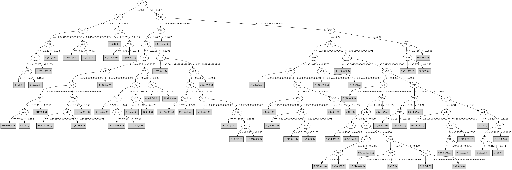

# J48

# SimpleCart Decision Tree

V23 < -0.185

* V3 < -0.9655

*   * V6 < -0.5

*   *   * V12 < -1.0085

*   *   *   * V3 < -1.089: 6(5.0/0.0)

*   *   *   * V3 >= -1.089: 4(10.0/0.0)

*   *   * V12 >= -1.0085

*   *   *   * V20 < -0.894: 6(297.0/2.0)

*   *   *   * V20 >= -0.894

*   *   *   *   * V3 < -1.012: 6(3.0/0.0)

*   *   *   *   * V3 >= -1.012: 4(4.0/0.0)

*   * V6 >= -0.5: 1(340.0/2.0)

* V3 >= -0.9655

*   * V23 < -1.096

*   *   * V2 < -0.7105

*   *   *   * V32 < -0.948: 5(3.0/1.0)

*   *   *   * V32 >= -0.948: 4(8.0/1.0)

*   *   * V2 >= -0.7105: 8(311.0/0.0)

*   * V23 >= -1.096

*   *   * V40 < -0.5395000000000001

*   *   *   * V20 < -0.7284999999999999

*   *   *   *   * V38 < -0.754

*   *   *   *   *   * V5 < -0.523

*   *   *   *   *   *   * V10 < -0.904

*   *   *   *   *   *   *   * V1 < -1.1635: 4(5.0/0.0)

*   *   *   *   *   *   *   * V1 >= -1.1635: 6(10.0/0.0)

*   *   *   *   *   *   * V10 >= -0.904: 10(28.0/0.0)

*   *   *   *   *   * V5 >= -0.523: 5(23.0/1.0)

*   *   *   *   * V38 >= -0.754

*   *   *   *   *   * V3 < -0.66

*   *   *   *   *   *   * V40 < -0.8394999999999999

*   *   *   *   *   *   *   * V6 < -0.582: 6(6.0/0.0)

*   *   *   *   *   *   *   * V6 >= -0.582: 4(4.0/1.0)

*   *   *   *   *   *   * V40 >= -0.8394999999999999

*   *   *   *   *   *   *   * V27 < -0.6964999999999999

*   *   *   *   *   *   *   *   * V30 < -0.849

*   *   *   *   *   *   *   *   *   * V24 < -0.9105000000000001: 5(2.0/1.0)

*   *   *   *   *   *   *   *   *   * V24 >= -0.9105000000000001: 4(166.0/4.0)

*   *   *   *   *   *   *   *   * V30 >= -0.849

*   *   *   *   *   *   *   *   *   * V3 < -0.8215: 4(3.0/0.0)

*   *   *   *   *   *   *   *   *   * V3 >= -0.8215: 10(3.0/0.0)

*   *   *   *   *   *   *   * V27 >= -0.6964999999999999

*   *   *   *   *   *   *   *   * V1 < -0.912: 6(3.0/1.0)

*   *   *   *   *   *   *   *   * V1 >= -0.912: 4(3.0/0.0)

*   *   *   *   *   * V3 >= -0.66

*   *   *   *   *   *   * V1 < -1.1935: 5(10.0/0.0)

*   *   *   *   *   *   * V1 >= -1.1935: 4(4.0/1.0)

*   *   *   * V20 >= -0.7284999999999999

*   *   *   *   * V26 < -0.5215000000000001

*   *   *   *   *   * V2 < -0.7855000000000001: 10(24.0/2.0)

*   *   *   *   *   * V2 >= -0.7855000000000001

*   *   *   *   *   *   * V33 < -0.525

*   *   *   *   *   *   *   * V3 < -0.748

*   *   *   *   *   *   *   *   * V4 < -0.46099999999999997

*   *   *   *   *   *   *   *   *   * V33 < -0.6779999999999999: 5(4.0/2.0)

*   *   *   *   *   *   *   *   *   * V33 >= -0.6779999999999999: 4(6.0/0.0)

*   *   *   *   *   *   *   *   * V4 >= -0.46099999999999997: 3(9.0/0.0)

*   *   *   *   *   *   *   * V3 >= -0.748

*   *   *   *   *   *   *   *   * V30 < -0.8109999999999999

*   *   *   *   *   *   *   *   *   * V10 < -0.617

*   *   *   *   *   *   *   *   *   *   * V1 < -1.068: 5(214.0/2.0)

*   *   *   *   *   *   *   *   *   *   * V1 >= -1.068: 10(2.0/1.0)

*   *   *   *   *   *   *   *   *   * V10 >= -0.617: 3(2.0/3.0)

*   *   *   *   *   *   *   *   * V30 >= -0.8109999999999999

*   *   *   *   *   *   *   *   *   * V1 < -1.202: 3(6.0/0.0)

*   *   *   *   *   *   *   *   *   * V1 >= -1.202: 5(4.0/0.0)

*   *   *   *   *   *   * V33 >= -0.525

*   *   *   *   *   *   *   * V5 < -0.2345: 4(20.0/0.0)

*   *   *   *   *   *   *   * V5 >= -0.2345: 3(3.0/0.0)

*   *   *   *   * V26 >= -0.5215000000000001

*   *   *   *   *   * V2 < -0.58

*   *   *   *   *   *   * V40 < -0.6194999999999999

*   *   *   *   *   *   *   * V30 < -0.9

*   *   *   *   *   *   *   *   * V33 < -0.6295: 10(6.0/0.0)

*   *   *   *   *   *   *   *   * V33 >= -0.6295: 4(8.0/0.0)

*   *   *   *   *   *   *   * V30 >= -0.9: 10(202.0/7.0)

*   *   *   *   *   *   * V40 >= -0.6194999999999999

*   *   *   *   *   *   *   * V30 < -0.8205: 4(11.0/0.0)

*   *   *   *   *   *   *   * V30 >= -0.8205

*   *   *   *   *   *   *   *   * V1 < -1.0685

*   *   *   *   *   *   *   *   *   * V27 < -0.8245: 3(9.0/0.0)

*   *   *   *   *   *   *   *   *   * V27 >= -0.8245: 9(5.0/2.0)

*   *   *   *   *   *   *   *   * V1 >= -1.0685: 10(10.0/0.0)

*   *   *   *   *   * V2 >= -0.58

*   *   *   *   *   *   * V23 < -0.9504999999999999: 8(41.0/0.0)

*   *   *   *   *   *   * V23 >= -0.9504999999999999

*   *   *   *   *   *   *   * V1 < -0.9875

*   *   *   *   *   *   *   *   * V16 < -0.559

*   *   *   *   *   *   *   *   *   * V30 < -0.8185: 5(4.0/2.0)

*   *   *   *   *   *   *   *   *   * V30 >= -0.8185: 3(38.0/1.0)

*   *   *   *   *   *   *   *   * V16 >= -0.559

*   *   *   *   *   *   *   *   *   * V33 < -0.51: 5(60.0/2.0)

*   *   *   *   *   *   *   *   *   * V33 >= -0.51

*   *   *   *   *   *   *   *   *   *   * V4 < -0.3305: 4(3.0/0.0)

*   *   *   *   *   *   *   *   *   *   * V4 >= -0.3305: 0(1.0/2.0)

*   *   *   *   *   *   *   * V1 >= -0.9875

*   *   *   *   *   *   *   *   * V36 < -0.591

*   *   *   *   *   *   *   *   *   * V10 < -0.6439999999999999: 3(8.0/0.0)

*   *   *   *   *   *   *   *   *   * V10 >= -0.6439999999999999

*   *   *   *   *   *   *   *   *   *   * V10 < -0.485: 4(2.0/1.0)

*   *   *   *   *   *   *   *   *   *   * V10 >= -0.485: 9(5.0/0.0)

*   *   *   *   *   *   *   *   * V36 >= -0.591

*   *   *   *   *   *   *   *   *   * V3 < -0.3375

*   *   *   *   *   *   *   *   *   *   * V13 < -0.4975: 4(3.0/1.0)

*   *   *   *   *   *   *   *   *   *   * V13 >= -0.4975: 10(48.0/4.0)

*   *   *   *   *   *   *   *   *   * V3 >= -0.3375: 9(3.0/1.0)

*   *   * V40 >= -0.5395000000000001

*   *   *   * V10 < -0.3205

*   *   *   *   * V20 < -0.3405

*   *   *   *   *   * V36 < -0.569

*   *   *   *   *   *   * V10 < -0.47350000000000003

*   *   *   *   *   *   *   * V23 < -0.899: 5(2.0/1.0)

*   *   *   *   *   *   *   * V23 >= -0.899: 3(156.0/2.0)

*   *   *   *   *   *   * V10 >= -0.47350000000000003

*   *   *   *   *   *   *   * V8 < -0.3135: 9(6.0/1.0)

*   *   *   *   *   *   *   * V8 >= -0.3135: 3(5.0/0.0)

*   *   *   *   *   * V36 >= -0.569

*   *   *   *   *   *   * V23 < -0.7855000000000001

*   *   *   *   *   *   *   * V3 < -0.5285: 4(71.0/2.0)

*   *   *   *   *   *   *   * V3 >= -0.5285

*   *   *   *   *   *   *   *   * V24 < -0.6775: 5(10.0/0.0)

*   *   *   *   *   *   *   *   * V24 >= -0.6775

*   *   *   *   *   *   *   *   *   * V36 < -0.4715

*   *   *   *   *   *   *   *   *   *   * V1 < -1.1995: 7(4.0/0.0)

*   *   *   *   *   *   *   *   *   *   * V1 >= -1.1995: 9(3.0/0.0)

*   *   *   *   *   *   *   *   *   * V36 >= -0.4715: 4(6.0/0.0)

*   *   *   *   *   *   * V23 >= -0.7855000000000001

*   *   *   *   *   *   *   * V27 < -0.8634999999999999: 3(29.0/2.0)

*   *   *   *   *   *   *   * V27 >= -0.8634999999999999

*   *   *   *   *   *   *   *   * V30 < -0.4165

*   *   *   *   *   *   *   *   *   * V14 < -0.553: 9(169.0/9.0)

*   *   *   *   *   *   *   *   *   * V14 >= -0.553

*   *   *   *   *   *   *   *   *   *   * V23 < -0.654

*   *   *   *   *   *   *   *   *   *   *   * V3 < -0.45299999999999996: 10(12.0/1.0)

*   *   *   *   *   *   *   *   *   *   *   * V3 >= -0.45299999999999996

*   *   *   *   *   *   *   *   *   *   *   *   * V20 < -0.4095: 5(2.0/1.0)

*   *   *   *   *   *   *   *   *   *   *   *   * V20 >= -0.4095: 0(3.0/0.0)

*   *   *   *   *   *   *   *   *   *   * V23 >= -0.654

*   *   *   *   *   *   *   *   *   *   *   * V32 < -0.54: 0(4.0/2.0)

*   *   *   *   *   *   *   *   *   *   *   * V32 >= -0.54

*   *   *   *   *   *   *   *   *   *   *   *   * V36 < -0.29800000000000004: 9(41.0/4.0)

*   *   *   *   *   *   *   *   *   *   *   *   * V36 >= -0.29800000000000004: 10(2.0/1.0)

*   *   *   *   *   *   *   *   * V30 >= -0.4165: 3(21.0/0.0)

*   *   *   *   * V20 >= -0.3405

*   *   *   *   *   * V22 < -0.771

*   *   *   *   *   *   * V23 < -0.7215

*   *   *   *   *   *   *   * V2 < -0.666: 7(5.0/0.0)

*   *   *   *   *   *   *   * V2 >= -0.666: 0(2.0/1.0)

*   *   *   *   *   *   * V23 >= -0.7215: 3(31.0/0.0)

*   *   *   *   *   * V22 >= -0.771

*   *   *   *   *   *   * V30 < -0.5785

*   *   *   *   *   *   *   * V2 < -0.6165: 7(9.0/1.0)

*   *   *   *   *   *   *   * V2 >= -0.6165

*   *   *   *   *   *   *   *   * V12 < -0.6305000000000001: 9(10.0/1.0)

*   *   *   *   *   *   *   *   * V12 >= -0.6305000000000001: 0(226.0/18.0)

*   *   *   *   *   *   * V30 >= -0.5785

*   *   *   *   *   *   *   * V36 < -0.379

*   *   *   *   *   *   *   *   * V30 < -0.417

*   *   *   *   *   *   *   *   *   * V20 < -0.251: 9(24.0/1.0)

*   *   *   *   *   *   *   *   *   * V20 >= -0.251: 0(7.0/2.0)

*   *   *   *   *   *   *   *   * V30 >= -0.417

*   *   *   *   *   *   *   *   *   * V1 < -1.062: 2(5.0/0.0)

*   *   *   *   *   *   *   *   *   * V1 >= -1.062: 3(7.0/0.0)

*   *   *   *   *   *   *   * V36 >= -0.379: 0(23.0/0.0)

*   *   *   * V10 >= -0.3205

*   *   *   *   * V34 < -0.5505

*   *   *   *   *   * V23 < -0.608

*   *   *   *   *   *   * V17 < -0.7124999999999999: 9(3.0/0.0)

*   *   *   *   *   *   * V17 >= -0.7124999999999999

*   *   *   *   *   *   *   * V22 < -0.9015: 3(3.0/0.0)

*   *   *   *   *   *   *   * V22 >= -0.9015: 7(357.0/3.0)

*   *   *   *   *   * V23 >= -0.608: 3(7.0/0.0)

*   *   *   *   * V34 >= -0.5505

*   *   *   *   *   * V20 < -0.2735

*   *   *   *   *   *   * V26 < -0.057: 9(48.0/0.0)

*   *   *   *   *   *   * V26 >= -0.057: 0(5.0/2.0)

*   *   *   *   *   * V20 >= -0.2735

*   *   *   *   *   *   * V40 < -0.3585: 9(11.0/1.0)

*   *   *   *   *   *   * V40 >= -0.3585

*   *   *   *   *   *   *   * V4 < -0.2635: 7(6.0/0.0)

*   *   *   *   *   *   *   * V4 >= -0.2635

*   *   *   *   *   *   *   *   * V36 < -0.436: 3(5.0/2.0)

*   *   *   *   *   *   *   *   * V36 >= -0.436

*   *   *   *   *   *   *   *   *   * V30 < -0.4955: 0(40.0/1.0)

*   *   *   *   *   *   *   *   *   * V30 >= -0.4955

*   *   *   *   *   *   *   *   *   *   * V26 < -0.089

*   *   *   *   *   *   *   *   *   *   *   * V1 < -0.726: 2(2.0/1.0)

*   *   *   *   *   *   *   *   *   *   *   * V1 >= -0.726: 9(7.0/0.0)

*   *   *   *   *   *   *   *   *   *   * V26 >= -0.089: 0(13.0/1.0)

V23 >= -0.185

* V2 < -0.1015: 2(322.0/1.0)

* V2 >= -0.1015: 3(2.0/2.0)

# PART

Decision list:

conditions|predicted class
---|---
V16 <= -0.708 AND V6 > -0.495 AND V3 <= -1.019| 1 (340.0)
V40 <= -0.546 AND V20 > -0.274 AND V14 <= -0.493| 8 (346.0)
V40 <= -0.546 AND V6 <= -0.584 AND V40 <= -0.846 AND V12 > -0.991| 6 (303.0/2.0)
V20 > -0.341 AND V30 > -0.291 AND V34 <= -0.206 AND V2 <= -0.161| 2 (326.0)
V40 <= -0.546 AND V16 <= -0.695 AND V3 > -1.071 AND V36 > -0.748 AND V20 <= -0.838 AND V28 <= -0.666 AND V35 > -0.643| 4 (88.0)
V40 <= -0.546 AND V30 > -0.821 AND V27 <= -0.862| 3 (51.0/1.0)
V40 <= -0.546 AND V9 <= -0.577 AND V10 > -0.901 AND V38 <= -0.733| 10 (19.0)
V40 <= -0.546 AND V9 <= -0.577 AND V36 > -0.795 AND V27 <= -0.854| 4 (45.0/1.0)
V40 <= -0.546 AND V26 > -0.482 AND V23 > -0.591 AND V38 <= -0.521| 3 (19.0)
V40 <= -0.546 AND V26 > -0.482 AND V18 <= -0.417 AND V10 > -0.829 AND V38 <= -0.557 AND V5 <= -0.284 AND V30 > -0.887| 10 (190.0/2.0)
V40 <= -0.546 AND V16 > -0.743 AND V33 <= -0.529 AND V5 > -0.426 AND V10 <= -0.621 AND V3 > -0.749 AND V34 <= -0.652 AND V1 <= -1.069| 5 (284.0/3.0)
V6 <= -0.216 AND V38 > -0.665 AND V23 <= -0.765 AND V18 <= -0.487 AND V16 > -0.743 AND V9 <= -0.291| 4 (172.0/2.0)
V40 <= -0.546 AND V6 <= -0.512| 6 (25.0/1.0)
V33 <= -0.452 AND V40 > -0.575 AND V27 <= -0.619 AND V36 <= -0.581 AND V23 > -0.834| 3 (114.0)
V33 <= -0.452 AND V10 > -0.352 AND V14 > -0.623| 8 (5.0)
V33 <= -0.452 AND V40 <= -0.579 AND V24 > -0.885 AND V12 <= -0.486 AND V10 > -0.817 AND V5 <= -0.198 AND V30 > -0.952 AND V38 <= -0.585| 10 (74.0)
V33 > -0.452 AND V23 <= -0.733 AND V20 > -0.387 AND V1 <= -0.993 AND V10 > -0.371 AND V17 > -0.686| 7 (316.0)
V30 > -0.812 AND V27 <= -0.805 AND V14 > -0.668| 3 (97.0/1.0)
V30 > -0.812 AND V20 > -0.341 AND V16 > -0.513 AND V33 > -0.463 AND V6 <= -0.012 AND V10 <= -0.165 AND V20 > -0.263| 0 (193.0)
V29 <= -0.565 AND V5 > -0.567 AND V24 > -0.682 AND V36 > -0.595| 4 (17.0)
V33 <= -0.455 AND V1 <= -0.988 AND V6 > -0.392 AND V10 <= -0.509 AND V1 > -1.317 AND V23 <= -0.76 AND V29 <= -0.575| 5 (42.0/2.0)
V40 > -0.541 AND V20 <= -0.341 AND V30 > -0.417 AND V35 <= -0.296| 3 (31.0)
V33 > -0.49 AND V40 <= -0.509 AND V36 > -0.508 AND V4 <= 0.004 AND V40 > -0.627| 10 (39.0)
V33 > -0.49 AND V20 <= -0.341 AND V23 > -0.833 AND V36 > -0.573 AND V40 > -0.591 AND V36 <= -0.404 AND V23 > -0.773 AND V30 <= -0.523 AND V19 <= -0.415 AND V15 <= -0.369| 9 (142.0)
V33 <= -0.488 AND V12 <= -0.489 AND V10 <= -0.855 AND V4 <= -0.607| 5 (11.0)
V33 > -0.488 AND V20 > -0.43 AND V16 > -0.512 AND V20 <= -0.181 AND V32 <= -0.625 AND V10 > -0.592| 0 (38.0/1.0)
V33 > -0.488 AND V20 > -0.43 AND V16 > -0.51 AND V20 <= -0.181 AND V5 > -0.301 AND V30 <= -0.198 AND V27 <= -0.69 AND V2 <= -0.411| 9 (21.0)
V33 > -0.488 AND V20 > -0.43 AND V16 <= -0.51 AND V30 <= -0.608 AND V10 > -0.319| 7 (53.0/1.0)
V33 > -0.446 AND V9 > -0.271 AND V27 > -0.663 AND V13 > -0.342 AND V20 <= -0.181 AND V23 <= -0.33 AND V16 > -0.481 AND V37 > -0.724 AND V26 <= -0.11 AND V23 > -0.703 AND V20 > -0.481| 9 (130.0/6.0)
V10 > -0.596 AND V20 <= -0.43 AND V19 > -0.42 AND V2 <= -0.345| 10 (5.0)
V10 > -0.596 AND V20 <= -0.43 AND V30 > -0.759 AND V19 <= -0.436| 9 (23.0/1.0)
V40 <= -0.551 AND V18 <= -0.384 AND V27 > -1.071 AND V3 <= -0.486 AND V38 > -0.758 AND V20 <= -0.541| 4 (13.0/2.0)
V40 <= -0.551 AND V18 <= -0.384 AND V27 > -1.071 AND V3 <= -0.486| 10 (17.0/1.0)
V10 > -0.596 AND V7 <= -0.602 AND V10 > -0.466| 7 (11.0)
V10 > -0.596 AND V19 <= -0.394 AND V20 > -0.457 AND V7 > -0.543| 9 (14.0)
V10 > -0.596 AND V24 > -0.489 AND V23 <= -0.409 AND V10 <= -0.174 AND V19 > -0.401 AND V25 > -0.414 AND V19 <= -0.271 AND V30 <= -0.592| 0 (53.0)
V24 > -0.353 AND V30 <= -0.198 AND V19 > -0.388 AND V3 <= -0.097 AND V23 <= -0.335 AND V40 > -0.453| 0 (38.0/1.0)
V20 > -0.178 AND V4 <= -0.124 AND V16 <= -0.424| 7 (11.0)
V30 > -0.579 AND V26 > 0.057 AND V1 <= 0.158| 2 (3.0/1.0)
V33 <= -0.456 AND V1 > -1.308 AND V2 > -0.511| 5 (15.0)
V6 <= -0.185 AND V26 <= -0.276 AND V36 > -0.679| 4 (9.0/1.0)
V36 <= -0.452 AND V16 <= -0.42 AND V30 > -0.64 AND V7 > -0.479| 3 (33.0)
V1 <= -1.308| 3 (8.0)
V30 <= -0.799 AND V7 > -0.577| 4 (4.0)
V20 <= -0.525 AND V3 <= -0.549| 10 (3.0)
V20 > -0.519 AND V16 > -0.52 AND V20 <= -0.138 AND V4 <= 0.013 AND V16 <= -0.315 AND V20 > -0.488| 9 (20.0)
V20 > -0.525 AND V32 > -0.306 AND V34 <= 0.04| 9 (7.0)
V19 > -0.438 AND V4 <= -0.061 AND V14 <= -0.488| 0 (11.0/1.0)
V14 > -0.505 AND V17 <= -0.514 AND V4 <= -0.061| 10 (6.0/1.0)
V15 > -0.329 AND V28 <= -0.181| 3 (6.0/1.0)
V15 <= -0.286| 5 (5.0/3.0)
| 0 (4.0/1.0)

# JRip

Decision list:

conditions|predicted class
---|---
(V6 <= -0.625) and (V40 <= -0.885)|6 (296.0/3.0)
(V6 <= -0.584) and (V28 >= -0.742)|6 (31.0/3.0)
(V6 <= -0.516) and (V33 <= -0.778) and (V27 >= -0.931)|6 (6.0/1.0)
(V23 >= -0.266) and (V20 >= -0.218) and (V1 <= -0.171)|2 (318.0/0.0)
(V23 >= -0.287) and (V1 <= -1.008)|2 (11.0/0.0)
(V3 <= -1.029)|1 (341.0/1.0)
(V25 >= -0.383) and (V20 >= -0.298) and (V10 <= -0.279) and (V36 >= -0.454) and (V12 >= -0.495)|0 (140.0/4.0)
(V25 >= -0.409) and (V20 >= -0.34) and (V10 <= -0.376) and (V30 <= -0.636) and (V16 >= -0.552)|0 (83.0/1.0)
(V25 >= -0.383) and (V36 >= -0.313) and (V18 >= -0.271)|0 (30.0/1.0)
(V29 >= -0.437) and (V20 >= -0.35) and (V10 <= -0.32) and (V23 <= -0.611) and (V33 >= -0.427) and (V6 <= -0.075) and (V8 >= -0.362) and (V12 >= -0.619)|0 (30.0/0.0)
(V23 >= -0.785) and (V20 >= -0.376) and (V40 <= -0.327) and (V30 <= -0.643) and (V36 >= -0.465) and (V2 >= -0.512)|0 (19.0/1.0)
(V16 >= -0.491) and (V20 >= -0.34) and (V3 <= -0.339) and (V2 >= -0.348)|0 (11.0/2.0)
(V25 >= -0.45) and (V37 <= -0.765) and (V16 >= -0.543) and (V33 >= -0.444) and (V2 >= -0.591)|0 (12.0/1.0)
(V25 >= -0.363) and (V20 >= -0.185) and (V16 >= -0.449) and (V3 <= -0.213)|0 (9.0/1.0)
(V20 <= -0.688) and (V35 >= -0.581) and (V30 <= -0.9)|4 (140.0/3.0)
(V20 <= -0.852)|4 (82.0/5.0)
(V20 <= -0.627) and (V35 >= -0.5) and (V30 <= -0.824) and (V5 <= -0.248)|4 (54.0/0.0)
(V25 <= -0.582) and (V24 >= -0.756) and (V33 >= -0.526) and (V4 <= -0.334)|4 (26.0/0.0)
(V3 <= -0.656) and (V30 <= -0.95) and (V35 >= -0.639)|4 (23.0/2.0)
(V20 <= -0.478) and (V38 >= -0.469) and (V23 <= -0.787)|4 (15.0/1.0)
(V13 <= -0.471) and (V32 >= -0.663) and (V29 <= -0.489) and (V28 >= -0.591)|4 (6.0/0.0)
(V3 >= -0.702) and (V10 <= -0.667) and (V26 <= -0.581) and (V23 <= -0.843)|5 (147.0/0.0)
(V26 <= -0.458) and (V3 >= -0.633) and (V10 <= -0.644) and (V9 <= -0.244)|5 (99.0/2.0)
(V32 <= -0.685) and (V14 >= -0.562)|5 (47.0/10.0)
(V26 <= -0.528) and (V10 <= -0.84) and (V32 <= -0.803) and (V2 >= -0.859)|5 (30.0/0.0)
(V26 <= -0.49) and (V3 >= -0.537) and (V4 <= -0.303) and (V10 <= -0.585)|5 (12.0/0.0)
(V10 <= -0.597) and (V16 >= -0.467) and (V8 >= -0.407) and (V37 <= -0.723)|5 (10.0/0.0)
(V10 <= -0.806) and (V9 <= -0.387) and (V6 >= -0.32)|5 (10.0/2.0)
(V8 <= -0.421) and (V40 <= -0.624) and (V36 >= -0.67) and (V10 >= -0.718)|10 (180.0/0.0)
(V8 <= -0.547)|10 (92.0/10.0)
(V1 >= -0.994) and (V40 <= -0.531) and (V36 >= -0.552) and (V2 <= -0.303)|10 (55.0/0.0)
(V1 >= -1.043) and (V2 <= -0.562) and (V32 <= -0.593)|10 (12.0/1.0)
(V14 >= -0.488) and (V2 <= -0.459)|10 (7.0/0.0)
(V30 <= -0.993)|8 (352.0/0.0)
(V34 >= -0.568) and (V12 <= -0.533)|9 (115.0/0.0)
(V34 >= -0.515) and (V26 <= -0.112)|9 (126.0/13.0)
(V12 <= -0.632) and (V34 >= -0.647) and (V22 >= -0.875)|9 (90.0/1.0)
(V27 >= -0.582) and (V19 <= -0.343) and (V26 <= -0.213) and (V2 >= -0.514)|9 (13.0/0.0)
(V12 <= -0.745) and (V2 >= -0.69)|9 (8.0/0.0)
(V22 >= -0.177)|9 (10.0/3.0)
(V16 >= -0.508) and (V5 <= -0.174) and (V4 >= -0.287) and (V1 >= -1.152)|9 (8.0/1.0)
(V10 <= -0.35) and (V36 <= -0.576)|3 (234.0/2.0)
(V23 >= -0.66) and (V36 <= -0.417)|3 (95.0/3.0)
(V24 <= -0.708)|3 (13.0/1.0)
|7 (402.0/19.0)

# Decision Table

Non matches covered by Majority class

v23|v25|target
---|---|---
(-0.175-inf)|(-0.102-inf)|2
(-0.5975--0.344]|(-0.102-inf)|0
(-0.2875--0.175]|(-0.102-inf)|2
(-0.344--0.2875]|(-0.2245--0.102]|9
(-0.175-inf)|(-0.2245--0.102]|2
(-0.2875--0.175]|(-0.2245--0.102]|3
(-0.6685--0.5975]|(-0.2245--0.102]|0
(-0.7325--0.6685]|(-0.2245--0.102]|0
(-0.5975--0.344]|(-0.2245--0.102]|0
(-0.8915--0.8295]|(-0.3655--0.2245]|0
(-0.344--0.2875]|(-0.3655--0.2245]|3
(-0.175-inf)|(-0.3655--0.2245]|2
(-0.2875--0.175]|(-0.3655--0.2245]|2
(-0.7885--0.7325]|(-0.3655--0.2245]|7
(-0.8295--0.7885]|(-0.3655--0.2245]|7
(-0.7325--0.6685]|(-0.3655--0.2245]|0
(-0.5975--0.344]|(-0.3655--0.2245]|9
(-0.6685--0.5975]|(-0.3655--0.2245]|0
(-0.5975--0.344]|(-0.4095--0.3655]|3
(-0.8915--0.8295]|(-0.4095--0.3655]|7
(-0.8295--0.7885]|(-0.4095--0.3655]|7
(-0.7885--0.7325]|(-0.4095--0.3655]|7
(-0.6685--0.5975]|(-0.4095--0.3655]|9
(-0.7325--0.6685]|(-0.4095--0.3655]|0
(-1.1825--1.112]|(-0.4095--0.3655]|0
(-1.0165--0.9385]|(-0.4095--0.3655]|8
(-1.0625--1.0165]|(-0.4095--0.3655]|8
(-1.112--1.0625]|(-0.4095--0.3655]|8
(-0.5975--0.344]|(-0.5125--0.4095]|3
(-0.6685--0.5975]|(-0.5125--0.4095]|9
(-0.9385--0.8915]|(-0.5125--0.4095]|7
(-0.8295--0.7885]|(-0.5125--0.4095]|7
(-0.8915--0.8295]|(-0.5125--0.4095]|7
(-0.7325--0.6685]|(-0.5125--0.4095]|9
(-0.7885--0.7325]|(-0.5125--0.4095]|7
(-1.0165--0.9385]|(-0.5125--0.4095]|7
(-1.112--1.0625]|(-0.5125--0.4095]|8
(-1.0625--1.0165]|(-0.5125--0.4095]|8
(-1.1825--1.112]|(-0.5125--0.4095]|8
(-inf--1.1825]|(-0.5125--0.4095]|8
(-0.5975--0.344]|(-0.567--0.5125]|3
(-0.6685--0.5975]|(-0.567--0.5125]|3
(-1.0165--0.9385]|(-0.567--0.5125]|7
(-0.9385--0.8915]|(-0.567--0.5125]|7
(-0.8295--0.7885]|(-0.567--0.5125]|10
(-0.8915--0.8295]|(-0.567--0.5125]|10
(-0.7885--0.7325]|(-0.567--0.5125]|5
(-0.7325--0.6685]|(-0.567--0.5125]|3
(-1.1825--1.112]|(-0.567--0.5125]|8
(-inf--1.1825]|(-0.567--0.5125]|8
(-0.6685--0.5975]|(-0.6045--0.567]|3
(-0.7885--0.7325]|(-0.6045--0.567]|5
(-0.7325--0.6685]|(-0.6045--0.567]|3
(-0.8295--0.7885]|(-0.6045--0.567]|5
(-0.8915--0.8295]|(-0.6045--0.567]|10
(-0.9385--0.8915]|(-0.6045--0.567]|4
(-1.0165--0.9385]|(-0.6045--0.567]|4
(-inf--1.1825]|(-0.6045--0.567]|8
(-0.6685--0.5975]|(-0.6765--0.6045]|0
(-0.8295--0.7885]|(-0.6765--0.6045]|5
(-0.7325--0.6685]|(-0.6765--0.6045]|3
(-0.7885--0.7325]|(-0.6765--0.6045]|3
(-0.8915--0.8295]|(-0.6765--0.6045]|5
(-0.9385--0.8915]|(-0.6765--0.6045]|4
(-1.0625--1.0165]|(-0.6765--0.6045]|6
(-1.0165--0.9385]|(-0.6765--0.6045]|4
(-1.112--1.0625]|(-0.6765--0.6045]|6
(-0.8915--0.8295]|(-0.7355--0.6765]|5
(-0.9385--0.8915]|(-0.7355--0.6765]|5
(-0.8295--0.7885]|(-0.7355--0.6765]|3
(-0.7885--0.7325]|(-0.7355--0.6765]|3
(-1.0165--0.9385]|(-0.7355--0.6765]|4
(-1.1825--1.112]|(-0.7355--0.6765]|6
(-1.112--1.0625]|(-0.7355--0.6765]|6
(-1.0625--1.0165]|(-0.7355--0.6765]|6
(-1.0165--0.9385]|(-0.83--0.7355]|5
(-1.0625--1.0165]|(-0.83--0.7355]|4
(-0.8915--0.8295]|(-0.83--0.7355]|1
(-0.9385--0.8915]|(-0.83--0.7355]|5
(-0.8295--0.7885]|(-0.83--0.7355]|1
(-inf--1.1825]|(-0.83--0.7355]|6
(-1.1825--1.112]|(-0.83--0.7355]|6
(-1.112--1.0625]|(-0.83--0.7355]|6
(-0.8915--0.8295]|(-0.906--0.83]|0
(-1.0625--1.0165]|(-0.906--0.83]|5
(-1.112--1.0625]|(-0.906--0.83]|4
(-1.0165--0.9385]|(-0.906--0.83]|1
(-0.9385--0.8915]|(-0.906--0.83]|1
(-inf--1.1825]|(-0.906--0.83]|6
(-1.1825--1.112]|(-0.906--0.83]|6
(-1.1825--1.112]|(-inf--0.906]|1
(-1.112--1.0625]|(-inf--0.906]|1
(-1.0625--1.0165]|(-inf--0.906]|1
(-1.0165--0.9385]|(-inf--0.906]|1
(-inf--1.1825]|(-inf--0.906]|6

