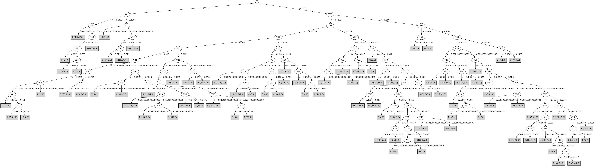

# J48

# SimpleCart Decision Tree

V23 < -0.2025

* V3 < -0.9404999999999999

*   * V6 < -0.497

*   *   * V40 < -0.8494999999999999: 6(334.0/5.0)

*   *   * V40 >= -0.8494999999999999

*   *   *   * V12 < -0.859: 4(15.0/0.0)

*   *   *   * V12 >= -0.859: 6(6.0/1.0)

*   * V6 >= -0.497: 1(355.0/5.0)

* V3 >= -0.9404999999999999

*   * V23 < -1.0855000000000001

*   *   * V2 < -0.6945: 4(9.0/10.0)

*   *   * V2 >= -0.6945: 8(297.0/0.0)

*   * V23 >= -1.0855000000000001

*   *   * V40 < -0.5065

*   *   *   * V26 < -0.4745

*   *   *   *   * V5 < -0.4125

*   *   *   *   *   * V38 < -0.7024999999999999

*   *   *   *   *   *   * V10 < -0.8745

*   *   *   *   *   *   *   * V22 < -0.8385

*   *   *   *   *   *   *   *   * V3 < -0.8115: 4(22.0/1.0)

*   *   *   *   *   *   *   *   * V3 >= -0.8115: 5(10.0/0.0)

*   *   *   *   *   *   *   * V22 >= -0.8385: 6(11.0/0.0)

*   *   *   *   *   *   * V10 >= -0.8745

*   *   *   *   *   *   *   * V5 < -0.4525

*   *   *   *   *   *   *   *   * V24 < -0.9115: 5(6.0/4.0)

*   *   *   *   *   *   *   *   * V24 >= -0.9115: 10(68.0/2.0)

*   *   *   *   *   *   *   * V5 >= -0.4525: 5(12.0/4.0)

*   *   *   *   *   * V38 >= -0.7024999999999999: 4(145.0/11.0)

*   *   *   *   * V5 >= -0.4125

*   *   *   *   *   * V33 < -0.5265

*   *   *   *   *   *   * V30 < -0.7955000000000001

*   *   *   *   *   *   *   * V1 < -1.326: 3(8.0/3.0)

*   *   *   *   *   *   *   * V1 >= -1.326

*   *   *   *   *   *   *   *   * V10 < -0.598: 5(247.0/12.0)

*   *   *   *   *   *   *   *   * V10 >= -0.598: 10(5.0/1.0)

*   *   *   *   *   *   * V30 >= -0.7955000000000001: 3(23.0/4.0)

*   *   *   *   *   * V33 >= -0.5265

*   *   *   *   *   *   * V5 < -0.2285: 4(39.0/3.0)

*   *   *   *   *   *   * V5 >= -0.2285: 5(8.0/4.0)

*   *   *   * V26 >= -0.4745

*   *   *   *   * V23 < -0.634

*   *   *   *   *   * V30 < -1.0575: 8(38.0/0.0)

*   *   *   *   *   * V30 >= -1.0575

*   *   *   *   *   *   * V40 < -0.603

*   *   *   *   *   *   *   * V5 < -0.2755

*   *   *   *   *   *   *   *   * V10 < -0.8285: 4(10.0/0.0)

*   *   *   *   *   *   *   *   * V10 >= -0.8285: 10(195.0/6.0)

*   *   *   *   *   *   *   * V5 >= -0.2755

*   *   *   *   *   *   *   *   * V32 < -0.6859999999999999: 5(24.0/2.0)

*   *   *   *   *   *   *   *   * V32 >= -0.6859999999999999

*   *   *   *   *   *   *   *   *   * V2 < -0.465: 10(11.0/0.0)

*   *   *   *   *   *   *   *   *   * V2 >= -0.465: 4(2.0/4.0)

*   *   *   *   *   *   * V40 >= -0.603

*   *   *   *   *   *   *   * V30 < -0.83: 4(35.0/1.0)

*   *   *   *   *   *   *   * V30 >= -0.83

*   *   *   *   *   *   *   *   * V36 < -0.4885

*   *   *   *   *   *   *   *   *   * V33 < -0.526

*   *   *   *   *   *   *   *   *   *   * V8 < -0.361: 3(10.0/0.0)

*   *   *   *   *   *   *   *   *   *   * V8 >= -0.361: 5(7.0/0.0)

*   *   *   *   *   *   *   *   *   * V33 >= -0.526

*   *   *   *   *   *   *   *   *   *   * V20 < -0.4135

*   *   *   *   *   *   *   *   *   *   *   * V23 < -0.7755000000000001: 10(4.0/2.0)

*   *   *   *   *   *   *   *   *   *   *   * V23 >= -0.7755000000000001: 9(23.0/3.0)

*   *   *   *   *   *   *   *   *   *   * V20 >= -0.4135

*   *   *   *   *   *   *   *   *   *   *   * V7 < -0.4285: 0(13.0/3.0)

*   *   *   *   *   *   *   *   *   *   *   * V7 >= -0.4285: 9(6.0/0.0)

*   *   *   *   *   *   *   *   * V36 >= -0.4885: 10(32.0/2.0)

*   *   *   *   * V23 >= -0.634

*   *   *   *   *   * V10 < -0.5645: 3(52.0/0.0)

*   *   *   *   *   * V10 >= -0.5645: 9(4.0/5.0)

*   *   * V40 >= -0.5065

*   *   *   * V10 < -0.319

*   *   *   *   * V20 < -0.2945

*   *   *   *   *   * V36 < -0.5525

*   *   *   *   *   *   * V22 < -0.6355

*   *   *   *   *   *   *   * V10 < -0.46950000000000003: 3(126.0/4.0)

*   *   *   *   *   *   *   * V10 >= -0.46950000000000003

*   *   *   *   *   *   *   *   * V22 < -0.7835: 3(7.0/0.0)

*   *   *   *   *   *   *   *   * V22 >= -0.7835: 9(6.0/2.0)

*   *   *   *   *   *   * V22 >= -0.6355: 9(8.0/3.0)

*   *   *   *   *   * V36 >= -0.5525

*   *   *   *   *   *   * V30 < -0.8085

*   *   *   *   *   *   *   * V3 < -0.521: 4(49.0/2.0)

*   *   *   *   *   *   *   * V3 >= -0.521: 5(5.0/6.0)

*   *   *   *   *   *   * V30 >= -0.8085

*   *   *   *   *   *   *   * V30 < -0.42

*   *   *   *   *   *   *   *   * V27 < -0.8634999999999999: 3(21.0/0.0)

*   *   *   *   *   *   *   *   * V27 >= -0.8634999999999999

*   *   *   *   *   *   *   *   *   * V19 < -0.4025

*   *   *   *   *   *   *   *   *   *   * V3 < -0.648: 4(5.0/5.0)

*   *   *   *   *   *   *   *   *   *   * V3 >= -0.648: 9(144.0/9.0)

*   *   *   *   *   *   *   *   *   * V19 >= -0.4025

*   *   *   *   *   *   *   *   *   *   * V16 < -0.462

*   *   *   *   *   *   *   *   *   *   *   * V30 < -0.5905: 0(47.0/10.0)

*   *   *   *   *   *   *   *   *   *   *   * V30 >= -0.5905

*   *   *   *   *   *   *   *   *   *   *   *   * V22 < -0.687: 3(6.0/0.0)

*   *   *   *   *   *   *   *   *   *   *   *   * V22 >= -0.687: 9(13.0/2.0)

*   *   *   *   *   *   *   *   *   *   * V16 >= -0.462

*   *   *   *   *   *   *   *   *   *   *   * V4 < -0.33399999999999996: 0(4.0/2.0)

*   *   *   *   *   *   *   *   *   *   *   * V4 >= -0.33399999999999996: 9(62.0/4.0)

*   *   *   *   *   *   *   * V30 >= -0.42: 3(24.0/0.0)

*   *   *   *   * V20 >= -0.2945

*   *   *   *   *   * V24 < -0.596: 3(14.0/3.0)

*   *   *   *   *   * V24 >= -0.596

*   *   *   *   *   *   * V16 < -0.5465: 7(6.0/4.0)

*   *   *   *   *   *   * V16 >= -0.5465: 0(214.0/23.0)

*   *   *   * V10 >= -0.319

*   *   *   *   * V34 < -0.5505

*   *   *   *   *   * V23 < -0.615

*   *   *   *   *   *   * V16 < -0.464: 7(316.0/3.0)

*   *   *   *   *   *   * V16 >= -0.464

*   *   *   *   *   *   *   * V20 < -0.1005: 0(6.0/1.0)

*   *   *   *   *   *   *   * V20 >= -0.1005: 7(6.0/0.0)

*   *   *   *   *   * V23 >= -0.615: 3(9.0/0.0)

*   *   *   *   * V34 >= -0.5505

*   *   *   *   *   * V20 < -0.2765: 9(40.0/4.0)

*   *   *   *   *   * V20 >= -0.2765

*   *   *   *   *   *   * V36 < -0.437

*   *   *   *   *   *   *   * V1 < -0.825: 3(4.0/4.0)

*   *   *   *   *   *   *   * V1 >= -0.825: 9(9.0/0.0)

*   *   *   *   *   *   * V36 >= -0.437

*   *   *   *   *   *   *   * V10 < -0.0965: 0(50.0/7.0)

*   *   *   *   *   *   *   * V10 >= -0.0965: 7(3.0/4.0)

V23 >= -0.2025

* V20 < -0.2425: 3(7.0/5.0)

* V20 >= -0.2425: 2(346.0/2.0)

# PART

Decision list:

conditions|predicted class
---|---
V16 <= -0.7035 AND V6 <= -0.4865 AND V40 <= -0.8705 AND V3 <= -0.916 AND V12 > -1.0085| 6 (328.0/1.0)
V20 > -0.3405 AND V33 <= -0.474 AND V24 > -0.5315| 8 (335.0)
V40 <= -0.5525 AND V3 <= -1.0185 AND V9 > -0.714| 1 (355.0)
V20 > -0.3405 AND V30 > -0.237 AND V4 <= 0.239 AND V5 <= 0.1535| 2 (350.0)
V40 > -0.5065 AND V23 <= -0.7585 AND V20 > -0.432 AND V22 > -0.8755 AND V1 <= -0.9925 AND V10 > -0.3505| 7 (260.0)
V23 <= -0.7845 AND V10 <= -0.8885 AND V3 > -0.804 AND V22 <= -0.861| 5 (17.0)
V23 <= -0.7845 AND V10 <= -0.8885 AND V27 <= -0.806 AND V3 > -1.083 AND V33 > -0.7775| 4 (74.0)
V23 <= -0.7605 AND V35 <= -0.5025 AND V10 <= -0.8915 AND V16 <= -0.6565 AND V17 > -0.919| 6 (21.0)
V23 <= -0.7605 AND V33 <= -0.5025 AND V5 > -0.346 AND V24 > -0.6445 AND V18 <= -0.368| 10 (33.0/1.0)
V23 <= -0.7845 AND V5 > -0.3445 AND V33 <= -0.524 AND V1 > -1.3125 AND V10 <= -0.619 AND V4 <= -0.294| 5 (183.0/1.0)
V23 <= -0.7845 AND V40 <= -0.6575 AND V20 > -0.808 AND V26 > -0.5975 AND V18 <= -0.4035 AND V30 > -0.9025 AND V24 > -0.7555| 10 (162.0/1.0)
V30 <= -0.8195 AND V35 > -0.569 AND V5 <= -0.239 AND V10 <= -0.456 AND V1 > -1.34 AND V24 > -0.89 AND V9 <= -0.2795| 4 (229.0)
V40 <= -0.5505 AND V13 <= -0.7555 AND V10 > -0.947 AND V7 > -0.911| 4 (7.0)
V40 <= -0.5505 AND V10 <= -0.892 AND V13 > -0.6425| 3 (17.0/1.0)
V40 <= -0.5505 AND V10 <= -0.895 AND V13 > -0.962 AND V28 <= -0.8145| 4 (10.0)
V40 <= -0.5505 AND V8 <= -0.6575 AND V10 > -0.919| 10 (33.0/1.0)
V40 <= -0.5505 AND V1 > -1.043 AND V12 <= -0.3245 AND V36 > -0.609 AND V38 <= -0.4555 AND V25 > -0.562 AND V18 <= -0.338 AND V10 <= -0.3865| 10 (67.0)
V33 <= -0.4575 AND V4 > -0.489 AND V16 <= -0.5245 AND V12 > -0.7515 AND V40 > -0.6485 AND V36 <= -0.5845| 3 (132.0)
V33 <= -0.4575 AND V8 > -0.6875 AND V23 > -0.6775 AND V16 <= -0.445| 3 (18.0)
V33 <= -0.4575 AND V8 > -0.6875 AND V5 > -0.421 AND V10 <= -0.576 AND V3 > -0.7385 AND V33 <= -0.4995 AND V1 > -1.2525| 5 (77.0/1.0)
V9 <= -0.383 AND V8 > -0.6875 AND V1 <= -1.223 AND V4 > -0.7025 AND V29 <= -0.7025 AND V35 <= -0.6215| 5 (46.0)
V23 > -0.8175 AND V27 <= -0.8045 AND V17 > -0.831| 3 (92.0/1.0)
V28 > -0.6525 AND V20 > -0.353 AND V16 <= -0.5065 AND V23 > -0.484 AND V8 <= -0.129| 3 (11.0)
V28 > -0.6525 AND V20 > -0.353 AND V16 <= -0.5065 AND V10 > -0.401 AND V22 <= -0.544 AND V10 > -0.34| 7 (70.0)
V23 > -0.8175 AND V20 > -0.3465 AND V5 <= -0.035 AND V3 <= -0.1835 AND V20 > -0.2545 AND V23 <= -0.37 AND V7 > -0.6005 AND V10 <= -0.271| 0 (185.0/1.0)
V9 <= -0.383 AND V3 > -0.918 AND V38 <= -0.7305| 10 (20.0)
V23 > -0.8175 AND V20 <= -0.3505 AND V30 > -0.5335 AND V35 > -0.2855 AND V16 > -0.5685| 9 (15.0)
V23 > -0.8175 AND V23 > -0.4905 AND V32 <= -0.314 AND V35 <= -0.281| 3 (47.0/1.0)
V23 > -0.8175 AND V20 <= -0.3505 AND V24 > -0.6035 AND V23 > -0.7675 AND V36 <= -0.391 AND V40 > -0.5015 AND V36 > -0.5855 AND V37 > -0.783 AND V16 > -0.525| 9 (152.0/1.0)
V23 > -0.8175 AND V20 > -0.424 AND V24 <= -0.6145 AND V30 > -0.644| 3 (10.0)
V23 > -0.8175 AND V20 > -0.424 AND V20 <= -0.186 AND V32 <= -0.6005 AND V14 <= -0.4865 AND V16 > -0.554 AND V20 <= -0.2385| 0 (58.0/1.0)
V23 > -0.8175 AND V20 > -0.423 AND V2 <= -0.5615 AND V1 <= -1.112| 7 (6.0)
V23 > -0.8175 AND V20 > -0.411 AND V20 <= -0.186 AND V13 <= -0.305 AND V4 <= -0.2515| 10 (3.0)
V23 > -0.8175 AND V20 > -0.411 AND V20 <= -0.186 AND V30 <= -0.1905 AND V16 > -0.46 AND V36 <= -0.4555| 9 (59.0)
V23 > -0.8175 AND V20 > -0.411 AND V10 > -0.0725 AND V4 <= -0.1055| 7 (10.0)
V23 > -0.8175 AND V20 > -0.411 AND V27 <= -0.6895 AND V2 > -0.4345| 3 (5.0)
V23 > -0.8175 AND V20 > -0.411 AND V30 <= -0.1905 AND V30 <= -0.688 AND V26 <= -0.151| 0 (25.0/1.0)
V23 > -0.7895 AND V20 > -0.411 AND V30 <= -0.1905 AND V30 > -0.688 AND V17 > -0.6425 AND V23 <= -0.4925 AND V19 > -0.372 AND V10 <= -0.2| 0 (53.0)
V23 > -0.8175 AND V8 > 0.0205 AND V4 > 0.0945| 0 (13.0)
V23 > -0.8175 AND V20 > -0.411 AND V5 <= 0.103 AND V30 > -0.688 AND V4 > -0.272 AND V40 > -0.425 AND V26 <= -0.108| 9 (49.0)
V23 > -0.8175 AND V20 > -0.4085 AND V5 > 0.103 AND V5 > 0.185| 3 (3.0)
V20 > -0.4085 AND V30 <= -0.67 AND V10 > -0.462| 7 (10.0)
V23 <= -0.8175 AND V6 > -0.5395 AND V1 > -1.3505 AND V24 > -0.6885| 4 (14.0/1.0)
V20 > -0.4085 AND V13 <= 0.2115 AND V7 <= -0.156| 0 (15.0/1.0)
V36 <= -0.625 AND V8 <= -0.684| 6 (10.0)
V36 <= -0.625 AND V4 > -0.5165| 3 (8.0)
V23 <= -0.8265 AND V5 > -0.4115| 5 (12.0/1.0)
V30 <= -0.5445 AND V39 <= -0.56 AND V36 <= -0.6155| 4 (9.0/1.0)
V30 <= -0.5445 AND V32 > -0.713 AND V14 <= -0.5935 AND V3 > -0.6555| 9 (54.0)
V3 > -0.4295 AND V7 > -0.5095 AND V13 <= 0.1935| 9 (19.0/1.0)
V30 > -0.5535 AND V3 <= -0.3965| 3 (5.0)
V3 > -0.4295 AND V1 <= -0.8245| 5 (3.0)
V33 <= -0.155 AND V30 > -0.71| 10 (19.0/2.0)
V33 > -0.155 AND V33 <= 0.0335| 9 (3.0)
V8 <= -0.1265 AND V33 > -0.42 AND V26 <= -0.2765| 4 (11.0)
V10 <= -0.274 AND V30 <= -0.7295 AND V1 > -1.169| 10 (10.0/1.0)
V9 > -0.343 AND V3 <= -0.209| 0 (2.0)
V1 <= -1.0825| 10 (3.0/1.0)
| 2 (3.0/1.0)

# JRip

Decision list:

conditions|predicted class
---|---
(V23 <= -1.105) and (V2 >= -0.667)|8 (285.0/0.0)
(V12 >= -0.348) and (V23 <= -0.974)|8 (50.0/0.0)
(V26 <= -0.451) and (V5 >= -0.42) and (V40 <= -0.644) and (V1 <= -1.12) and (V30 <= -0.868)|5 (161.0/2.0)
(V3 >= -0.755) and (V33 <= -0.641) and (V26 <= -0.591) and (V10 <= -0.777)|5 (23.0/1.0)
(V32 <= -0.668) and (V5 >= -0.33) and (V26 <= -0.491) and (V22 >= -0.946) and (V3 >= -0.554)|5 (55.0/0.0)
(V33 <= -0.5) and (V5 >= -0.405) and (V26 <= -0.532) and (V34 <= -0.743)|5 (17.0/4.0)
(V33 <= -0.458) and (V3 >= -0.578) and (V18 >= -0.378) and (V1 <= -0.99)|5 (20.0/0.0)
(V33 <= -0.5) and (V3 >= -0.615) and (V26 <= -0.466) and (V10 <= -0.654)|5 (42.0/4.0)
(V10 <= -0.583) and (V3 >= -0.499) and (V30 <= -0.754)|5 (10.0/0.0)
(V3 >= -0.802) and (V33 <= -0.727) and (V10 <= -0.834)|5 (11.0/2.0)
(V10 <= -0.639) and (V3 >= -0.645) and (V40 <= -0.613) and (V18 >= -0.499) and (V1 <= -1.092)|5 (10.0/0.0)
(V23 >= -0.706) and (V27 <= -0.733) and (V22 <= -0.777)|3 (180.0/0.0)
(V2 >= -0.512) and (V36 <= -0.527) and (V10 <= -0.584)|3 (78.0/6.0)
(V2 >= -0.413) and (V24 <= -0.455) and (V1 >= -1.069) and (V23 >= -0.61)|3 (31.0/0.0)
(V1 <= -1.268) and (V23 >= -0.884) and (V22 <= -0.932)|3 (28.0/0.0)
(V30 >= -0.41) and (V20 <= -0.248) and (V36 <= -0.42)|3 (19.0/2.0)
(V27 <= -0.911) and (V9 >= -0.347)|3 (11.0/2.0)
(V20 >= -0.736) and (V40 <= -0.658) and (V26 >= -0.52) and (V7 <= -0.464)|10 (195.0/0.0)
(V40 <= -0.514) and (V10 >= -0.821) and (V38 <= -0.72)|10 (51.0/1.0)
(V1 >= -1.009) and (V40 <= -0.502) and (V36 >= -0.526) and (V30 >= -0.76) and (V1 <= -0.288)|10 (54.0/0.0)
(V40 <= -0.551) and (V19 >= -0.57) and (V24 >= -0.591) and (V32 <= -0.567)|10 (22.0/0.0)
(V32 <= -0.96) and (V3 >= -0.931)|10 (7.0/0.0)
(V40 <= -0.422) and (V36 >= -0.403) and (V14 >= -0.517)|10 (6.0/0.0)
(V2 <= -0.673) and (V3 >= -0.705) and (V40 <= -0.628) and (V6 >= -0.296)|10 (7.0/0.0)
(V10 <= -0.32) and (V30 <= -0.606) and (V19 >= -0.349) and (V8 >= -0.321)|0 (147.0/2.0)
(V19 >= -0.402) and (V10 <= -0.376) and (V23 <= -0.59) and (V6 <= -0.093)|0 (89.0/8.0)
(V2 >= -0.466) and (V36 >= -0.313) and (V23 <= -0.359) and (V19 >= -0.371)|0 (46.0/0.0)
(V2 >= -0.488) and (V3 <= -0.29) and (V18 >= -0.353) and (V23 <= -0.44) and (V36 >= -0.435)|0 (36.0/3.0)
(V23 >= -0.788) and (V32 <= -0.687)|0 (15.0/5.0)
(V2 >= -0.473) and (V38 <= -0.328) and (V36 >= -0.423) and (V14 >= -0.52) and (V9 <= -0.084)|0 (12.0/1.0)
(V2 >= -0.511) and (V1 >= 0.417)|0 (4.0/0.0)
(V23 >= -0.763) and (V20 <= -0.256)|9 (338.0/29.0)
(V2 >= -0.262) and (V18 <= -0.186)|9 (20.0/1.0)
(V23 >= -0.817) and (V25 <= -0.53) and (V6 >= -0.137)|9 (8.0/0.0)
(V23 >= -0.287)|2 (347.0/0.0)
(V26 <= -0.751) and (V6 >= -0.486)|1 (330.0/1.0)
(V24 <= -0.829) and (V1 >= -1.135)|1 (23.0/0.0)
(V10 >= -0.422) and (V34 <= -0.58)|7 (307.0/0.0)
(V40 >= -0.309)|7 (41.0/5.0)
(V40 <= -0.858) and (V28 >= -0.841)|6 (278.0/0.0)
(V6 <= -0.681) and (V23 <= -1.109)|6 (64.0/0.0)
(V40 <= -0.801) and (V27 >= -0.852)|6 (15.0/3.0)
|4 (357.0/17.0)

# Decision Table

Non matches covered by IB1

v23|v25|target
---|---|---
(-0.344--0.2215]|(-0.093-inf)|0
(-0.2215--0.0855]|(-0.093-inf)|2
(-0.0855-inf)|(-0.093-inf)|2
(-0.5975--0.344]|(-0.093-inf)|0
(-0.0855-inf)|(-0.2155--0.093]|2
(-0.2215--0.0855]|(-0.2155--0.093]|2
(-0.6975--0.5975]|(-0.2155--0.093]|0
(-0.344--0.2215]|(-0.2155--0.093]|3
(-0.5975--0.344]|(-0.2155--0.093]|0
(-0.9725--0.8915]|(-0.3655--0.2155]|0
(-0.8915--0.8195]|(-0.3655--0.2155]|7
(-0.2215--0.0855]|(-0.3655--0.2155]|2
(-0.8195--0.7855]|(-0.3655--0.2155]|7
(-0.344--0.2215]|(-0.3655--0.2155]|3
(-0.7855--0.6975]|(-0.3655--0.2155]|7
(-0.6975--0.5975]|(-0.3655--0.2155]|0
(-0.5975--0.344]|(-0.3655--0.2155]|9
(-1.0085--0.9725]|(-0.4095--0.3655]|8
(-1.0625--1.0085]|(-0.4095--0.3655]|8
(-0.8915--0.8195]|(-0.4095--0.3655]|7
(-0.8195--0.7855]|(-0.4095--0.3655]|7
(-1.1825--1.1125]|(-0.4095--0.3655]|0
(-1.1125--1.0625]|(-0.4095--0.3655]|8
(-0.7855--0.6975]|(-0.4095--0.3655]|7
(-0.5975--0.344]|(-0.4095--0.3655]|3
(-0.6975--0.5975]|(-0.4095--0.3655]|9
(-1.0625--1.0085]|(-0.5175--0.4095]|8
(-0.9725--0.8915]|(-0.5175--0.4095]|7
(-1.0085--0.9725]|(-0.5175--0.4095]|7
(-1.1125--1.0625]|(-0.5175--0.4095]|8
(-1.1825--1.1125]|(-0.5175--0.4095]|8
(-inf--1.1825]|(-0.5175--0.4095]|8
(-0.5975--0.344]|(-0.5175--0.4095]|3
(-0.8915--0.8195]|(-0.5175--0.4095]|7
(-0.8195--0.7855]|(-0.5175--0.4095]|7
(-0.6975--0.5975]|(-0.5175--0.4095]|9
(-0.7855--0.6975]|(-0.5175--0.4095]|10
(-inf--1.1825]|(-0.567--0.5175]|8
(-1.1825--1.1125]|(-0.567--0.5175]|8
(-0.6975--0.5975]|(-0.567--0.5175]|3
(-0.5975--0.344]|(-0.567--0.5175]|3
(-0.8915--0.8195]|(-0.567--0.5175]|10
(-0.9725--0.8915]|(-0.567--0.5175]|10
(-0.8195--0.7855]|(-0.567--0.5175]|10
(-0.7855--0.6975]|(-0.567--0.5175]|5
(-1.0085--0.9725]|(-0.5965--0.567]|0
(-1.0625--1.0085]|(-0.5965--0.567]|0
(-inf--1.1825]|(-0.5965--0.567]|8
(-0.7855--0.6975]|(-0.5965--0.567]|5
(-0.6975--0.5975]|(-0.5965--0.567]|3
(-0.9725--0.8915]|(-0.5965--0.567]|4
(-0.8915--0.8195]|(-0.5965--0.567]|10
(-0.8195--0.7855]|(-0.5965--0.567]|5
(-0.6975--0.5975]|(-0.6825--0.5965]|3
(-1.1125--1.0625]|(-0.6825--0.5965]|6
(-1.0085--0.9725]|(-0.6825--0.5965]|4
(-0.8195--0.7855]|(-0.6825--0.5965]|5
(-0.7855--0.6975]|(-0.6825--0.5965]|3
(-0.9725--0.8915]|(-0.6825--0.5965]|4
(-0.8915--0.8195]|(-0.6825--0.5965]|5
(-1.0625--1.0085]|(-0.6825--0.5965]|6
(-0.7855--0.6975]|(-0.7315--0.6825]|3
(-0.8195--0.7855]|(-0.7315--0.6825]|0
(-1.0085--0.9725]|(-0.7315--0.6825]|4
(-0.8915--0.8195]|(-0.7315--0.6825]|5
(-0.9725--0.8915]|(-0.7315--0.6825]|5
(-1.1825--1.1125]|(-0.7315--0.6825]|6
(-1.0625--1.0085]|(-0.7315--0.6825]|4
(-1.1125--1.0625]|(-0.7315--0.6825]|6
(-0.8195--0.7855]|(-0.8065--0.7315]|1
(-0.8915--0.8195]|(-0.8065--0.7315]|1
(-1.0625--1.0085]|(-0.8065--0.7315]|4
(-1.0085--0.9725]|(-0.8065--0.7315]|4
(-0.9725--0.8915]|(-0.8065--0.7315]|5
(-inf--1.1825]|(-0.8065--0.7315]|6
(-1.1825--1.1125]|(-0.8065--0.7315]|6
(-1.1125--1.0625]|(-0.8065--0.7315]|6
(-0.8915--0.8195]|(-0.9005--0.8065]|1
(-1.1125--1.0625]|(-0.9005--0.8065]|4
(-0.9725--0.8915]|(-0.9005--0.8065]|1
(-1.0625--1.0085]|(-0.9005--0.8065]|5
(-1.0085--0.9725]|(-0.9005--0.8065]|5
(-inf--1.1825]|(-0.9005--0.8065]|6
(-1.1825--1.1125]|(-0.9005--0.8065]|6
(-0.9725--0.8915]|(-inf--0.9005]|1
(-1.0625--1.0085]|(-inf--0.9005]|1
(-1.0085--0.9725]|(-inf--0.9005]|1
(-1.1125--1.0625]|(-inf--0.9005]|1
(-1.1825--1.1125]|(-inf--0.9005]|1
(-inf--1.1825]|(-inf--0.9005]|6

