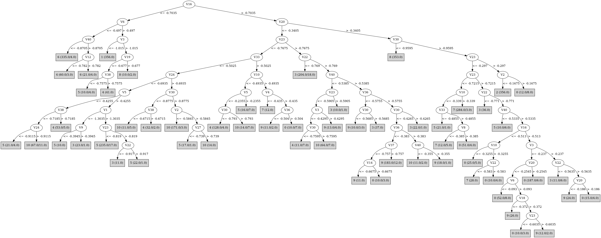

# J48

# SimpleCart Decision Tree

V23 < -0.2255

* V3 < -0.9444999999999999

*   * V6 < -0.5005

*   *   * V40 < -0.8474999999999999

*   *   *   * V12 < -1.0019999999999998

*   *   *   *   * V3 < -1.089: 6(3.0/0.0)

*   *   *   *   * V3 >= -1.089: 4(3.0/0.0)

*   *   *   * V12 >= -1.0019999999999998: 6(326.0/2.0)

*   *   * V40 >= -0.8474999999999999

*   *   *   * V12 < -0.859: 4(13.0/0.0)

*   *   *   * V12 >= -0.859: 6(8.0/0.0)

*   * V6 >= -0.5005

*   *   * V3 < -1.0150000000000001: 1(356.0/0.0)

*   *   * V3 >= -1.0150000000000001: 4(3.0/1.0)

* V3 >= -0.9444999999999999

*   * V30 < -1.0495

*   *   * V3 < -0.627

*   *   *   * V24 < -0.9795: 5(13.0/0.0)

*   *   *   * V24 >= -0.9795

*   *   *   *   * V27 < -0.862: 4(27.0/1.0)

*   *   *   *   * V27 >= -0.862: 6(8.0/0.0)

*   *   * V3 >= -0.627: 8(347.0/0.0)

*   * V30 >= -1.0495

*   *   * V40 < -0.5495000000000001

*   *   *   * V26 < -0.4815

*   *   *   *   * V6 < -0.3055

*   *   *   *   *   * V39 < -0.664

*   *   *   *   *   *   * V10 < -0.8745

*   *   *   *   *   *   *   * V22 < -0.8365

*   *   *   *   *   *   *   *   * V3 < -0.8175

*   *   *   *   *   *   *   *   *   * V2 < -0.968: 10(2.0/0.0)

*   *   *   *   *   *   *   *   *   * V2 >= -0.968: 4(20.0/0.0)

*   *   *   *   *   *   *   *   * V3 >= -0.8175: 5(8.0/0.0)

*   *   *   *   *   *   *   * V22 >= -0.8365: 6(11.0/0.0)

*   *   *   *   *   *   * V10 >= -0.8745

*   *   *   *   *   *   *   * V5 < -0.4545

*   *   *   *   *   *   *   *   * V24 < -0.9115

*   *   *   *   *   *   *   *   *   * V2 < -0.8885000000000001: 10(5.0/0.0)

*   *   *   *   *   *   *   *   *   * V2 >= -0.8885000000000001: 5(5.0/0.0)

*   *   *   *   *   *   *   *   * V24 >= -0.9115: 10(55.0/1.0)

*   *   *   *   *   *   *   * V5 >= -0.4545: 5(15.0/0.0)

*   *   *   *   *   * V39 >= -0.664

*   *   *   *   *   *   * V28 < -0.6125: 4(130.0/5.0)

*   *   *   *   *   *   * V28 >= -0.6125: 6(2.0/0.0)

*   *   *   *   * V6 >= -0.3055

*   *   *   *   *   * V33 < -0.5275000000000001

*   *   *   *   *   *   * V30 < -0.7955000000000001

*   *   *   *   *   *   *   * V2 < -0.7665

*   *   *   *   *   *   *   *   * V1 < -1.279: 5(2.0/0.0)

*   *   *   *   *   *   *   *   * V1 >= -1.279: 10(8.0/0.0)

*   *   *   *   *   *   *   * V2 >= -0.7665

*   *   *   *   *   *   *   *   * V1 < -1.3125

*   *   *   *   *   *   *   *   *   * V4 < -0.5205: 5(2.0/0.0)

*   *   *   *   *   *   *   *   *   * V4 >= -0.5205: 3(8.0/0.0)

*   *   *   *   *   *   *   *   * V1 >= -1.3125

*   *   *   *   *   *   *   *   *   * V32 < -0.687

*   *   *   *   *   *   *   *   *   *   * V10 < -0.55

*   *   *   *   *   *   *   *   *   *   *   * V40 < -0.572: 5(232.0/5.0)

*   *   *   *   *   *   *   *   *   *   *   * V40 >= -0.572: 3(2.0/1.0)

*   *   *   *   *   *   *   *   *   *   * V10 >= -0.55: 10(3.0/0.0)

*   *   *   *   *   *   *   *   *   * V32 >= -0.687

*   *   *   *   *   *   *   *   *   *   * V2 < -0.5635: 4(6.0/0.0)

*   *   *   *   *   *   *   *   *   *   * V2 >= -0.5635: 5(3.0/0.0)

*   *   *   *   *   *   * V30 >= -0.7955000000000001

*   *   *   *   *   *   *   * V22 < -0.883: 3(16.0/0.0)

*   *   *   *   *   *   *   * V22 >= -0.883

*   *   *   *   *   *   *   *   * V2 < -0.6255: 10(2.0/0.0)

*   *   *   *   *   *   *   *   * V2 >= -0.6255: 5(3.0/0.0)

*   *   *   *   *   * V33 >= -0.5275000000000001

*   *   *   *   *   *   * V5 < -0.222: 4(17.0/1.0)

*   *   *   *   *   *   * V5 >= -0.222: 3(2.0/0.0)

*   *   *   * V26 >= -0.4815

*   *   *   *   * V10 < -0.81

*   *   *   *   *   * V23 < -0.746

*   *   *   *   *   *   * V13 < -0.6405000000000001: 4(16.0/0.0)

*   *   *   *   *   *   * V13 >= -0.6405000000000001: 10(2.0/1.0)

*   *   *   *   *   * V23 >= -0.746: 3(26.0/0.0)

*   *   *   *   * V10 >= -0.81

*   *   *   *   *   * V5 < -0.305

*   *   *   *   *   *   * V30 < -0.8935

*   *   *   *   *   *   *   * V10 < -0.638: 4(5.0/0.0)

*   *   *   *   *   *   *   * V10 >= -0.638: 8(2.0/1.0)

*   *   *   *   *   *   * V30 >= -0.8935

*   *   *   *   *   *   *   * V40 < -0.578

*   *   *   *   *   *   *   *   * V23 < -0.5575: 10(215.0/4.0)

*   *   *   *   *   *   *   *   * V23 >= -0.5575: 3(2.0/0.0)

*   *   *   *   *   *   *   * V40 >= -0.578

*   *   *   *   *   *   *   *   * V36 < -0.5525: 9(5.0/0.0)

*   *   *   *   *   *   *   *   * V36 >= -0.5525

*   *   *   *   *   *   *   *   *   * V1 < -1.004: 0(1.0/1.0)

*   *   *   *   *   *   *   *   *   * V1 >= -1.004: 10(4.0/0.0)

*   *   *   *   *   * V5 >= -0.305

*   *   *   *   *   *   * V10 < -0.6234999999999999

*   *   *   *   *   *   *   * V16 < -0.539

*   *   *   *   *   *   *   *   * V13 < -0.5185: 4(2.0/1.0)

*   *   *   *   *   *   *   *   * V13 >= -0.5185: 3(6.0/0.0)

*   *   *   *   *   *   *   * V16 >= -0.539

*   *   *   *   *   *   *   *   * V1 < -0.974: 5(31.0/0.0)

*   *   *   *   *   *   *   *   * V1 >= -0.974: 10(2.0/1.0)

*   *   *   *   *   *   * V10 >= -0.6234999999999999

*   *   *   *   *   *   *   * V20 < -0.126

*   *   *   *   *   *   *   *   * V3 < -0.428

*   *   *   *   *   *   *   *   *   * V6 < -0.203: 4(4.0/1.0)

*   *   *   *   *   *   *   *   *   * V6 >= -0.203

*   *   *   *   *   *   *   *   *   *   * V1 < -1.1185: 0(1.0/1.0)

*   *   *   *   *   *   *   *   *   *   * V1 >= -1.1185: 10(33.0/2.0)

*   *   *   *   *   *   *   *   * V3 >= -0.428

*   *   *   *   *   *   *   *   *   * V6 < -0.057499999999999996: 9(8.0/0.0)

*   *   *   *   *   *   *   *   *   * V6 >= -0.057499999999999996: 10(3.0/1.0)

*   *   *   *   *   *   *   * V20 >= -0.126: 8(11.0/0.0)

*   *   * V40 >= -0.5495000000000001

*   *   *   * V10 < -0.3165

*   *   *   *   * V20 < -0.3455

*   *   *   *   *   * V36 < -0.5645

*   *   *   *   *   *   * V5 < -0.2565

*   *   *   *   *   *   *   * V22 < -0.7925: 3(8.0/1.0)

*   *   *   *   *   *   *   * V22 >= -0.7925: 9(10.0/0.0)

*   *   *   *   *   *   * V5 >= -0.2565

*   *   *   *   *   *   *   * V23 < -0.897: 5(3.0/1.0)

*   *   *   *   *   *   *   * V23 >= -0.897

*   *   *   *   *   *   *   *   * V10 < -0.3975

*   *   *   *   *   *   *   *   *   * V16 < -0.446

*   *   *   *   *   *   *   *   *   *   * V10 < -0.471: 3(164.0/0.0)

*   *   *   *   *   *   *   *   *   *   * V10 >= -0.471: 3(4.0/1.0)

*   *   *   *   *   *   *   *   *   * V16 >= -0.446: 3(1.0/1.0)

*   *   *   *   *   *   *   *   * V10 >= -0.3975: 9(2.0/0.0)

*   *   *   *   *   * V36 >= -0.5645

*   *   *   *   *   *   * V23 < -0.7855000000000001

*   *   *   *   *   *   *   * V6 < -0.1535

*   *   *   *   *   *   *   *   * V19 < -0.4445

*   *   *   *   *   *   *   *   *   * V33 < -0.504

*   *   *   *   *   *   *   *   *   *   * V3 < -0.641: 3(1.0/1.0)

*   *   *   *   *   *   *   *   *   *   * V3 >= -0.641: 5(2.0/0.0)

*   *   *   *   *   *   *   *   *   * V33 >= -0.504

*   *   *   *   *   *   *   *   *   *   * V4 < -0.33299999999999996: 4(76.0/0.0)

*   *   *   *   *   *   *   *   *   *   * V4 >= -0.33299999999999996: 4(1.0/1.0)

*   *   *   *   *   *   *   *   * V19 >= -0.4445

*   *   *   *   *   *   *   *   *   * V2 < -0.6795: 7(3.0/0.0)

*   *   *   *   *   *   *   *   *   * V2 >= -0.6795: 0(2.0/1.0)

*   *   *   *   *   *   *   * V6 >= -0.1535

*   *   *   *   *   *   *   *   * V24 < -0.6765000000000001: 5(13.0/0.0)

*   *   *   *   *   *   *   *   * V24 >= -0.6765000000000001

*   *   *   *   *   *   *   *   *   * V2 < -0.5445

*   *   *   *   *   *   *   *   *   *   * V2 < -0.591: 0(1.0/1.0)

*   *   *   *   *   *   *   *   *   *   * V2 >= -0.591: 9(4.0/0.0)

*   *   *   *   *   *   *   *   *   * V2 >= -0.5445: 4(4.0/0.0)

*   *   *   *   *   *   * V23 >= -0.7855000000000001

*   *   *   *   *   *   *   * V24 < -0.7024999999999999: 3(23.0/1.0)

*   *   *   *   *   *   *   * V24 >= -0.7024999999999999

*   *   *   *   *   *   *   *   * V30 < -0.4265

*   *   *   *   *   *   *   *   *   * V14 < -0.553

*   *   *   *   *   *   *   *   *   *   * V30 < -0.5205

*   *   *   *   *   *   *   *   *   *   *   * V4 < -0.456: 4(2.0/0.0)

*   *   *   *   *   *   *   *   *   *   *   * V4 >= -0.456

*   *   *   *   *   *   *   *   *   *   *   *   * V32 < -0.6835

*   *   *   *   *   *   *   *   *   *   *   *   *   * V3 < -0.6005: 0(2.0/0.0)

*   *   *   *   *   *   *   *   *   *   *   *   *   * V3 >= -0.6005: 5(1.0/1.0)

*   *   *   *   *   *   *   *   *   *   *   *   * V32 >= -0.6835

*   *   *   *   *   *   *   *   *   *   *   *   *   * V5 < -0.365: 9(3.0/1.0)

*   *   *   *   *   *   *   *   *   *   *   *   *   * V5 >= -0.365: 9(138.0/0.0)

*   *   *   *   *   *   *   *   *   *   * V30 >= -0.5205: 3(4.0/1.0)

*   *   *   *   *   *   *   *   *   * V14 >= -0.553

*   *   *   *   *   *   *   *   *   *   * V23 < -0.6585000000000001

*   *   *   *   *   *   *   *   *   *   *   * V3 < -0.4885: 10(11.0/1.0)

*   *   *   *   *   *   *   *   *   *   *   * V3 >= -0.4885

*   *   *   *   *   *   *   *   *   *   *   *   * V20 < -0.4175

*   *   *   *   *   *   *   *   *   *   *   *   *   * V1 < -0.8915: 5(3.0/0.0)

*   *   *   *   *   *   *   *   *   *   *   *   *   * V1 >= -0.8915

*   *   *   *   *   *   *   *   *   *   *   *   *   *   * V3 < -0.399: 4(1.0/1.0)

*   *   *   *   *   *   *   *   *   *   *   *   *   *   * V3 >= -0.399: 9(2.0/0.0)

*   *   *   *   *   *   *   *   *   *   *   *   * V20 >= -0.4175: 0(4.0/0.0)

*   *   *   *   *   *   *   *   *   *   * V23 >= -0.6585000000000001

*   *   *   *   *   *   *   *   *   *   *   * V36 < -0.328

*   *   *   *   *   *   *   *   *   *   *   *   * V27 < -0.6325000000000001

*   *   *   *   *   *   *   *   *   *   *   *   *   * V2 < -0.5035000000000001: 0(2.0/0.0)

*   *   *   *   *   *   *   *   *   *   *   *   *   * V2 >= -0.5035000000000001: 3(2.0/0.0)

*   *   *   *   *   *   *   *   *   *   *   *   * V27 >= -0.6325000000000001

*   *   *   *   *   *   *   *   *   *   *   *   *   * V30 < -0.6865: 0(2.0/0.0)

*   *   *   *   *   *   *   *   *   *   *   *   *   * V30 >= -0.6865: 9(36.0/2.0)

*   *   *   *   *   *   *   *   *   *   *   * V36 >= -0.328: 10(4.0/0.0)

*   *   *   *   *   *   *   *   * V30 >= -0.4265: 3(14.0/0.0)

*   *   *   *   * V20 >= -0.3455

*   *   *   *   *   * V24 < -0.6025

*   *   *   *   *   *   * V23 < -0.7495

*   *   *   *   *   *   *   * V2 < -0.5065: 0(1.0/2.0)

*   *   *   *   *   *   *   * V2 >= -0.5065: 5(3.0/0.0)

*   *   *   *   *   *   * V23 >= -0.7495: 3(32.0/1.0)

*   *   *   *   *   * V24 >= -0.6025

*   *   *   *   *   *   * V20 < -0.2545

*   *   *   *   *   *   *   * V6 < -0.093

*   *   *   *   *   *   *   *   * V16 < -0.40349999999999997

*   *   *   *   *   *   *   *   *   * V23 < -0.8175: 7(3.0/0.0)

*   *   *   *   *   *   *   *   *   * V23 >= -0.8175

*   *   *   *   *   *   *   *   *   *   * V23 < -0.547: 0(74.0/1.0)

*   *   *   *   *   *   *   *   *   *   * V23 >= -0.547

*   *   *   *   *   *   *   *   *   *   *   * V1 < -1.0125: 9(3.0/0.0)

*   *   *   *   *   *   *   *   *   *   *   * V1 >= -1.0125

*   *   *   *   *   *   *   *   *   *   *   *   * V15 < -0.3325: 3(2.0/0.0)

*   *   *   *   *   *   *   *   *   *   *   *   * V15 >= -0.3325: 0(3.0/0.0)

*   *   *   *   *   *   *   *   * V16 >= -0.40349999999999997: 9(5.0/1.0)

*   *   *   *   *   *   *   * V6 >= -0.093

*   *   *   *   *   *   *   *   * V16 < -0.501

*   *   *   *   *   *   *   *   *   * V2 < -0.573: 7(3.0/0.0)

*   *   *   *   *   *   *   *   *   * V2 >= -0.573: 0(10.0/0.0)

*   *   *   *   *   *   *   *   * V16 >= -0.501

*   *   *   *   *   *   *   *   *   * V32 < -0.6025: 0(5.0/0.0)

*   *   *   *   *   *   *   *   *   * V32 >= -0.6025

*   *   *   *   *   *   *   *   *   *   * V26 < -0.14200000000000002

*   *   *   *   *   *   *   *   *   *   *   * V26 < -0.374: 0(2.0/1.0)

*   *   *   *   *   *   *   *   *   *   *   * V26 >= -0.374: 9(35.0/1.0)

*   *   *   *   *   *   *   *   *   *   * V26 >= -0.14200000000000002: 0(2.0/0.0)

*   *   *   *   *   *   * V20 >= -0.2545

*   *   *   *   *   *   *   * V2 < -0.604: 7(5.0/1.0)

*   *   *   *   *   *   *   * V2 >= -0.604

*   *   *   *   *   *   *   *   * V23 < -0.3835: 0(170.0/3.0)

*   *   *   *   *   *   *   *   * V23 >= -0.3835: 3(2.0/1.0)

*   *   *   * V10 >= -0.3165

*   *   *   *   * V34 < -0.5375000000000001

*   *   *   *   *   * V23 < -0.615

*   *   *   *   *   *   * V16 < -0.46

*   *   *   *   *   *   *   * V22 < -0.872: 3(3.0/0.0)

*   *   *   *   *   *   *   * V22 >= -0.872: 7(312.0/1.0)

*   *   *   *   *   *   * V16 >= -0.46

*   *   *   *   *   *   *   * V23 < -0.6984999999999999: 7(7.0/0.0)

*   *   *   *   *   *   *   * V23 >= -0.6984999999999999

*   *   *   *   *   *   *   *   * V5 < -0.07600000000000001: 0(7.0/0.0)

*   *   *   *   *   *   *   *   * V5 >= -0.07600000000000001: 7(1.0/1.0)

*   *   *   *   *   * V23 >= -0.615: 3(6.0/1.0)

*   *   *   *   * V34 >= -0.5375000000000001

*   *   *   *   *   * V36 < -0.4395

*   *   *   *   *   *   * V30 < -0.4125: 9(39.0/1.0)

*   *   *   *   *   *   * V30 >= -0.4125: 3(3.0/0.0)

*   *   *   *   *   * V36 >= -0.4395

*   *   *   *   *   *   * V18 < -0.2955

*   *   *   *   *   *   *   * V10 < -0.2995: 0(3.0/0.0)

*   *   *   *   *   *   *   * V10 >= -0.2995

*   *   *   *   *   *   *   *   * V26 < -0.12: 9(18.0/0.0)

*   *   *   *   *   *   *   *   * V26 >= -0.12: 0(2.0/1.0)

*   *   *   *   *   *   * V18 >= -0.2955

*   *   *   *   *   *   *   * V22 < -0.585

*   *   *   *   *   *   *   *   * V2 < -0.3215: 7(2.0/0.0)

*   *   *   *   *   *   *   *   * V2 >= -0.3215: 3(3.0/0.0)

*   *   *   *   *   *   *   * V22 >= -0.585

*   *   *   *   *   *   *   *   * V3 < -0.0945: 0(45.0/4.0)

*   *   *   *   *   *   *   *   * V3 >= -0.0945: 3(1.0/1.0)

V23 >= -0.2255

* V20 < -0.353: 3(8.0/0.0)

* V20 >= -0.353

*   * V2 < -0.1015: 2(357.0/0.0)

*   * V2 >= -0.1015

*   *   * V2 < 0.11299999999999999: 9(2.0/1.0)

*   *   * V2 >= 0.11299999999999999: 0(3.0/0.0)

# PART

Decision list:

conditions|predicted class
---|---
V16 <= -0.704 AND V6 <= -0.497 AND V40 <= -0.871| 6 (335.0/4.0)
V20 > -0.341 AND V30 > -0.96 AND V23 > -0.307 AND V1 <= -0.189| 2 (362.0/3.0)
V40 > -0.552 AND V20 > -0.349 AND V23 <= -0.722 AND V12 <= -0.343 AND V10 > -0.339| 7 (286.0/3.0)
V3 <= -1.02 AND V2 > -0.916| 1 (355.0)
V30 <= -0.82 AND V20 > -0.278| 8 (362.0/2.0)
V30 <= -0.82 AND V5 > -0.388 AND V33 <= -0.528 AND V1 <= -1.084 AND V1 > -1.319 AND V40 <= -0.477 AND V10 <= -0.597| 5 (228.0/4.0)
V30 <= -0.82 AND V27 > -0.961 AND V30 <= -0.944 AND V22 <= -0.765 AND V33 > -0.772| 4 (145.0/3.0)
V40 <= -0.55 AND V30 > -0.871 AND V24 <= -0.758| 3 (36.0/1.0)
V40 <= -0.55 AND V10 > -0.851 AND V5 <= -0.264 AND V30 > -0.871 AND V30 <= -0.575 AND V38 <= -0.59 AND V33 <= -0.471 AND V5 <= -0.342| 10 (182.0)
V23 <= -0.808 AND V9 <= -0.628 AND V38 > -0.86 AND V12 <= -0.856| 4 (24.0)
V23 <= -0.808 AND V9 <= -0.629 AND V10 <= -0.912| 6 (23.0/1.0)
V23 <= -0.808 AND V10 <= -0.489 AND V39 <= -0.68 AND V2 > -0.859 AND V27 <= -0.925| 5 (44.0/1.0)
V23 <= -0.808 AND V10 <= -0.489 AND V5 > -0.242 AND V1 > -1.274| 5 (24.0/2.0)
V23 <= -0.818 AND V10 > -0.462 AND V20 > -0.416| 7 (12.0)
V23 <= -0.818 AND V39 > -0.68 AND V9 <= -0.309 AND V33 > -0.578| 4 (123.0/3.0)
V40 <= -0.547 AND V23 > -0.608 AND V1 <= -0.699| 3 (23.0)
V40 <= -0.55 AND V33 > -0.523 AND V36 > -0.561 AND V4 <= -0.098| 10 (69.0/5.0)
V40 <= -0.567 AND V33 > -0.519 AND V16 <= -0.5| 9 (8.0)
V40 <= -0.567 AND V39 <= -0.68| 10 (58.0/5.0)
V40 <= -0.567 AND V9 > -0.536 AND V36 > -0.679 AND V32 <= -0.623 AND V10 > -0.64 AND V2 <= -0.51| 10 (25.0/1.0)
V40 <= -0.567 AND V36 > -0.679 AND V9 > -0.536 AND V32 <= -0.623 AND V5 > -0.419 AND V1 <= -0.974| 5 (47.0/3.0)
V22 <= -0.79 AND V7 > -0.761 AND V20 > -0.604 AND V12 > -0.725 AND V4 > -0.388| 3 (196.0/3.0)
V30 <= -0.819 AND V36 > -0.679 AND V15 <= -0.414 AND V33 > -0.669| 4 (30.0/1.0)
V20 > -0.347 AND V16 > -0.513 AND V3 <= -0.237 AND V20 > -0.255| 0 (209.0/8.0)
V35 > -0.458 AND V20 <= -0.354 AND V23 > -0.495 AND V32 <= -0.317| 3 (38.0)
V35 > -0.458 AND V20 <= -0.354 AND V14 <= -0.586| 9 (142.0/3.0)
V33 > -0.429 AND V20 <= -0.366 AND V27 > -0.62 AND V30 > -0.705 AND V6 > -0.2 AND V36 <= -0.383| 9 (55.0/2.0)
V20 > -0.378 AND V16 > -0.471 AND V18 <= -0.192 AND V32 > -0.599 AND V20 <= -0.163 AND V24 <= 0.109 AND V6 > -0.093 AND V34 > -0.578 AND V23 > -0.702| 9 (79.0/1.0)
V20 > -0.378 AND V23 <= -0.622 AND V10 <= -0.326 AND V16 <= -0.407 AND V2 > -0.626| 0 (89.0/1.0)
V20 > -0.378 AND V23 <= -0.626 AND V16 <= -0.472| 7 (43.0/2.0)
V36 <= -0.564 AND V40 > -0.626| 3 (41.0/2.0)
V20 > -0.431 AND V40 > -0.518 AND V24 > -0.469 AND V26 > -0.222 AND V3 > -0.55 AND V36 > -0.435| 0 (36.0/1.0)
V23 > -0.581 AND V24 > -0.467| 9 (26.0/3.0)
V23 <= -0.574 AND V36 > -0.639 AND V20 <= -0.431 AND V5 <= -0.148 AND V32 <= -0.579| 10 (22.0/2.0)
V23 <= -0.574 AND V20 > -0.431 AND V40 > -0.455 AND V4 > -0.33 AND V12 <= -0.425| 9 (13.0)
V23 > -0.574| 3 (12.0)
V26 > -0.293 AND V1 > -0.907| 10 (11.0/1.0)
V20 <= -0.431 AND V26 > -0.742 AND V1 > -0.999| 4 (9.0)
V29 > -0.455| 0 (14.0/2.0)
V25 > -0.806| 5 (8.0/3.0)
| 4 (6.0/2.0)

# JRip

Decision list:

conditions|predicted class
---|---
(V23 >= -0.771) and (V20 <= -0.283) and (V33 >= -0.39) and (V12 <= -0.586) and (V34 >= -0.612)|9 (110.0/3.0)
(V34 >= -0.526) and (V20 <= -0.256) and (V10 >= -0.429) and (V36 <= -0.393) and (V13 <= -0.095)|9 (65.0/4.0)
(V23 >= -0.782) and (V20 <= -0.255) and (V34 >= -0.555) and (V10 >= -0.435) and (V30 <= -0.428) and (V28 >= -0.42)|9 (35.0/5.0)
(V23 >= -0.784) and (V12 <= -0.664) and (V33 >= -0.487) and (V1 >= -1.24)|9 (38.0/2.0)
(V23 >= -0.77) and (V20 <= -0.181) and (V34 >= -0.568) and (V14 <= -0.54) and (V19 <= -0.357) and (V30 <= -0.508)|9 (35.0/3.0)
(V34 >= -0.492) and (V39 <= -0.325) and (V8 >= -0.185)|9 (17.0/3.0)
(V30 >= -0.682) and (V20 <= -0.248) and (V27 >= -0.631) and (V26 <= -0.214) and (V23 >= -0.651) and (V36 <= -0.391) and (V12 <= -0.431) and (V6 >= -0.152)|9 (17.0/1.0)
(V32 >= -0.298) and (V29 <= -0.176) and (V23 >= -0.465)|9 (10.0/1.0)
(V35 >= -0.471) and (V36 <= -0.538) and (V12 <= -0.626) and (V10 >= -0.499)|9 (10.0/1.0)
(V10 >= -0.316) and (V34 <= -0.587) and (V36 >= -0.532) and (V23 <= -0.627)|7 (259.0/0.0)
(V10 >= -0.364) and (V24 <= -0.434) and (V28 >= -0.611) and (V23 <= -0.736)|7 (46.0/1.0)
(V10 >= -0.133) and (V13 <= 0.006)|7 (17.0/0.0)
(V33 >= -0.363) and (V16 <= -0.521) and (V10 >= -0.369) and (V24 <= -0.35)|7 (12.0/3.0)
(V19 <= -0.548) and (V38 >= -0.702) and (V20 <= -0.725) and (V39 >= -0.606)|4 (142.0/4.0)
(V19 <= -0.505) and (V39 >= -0.718) and (V6 <= -0.409) and (V27 <= -0.858) and (V10 <= -0.79)|4 (71.0/1.0)
(V19 <= -0.432) and (V33 >= -0.542) and (V30 <= -0.821) and (V9 <= -0.317)|4 (70.0/2.0)
(V35 >= -0.588) and (V20 <= -0.703) and (V22 <= -0.704) and (V24 >= -0.8)|4 (21.0/1.0)
(V3 <= -0.522) and (V33 >= -0.444) and (V30 <= -0.781)|4 (22.0/4.0)
(V3 <= -0.567) and (V40 >= -0.888) and (V23 <= -1.074) and (V28 <= -0.843) and (V22 >= -1.086)|4 (8.0/0.0)
(V4 <= -0.438) and (V36 >= -0.734) and (V23 <= -1.004) and (V25 <= -0.73) and (V25 >= -0.777)|4 (11.0/3.0)
(V33 >= -0.414) and (V23 <= -0.454) and (V25 >= -0.391) and (V20 >= -0.364)|0 (264.0/10.0)
(V33 >= -0.427) and (V23 <= -0.345) and (V20 >= -0.356) and (V24 >= -0.592)|0 (74.0/9.0)
(V33 >= -0.477) and (V37 <= -0.814) and (V26 >= -0.321)|0 (8.0/1.0)
(V26 <= -0.452) and (V10 <= -0.669) and (V3 >= -0.628) and (V32 <= -0.693)|5 (173.0/0.0)
(V3 >= -0.769) and (V26 <= -0.603) and (V10 <= -0.767)|5 (69.0/1.0)
(V6 >= -0.235) and (V26 <= -0.5) and (V27 >= -0.963) and (V5 >= -0.327)|5 (47.0/1.0)
(V26 <= -0.37) and (V5 >= -0.405) and (V35 <= -0.593) and (V20 <= -0.615)|5 (17.0/1.0)
(V10 <= -0.583) and (V3 >= -0.573) and (V23 <= -0.713) and (V15 >= -0.383) and (V1 >= -1.194)|5 (27.0/1.0)
(V40 >= -0.606) and (V24 <= -0.468) and (V27 <= -0.792)|3 (222.0/3.0)
(V2 >= -0.429) and (V20 <= -0.257) and (V24 <= -0.445)|3 (71.0/2.0)
(V20 <= -0.225) and (V23 >= -0.612) and (V35 <= -0.383)|3 (19.0/1.0)
(V23 >= -0.82) and (V27 <= -0.765) and (V1 <= -1.173)|3 (12.0/0.0)
(V7 >= -0.318) and (V24 <= -0.284)|3 (12.0/2.0)
(V26 <= -0.768) and (V7 >= -0.881)|1 (305.0/0.0)
(V3 <= -1.042) and (V5 >= -0.727)|1 (50.0/0.0)
(V23 >= -0.287) and (V2 <= -0.107)|2 (359.0/1.0)
(V10 <= -0.897) and (V5 <= -0.537)|6 (355.0/3.0)
(V30 <= -1.026) and (V2 >= -0.667)|8 (358.0/0.0)
|10 (392.0/50.0)

# Decision Table

Non matches covered by Majority class

v29|v30|v40|target
---|---|---|---
(-0.1835--0.0495]|(-0.1805-inf)|(-0.1015-inf)|2
(-0.0495-inf)|(-0.1805-inf)|(-0.1015-inf)|2
(-0.2805--0.1835]|(-0.2545--0.1805]|(-0.1015-inf)|2
(-0.3725--0.2805]|(-0.2545--0.1805]|(-0.1015-inf)|0
(-0.0495-inf)|(-0.2545--0.1805]|(-0.1015-inf)|0
(-0.1835--0.0495]|(-0.2545--0.1805]|(-0.1015-inf)|2
(-0.2805--0.1835]|(-0.5825--0.2545]|(-0.1015-inf)|0
(-0.0495-inf)|(-0.5825--0.2545]|(-0.1015-inf)|0
(-0.2805--0.1835]|(-0.1805-inf)|(-0.174--0.1015]|2
(-0.1835--0.0495]|(-0.5825--0.2545]|(-0.1015-inf)|0
(-0.3725--0.2805]|(-0.5825--0.2545]|(-0.1015-inf)|3
(-0.0495-inf)|(-0.1805-inf)|(-0.174--0.1015]|2
(-0.1835--0.0495]|(-0.1805-inf)|(-0.174--0.1015]|2
(-0.2805--0.1835]|(-0.6745--0.5825]|(-0.1015-inf)|0
(-0.1835--0.0495]|(-0.2545--0.1805]|(-0.174--0.1015]|2
(-0.3725--0.2805]|(-0.6745--0.5825]|(-0.1015-inf)|7
(-0.3725--0.2805]|(-0.7235--0.6745]|(-0.1015-inf)|0
(-0.4405--0.3725]|(-0.7235--0.6745]|(-0.1015-inf)|0
(-0.3725--0.2805]|(-0.5825--0.2545]|(-0.174--0.1015]|3
(-0.2805--0.1835]|(-0.1805-inf)|(-0.2825--0.174]|2
(-0.2805--0.1835]|(-0.5825--0.2545]|(-0.174--0.1015]|9
(-0.1835--0.0495]|(-0.5825--0.2545]|(-0.174--0.1015]|0
(-0.0495-inf)|(-0.5825--0.2545]|(-0.174--0.1015]|0
(-0.4405--0.3725]|(-0.5825--0.2545]|(-0.174--0.1015]|0
(-0.0495-inf)|(-0.1805-inf)|(-0.2825--0.174]|2
(-0.1835--0.0495]|(-0.1805-inf)|(-0.2825--0.174]|2
(-0.5705--0.5235]|(-0.8235--0.7235]|(-0.1015-inf)|0
(-0.3725--0.2805]|(-0.6745--0.5825]|(-0.174--0.1015]|7
(-0.2805--0.1835]|(-0.6745--0.5825]|(-0.174--0.1015]|0
(-0.2805--0.1835]|(-0.2545--0.1805]|(-0.2825--0.174]|0
(-0.6105--0.5705]|(-0.6745--0.5825]|(-0.174--0.1015]|0
(-0.1835--0.0495]|(-0.2545--0.1805]|(-0.2825--0.174]|0
(-0.0495-inf)|(-0.5825--0.2545]|(-0.2825--0.174]|0
(-0.4405--0.3725]|(-0.7235--0.6745]|(-0.174--0.1015]|7
(-0.0495-inf)|(-0.1805-inf)|(-0.3765--0.2825]|3
(-0.3725--0.2805]|(-0.7235--0.6745]|(-0.174--0.1015]|7
(-0.5705--0.5235]|(-0.5825--0.2545]|(-0.2825--0.174]|0
(-0.4405--0.3725]|(-0.5825--0.2545]|(-0.2825--0.174]|3
(-0.5235--0.4405]|(-0.5825--0.2545]|(-0.2825--0.174]|3
(-0.2805--0.1835]|(-0.5825--0.2545]|(-0.2825--0.174]|0
(-0.1835--0.0495]|(-0.5825--0.2545]|(-0.2825--0.174]|0
(-0.1835--0.0495]|(-0.1805-inf)|(-0.3765--0.2825]|3
(-0.3725--0.2805]|(-0.5825--0.2545]|(-0.2825--0.174]|3
(-0.3725--0.2805]|(-0.8235--0.7235]|(-0.174--0.1015]|0
(-0.1835--0.0495]|(-0.2545--0.1805]|(-0.3765--0.2825]|0
(-0.5235--0.4405]|(-0.6745--0.5825]|(-0.2825--0.174]|3
(-0.4405--0.3725]|(-0.6745--0.5825]|(-0.2825--0.174]|3
(-0.5235--0.4405]|(-0.8235--0.7235]|(-0.174--0.1015]|7
(-0.4405--0.3725]|(-0.8235--0.7235]|(-0.174--0.1015]|7
(-0.2805--0.1835]|(-0.2545--0.1805]|(-0.3765--0.2825]|0
(-0.2805--0.1835]|(-0.6745--0.5825]|(-0.2825--0.174]|0
(-0.3725--0.2805]|(-0.6745--0.5825]|(-0.2825--0.174]|0
(-0.1835--0.0495]|(-0.1805-inf)|(-0.4625--0.3765]|0
(-0.5235--0.4405]|(-0.7235--0.6745]|(-0.2825--0.174]|0
(-0.6105--0.5705]|(-0.7235--0.6745]|(-0.2825--0.174]|0
(-0.4405--0.3725]|(-0.5825--0.2545]|(-0.3765--0.2825]|3
(-0.0495-inf)|(-0.5825--0.2545]|(-0.3765--0.2825]|0
(-0.4405--0.3725]|(-0.7235--0.6745]|(-0.2825--0.174]|7
(-0.5235--0.4405]|(-0.8635--0.8235]|(-0.174--0.1015]|0
(-0.5705--0.5235]|(-0.8635--0.8235]|(-0.174--0.1015]|7
(-0.5235--0.4405]|(-0.5825--0.2545]|(-0.3765--0.2825]|3
(-0.1835--0.0495]|(-0.5825--0.2545]|(-0.3765--0.2825]|0
(-0.3725--0.2805]|(-0.5825--0.2545]|(-0.3765--0.2825]|9
(-0.2805--0.1835]|(-0.5825--0.2545]|(-0.3765--0.2825]|9
(-0.3725--0.2805]|(-0.7235--0.6745]|(-0.2825--0.174]|7
(-0.5235--0.4405]|(-0.9405--0.8635]|(-0.174--0.1015]|0
(-0.5705--0.5235]|(-0.8235--0.7235]|(-0.2825--0.174]|7
(-0.1835--0.0495]|(-0.2545--0.1805]|(-0.4625--0.3765]|0
(-0.5235--0.4405]|(-0.8235--0.7235]|(-0.2825--0.174]|7
(-0.4405--0.3725]|(-0.6745--0.5825]|(-0.3765--0.2825]|9
(-0.2805--0.1835]|(-0.2545--0.1805]|(-0.4625--0.3765]|0
(-0.5705--0.5235]|(-0.6745--0.5825]|(-0.3765--0.2825]|3
(-0.5235--0.4405]|(-0.6745--0.5825]|(-0.3765--0.2825]|3
(-0.3725--0.2805]|(-0.8235--0.7235]|(-0.2825--0.174]|7
(-0.4405--0.3725]|(-0.8235--0.7235]|(-0.2825--0.174]|7
(-0.3725--0.2805]|(-0.6745--0.5825]|(-0.3765--0.2825]|0
(-0.2805--0.1835]|(-0.6745--0.5825]|(-0.3765--0.2825]|0
(-0.5705--0.5235]|(-0.7235--0.6745]|(-0.3765--0.2825]|0
(-0.6905--0.6105]|(-0.7235--0.6745]|(-0.3765--0.2825]|0
(-0.5705--0.5235]|(-0.8635--0.8235]|(-0.2825--0.174]|0
(-0.4405--0.3725]|(-0.8635--0.8235]|(-0.2825--0.174]|7
(-0.5235--0.4405]|(-0.7235--0.6745]|(-0.3765--0.2825]|9
(-0.5235--0.4405]|(-0.8635--0.8235]|(-0.2825--0.174]|7
(-0.1835--0.0495]|(-0.5825--0.2545]|(-0.4625--0.3765]|9
(-0.2805--0.1835]|(-0.5825--0.2545]|(-0.4625--0.3765]|9
(-0.4405--0.3725]|(-0.5825--0.2545]|(-0.4625--0.3765]|3
(-0.5235--0.4405]|(-0.5825--0.2545]|(-0.4625--0.3765]|3
(-0.3725--0.2805]|(-0.5825--0.2545]|(-0.4625--0.3765]|9
(-0.4405--0.3725]|(-0.7235--0.6745]|(-0.3765--0.2825]|0
(-0.3725--0.2805]|(-0.7235--0.6745]|(-0.3765--0.2825]|0
(-0.6105--0.5705]|(-0.8235--0.7235]|(-0.3765--0.2825]|0
(-0.6105--0.5705]|(-0.6745--0.5825]|(-0.4625--0.3765]|3
(-0.7815--0.6905]|(-0.8235--0.7235]|(-0.3765--0.2825]|0
(-0.6905--0.6105]|(-0.8235--0.7235]|(-0.3765--0.2825]|0
(-0.5705--0.5235]|(-0.9405--0.8635]|(-0.2825--0.174]|7
(-0.6105--0.5705]|(-0.9405--0.8635]|(-0.2825--0.174]|7
(-0.5235--0.4405]|(-0.8235--0.7235]|(-0.3765--0.2825]|7
(-0.5235--0.4405]|(-0.9405--0.8635]|(-0.2825--0.174]|7
(-0.5705--0.5235]|(-0.6745--0.5825]|(-0.4625--0.3765]|3
(-0.5235--0.4405]|(-0.6745--0.5825]|(-0.4625--0.3765]|3
(-0.3725--0.2805]|(-0.8235--0.7235]|(-0.3765--0.2825]|0
(-0.2805--0.1835]|(-0.6745--0.5825]|(-0.4625--0.3765]|0
(-0.4405--0.3725]|(-0.6745--0.5825]|(-0.4625--0.3765]|9
(-0.4405--0.3725]|(-0.8235--0.7235]|(-0.3765--0.2825]|7
(-0.3725--0.2805]|(-0.6745--0.5825]|(-0.4625--0.3765]|0
(-0.4405--0.3725]|(-0.8635--0.8235]|(-0.3765--0.2825]|7
(-0.5705--0.5235]|(-0.8635--0.8235]|(-0.3765--0.2825]|7
(-0.5235--0.4405]|(-0.8635--0.8235]|(-0.3765--0.2825]|7
(-0.1835--0.0495]|(-0.5825--0.2545]|(-0.5495--0.4625]|0
(-0.5235--0.4405]|(-0.7235--0.6745]|(-0.4625--0.3765]|9
(-0.2805--0.1835]|(-0.5825--0.2545]|(-0.5495--0.4625]|9
(-0.3725--0.2805]|(-0.5825--0.2545]|(-0.5495--0.4625]|3
(-0.5235--0.4405]|(-0.5825--0.2545]|(-0.5495--0.4625]|3
(-0.4405--0.3725]|(-0.5825--0.2545]|(-0.5495--0.4625]|3
(-0.6105--0.5705]|(-0.7235--0.6745]|(-0.4625--0.3765]|3
(-0.5705--0.5235]|(-0.7235--0.6745]|(-0.4625--0.3765]|3
(-0.3725--0.2805]|(-0.7235--0.6745]|(-0.4625--0.3765]|0
(-0.4405--0.3725]|(-0.7235--0.6745]|(-0.4625--0.3765]|9
(-0.6105--0.5705]|(-0.9405--0.8635]|(-0.3765--0.2825]|0
(-0.5235--0.4405]|(-0.9405--0.8635]|(-0.3765--0.2825]|7
(-0.5705--0.5235]|(-0.9405--0.8635]|(-0.3765--0.2825]|7
(-0.4405--0.3725]|(-0.9405--0.8635]|(-0.3765--0.2825]|0
(-0.2805--0.1835]|(-0.6745--0.5825]|(-0.5495--0.4625]|0
(-0.6105--0.5705]|(-0.8235--0.7235]|(-0.4625--0.3765]|3
(-0.4405--0.3725]|(-0.6745--0.5825]|(-0.5495--0.4625]|9
(-0.5705--0.5235]|(-0.8235--0.7235]|(-0.4625--0.3765]|9
(-0.5705--0.5235]|(-0.6745--0.5825]|(-0.5495--0.4625]|3
(-0.6905--0.6105]|(-0.8235--0.7235]|(-0.4625--0.3765]|3
(-0.5235--0.4405]|(-0.6745--0.5825]|(-0.5495--0.4625]|3
(-0.3725--0.2805]|(-0.6745--0.5825]|(-0.5495--0.4625]|9
(-0.5235--0.4405]|(-0.8235--0.7235]|(-0.4625--0.3765]|9
(-0.3725--0.2805]|(-0.8235--0.7235]|(-0.4625--0.3765]|0
(-0.4405--0.3725]|(-0.8235--0.7235]|(-0.4625--0.3765]|0
(-0.7815--0.6905]|(-0.8635--0.8235]|(-0.4625--0.3765]|0
(-0.1835--0.0495]|(-0.5825--0.2545]|(-0.6515--0.5495]|0
(-0.2805--0.1835]|(-0.7235--0.6745]|(-0.5495--0.4625]|0
(-0.5705--0.5235]|(-0.7235--0.6745]|(-0.5495--0.4625]|3
(-0.6905--0.6105]|(-0.7235--0.6745]|(-0.5495--0.4625]|3
(-0.4405--0.3725]|(-0.5825--0.2545]|(-0.6515--0.5495]|3
(-0.5235--0.4405]|(-0.8635--0.8235]|(-0.4625--0.3765]|7
(-0.4405--0.3725]|(-0.8635--0.8235]|(-0.4625--0.3765]|7
(-0.2805--0.1835]|(-0.5825--0.2545]|(-0.6515--0.5495]|10
(-0.5705--0.5235]|(-0.8635--0.8235]|(-0.4625--0.3765]|3
(-0.6105--0.5705]|(-0.7235--0.6745]|(-0.5495--0.4625]|3
(-0.3725--0.2805]|(-0.5825--0.2545]|(-0.6515--0.5495]|3
(-0.5235--0.4405]|(-0.7235--0.6745]|(-0.5495--0.4625]|10
(-0.6905--0.6105]|(-0.8635--0.8235]|(-0.4625--0.3765]|3
(-0.5235--0.4405]|(-0.5825--0.2545]|(-0.6515--0.5495]|3
(-0.6105--0.5705]|(-0.8635--0.8235]|(-0.4625--0.3765]|3
(-0.4405--0.3725]|(-0.7235--0.6745]|(-0.5495--0.4625]|0
(-0.3725--0.2805]|(-0.7235--0.6745]|(-0.5495--0.4625]|0
(-0.6905--0.6105]|(-0.9405--0.8635]|(-0.4625--0.3765]|4
(-0.6105--0.5705]|(-0.6745--0.5825]|(-0.6515--0.5495]|3
(-0.5235--0.4405]|(-0.6745--0.5825]|(-0.6515--0.5495]|3
(-0.4405--0.3725]|(-0.9405--0.8635]|(-0.4625--0.3765]|0
(-0.2805--0.1835]|(-0.6745--0.5825]|(-0.6515--0.5495]|0
(-0.6105--0.5705]|(-0.8235--0.7235]|(-0.5495--0.4625]|3
(-0.5235--0.4405]|(-0.9405--0.8635]|(-0.4625--0.3765]|7
(-0.4405--0.3725]|(-0.6745--0.5825]|(-0.6515--0.5495]|10
(-0.3725--0.2805]|(-0.6745--0.5825]|(-0.6515--0.5495]|10
(-0.5705--0.5235]|(-0.9405--0.8635]|(-0.4625--0.3765]|4
(-0.6105--0.5705]|(-0.9405--0.8635]|(-0.4625--0.3765]|4
(-0.7815--0.6905]|(-0.8235--0.7235]|(-0.5495--0.4625]|3
(-0.5705--0.5235]|(-0.8235--0.7235]|(-0.5495--0.4625]|9
(-0.5705--0.5235]|(-0.6745--0.5825]|(-0.6515--0.5495]|3
(-0.6905--0.6105]|(-0.8235--0.7235]|(-0.5495--0.4625]|3
(-0.3725--0.2805]|(-0.8235--0.7235]|(-0.5495--0.4625]|10
(-0.4405--0.3725]|(-0.8235--0.7235]|(-0.5495--0.4625]|0
(-0.5235--0.4405]|(-0.8235--0.7235]|(-0.5495--0.4625]|9
(-0.5705--0.5235]|(-0.8635--0.8235]|(-0.5495--0.4625]|4
(-0.5705--0.5235]|(-0.7235--0.6745]|(-0.6515--0.5495]|0
(-0.6105--0.5705]|(-0.9835--0.9405]|(-0.4625--0.3765]|0
(-0.6905--0.6105]|(-0.9835--0.9405]|(-0.4625--0.3765]|0
(-0.3725--0.2805]|(-0.7235--0.6745]|(-0.6515--0.5495]|9
(-0.5235--0.4405]|(-0.7235--0.6745]|(-0.6515--0.5495]|10
(-0.6905--0.6105]|(-0.8635--0.8235]|(-0.5495--0.4625]|5
(-0.5235--0.4405]|(-0.8635--0.8235]|(-0.5495--0.4625]|4
(-0.6105--0.5705]|(-0.8635--0.8235]|(-0.5495--0.4625]|4
(-0.7815--0.6905]|(-0.8635--0.8235]|(-0.5495--0.4625]|0
(-0.4405--0.3725]|(-0.5825--0.2545]|(-0.8395--0.6515]|3
(-0.6105--0.5705]|(-0.7235--0.6745]|(-0.6515--0.5495]|3
(-0.6905--0.6105]|(-0.7235--0.6745]|(-0.6515--0.5495]|3
(-0.4405--0.3725]|(-0.7235--0.6745]|(-0.6515--0.5495]|10
(-0.3725--0.2805]|(-0.6745--0.5825]|(-0.8395--0.6515]|0
(-0.5705--0.5235]|(-0.6745--0.5825]|(-0.8395--0.6515]|0
(-0.4405--0.3725]|(-0.6745--0.5825]|(-0.8395--0.6515]|10
(-0.3725--0.2805]|(-0.8235--0.7235]|(-0.6515--0.5495]|10
(-0.7815--0.6905]|(-0.9405--0.8635]|(-0.5495--0.4625]|5
(-0.7815--0.6905]|(-0.8235--0.7235]|(-0.6515--0.5495]|3
(-0.4405--0.3725]|(-0.9405--0.8635]|(-0.5495--0.4625]|7
(-0.5235--0.4405]|(-0.6745--0.5825]|(-0.8395--0.6515]|10
(-0.5235--0.4405]|(-0.8235--0.7235]|(-0.6515--0.5495]|10
(-0.5705--0.5235]|(-0.8235--0.7235]|(-0.6515--0.5495]|5
(-0.5705--0.5235]|(-0.9405--0.8635]|(-0.5495--0.4625]|4
(-0.5235--0.4405]|(-0.9405--0.8635]|(-0.5495--0.4625]|4
(-0.6105--0.5705]|(-0.9405--0.8635]|(-0.5495--0.4625]|4
(-0.6905--0.6105]|(-0.9405--0.8635]|(-0.5495--0.4625]|4
(-0.6105--0.5705]|(-0.8235--0.7235]|(-0.6515--0.5495]|5
(-0.6905--0.6105]|(-0.8235--0.7235]|(-0.6515--0.5495]|3
(-0.4405--0.3725]|(-0.8235--0.7235]|(-0.6515--0.5495]|10
(-0.7815--0.6905]|(-0.8635--0.8235]|(-0.6515--0.5495]|0
(-0.6105--0.5705]|(-0.9835--0.9405]|(-0.5495--0.4625]|4
(-0.6105--0.5705]|(-0.7235--0.6745]|(-0.8395--0.6515]|0
(-0.4405--0.3725]|(-0.7235--0.6745]|(-0.8395--0.6515]|10
(-0.5235--0.4405]|(-0.8635--0.8235]|(-0.6515--0.5495]|10
(-0.5705--0.5235]|(-0.8635--0.8235]|(-0.6515--0.5495]|4
(-0.5235--0.4405]|(-0.7235--0.6745]|(-0.8395--0.6515]|10
(-0.6905--0.6105]|(-0.8635--0.8235]|(-0.6515--0.5495]|5
(-0.6105--0.5705]|(-0.8635--0.8235]|(-0.6515--0.5495]|5
(-0.6905--0.6105]|(-0.9835--0.9405]|(-0.5495--0.4625]|4
(-0.7815--0.6905]|(-0.9835--0.9405]|(-0.5495--0.4625]|5
(-0.5235--0.4405]|(-1.0485--0.9835]|(-0.5495--0.4625]|0
(-0.6905--0.6105]|(-0.8235--0.7235]|(-0.8395--0.6515]|5
(-0.7815--0.6905]|(-0.8235--0.7235]|(-0.8395--0.6515]|0
(-0.4405--0.3725]|(-0.8235--0.7235]|(-0.8395--0.6515]|10
(-0.5235--0.4405]|(-0.8235--0.7235]|(-0.8395--0.6515]|10
(-0.5705--0.5235]|(-0.8235--0.7235]|(-0.8395--0.6515]|10
(-0.6105--0.5705]|(-0.8235--0.7235]|(-0.8395--0.6515]|5
(-0.7815--0.6905]|(-0.9405--0.8635]|(-0.6515--0.5495]|5
(-0.7815--0.6905]|(-1.0485--0.9835]|(-0.5495--0.4625]|4
(-0.5705--0.5235]|(-0.9405--0.8635]|(-0.6515--0.5495]|0
(-0.6105--0.5705]|(-0.9405--0.8635]|(-0.6515--0.5495]|4
(-0.6905--0.6105]|(-1.0485--0.9835]|(-0.5495--0.4625]|4
(-0.6905--0.6105]|(-0.9405--0.8635]|(-0.6515--0.5495]|4
(-0.8325--0.7815]|(-0.9835--0.9405]|(-0.6515--0.5495]|0
(-0.5235--0.4405]|(-1.1335--1.0485]|(-0.5495--0.4625]|8
(-0.5235--0.4405]|(-0.8635--0.8235]|(-0.8395--0.6515]|10
(-0.7815--0.6905]|(-0.8635--0.8235]|(-0.8395--0.6515]|3
(-0.6905--0.6105]|(-0.8635--0.8235]|(-0.8395--0.6515]|5
(-0.6105--0.5705]|(-0.8635--0.8235]|(-0.8395--0.6515]|10
(-0.5705--0.5235]|(-0.8635--0.8235]|(-0.8395--0.6515]|10
(-0.6105--0.5705]|(-0.9835--0.9405]|(-0.6515--0.5495]|4
(-0.6905--0.6105]|(-0.9835--0.9405]|(-0.6515--0.5495]|4
(-0.7815--0.6905]|(-0.9835--0.9405]|(-0.6515--0.5495]|4
(-0.9125--0.8325]|(-0.9405--0.8635]|(-0.8395--0.6515]|0
(-0.5705--0.5235]|(-1.195--1.1335]|(-0.5495--0.4625]|0
(-0.6105--0.5705]|(-1.0485--0.9835]|(-0.6515--0.5495]|0
(-0.4405--0.3725]|(-1.0485--0.9835]|(-0.6515--0.5495]|8
(-0.5235--0.4405]|(-1.0485--0.9835]|(-0.6515--0.5495]|8
(-0.5705--0.5235]|(-0.9405--0.8635]|(-0.8395--0.6515]|10
(-0.6105--0.5705]|(-0.9405--0.8635]|(-0.8395--0.6515]|10
(-0.5235--0.4405]|(-0.9405--0.8635]|(-0.8395--0.6515]|0
(-0.7815--0.6905]|(-1.0485--0.9835]|(-0.6515--0.5495]|4
(-0.7815--0.6905]|(-0.9405--0.8635]|(-0.8395--0.6515]|5
(-0.8325--0.7815]|(-1.0485--0.9835]|(-0.6515--0.5495]|5
(-0.6905--0.6105]|(-1.0485--0.9835]|(-0.6515--0.5495]|4
(-0.6905--0.6105]|(-0.9405--0.8635]|(-0.8395--0.6515]|5
(-0.6905--0.6105]|(-0.8635--0.8235]|(-0.8955--0.8395]|0
(-0.6105--0.5705]|(-0.8635--0.8235]|(-0.8955--0.8395]|0
(-0.9125--0.8325]|(-0.9835--0.9405]|(-0.8395--0.6515]|5
(-0.4405--0.3725]|(-1.1335--1.0485]|(-0.6515--0.5495]|8
(-0.6105--0.5705]|(-0.9835--0.9405]|(-0.8395--0.6515]|6
(-0.5705--0.5235]|(-1.1335--1.0485]|(-0.6515--0.5495]|8
(-0.5235--0.4405]|(-1.1335--1.0485]|(-0.6515--0.5495]|8
(-0.5705--0.5235]|(-0.8635--0.8235]|(-0.8955--0.8395]|10
(-0.8325--0.7815]|(-0.9835--0.9405]|(-0.8395--0.6515]|5
(-0.7815--0.6905]|(-0.8635--0.8235]|(-0.8955--0.8395]|0
(-0.6105--0.5705]|(-0.7235--0.6745]|(-0.9525--0.8955]|0
(-0.7815--0.6905]|(-1.1335--1.0485]|(-0.6515--0.5495]|4
(-0.7815--0.6905]|(-0.9835--0.9405]|(-0.8395--0.6515]|5
(-0.6905--0.6105]|(-0.9835--0.9405]|(-0.8395--0.6515]|4
(-0.5235--0.4405]|(-1.195--1.1335]|(-0.6515--0.5495]|8
(-0.7815--0.6905]|(-0.8235--0.7235]|(-0.9525--0.8955]|1
(-0.7815--0.6905]|(-1.195--1.1335]|(-0.6515--0.5495]|0
(-0.6105--0.5705]|(-1.0485--0.9835]|(-0.8395--0.6515]|0
(-0.4405--0.3725]|(-1.0485--0.9835]|(-0.8395--0.6515]|8
(-0.5705--0.5235]|(-1.195--1.1335]|(-0.6515--0.5495]|8
(-0.6105--0.5705]|(-0.9405--0.8635]|(-0.8955--0.8395]|10
(-0.7815--0.6905]|(-0.9405--0.8635]|(-0.8955--0.8395]|10
(-0.6905--0.6105]|(-0.9405--0.8635]|(-0.8955--0.8395]|10
(-0.9125--0.8325]|(-1.0485--0.9835]|(-0.8395--0.6515]|5
(-0.6905--0.6105]|(-0.8235--0.7235]|(-0.9525--0.8955]|1
(-0.8325--0.7815]|(-1.0485--0.9835]|(-0.8395--0.6515]|5
(-0.7815--0.6905]|(-1.0485--0.9835]|(-0.8395--0.6515]|4
(-0.6905--0.6105]|(-1.0485--0.9835]|(-0.8395--0.6515]|4
(-0.6905--0.6105]|(-1.1335--1.0485]|(-0.8395--0.6515]|0
(-0.6105--0.5705]|(-0.8635--0.8235]|(-0.9525--0.8955]|0
(-0.6905--0.6105]|(-0.9835--0.9405]|(-0.8955--0.8395]|0
(-0.5705--0.5235]|(-1.1335--1.0485]|(-0.8395--0.6515]|8
(-0.5235--0.4405]|(-1.1335--1.0485]|(-0.8395--0.6515]|8
(-0.4405--0.3725]|(-1.1335--1.0485]|(-0.8395--0.6515]|8
(-0.7815--0.6905]|(-0.9835--0.9405]|(-0.8955--0.8395]|10
(-0.8325--0.7815]|(-0.9835--0.9405]|(-0.8955--0.8395]|5
(-inf--0.9125]|(-1.1335--1.0485]|(-0.8395--0.6515]|5
(-0.7815--0.6905]|(-0.8635--0.8235]|(-0.9525--0.8955]|1
(-0.7815--0.6905]|(-1.1335--1.0485]|(-0.8395--0.6515]|4
(-0.9125--0.8325]|(-1.1335--1.0485]|(-0.8395--0.6515]|4
(-0.8325--0.7815]|(-1.1335--1.0485]|(-0.8395--0.6515]|4
(-0.6105--0.5705]|(-1.0485--0.9835]|(-0.8955--0.8395]|0
(-0.4405--0.3725]|(-1.195--1.1335]|(-0.8395--0.6515]|8
(-0.6905--0.6105]|(-0.9405--0.8635]|(-0.9525--0.8955]|0
(-0.9125--0.8325]|(-1.0485--0.9835]|(-0.8955--0.8395]|5
(-0.9125--0.8325]|(-0.9405--0.8635]|(-0.9525--0.8955]|1
(-0.5705--0.5235]|(-1.195--1.1335]|(-0.8395--0.6515]|8
(-0.5235--0.4405]|(-1.195--1.1335]|(-0.8395--0.6515]|8
(-0.7815--0.6905]|(-0.9405--0.8635]|(-0.9525--0.8955]|10
(-0.8325--0.7815]|(-1.0485--0.9835]|(-0.8955--0.8395]|10
(-inf--0.9125]|(-1.0485--0.9835]|(-0.8955--0.8395]|5
(-0.7815--0.6905]|(-0.8235--0.7235]|(-1.0995--0.9525]|1
(-0.8325--0.7815]|(-0.9405--0.8635]|(-0.9525--0.8955]|1
(-0.7815--0.6905]|(-1.0485--0.9835]|(-0.8955--0.8395]|4
(-0.6905--0.6105]|(-1.0485--0.9835]|(-0.8955--0.8395]|6
(-inf--0.9125]|(-0.9835--0.9405]|(-0.9525--0.8955]|1
(-0.9125--0.8325]|(-1.1335--1.0485]|(-0.8955--0.8395]|0
(-0.6905--0.6105]|(-0.9835--0.9405]|(-0.9525--0.8955]|0
(-inf--0.9125]|(-1.1335--1.0485]|(-0.8955--0.8395]|5
(-0.9125--0.8325]|(-0.9835--0.9405]|(-0.9525--0.8955]|1
(-0.6905--0.6105]|(-inf--1.195]|(-0.8395--0.6515]|8
(-0.6105--0.5705]|(-inf--1.195]|(-0.8395--0.6515]|8
(-0.5235--0.4405]|(-inf--1.195]|(-0.8395--0.6515]|8
(-0.5705--0.5235]|(-inf--1.195]|(-0.8395--0.6515]|8
(-0.7815--0.6905]|(-0.9835--0.9405]|(-0.9525--0.8955]|0
(-0.8325--0.7815]|(-0.8635--0.8235]|(-1.0995--0.9525]|1
(-0.7815--0.6905]|(-0.8635--0.8235]|(-1.0995--0.9525]|1
(-0.8325--0.7815]|(-1.1335--1.0485]|(-0.8955--0.8395]|4
(-0.6905--0.6105]|(-1.1335--1.0485]|(-0.8955--0.8395]|6
(-0.7815--0.6905]|(-1.1335--1.0485]|(-0.8955--0.8395]|6
(-0.9125--0.8325]|(-1.195--1.1335]|(-0.8955--0.8395]|0
(-inf--0.9125]|(-1.0485--0.9835]|(-0.9525--0.8955]|0
(-0.6905--0.6105]|(-0.9405--0.8635]|(-1.0995--0.9525]|0
(-0.7815--0.6905]|(-0.9405--0.8635]|(-1.0995--0.9525]|0
(-0.7815--0.6905]|(-1.0485--0.9835]|(-0.9525--0.8955]|6
(-0.5235--0.4405]|(-1.195--1.1335]|(-0.8955--0.8395]|8
(-0.8325--0.7815]|(-1.0485--0.9835]|(-0.9525--0.8955]|10
(-0.9125--0.8325]|(-1.0485--0.9835]|(-0.9525--0.8955]|1
(-0.9125--0.8325]|(-0.9405--0.8635]|(-1.0995--0.9525]|1
(-0.8325--0.7815]|(-0.9405--0.8635]|(-1.0995--0.9525]|1
(-0.6905--0.6105]|(-1.0485--0.9835]|(-0.9525--0.8955]|6
(-0.6905--0.6105]|(-inf--1.195]|(-0.8955--0.8395]|0
(-inf--0.9125]|(-1.1335--1.0485]|(-0.9525--0.8955]|5
(-inf--0.9125]|(-0.9835--0.9405]|(-1.0995--0.9525]|1
(-0.5705--0.5235]|(-inf--1.195]|(-0.8955--0.8395]|0
(-0.5235--0.4405]|(-inf--1.195]|(-0.8955--0.8395]|8
(-0.9125--0.8325]|(-0.9835--0.9405]|(-1.0995--0.9525]|1
(-0.8325--0.7815]|(-1.1335--1.0485]|(-0.9525--0.8955]|6
(-0.7815--0.6905]|(-1.1335--1.0485]|(-0.9525--0.8955]|6
(-0.6905--0.6105]|(-1.1335--1.0485]|(-0.9525--0.8955]|6
(-0.7815--0.6905]|(-1.195--1.1335]|(-0.9525--0.8955]|6
(-0.5235--0.4405]|(-1.195--1.1335]|(-0.9525--0.8955]|0
(-0.8325--0.7815]|(-1.0485--0.9835]|(-1.0995--0.9525]|10
(-0.9125--0.8325]|(-1.0485--0.9835]|(-1.0995--0.9525]|1
(-inf--0.9125]|(-1.0485--0.9835]|(-1.0995--0.9525]|1
(-0.6905--0.6105]|(-1.0485--0.9835]|(-1.0995--0.9525]|6
(-0.7815--0.6905]|(-1.0485--0.9835]|(-1.0995--0.9525]|6
(-0.8325--0.7815]|(-1.195--1.1335]|(-0.9525--0.8955]|6
(-0.6105--0.5705]|(-inf--1.195]|(-0.9525--0.8955]|0
(-inf--0.9125]|(-1.1335--1.0485]|(-1.0995--0.9525]|1
(-0.9125--0.8325]|(-1.1335--1.0485]|(-1.0995--0.9525]|5
(-0.6905--0.6105]|(-1.1335--1.0485]|(-1.0995--0.9525]|6
(-0.7815--0.6905]|(-1.1335--1.0485]|(-1.0995--0.9525]|6
(-0.8325--0.7815]|(-1.1335--1.0485]|(-1.0995--0.9525]|6
(-inf--0.9125]|(-1.0485--0.9835]|(-inf--1.0995]|1
(-inf--0.9125]|(-1.195--1.1335]|(-1.0995--0.9525]|1
(-0.9125--0.8325]|(-1.195--1.1335]|(-1.0995--0.9525]|6
(-0.7815--0.6905]|(-1.195--1.1335]|(-1.0995--0.9525]|6
(-0.8325--0.7815]|(-1.195--1.1335]|(-1.0995--0.9525]|6
(-inf--0.9125]|(-1.1335--1.0485]|(-inf--1.0995]|0
(-0.8325--0.7815]|(-1.1335--1.0485]|(-inf--1.0995]|6
(-0.8325--0.7815]|(-inf--1.195]|(-1.0995--0.9525]|0
(-0.7815--0.6905]|(-1.1335--1.0485]|(-inf--1.0995]|6
(-0.9125--0.8325]|(-inf--1.195]|(-1.0995--0.9525]|6
(-inf--0.9125]|(-1.195--1.1335]|(-inf--1.0995]|0
(-0.8325--0.7815]|(-1.195--1.1335]|(-inf--1.0995]|6
(-0.7815--0.6905]|(-1.195--1.1335]|(-inf--1.0995]|0
(-0.9125--0.8325]|(-1.195--1.1335]|(-inf--1.0995]|6
(-0.9125--0.8325]|(-inf--1.195]|(-inf--1.0995]|6

