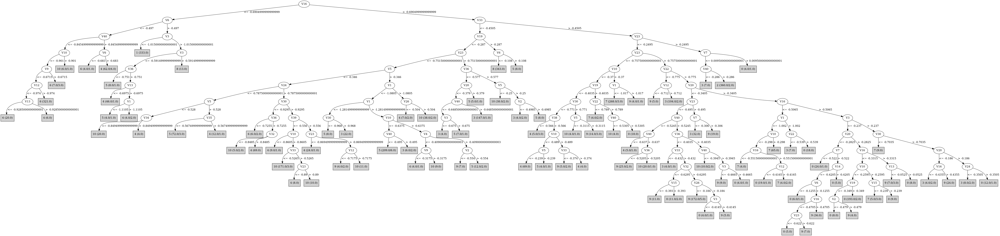

# J48

# SimpleCart Decision Tree

V23 < -0.2495

* V3 < -0.9404999999999999

*   * V6 < -0.5005

*   *   * V40 < -0.8494999999999999

*   *   *   * V12 < -0.9904999999999999

*   *   *   *   * V3 < -1.07: 6(12.0/0.0)

*   *   *   *   * V3 >= -1.07: 4(5.0/0.0)

*   *   *   * V12 >= -0.9904999999999999: 6(324.0/2.0)

*   *   * V40 >= -0.8494999999999999

*   *   *   * V12 < -0.859: 4(21.0/0.0)

*   *   *   * V12 >= -0.859: 6(6.0/1.0)

*   * V6 >= -0.5005: 1(333.0/4.0)

* V3 >= -0.9404999999999999

*   * V30 < -1.0445

*   *   * V3 < -0.624

*   *   *   * V24 < -0.9795: 5(17.0/0.0)

*   *   *   * V24 >= -0.9795

*   *   *   *   * V12 < -0.7855000000000001: 4(31.0/1.0)

*   *   *   *   * V12 >= -0.7855000000000001: 6(7.0/0.0)

*   *   * V3 >= -0.624: 8(344.0/0.0)

*   * V30 >= -1.0445

*   *   * V40 < -0.5455000000000001

*   *   *   * V5 < -0.346

*   *   *   *   * V30 < -0.8935

*   *   *   *   *   * V38 < -0.7064999999999999

*   *   *   *   *   *   * V5 < -0.4545

*   *   *   *   *   *   *   * V10 < -0.8534999999999999

*   *   *   *   *   *   *   *   * V40 < -0.8445

*   *   *   *   *   *   *   *   *   * V17 < -0.902: 5(4.0/5.0)

*   *   *   *   *   *   *   *   *   * V17 >= -0.902: 6(7.0/0.0)

*   *   *   *   *   *   *   *   * V40 >= -0.8445: 4(14.0/1.0)

*   *   *   *   *   *   *   * V10 >= -0.8534999999999999: 10(36.0/4.0)

*   *   *   *   *   *   * V5 >= -0.4545: 5(41.0/3.0)

*   *   *   *   *   * V38 >= -0.7064999999999999

*   *   *   *   *   *   * V6 < -0.2845: 4(120.0/2.0)

*   *   *   *   *   *   * V6 >= -0.2845

*   *   *   *   *   *   *   * V32 < -0.7775000000000001: 5(5.0/2.0)

*   *   *   *   *   *   *   * V32 >= -0.7775000000000001: 4(8.0/0.0)

*   *   *   *   * V30 >= -0.8935

*   *   *   *   *   * V10 < -0.7955000000000001

*   *   *   *   *   *   * V27 < -0.8095

*   *   *   *   *   *   *   * V3 < -0.8125: 10(5.0/3.0)

*   *   *   *   *   *   *   * V3 >= -0.8125: 5(9.0/1.0)

*   *   *   *   *   *   * V27 >= -0.8095: 4(13.0/0.0)

*   *   *   *   *   * V10 >= -0.7955000000000001

*   *   *   *   *   *   * V38 < -0.5765: 10(191.0/9.0)

*   *   *   *   *   *   * V38 >= -0.5765

*   *   *   *   *   *   *   * V29 < -0.522: 4(10.0/3.0)

*   *   *   *   *   *   *   * V29 >= -0.522: 10(14.0/1.0)

*   *   *   * V5 >= -0.346

*   *   *   *   * V10 < -0.6395

*   *   *   *   *   * V30 < -0.722

*   *   *   *   *   *   * V1 < -1.3125: 3(9.0/0.0)

*   *   *   *   *   *   * V1 >= -1.3125

*   *   *   *   *   *   *   * V33 < -0.503: 5(221.0/10.0)

*   *   *   *   *   *   *   * V33 >= -0.503: 4(6.0/0.0)

*   *   *   *   *   * V30 >= -0.722: 3(47.0/3.0)

*   *   *   *   * V10 >= -0.6395

*   *   *   *   *   * V36 < -0.5874999999999999

*   *   *   *   *   *   * V13 < -0.10999999999999999

*   *   *   *   *   *   *   * V10 < -0.497

*   *   *   *   *   *   *   *   * V16 < -0.533: 3(9.0/1.0)

*   *   *   *   *   *   *   *   * V16 >= -0.533: 5(3.0/3.0)

*   *   *   *   *   *   *   * V10 >= -0.497: 9(9.0/0.0)

*   *   *   *   *   *   * V13 >= -0.10999999999999999: 8(12.0/0.0)

*   *   *   *   *   * V36 >= -0.5874999999999999

*   *   *   *   *   *   * V26 < -0.463

*   *   *   *   *   *   *   * V3 < -0.519: 4(8.0/2.0)

*   *   *   *   *   *   *   * V3 >= -0.519: 5(8.0/0.0)

*   *   *   *   *   *   * V26 >= -0.463

*   *   *   *   *   *   *   * V3 < -0.356

*   *   *   *   *   *   *   *   * V32 < -0.3815: 10(61.0/6.0)

*   *   *   *   *   *   *   *   * V32 >= -0.3815: 4(4.0/2.0)

*   *   *   *   *   *   *   * V3 >= -0.356: 9(7.0/0.0)

*   *   * V40 >= -0.5455000000000001

*   *   *   * V10 < -0.3055

*   *   *   *   * V20 < -0.3405

*   *   *   *   *   * V36 < -0.5754999999999999

*   *   *   *   *   *   * V27 < -0.602: 3(156.0/3.0)

*   *   *   *   *   *   * V27 >= -0.602: 9(5.0/1.0)

*   *   *   *   *   * V36 >= -0.5754999999999999

*   *   *   *   *   *   * V23 < -0.785

*   *   *   *   *   *   *   * V6 < -0.14450000000000002

*   *   *   *   *   *   *   *   * V10 < -0.439: 4(75.0/4.0)

*   *   *   *   *   *   *   *   * V10 >= -0.439: 7(6.0/1.0)

*   *   *   *   *   *   *   * V6 >= -0.14450000000000002

*   *   *   *   *   *   *   *   * V25 < -0.6025: 5(11.0/0.0)

*   *   *   *   *   *   *   *   * V25 >= -0.6025: 9(5.0/6.0)

*   *   *   *   *   *   * V23 >= -0.785

*   *   *   *   *   *   *   * V22 < -0.7895000000000001

*   *   *   *   *   *   *   *   * V12 < -0.712: 9(7.0/0.0)

*   *   *   *   *   *   *   *   * V12 >= -0.712: 3(33.0/2.0)

*   *   *   *   *   *   *   * V22 >= -0.7895000000000001

*   *   *   *   *   *   *   *   * V30 < -0.4265

*   *   *   *   *   *   *   *   *   * V17 < -0.718: 9(152.0/8.0)

*   *   *   *   *   *   *   *   *   * V17 >= -0.718

*   *   *   *   *   *   *   *   *   *   * V23 < -0.655

*   *   *   *   *   *   *   *   *   *   *   * V3 < -0.46199999999999997: 10(15.0/3.0)

*   *   *   *   *   *   *   *   *   *   *   * V3 >= -0.46199999999999997: 0(3.0/5.0)

*   *   *   *   *   *   *   *   *   *   * V23 >= -0.655

*   *   *   *   *   *   *   *   *   *   *   * V34 < -0.5745: 0(4.0/4.0)

*   *   *   *   *   *   *   *   *   *   *   * V34 >= -0.5745: 9(48.0/7.0)

*   *   *   *   *   *   *   *   * V30 >= -0.4265: 3(19.0/0.0)

*   *   *   *   * V20 >= -0.3405

*   *   *   *   *   * V24 < -0.6

*   *   *   *   *   *   * V23 < -0.762: 5(3.0/2.0)

*   *   *   *   *   *   * V23 >= -0.762: 3(30.0/1.0)

*   *   *   *   *   * V24 >= -0.6

*   *   *   *   *   *   * V2 < -0.6105: 7(16.0/3.0)

*   *   *   *   *   *   * V2 >= -0.6105

*   *   *   *   *   *   *   * V30 < -0.579

*   *   *   *   *   *   *   *   * V12 < -0.6305000000000001: 9(8.0/1.0)

*   *   *   *   *   *   *   *   * V12 >= -0.6305000000000001: 0(236.0/19.0)

*   *   *   *   *   *   *   * V30 >= -0.579

*   *   *   *   *   *   *   *   * V36 < -0.4275

*   *   *   *   *   *   *   *   *   * V16 < -0.507: 3(7.0/0.0)

*   *   *   *   *   *   *   *   *   * V16 >= -0.507: 9(24.0/2.0)

*   *   *   *   *   *   *   *   * V36 >= -0.4275: 0(34.0/5.0)

*   *   *   * V10 >= -0.3055

*   *   *   *   * V34 < -0.5375000000000001

*   *   *   *   *   * V23 < -0.61

*   *   *   *   *   *   * V16 < -0.4375: 7(321.0/6.0)

*   *   *   *   *   *   * V16 >= -0.4375: 0(4.0/3.0)

*   *   *   *   *   * V23 >= -0.61: 3(7.0/0.0)

*   *   *   *   * V34 >= -0.5375000000000001

*   *   *   *   *   * V20 < -0.2855: 9(42.0/3.0)

*   *   *   *   *   * V20 >= -0.2855

*   *   *   *   *   *   * V10 < -0.16999999999999998: 0(38.0/9.0)

*   *   *   *   *   *   * V10 >= -0.16999999999999998

*   *   *   *   *   *   *   * V1 < -0.7415: 7(3.0/2.0)

*   *   *   *   *   *   *   * V1 >= -0.7415: 9(14.0/3.0)

V23 >= -0.2495

* V20 < -0.3395: 3(7.0/1.0)

* V20 >= -0.3395

*   * V2 < -0.07200000000000001: 2(358.0/0.0)

*   * V2 >= -0.07200000000000001: 0(2.0/3.0)

# PART

Decision list:

conditions|predicted class
---|---
V16 <= -0.6904999999999999 AND V6 <= -0.497 AND V40 <= -0.8454999999999999 AND V10 <= -0.901 AND V12 > -0.974 AND V6 <= -0.58| 6 (324.0)
V20 > -0.3405 AND V30 > -0.9605 AND V23 > -0.2555 AND V2 <= -0.07200000000000001| 2 (358.0)
V20 > -0.3405 AND V30 <= -0.9605| 8 (357.0)
V40 > -0.5505 AND V20 > -0.3525 AND V23 <= -0.7144999999999999 AND V10 > -0.319 AND V4 <= -0.151| 7 (298.0/1.0)
V3 <= -1.02 AND V9 > -0.722| 1 (333.0)
V23 <= -0.7885 AND V5 <= -0.3455 AND V30 > -0.9295 AND V40 > -0.623 AND V10 <= -0.482| 4 (59.0/3.0)
V40 <= -0.5455000000000001 AND V20 <= -0.7935000000000001 AND V3 > -1.07 AND V27 > -1.089 AND V40 > -0.7865 AND V3 <= -0.705| 4 (105.0/1.0)
V40 <= -0.5455000000000001 AND V20 <= -0.8725 AND V40 > -0.9584999999999999 AND V28 <= -0.7915000000000001| 4 (40.0/2.0)
V40 <= -0.5455000000000001 AND V9 <= -0.5665 AND V10 <= -0.9045000000000001 AND V23 <= -1.029| 6 (28.0)
V40 <= -0.5455000000000001 AND V33 <= -0.5285 AND V23 <= -0.6975 AND V5 > -0.346 AND V10 <= -0.6395 AND V1 > -1.3125 AND V24 <= -0.5635 AND V3 > -0.6415| 5 (206.0/2.0)
V40 <= -0.5455000000000001 AND V24 > -0.776 AND V23 <= -0.693 AND V3 <= -0.4935 AND V10 > -0.801 AND V30 > -0.8805000000000001 AND V33 <= -0.5025 AND V26 > -0.4755| 10 (171.0)
V23 <= -0.8274999999999999 AND V10 > -0.46950000000000003 AND V20 > -0.418| 7 (17.0)
V23 <= -0.8274999999999999 AND V35 > -0.581 AND V5 <= -0.239 AND V29 <= -0.535 AND V28 > -0.8414999999999999 AND V38 > -0.645| 4 (100.0/3.0)
V23 <= -0.8274999999999999 AND V24 <= -0.7915000000000001 AND V5 > -0.528 AND V9 <= -0.3565 AND V36 <= -0.642| 5 (75.0)
V23 <= -0.8274999999999999 AND V5 <= -0.416 AND V27 <= -0.784 AND V10 > -0.9005000000000001 AND V35 <= -0.581 AND V38 <= -0.7364999999999999| 10 (67.0)
V24 <= -0.5954999999999999 AND V5 > -0.366 AND V23 > -0.7255 AND V30 > -0.7375 AND V22 <= -0.7735000000000001| 3 (192.0)
V33 > -0.4435 AND V20 > -0.3405 AND V16 > -0.5115000000000001 AND V5 <= -0.034 AND V3 <= -0.1835 AND V20 > -0.275 AND V16 <= -0.3315 AND V19 > -0.3495| 0 (206.0/2.0)
V23 <= -0.8274999999999999 AND V27 > -1.029 AND V6 <= -0.39649999999999996 AND V12 <= -0.7515000000000001| 4 (13.0)
V33 > -0.4435 AND V30 > -0.46799999999999997 AND V34 <= -0.4145 AND V23 > -0.4545| 3 (49.0)
V33 > -0.4345 AND V20 <= -0.341 AND V28 > -0.651 AND V30 > -0.762 AND V40 > -0.5245 AND V36 <= -0.4035 AND V36 > -0.6014999999999999 AND V34 > -0.6525000000000001 AND V16 > -0.5765 AND V19 <= -0.4015| 9 (150.0/1.0)
V33 > -0.4345 AND V40 <= -0.5245 AND V30 > -0.7605 AND V36 > -0.5205| 10 (28.0/1.0)
V33 > -0.4345 AND V26 > -0.4105 AND V32 <= -0.629 AND V10 <= -0.368 AND V15 > -0.4105| 0 (49.0)
V33 > -0.4345 AND V20 <= -0.341 AND V23 <= -0.7905 AND V22 > -0.82| 4 (16.0/3.0)
V33 > -0.4305 AND V34 > -0.5665 AND V13 <= -0.4315 AND V2 > -0.403| 4 (5.0)
V33 > -0.4305 AND V34 > -0.5665 AND V35 <= -0.036 AND V9 > -0.279 AND V27 > -0.6964999999999999 AND V16 > -0.4835 AND V20 <= -0.167 AND V7 > -0.5545 AND V26 <= -0.1095 AND V40 > -0.451 AND V30 > -0.6054999999999999| 9 (68.0)
V33 > -0.4305 AND V20 > -0.2935 AND V22 > -0.5445 AND V36 > -0.526| 0 (40.0/2.0)
V33 > -0.4305 AND V20 > -0.2935 AND V14 <= -0.4555 AND V24 > -0.567 AND V10 > -0.362| 7 (40.0/1.0)
V33 > -0.4435 AND V25 <= -0.578 AND V10 > -0.5625| 3 (9.0)
V33 > -0.4435 AND V10 > -0.558 AND V7 > -0.5814999999999999 AND V26 <= -0.2385 AND V23 <= -0.564 AND V40 > -0.5905 AND V16 > -0.4625| 9 (52.0/1.0)
V33 > -0.4375 AND V20 <= -0.412 AND V10 > -0.573 AND V19 <= -0.435| 9 (35.0/1.0)
V33 > -0.333 AND V7 > -0.5765 AND V22 > -0.7244999999999999 AND V19 > -0.3995 AND V16 <= -0.41100000000000003 AND V23 <= -0.62| 0 (27.0)
V33 > -0.3325 AND V7 > -0.5765 AND V28 > -0.495 AND V23 > -0.65 AND V19 > -0.3945 AND V16 > -0.5035000000000001 AND V28 > -0.4645 AND V6 <= -0.0435 AND V36 <= -0.435| 9 (9.0/1.0)
V35 > -0.3735 AND V34 > -0.608 AND V24 > -0.52 AND V20 > -0.4275 AND V40 > -0.469 AND V19 > -0.3945 AND V6 <= -0.0435| 0 (17.0/1.0)
V5 <= -0.346 AND V24 <= -0.776 AND V4 > -0.585 AND V30 <= -0.8554999999999999| 5 (8.0)
V6 <= -0.2325 AND V30 > -0.944 AND V17 > -0.926 AND V6 <= -0.24 AND V36 > -0.6025| 10 (33.0)
V4 <= -0.521 AND V36 > -0.661 AND V35 > -0.6005| 4 (9.0/2.0)
V36 <= -0.575 AND V9 > -0.381 AND V22 <= -0.5814999999999999 AND V20 <= -0.3125 AND V23 > -0.842 AND V10 <= -0.497| 3 (87.0)
V5 <= -0.3655 AND V6 > -0.39649999999999996 AND V10 > -0.7264999999999999| 10 (17.0/1.0)
V26 <= -0.4775 AND V27 > -1.019 AND V6 > -0.3435| 5 (38.0/2.0)
V36 <= -0.6415 AND V1 <= -1.2255| 3 (6.0)
V9 > -0.515 AND V40 > -0.4305 AND V23 > -0.729 AND V24 > -0.534 AND V28 <= -0.1235| 9 (12.0)
V9 <= -0.515| 6 (6.0)
V40 > -0.4225 AND V2 <= -0.494| 7 (5.0)
V14 <= -0.612 AND V25 > -0.5974999999999999| 9 (14.0)
V24 > -0.513 AND V36 <= -0.5365 AND V10 > -0.44499999999999995| 9 (7.0)
V24 > -0.513 AND V16 > -0.495| 10 (19.0/4.0)
V5 <= -0.2355 AND V1 > -1.1115| 10 (11.0/1.0)
V24 <= -0.509 AND V16 > -0.5235000000000001 AND V10 <= -0.574| 5 (14.0)
V24 <= -0.5425| 3 (11.0/2.0)
| 0 (10.0/1.0)

# JRip

Decision list:

conditions|predicted class
---|---
(V26 <= -0.741) and (V32 >= -0.868) and (V3 <= -1.022)|1 (258.0/0.0)
(V3 <= -1.035) and (V5 >= -0.727)|1 (75.0/0.0)
(V35 >= -0.581) and (V20 <= -0.721)|4 (172.0/6.0)
(V19 <= -0.504) and (V40 >= -0.87) and (V9 <= -0.555) and (V27 <= -0.855) and (V16 <= -0.632)|4 (68.0/3.0)
(V20 <= -0.493) and (V33 >= -0.526) and (V30 <= -0.814) and (V9 <= -0.324)|4 (52.0/0.0)
(V26 <= -0.426) and (V33 >= -0.608) and (V30 <= -0.869) and (V1 >= -1.153) and (V19 <= -0.529)|4 (12.0/0.0)
(V20 <= -0.493) and (V35 >= -0.379) and (V30 <= -0.711)|4 (18.0/1.0)
(V26 <= -0.426) and (V16 >= -0.447) and (V33 >= -0.444)|4 (10.0/1.0)
(V3 <= -0.682) and (V33 >= -0.661) and (V30 <= -0.904) and (V38 >= -0.702)|4 (8.0/0.0)
(V12 <= -0.975) and (V39 >= -0.787)|4 (3.0/0.0)
(V20 <= -0.93) and (V5 >= -0.664)|4 (3.0/0.0)
(V26 <= -0.451) and (V10 <= -0.646) and (V3 >= -0.633) and (V40 <= -0.53)|5 (197.0/1.0)
(V24 <= -0.805) and (V5 >= -0.547) and (V9 <= -0.38)|5 (74.0/2.0)
(V10 <= -0.578) and (V3 >= -0.559) and (V23 <= -0.712) and (V37 <= -0.747)|5 (42.0/0.0)
(V26 <= -0.407) and (V2 >= -0.644) and (V37 <= -0.882) and (V9 <= -0.34)|5 (15.0/1.0)
(V10 <= -0.579) and (V8 >= -0.367) and (V36 >= -0.528) and (V32 <= -0.621)|5 (8.0/0.0)
(V26 <= -0.458) and (V23 >= -0.888) and (V30 <= -0.854) and (V28 >= -0.729) and (V24 <= -0.756)|5 (5.0/0.0)
(V36 >= -0.475) and (V10 <= -0.311) and (V30 <= -0.613) and (V20 >= -0.332) and (V2 >= -0.551)|0 (157.0/4.0)
(V29 >= -0.412) and (V23 <= -0.425) and (V36 >= -0.376) and (V26 >= -0.142)|0 (50.0/0.0)
(V29 >= -0.43) and (V30 <= -0.515) and (V26 >= -0.202) and (V4 >= -0.249) and (V20 >= -0.364)|0 (50.0/4.0)
(V29 >= -0.437) and (V37 <= -0.738) and (V16 >= -0.512) and (V20 >= -0.35)|0 (49.0/4.0)
(V36 >= -0.501) and (V40 <= -0.337) and (V13 >= -0.125) and (V14 <= -0.456)|0 (8.0/1.0)
(V35 >= 0.017)|0 (8.0/0.0)
(V36 >= -0.497) and (V39 <= -0.416) and (V20 >= -0.405) and (V16 <= -0.463) and (V8 >= -0.372) and (V10 <= -0.386)|0 (13.0/0.0)
(V36 >= -0.424) and (V40 <= -0.208) and (V20 >= -0.208) and (V16 >= -0.463)|0 (11.0/2.0)
(V36 >= -0.561) and (V37 <= -0.84) and (V33 >= -0.458) and (V1 >= -1.247)|0 (7.0/0.0)
(V36 >= -0.424) and (V30 <= -0.571) and (V24 >= -0.389) and (V20 >= -0.408) and (V39 <= -0.29)|0 (6.0/0.0)
(V8 <= -0.406) and (V10 >= -0.809) and (V40 <= -0.607) and (V36 >= -0.646)|10 (206.0/0.0)
(V20 <= -0.407) and (V10 >= -0.897) and (V40 <= -0.649)|10 (85.0/7.0)
(V1 >= -0.969) and (V40 <= -0.472) and (V36 >= -0.518) and (V2 <= -0.303)|10 (44.0/0.0)
(V32 <= -0.587) and (V36 >= -0.508) and (V1 >= -1.043) and (V2 <= -0.515)|10 (8.0/0.0)
(V1 >= -1.064) and (V40 <= -0.578) and (V36 >= -0.559)|10 (4.0/0.0)
(V24 <= -0.59) and (V23 >= -0.807) and (V30 >= -0.704) and (V12 >= -0.641)|3 (187.0/0.0)
(V27 <= -0.909) and (V2 >= -0.717)|3 (74.0/0.0)
(V23 >= -0.563) and (V24 <= -0.447)|3 (65.0/6.0)
(V1 >= -0.854) and (V27 <= -0.417) and (V23 >= -0.378) and (V13 <= -0.008)|3 (16.0/0.0)
(V22 <= -0.84) and (V23 >= -0.748)|3 (9.0/1.0)
(V23 >= -0.77) and (V20 <= -0.288) and (V16 >= -0.524)|9 (253.0/2.0)
(V23 >= -0.795) and (V40 <= -0.322) and (V19 <= -0.415)|9 (56.0/2.0)
(V7 >= -0.29) and (V23 <= -0.192)|9 (21.0/0.0)
(V1 >= -1.025) and (V18 <= -0.336) and (V2 >= -0.46)|9 (10.0/1.0)
(V17 <= -0.7) and (V4 >= -0.395)|9 (7.0/2.0)
(V12 >= -0.386) and (V23 <= -0.962)|8 (328.0/0.0)
(V23 <= -1.156) and (V2 >= -0.667)|8 (29.0/0.0)
(V4 <= -0.595)|6 (355.0/1.0)
(V23 >= -0.234) and (V2 <= -0.074)|2 (350.0/0.0)
|7 (364.0/10.0)

# Decision Table

Non matches covered by Majority class

v20|v29|v30|target
---|---|---|---
(-0.6255--0.5525]|(-0.0855-inf)|(-0.1635-inf)|0
(-0.2395--0.1375]|(-0.0855-inf)|(-0.1635-inf)|2
(-0.0695--0.0155]|(-0.0855-inf)|(-0.1635-inf)|2
(-0.0155-0.0805]|(-0.0855-inf)|(-0.1635-inf)|2
(-0.3405--0.2395]|(-0.0855-inf)|(-0.1635-inf)|2
(0.0805-inf)|(-0.0855-inf)|(-0.1635-inf)|2
(-0.1375--0.0695]|(-0.0855-inf)|(-0.1635-inf)|2
(-0.5525--0.4405]|(-0.1835--0.0855]|(-0.1635-inf)|0
(-0.4405--0.3405]|(-0.1835--0.0855]|(-0.1635-inf)|0
(0.0805-inf)|(-0.1835--0.0855]|(-0.1635-inf)|2
(-0.3405--0.2395]|(-0.1835--0.0855]|(-0.1635-inf)|0
(-0.2395--0.1375]|(-0.1835--0.0855]|(-0.1635-inf)|2
(-0.0155-0.0805]|(-0.1835--0.0855]|(-0.1635-inf)|2
(-0.1375--0.0695]|(-0.1835--0.0855]|(-0.1635-inf)|2
(-0.0695--0.0155]|(-0.1835--0.0855]|(-0.1635-inf)|2
(-0.3405--0.2395]|(-0.2805--0.1835]|(-0.1635-inf)|0
(-0.3405--0.2395]|(-0.0855-inf)|(-0.2365--0.1635]|0
(-0.4405--0.3405]|(-0.0855-inf)|(-0.2365--0.1635]|0
(-0.2395--0.1375]|(-0.2805--0.1835]|(-0.1635-inf)|0
(-0.1375--0.0695]|(-0.2805--0.1835]|(-0.1635-inf)|0
(-0.1375--0.0695]|(-0.0855-inf)|(-0.2365--0.1635]|0
(-0.4405--0.3405]|(-0.1835--0.0855]|(-0.2365--0.1635]|3
(-0.3405--0.2395]|(-0.1835--0.0855]|(-0.2365--0.1635]|3
(-0.5525--0.4405]|(-0.1835--0.0855]|(-0.2365--0.1635]|0
(-0.0155-0.0805]|(-0.1835--0.0855]|(-0.2365--0.1635]|0
(-0.2395--0.1375]|(-0.1835--0.0855]|(-0.2365--0.1635]|0
(-0.1375--0.0695]|(-0.1835--0.0855]|(-0.2365--0.1635]|2
(-0.0695--0.0155]|(-0.1835--0.0855]|(-0.2365--0.1635]|2
(-0.4405--0.3405]|(-0.2805--0.1835]|(-0.2365--0.1635]|0
(-0.0155-0.0805]|(-0.2805--0.1835]|(-0.2365--0.1635]|0
(-0.4405--0.3405]|(-0.0855-inf)|(-0.4215--0.2365]|0
(-0.5525--0.4405]|(-0.2805--0.1835]|(-0.2365--0.1635]|0
(-0.0695--0.0155]|(-0.2805--0.1835]|(-0.2365--0.1635]|2
(-0.3405--0.2395]|(-0.2805--0.1835]|(-0.2365--0.1635]|0
(-0.3405--0.2395]|(-0.0855-inf)|(-0.4215--0.2365]|0
(-0.1375--0.0695]|(-0.0855-inf)|(-0.4215--0.2365]|0
(-0.0155-0.0805]|(-0.0855-inf)|(-0.4215--0.2365]|0
(-0.2395--0.1375]|(-0.0855-inf)|(-0.4215--0.2365]|0
(-0.3405--0.2395]|(-0.1835--0.0855]|(-0.4215--0.2365]|0
(0.0805-inf)|(-0.3785--0.2805]|(-0.2365--0.1635]|0
(-0.4405--0.3405]|(-0.1835--0.0855]|(-0.4215--0.2365]|0
(-0.2395--0.1375]|(-0.1835--0.0855]|(-0.4215--0.2365]|0
(-0.3405--0.2395]|(-0.0855-inf)|(-0.5825--0.4215]|0
(-0.2395--0.1375]|(-0.2805--0.1835]|(-0.4215--0.2365]|3
(-0.3405--0.2395]|(-0.2805--0.1835]|(-0.4215--0.2365]|9
(-0.7285--0.6255]|(-0.2805--0.1835]|(-0.4215--0.2365]|0
(-0.1375--0.0695]|(-0.2805--0.1835]|(-0.4215--0.2365]|3
(-0.6255--0.5525]|(-0.2805--0.1835]|(-0.4215--0.2365]|0
(-0.5525--0.4405]|(-0.2805--0.1835]|(-0.4215--0.2365]|3
(-0.4405--0.3405]|(-0.2805--0.1835]|(-0.4215--0.2365]|3
(-0.0695--0.0155]|(-0.0855-inf)|(-0.5825--0.4215]|0
(-0.2395--0.1375]|(-0.0855-inf)|(-0.5825--0.4215]|0
(-0.0155-0.0805]|(-0.1835--0.0855]|(-0.5825--0.4215]|0
(-0.5525--0.4405]|(-0.1835--0.0855]|(-0.5825--0.4215]|9
(-0.4405--0.3405]|(-0.1835--0.0855]|(-0.5825--0.4215]|9
(-0.1375--0.0695]|(-0.3785--0.2805]|(-0.4215--0.2365]|3
(-0.3405--0.2395]|(-0.3785--0.2805]|(-0.4215--0.2365]|3
(-0.2395--0.1375]|(-0.3785--0.2805]|(-0.4215--0.2365]|3
(-0.5525--0.4405]|(-0.3785--0.2805]|(-0.4215--0.2365]|3
(-0.4405--0.3405]|(-0.3785--0.2805]|(-0.4215--0.2365]|3
(-0.7285--0.6255]|(-0.3785--0.2805]|(-0.4215--0.2365]|3
(-0.6255--0.5525]|(-0.3785--0.2805]|(-0.4215--0.2365]|3
(-0.0695--0.0155]|(-0.1835--0.0855]|(-0.5825--0.4215]|0
(-0.1375--0.0695]|(-0.1835--0.0855]|(-0.5825--0.4215]|0
(-0.3405--0.2395]|(-0.1835--0.0855]|(-0.5825--0.4215]|0
(-0.2395--0.1375]|(-0.1835--0.0855]|(-0.5825--0.4215]|0
(-0.5525--0.4405]|(-0.2805--0.1835]|(-0.5825--0.4215]|9
(-0.6255--0.5525]|(-0.2805--0.1835]|(-0.5825--0.4215]|0
(-0.4405--0.3405]|(-0.2805--0.1835]|(-0.5825--0.4215]|9
(-0.1375--0.0695]|(-0.2805--0.1835]|(-0.5825--0.4215]|0
(-0.2395--0.1375]|(-0.2805--0.1835]|(-0.5825--0.4215]|0
(-0.3405--0.2395]|(-0.2805--0.1835]|(-0.5825--0.4215]|9
(-0.7285--0.6255]|(-0.3785--0.2805]|(-0.5825--0.4215]|3
(-0.4405--0.3405]|(-0.3785--0.2805]|(-0.5825--0.4215]|9
(-0.3405--0.2395]|(-0.3785--0.2805]|(-0.5825--0.4215]|9
(-0.2395--0.1375]|(-0.3785--0.2805]|(-0.5825--0.4215]|0
(-0.6255--0.5525]|(-0.3785--0.2805]|(-0.5825--0.4215]|3
(-0.5525--0.4405]|(-0.3785--0.2805]|(-0.5825--0.4215]|3
(-0.7285--0.6255]|(-0.4285--0.3785]|(-0.5825--0.4215]|0
(-0.6255--0.5525]|(-0.4285--0.3785]|(-0.5825--0.4215]|3
(-0.3405--0.2395]|(-0.4285--0.3785]|(-0.5825--0.4215]|3
(-0.2395--0.1375]|(-0.4285--0.3785]|(-0.5825--0.4215]|3
(-0.4405--0.3405]|(-0.4285--0.3785]|(-0.5825--0.4215]|3
(-0.5525--0.4405]|(-0.4285--0.3785]|(-0.5825--0.4215]|3
(-0.4405--0.3405]|(-0.2805--0.1835]|(-0.7055--0.5825]|9
(-0.1375--0.0695]|(-0.2805--0.1835]|(-0.7055--0.5825]|0
(-0.3405--0.2395]|(-0.2805--0.1835]|(-0.7055--0.5825]|0
(-0.5525--0.4405]|(-0.2805--0.1835]|(-0.7055--0.5825]|0
(-0.2395--0.1375]|(-0.2805--0.1835]|(-0.7055--0.5825]|0
(-0.7285--0.6255]|(-0.4865--0.4285]|(-0.5825--0.4215]|0
(-0.0155-0.0805]|(-0.3785--0.2805]|(-0.7055--0.5825]|0
(-0.2395--0.1375]|(-0.4865--0.4285]|(-0.5825--0.4215]|0
(-0.3405--0.2395]|(-0.4865--0.4285]|(-0.5825--0.4215]|3
(-0.5525--0.4405]|(-0.4865--0.4285]|(-0.5825--0.4215]|3
(-0.4405--0.3405]|(-0.4865--0.4285]|(-0.5825--0.4215]|3
(-0.6255--0.5525]|(-0.4865--0.4285]|(-0.5825--0.4215]|3
(-0.4405--0.3405]|(-0.3785--0.2805]|(-0.7055--0.5825]|9
(-0.7285--0.6255]|(-0.3785--0.2805]|(-0.7055--0.5825]|10
(-0.5525--0.4405]|(-0.3785--0.2805]|(-0.7055--0.5825]|9
(-0.6255--0.5525]|(-0.3785--0.2805]|(-0.7055--0.5825]|9
(-0.0695--0.0155]|(-0.3785--0.2805]|(-0.7055--0.5825]|7
(-0.2395--0.1375]|(-0.3785--0.2805]|(-0.7055--0.5825]|0
(-0.3405--0.2395]|(-0.3785--0.2805]|(-0.7055--0.5825]|0
(-0.1375--0.0695]|(-0.3785--0.2805]|(-0.7055--0.5825]|0
(-0.6255--0.5525]|(-0.5585--0.4865]|(-0.5825--0.4215]|3
(-0.4405--0.3405]|(-0.5585--0.4865]|(-0.5825--0.4215]|0
(-0.1375--0.0695]|(-0.2805--0.1835]|(-0.7685--0.7055]|0
(-0.7285--0.6255]|(-0.4285--0.3785]|(-0.7055--0.5825]|10
(-0.0695--0.0155]|(-0.4285--0.3785]|(-0.7055--0.5825]|0
(-0.3405--0.2395]|(-0.5585--0.4865]|(-0.5825--0.4215]|3
(-0.5525--0.4405]|(-0.5585--0.4865]|(-0.5825--0.4215]|3
(-0.1375--0.0695]|(-0.4285--0.3785]|(-0.7055--0.5825]|7
(-0.3405--0.2395]|(-0.4285--0.3785]|(-0.7055--0.5825]|0
(-0.4405--0.3405]|(-0.4285--0.3785]|(-0.7055--0.5825]|9
(-0.6255--0.5525]|(-0.4285--0.3785]|(-0.7055--0.5825]|9
(-0.5525--0.4405]|(-0.4285--0.3785]|(-0.7055--0.5825]|9
(-0.0155-0.0805]|(-0.4285--0.3785]|(-0.7055--0.5825]|7
(-0.2395--0.1375]|(-0.4285--0.3785]|(-0.7055--0.5825]|0
(-0.6255--0.5525]|(-0.3785--0.2805]|(-0.7685--0.7055]|0
(-0.4405--0.3405]|(-0.4865--0.4285]|(-0.7055--0.5825]|9
(-0.2395--0.1375]|(-0.4865--0.4285]|(-0.7055--0.5825]|3
(-0.3405--0.2395]|(-0.4865--0.4285]|(-0.7055--0.5825]|9
(-0.7285--0.6255]|(-0.4865--0.4285]|(-0.7055--0.5825]|10
(-0.5525--0.4405]|(-0.4865--0.4285]|(-0.7055--0.5825]|9
(-0.6255--0.5525]|(-0.4865--0.4285]|(-0.7055--0.5825]|10
(-0.4405--0.3405]|(-0.3785--0.2805]|(-0.7685--0.7055]|10
(-0.2395--0.1375]|(-0.3785--0.2805]|(-0.7685--0.7055]|0
(-0.1375--0.0695]|(-0.3785--0.2805]|(-0.7685--0.7055]|0
(-0.3405--0.2395]|(-0.3785--0.2805]|(-0.7685--0.7055]|0
(-0.7285--0.6255]|(-0.4285--0.3785]|(-0.7685--0.7055]|0
(-0.3405--0.2395]|(-0.5585--0.4865]|(-0.7055--0.5825]|3
(-0.6255--0.5525]|(-0.5585--0.4865]|(-0.7055--0.5825]|3
(-0.2395--0.1375]|(-0.5585--0.4865]|(-0.7055--0.5825]|3
(-0.4405--0.3405]|(-0.5585--0.4865]|(-0.7055--0.5825]|3
(-0.5525--0.4405]|(-0.4285--0.3785]|(-0.7685--0.7055]|9
(-0.6255--0.5525]|(-0.4285--0.3785]|(-0.7685--0.7055]|10
(-0.4405--0.3405]|(-0.4285--0.3785]|(-0.7685--0.7055]|9
(-0.5525--0.4405]|(-0.5585--0.4865]|(-0.7055--0.5825]|3
(-0.3405--0.2395]|(-0.4285--0.3785]|(-0.7685--0.7055]|0
(-0.1375--0.0695]|(-0.4285--0.3785]|(-0.7685--0.7055]|7
(-0.2395--0.1375]|(-0.4285--0.3785]|(-0.7685--0.7055]|7
(-0.0695--0.0155]|(-0.4285--0.3785]|(-0.7685--0.7055]|7
(-0.5525--0.4405]|(-0.3785--0.2805]|(-0.8205--0.7685]|0
(-0.3405--0.2395]|(-0.5935--0.5585]|(-0.7055--0.5825]|0
(-0.7285--0.6255]|(-0.5935--0.5585]|(-0.7055--0.5825]|0
(-0.7285--0.6255]|(-0.4865--0.4285]|(-0.7685--0.7055]|10
(-0.0695--0.0155]|(-0.4865--0.4285]|(-0.7685--0.7055]|0
(-0.8505--0.7285]|(-0.5935--0.5585]|(-0.7055--0.5825]|0
(-0.5525--0.4405]|(-0.5935--0.5585]|(-0.7055--0.5825]|3
(-0.4405--0.3405]|(-0.5935--0.5585]|(-0.7055--0.5825]|3
(-0.2395--0.1375]|(-0.5935--0.5585]|(-0.7055--0.5825]|3
(-0.6255--0.5525]|(-0.5935--0.5585]|(-0.7055--0.5825]|3
(-0.2395--0.1375]|(-0.3785--0.2805]|(-0.8205--0.7685]|0
(-0.6255--0.5525]|(-0.4865--0.4285]|(-0.7685--0.7055]|10
(-0.4405--0.3405]|(-0.4865--0.4285]|(-0.7685--0.7055]|9
(-0.5525--0.4405]|(-0.4865--0.4285]|(-0.7685--0.7055]|10
(-0.3405--0.2395]|(-0.3785--0.2805]|(-0.8205--0.7685]|0
(-0.2395--0.1375]|(-0.4865--0.4285]|(-0.7685--0.7055]|7
(-0.1375--0.0695]|(-0.4865--0.4285]|(-0.7685--0.7055]|7
(-0.3405--0.2395]|(-0.4865--0.4285]|(-0.7685--0.7055]|0
(-0.5525--0.4405]|(-0.4285--0.3785]|(-0.8205--0.7685]|0
(-0.9295--0.8505]|(-0.6865--0.5935]|(-0.7055--0.5825]|0
(-0.3405--0.2395]|(-0.6865--0.5935]|(-0.7055--0.5825]|0
(-0.2395--0.1375]|(-0.6865--0.5935]|(-0.7055--0.5825]|0
(-0.4405--0.3405]|(-0.4285--0.3785]|(-0.8205--0.7685]|10
(-0.0695--0.0155]|(-0.4285--0.3785]|(-0.8205--0.7685]|7
(-0.7285--0.6255]|(-0.6865--0.5935]|(-0.7055--0.5825]|3
(-0.5525--0.4405]|(-0.6865--0.5935]|(-0.7055--0.5825]|0
(-0.4405--0.3405]|(-0.6865--0.5935]|(-0.7055--0.5825]|3
(-0.6255--0.5525]|(-0.6865--0.5935]|(-0.7055--0.5825]|3
(-0.7285--0.6255]|(-0.5585--0.4865]|(-0.7685--0.7055]|10
(-0.1375--0.0695]|(-0.4285--0.3785]|(-0.8205--0.7685]|7
(-0.2395--0.1375]|(-0.4285--0.3785]|(-0.8205--0.7685]|7
(-0.3405--0.2395]|(-0.4285--0.3785]|(-0.8205--0.7685]|7
(-0.6255--0.5525]|(-0.5585--0.4865]|(-0.7685--0.7055]|10
(-0.5525--0.4405]|(-0.5585--0.4865]|(-0.7685--0.7055]|10
(-0.4405--0.3405]|(-0.5585--0.4865]|(-0.7685--0.7055]|9
(-0.3405--0.2395]|(-0.5585--0.4865]|(-0.7685--0.7055]|0
(-0.8505--0.7285]|(-0.4865--0.4285]|(-0.8205--0.7685]|0
(-0.0695--0.0155]|(-0.4865--0.4285]|(-0.8205--0.7685]|0
(-0.4405--0.3405]|(-0.5935--0.5585]|(-0.7685--0.7055]|3
(-0.7285--0.6255]|(-0.5935--0.5585]|(-0.7685--0.7055]|3
(-0.5525--0.4405]|(-0.4865--0.4285]|(-0.8205--0.7685]|4
(-0.6255--0.5525]|(-0.4865--0.4285]|(-0.8205--0.7685]|10
(-0.6255--0.5525]|(-0.5935--0.5585]|(-0.7685--0.7055]|5
(-0.7285--0.6255]|(-0.4865--0.4285]|(-0.8205--0.7685]|4
(-0.4405--0.3405]|(-0.4865--0.4285]|(-0.8205--0.7685]|0
(-0.4405--0.3405]|(-0.3785--0.2805]|(-0.9055--0.8205]|0
(-0.1375--0.0695]|(-0.4865--0.4285]|(-0.8205--0.7685]|7
(-0.3405--0.2395]|(-0.4865--0.4285]|(-0.8205--0.7685]|7
(-0.2395--0.1375]|(-0.4865--0.4285]|(-0.8205--0.7685]|7
(-0.5525--0.4405]|(-0.5935--0.5585]|(-0.7685--0.7055]|3
(-0.7285--0.6255]|(-0.4285--0.3785]|(-0.9055--0.8205]|0
(-1.0615--0.9295]|(-0.6865--0.5935]|(-0.7685--0.7055]|0
(-0.7285--0.6255]|(-0.6865--0.5935]|(-0.7685--0.7055]|3
(-0.0155-0.0805]|(-0.5585--0.4865]|(-0.8205--0.7685]|7
(-0.1375--0.0695]|(-0.5585--0.4865]|(-0.8205--0.7685]|0
(-0.6255--0.5525]|(-0.6865--0.5935]|(-0.7685--0.7055]|3
(-0.4405--0.3405]|(-0.6865--0.5935]|(-0.7685--0.7055]|3
(-0.5525--0.4405]|(-0.6865--0.5935]|(-0.7685--0.7055]|3
(-0.3405--0.2395]|(-0.6865--0.5935]|(-0.7685--0.7055]|0
(-0.7285--0.6255]|(-0.5585--0.4865]|(-0.8205--0.7685]|10
(-0.6255--0.5525]|(-0.5585--0.4865]|(-0.8205--0.7685]|10
(-0.8505--0.7285]|(-0.5585--0.4865]|(-0.8205--0.7685]|4
(-0.0695--0.0155]|(-0.4285--0.3785]|(-0.9055--0.8205]|0
(-0.3405--0.2395]|(-0.4285--0.3785]|(-0.9055--0.8205]|7
(-0.2395--0.1375]|(-0.5585--0.4865]|(-0.8205--0.7685]|7
(-0.2395--0.1375]|(-0.4285--0.3785]|(-0.9055--0.8205]|7
(-0.0695--0.0155]|(-0.5585--0.4865]|(-0.8205--0.7685]|7
(-0.4405--0.3405]|(-0.4285--0.3785]|(-0.9055--0.8205]|7
(-0.3405--0.2395]|(-0.5585--0.4865]|(-0.8205--0.7685]|5
(-0.4405--0.3405]|(-0.5585--0.4865]|(-0.8205--0.7685]|10
(-0.5525--0.4405]|(-0.5585--0.4865]|(-0.8205--0.7685]|10
(-0.9295--0.8505]|(-0.833--0.6865]|(-0.7685--0.7055]|0
(-0.8505--0.7285]|(-0.5935--0.5585]|(-0.8205--0.7685]|9
(-0.5525--0.4405]|(-0.4865--0.4285]|(-0.9055--0.8205]|4
(-0.0695--0.0155]|(-0.4865--0.4285]|(-0.9055--0.8205]|7
(-0.2395--0.1375]|(-0.5935--0.5585]|(-0.8205--0.7685]|0
(-0.7285--0.6255]|(-0.4865--0.4285]|(-0.9055--0.8205]|4
(-0.6255--0.5525]|(-0.4865--0.4285]|(-0.9055--0.8205]|4
(-0.4405--0.3405]|(-0.4865--0.4285]|(-0.9055--0.8205]|7
(-0.2395--0.1375]|(-0.4865--0.4285]|(-0.9055--0.8205]|7
(-0.1375--0.0695]|(-0.4865--0.4285]|(-0.9055--0.8205]|7
(-0.3405--0.2395]|(-0.4865--0.4285]|(-0.9055--0.8205]|7
(-0.3405--0.2395]|(-0.5935--0.5585]|(-0.8205--0.7685]|5
(-0.7285--0.6255]|(-0.5935--0.5585]|(-0.8205--0.7685]|10
(-0.5525--0.4405]|(-0.5935--0.5585]|(-0.8205--0.7685]|5
(-0.4405--0.3405]|(-0.5935--0.5585]|(-0.8205--0.7685]|3
(-0.6255--0.5525]|(-0.5935--0.5585]|(-0.8205--0.7685]|5
(-0.9295--0.8505]|(-0.5585--0.4865]|(-0.9055--0.8205]|4
(-0.0155-0.0805]|(-0.5585--0.4865]|(-0.9055--0.8205]|0
(-0.0695--0.0155]|(-0.5585--0.4865]|(-0.9055--0.8205]|0
(-0.4405--0.3405]|(-0.6865--0.5935]|(-0.8205--0.7685]|3
(-0.8505--0.7285]|(-0.5585--0.4865]|(-0.9055--0.8205]|4
(-0.6255--0.5525]|(-0.5585--0.4865]|(-0.9055--0.8205]|10
(-0.7285--0.6255]|(-0.5585--0.4865]|(-0.9055--0.8205]|4
(-0.5525--0.4405]|(-0.5585--0.4865]|(-0.9055--0.8205]|10
(-0.3405--0.2395]|(-0.5585--0.4865]|(-0.9055--0.8205]|7
(-0.4405--0.3405]|(-0.5585--0.4865]|(-0.9055--0.8205]|7
(-0.1375--0.0695]|(-0.5585--0.4865]|(-0.9055--0.8205]|7
(-0.2395--0.1375]|(-0.5585--0.4865]|(-0.9055--0.8205]|7
(-0.6255--0.5525]|(-0.6865--0.5935]|(-0.8205--0.7685]|3
(-0.5525--0.4405]|(-0.6865--0.5935]|(-0.8205--0.7685]|3
(-0.7285--0.6255]|(-0.6865--0.5935]|(-0.8205--0.7685]|5
(-0.8505--0.7285]|(-0.833--0.6865]|(-0.8205--0.7685]|1
(-0.4405--0.3405]|(-0.4865--0.4285]|(-0.9435--0.9055]|0
(-0.3405--0.2395]|(-0.4865--0.4285]|(-0.9435--0.9055]|0
(-0.9295--0.8505]|(-0.5935--0.5585]|(-0.9055--0.8205]|0
(-0.8505--0.7285]|(-0.5935--0.5585]|(-0.9055--0.8205]|4
(-1.0615--0.9295]|(-0.833--0.6865]|(-0.8205--0.7685]|1
(-0.9295--0.8505]|(-0.833--0.6865]|(-0.8205--0.7685]|1
(-0.2395--0.1375]|(-0.833--0.6865]|(-0.8205--0.7685]|0
(-0.5525--0.4405]|(-0.833--0.6865]|(-0.8205--0.7685]|3
(-0.6255--0.5525]|(-0.833--0.6865]|(-0.8205--0.7685]|0
(-0.7285--0.6255]|(-0.833--0.6865]|(-0.8205--0.7685]|0
(-0.6255--0.5525]|(-0.5935--0.5585]|(-0.9055--0.8205]|10
(-0.7285--0.6255]|(-0.5935--0.5585]|(-0.9055--0.8205]|4
(-0.0695--0.0155]|(-0.5935--0.5585]|(-0.9055--0.8205]|0
(-0.2395--0.1375]|(-0.5935--0.5585]|(-0.9055--0.8205]|0
(-0.1375--0.0695]|(-0.5935--0.5585]|(-0.9055--0.8205]|7
(-0.3405--0.2395]|(-0.5935--0.5585]|(-0.9055--0.8205]|5
(-0.4405--0.3405]|(-0.5935--0.5585]|(-0.9055--0.8205]|5
(-0.5525--0.4405]|(-0.5935--0.5585]|(-0.9055--0.8205]|10
(-0.9295--0.8505]|(-0.6865--0.5935]|(-0.9055--0.8205]|4
(-0.0155-0.0805]|(-0.4285--0.3785]|(-1.0255--0.9435]|0
(-0.0695--0.0155]|(-0.5585--0.4865]|(-0.9435--0.9055]|0
(-0.6255--0.5525]|(-0.5585--0.4865]|(-0.9435--0.9055]|0
(-0.8505--0.7285]|(-0.6865--0.5935]|(-0.9055--0.8205]|4
(-0.7285--0.6255]|(-0.6865--0.5935]|(-0.9055--0.8205]|10
(-0.3405--0.2395]|(-0.6865--0.5935]|(-0.9055--0.8205]|5
(-0.4405--0.3405]|(-0.6865--0.5935]|(-0.9055--0.8205]|5
(-0.6255--0.5525]|(-0.6865--0.5935]|(-0.9055--0.8205]|5
(-0.5525--0.4405]|(-0.6865--0.5935]|(-0.9055--0.8205]|5
(-0.6255--0.5525]|(-0.5935--0.5585]|(-0.9435--0.9055]|4
(-0.7285--0.6255]|(-0.5935--0.5585]|(-0.9435--0.9055]|4
(-0.9295--0.8505]|(-0.833--0.6865]|(-0.9055--0.8205]|1
(-1.0615--0.9295]|(-0.833--0.6865]|(-0.9055--0.8205]|1
(-0.0155-0.0805]|(-0.4865--0.4285]|(-1.0255--0.9435]|0
(-0.8505--0.7285]|(-0.833--0.6865]|(-0.9055--0.8205]|10
(-0.7285--0.6255]|(-0.833--0.6865]|(-0.9055--0.8205]|5
(-0.6255--0.5525]|(-0.833--0.6865]|(-0.9055--0.8205]|5
(-0.5525--0.4405]|(-0.833--0.6865]|(-0.9055--0.8205]|0
(-0.1375--0.0695]|(-0.4285--0.3785]|(-1.0865--1.0255]|0
(-1.0615--0.9295]|(-0.6865--0.5935]|(-0.9435--0.9055]|0
(-0.9295--0.8505]|(-0.6865--0.5935]|(-0.9435--0.9055]|4
(-0.8505--0.7285]|(-0.6865--0.5935]|(-0.9435--0.9055]|4
(-0.9295--0.8505]|(-0.9165--0.833]|(-0.9055--0.8205]|0
(-1.0615--0.9295]|(-0.9165--0.833]|(-0.9055--0.8205]|0
(-0.0155-0.0805]|(-0.4285--0.3785]|(-1.0865--1.0255]|8
(-0.0695--0.0155]|(-0.4285--0.3785]|(-1.0865--1.0255]|8
(-0.6255--0.5525]|(-0.6865--0.5935]|(-0.9435--0.9055]|5
(-0.7285--0.6255]|(-0.6865--0.5935]|(-0.9435--0.9055]|4
(-0.4405--0.3405]|(-0.6865--0.5935]|(-0.9435--0.9055]|5
(-0.9295--0.8505]|(-0.5935--0.5585]|(-1.0255--0.9435]|0
(-0.2395--0.1375]|(-0.4865--0.4285]|(-1.0865--1.0255]|8
(-0.8505--0.7285]|(-0.5935--0.5585]|(-1.0255--0.9435]|0
(-1.0615--0.9295]|(-0.833--0.6865]|(-0.9435--0.9055]|1
(-0.9295--0.8505]|(-0.833--0.6865]|(-0.9435--0.9055]|1
(-0.1375--0.0695]|(-0.4865--0.4285]|(-1.0865--1.0255]|8
(-0.0155-0.0805]|(-0.4865--0.4285]|(-1.0865--1.0255]|8
(0.0805-inf)|(-0.4865--0.4285]|(-1.0865--1.0255]|0
(-0.0695--0.0155]|(-0.4865--0.4285]|(-1.0865--1.0255]|8
(-0.4405--0.3405]|(-0.833--0.6865]|(-0.9435--0.9055]|5
(-0.6255--0.5525]|(-0.833--0.6865]|(-0.9435--0.9055]|5
(-0.5525--0.4405]|(-0.833--0.6865]|(-0.9435--0.9055]|5
(-0.8505--0.7285]|(-0.833--0.6865]|(-0.9435--0.9055]|10
(-0.7285--0.6255]|(-0.833--0.6865]|(-0.9435--0.9055]|5
(-0.6255--0.5525]|(-0.6865--0.5935]|(-1.0255--0.9435]|4
(-0.0155-0.0805]|(-0.5585--0.4865]|(-1.0865--1.0255]|0
(-0.5525--0.4405]|(-0.6865--0.5935]|(-1.0255--0.9435]|0
(-inf--1.0615]|(-0.9165--0.833]|(-0.9435--0.9055]|0
(-1.0615--0.9295]|(-0.9165--0.833]|(-0.9435--0.9055]|1
(-0.6255--0.5525]|(-0.9165--0.833]|(-0.9435--0.9055]|0
(-0.0695--0.0155]|(-0.5585--0.4865]|(-1.0865--1.0255]|8
(0.0805-inf)|(-0.5585--0.4865]|(-1.0865--1.0255]|8
(-0.1375--0.0695]|(-0.4285--0.3785]|(-1.1785--1.0865]|8
(-0.2395--0.1375]|(-0.4285--0.3785]|(-1.1785--1.0865]|8
(-0.8505--0.7285]|(-0.6865--0.5935]|(-1.0255--0.9435]|4
(-0.7285--0.6255]|(-0.6865--0.5935]|(-1.0255--0.9435]|4
(-0.9295--0.8505]|(-0.6865--0.5935]|(-1.0255--0.9435]|4
(-1.0615--0.9295]|(-0.6865--0.5935]|(-1.0255--0.9435]|6
(-0.3405--0.2395]|(-0.4865--0.4285]|(-1.1785--1.0865]|8
(-0.4405--0.3405]|(-0.833--0.6865]|(-1.0255--0.9435]|0
(-1.0615--0.9295]|(-0.833--0.6865]|(-1.0255--0.9435]|4
(-0.2395--0.1375]|(-0.4865--0.4285]|(-1.1785--1.0865]|8
(-0.0155-0.0805]|(-0.4865--0.4285]|(-1.1785--1.0865]|8
(-0.1375--0.0695]|(-0.4865--0.4285]|(-1.1785--1.0865]|8
(-0.0695--0.0155]|(-0.4865--0.4285]|(-1.1785--1.0865]|8
(-0.9295--0.8505]|(-0.833--0.6865]|(-1.0255--0.9435]|4
(-0.9295--0.8505]|(-0.5935--0.5585]|(-1.0865--1.0255]|0
(-0.5525--0.4405]|(-0.833--0.6865]|(-1.0255--0.9435]|5
(-0.8505--0.7285]|(-0.833--0.6865]|(-1.0255--0.9435]|4
(-0.7285--0.6255]|(-0.833--0.6865]|(-1.0255--0.9435]|5
(-0.6255--0.5525]|(-0.833--0.6865]|(-1.0255--0.9435]|5
(-inf--1.0615]|(-0.9165--0.833]|(-1.0255--0.9435]|1
(-0.6255--0.5525]|(-0.9165--0.833]|(-1.0255--0.9435]|0
(-1.0615--0.9295]|(-0.9165--0.833]|(-1.0255--0.9435]|1
(-0.2395--0.1375]|(-0.5585--0.4865]|(-1.1785--1.0865]|8
(0.0805-inf)|(-0.5585--0.4865]|(-1.1785--1.0865]|8
(-0.0155-0.0805]|(-0.5585--0.4865]|(-1.1785--1.0865]|8
(-0.0695--0.0155]|(-0.5585--0.4865]|(-1.1785--1.0865]|8
(-0.1375--0.0695]|(-0.5585--0.4865]|(-1.1785--1.0865]|8
(-0.8505--0.7285]|(-0.6865--0.5935]|(-1.0865--1.0255]|4
(-0.9295--0.8505]|(-0.6865--0.5935]|(-1.0865--1.0255]|6
(-1.0615--0.9295]|(-0.6865--0.5935]|(-1.0865--1.0255]|6
(-0.7285--0.6255]|(-0.9165--0.833]|(-1.0255--0.9435]|5
(-0.8505--0.7285]|(-0.9165--0.833]|(-1.0255--0.9435]|5
(-0.9295--0.8505]|(-inf--0.9165]|(-1.0255--0.9435]|0
(-0.3405--0.2395]|(-0.4865--0.4285]|(-1.2195--1.1785]|8
(-0.7285--0.6255]|(-0.833--0.6865]|(-1.0865--1.0255]|4
(-inf--1.0615]|(-inf--0.9165]|(-1.0255--0.9435]|1
(-1.0615--0.9295]|(-inf--0.9165]|(-1.0255--0.9435]|1
(-0.0155-0.0805]|(-0.5935--0.5585]|(-1.1785--1.0865]|0
(-0.0695--0.0155]|(-0.4865--0.4285]|(-1.2195--1.1785]|0
(-0.2395--0.1375]|(-0.4865--0.4285]|(-1.2195--1.1785]|8
(-0.1375--0.0695]|(-0.4865--0.4285]|(-1.2195--1.1785]|8
(-0.8505--0.7285]|(-0.833--0.6865]|(-1.0865--1.0255]|4
(-0.9295--0.8505]|(-0.833--0.6865]|(-1.0865--1.0255]|4
(-inf--1.0615]|(-0.833--0.6865]|(-1.0865--1.0255]|6
(-1.0615--0.9295]|(-0.833--0.6865]|(-1.0865--1.0255]|6
(-0.9295--0.8505]|(-0.9165--0.833]|(-1.0865--1.0255]|0
(-1.0615--0.9295]|(-0.9165--0.833]|(-1.0865--1.0255]|4
(-0.3405--0.2395]|(-0.5585--0.4865]|(-1.2195--1.1785]|0
(-0.0155-0.0805]|(-0.5585--0.4865]|(-1.2195--1.1785]|8
(-0.0695--0.0155]|(-0.5585--0.4865]|(-1.2195--1.1785]|8
(-0.2395--0.1375]|(-0.5585--0.4865]|(-1.2195--1.1785]|8
(-0.1375--0.0695]|(-0.5585--0.4865]|(-1.2195--1.1785]|8
(-0.8505--0.7285]|(-0.6865--0.5935]|(-1.1785--1.0865]|0
(-1.0615--0.9295]|(-0.6865--0.5935]|(-1.1785--1.0865]|6
(-0.9295--0.8505]|(-0.6865--0.5935]|(-1.1785--1.0865]|6
(-0.8505--0.7285]|(-0.9165--0.833]|(-1.0865--1.0255]|5
(-0.7285--0.6255]|(-0.9165--0.833]|(-1.0865--1.0255]|5
(-0.7285--0.6255]|(-inf--0.9165]|(-1.0865--1.0255]|0
(-1.0615--0.9295]|(-inf--0.9165]|(-1.0865--1.0255]|1
(-inf--1.0615]|(-inf--0.9165]|(-1.0865--1.0255]|1
(-0.2395--0.1375]|(-0.4865--0.4285]|(-inf--1.2195]|8
(-0.9295--0.8505]|(-0.833--0.6865]|(-1.1785--1.0865]|6
(-inf--1.0615]|(-0.833--0.6865]|(-1.1785--1.0865]|6
(-1.0615--0.9295]|(-0.833--0.6865]|(-1.1785--1.0865]|6
(-0.8505--0.7285]|(-inf--0.9165]|(-1.0865--1.0255]|5
(-0.0155-0.0805]|(-0.5585--0.4865]|(-inf--1.2195]|0
(-0.9295--0.8505]|(-0.9165--0.833]|(-1.1785--1.0865]|4
(-0.0695--0.0155]|(-0.5585--0.4865]|(-inf--1.2195]|0
(-0.1375--0.0695]|(-0.5585--0.4865]|(-inf--1.2195]|8
(-0.2395--0.1375]|(-0.5585--0.4865]|(-inf--1.2195]|8
(-1.0615--0.9295]|(-0.9165--0.833]|(-1.1785--1.0865]|6
(-inf--1.0615]|(-0.9165--0.833]|(-1.1785--1.0865]|6
(-1.0615--0.9295]|(-inf--0.9165]|(-1.1785--1.0865]|1
(-inf--1.0615]|(-inf--0.9165]|(-1.1785--1.0865]|1
(-0.0695--0.0155]|(-0.5935--0.5585]|(-inf--1.2195]|0
(-0.2395--0.1375]|(-0.5935--0.5585]|(-inf--1.2195]|8
(-0.1375--0.0695]|(-0.5935--0.5585]|(-inf--1.2195]|8
(-1.0615--0.9295]|(-0.833--0.6865]|(-1.2195--1.1785]|6
(-inf--1.0615]|(-0.833--0.6865]|(-1.2195--1.1785]|6
(-0.9295--0.8505]|(-inf--0.9165]|(-1.1785--1.0865]|5
(-0.8505--0.7285]|(-inf--0.9165]|(-1.1785--1.0865]|5
(-0.3405--0.2395]|(-0.6865--0.5935]|(-inf--1.2195]|8
(-0.2395--0.1375]|(-0.6865--0.5935]|(-inf--1.2195]|8
(-1.0615--0.9295]|(-0.9165--0.833]|(-1.2195--1.1785]|6
(-inf--1.0615]|(-0.9165--0.833]|(-1.2195--1.1785]|6
(-1.0615--0.9295]|(-inf--0.9165]|(-1.2195--1.1785]|0
(-inf--1.0615]|(-inf--0.9165]|(-1.2195--1.1785]|0
(-inf--1.0615]|(-inf--0.9165]|(-inf--1.2195]|0

