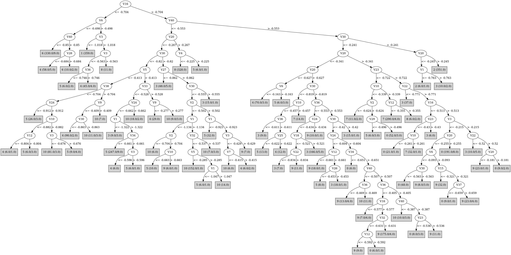

# J48

# SimpleCart Decision Tree

V30 < -0.24

* V3 < -0.9444999999999999

*   * V6 < -0.5005

*   *   * V40 < -0.8494999999999999

*   *   *   * V12 < -1.0025: 6(6.0/4.0)

*   *   *   * V12 >= -1.0025: 6(305.0/3.0)

*   *   * V40 >= -0.8494999999999999: 4(16.0/8.0)

*   * V6 >= -0.5005: 1(361.0/4.0)

* V3 >= -0.9444999999999999

*   * V30 < -1.0514999999999999

*   *   * V3 < -0.624

*   *   *   * V24 < -0.979: 5(14.0/0.0)

*   *   *   * V24 >= -0.979: 4(27.0/9.0)

*   *   * V3 >= -0.624: 8(329.0/0.0)

*   * V30 >= -1.0514999999999999

*   *   * V40 < -0.5605

*   *   *   * V5 < -0.3415

*   *   *   *   * V30 < -0.8725

*   *   *   *   *   * V38 < -0.704

*   *   *   *   *   *   * V5 < -0.455

*   *   *   *   *   *   *   * V10 < -0.8745: 4(15.0/14.0)

*   *   *   *   *   *   *   * V10 >= -0.8745: 10(52.0/5.0)

*   *   *   *   *   *   * V5 >= -0.455: 5(51.0/5.0)

*   *   *   *   *   * V38 >= -0.704: 4(145.0/16.0)

*   *   *   *   * V30 >= -0.8725

*   *   *   *   *   * V20 < -0.782: 4(9.0/2.0)

*   *   *   *   *   * V20 >= -0.782

*   *   *   *   *   *   * V24 < -0.7525: 3(6.0/8.0)

*   *   *   *   *   *   * V24 >= -0.7525: 10(183.0/9.0)

*   *   *   * V5 >= -0.3415

*   *   *   *   * V10 < -0.619

*   *   *   *   *   * V3 < -0.6815: 3(33.0/2.0)

*   *   *   *   *   * V3 >= -0.6815

*   *   *   *   *   *   * V23 < -0.597

*   *   *   *   *   *   *   * V33 < -0.527: 5(247.0/11.0)

*   *   *   *   *   *   *   * V33 >= -0.527: 4(8.0/4.0)

*   *   *   *   *   *   * V23 >= -0.597: 3(10.0/0.0)

*   *   *   *   * V10 >= -0.619

*   *   *   *   *   * V20 < -0.126

*   *   *   *   *   *   * V36 < -0.5605: 9(9.0/20.0)

*   *   *   *   *   *   * V36 >= -0.5605: 10(46.0/8.0)

*   *   *   *   *   * V20 >= -0.126: 8(12.0/0.0)

*   *   * V40 >= -0.5605

*   *   *   * V10 < -0.3165

*   *   *   *   * V20 < -0.3405

*   *   *   *   *   * V36 < -0.5694999999999999

*   *   *   *   *   *   * V10 < -0.5075000000000001: 3(166.0/6.0)

*   *   *   *   *   *   * V10 >= -0.5075000000000001: 9(9.0/6.0)

*   *   *   *   *   * V36 >= -0.5694999999999999

*   *   *   *   *   *   * V30 < -0.812

*   *   *   *   *   *   *   * V3 < -0.5285: 4(77.0/3.0)

*   *   *   *   *   *   *   * V3 >= -0.5285: 5(13.0/8.0)

*   *   *   *   *   *   * V30 >= -0.812

*   *   *   *   *   *   *   * V27 < -0.8634999999999999: 3(24.0/1.0)

*   *   *   *   *   *   *   * V27 >= -0.8634999999999999

*   *   *   *   *   *   *   *   * V30 < -0.42

*   *   *   *   *   *   *   *   *   * V36 < -0.405

*   *   *   *   *   *   *   *   *   *   * V33 < -0.4575: 5(7.0/3.0)

*   *   *   *   *   *   *   *   *   *   * V33 >= -0.4575

*   *   *   *   *   *   *   *   *   *   *   * V39 < -0.446

*   *   *   *   *   *   *   *   *   *   *   *   * V36 < -0.52: 9(25.0/5.0)

*   *   *   *   *   *   *   *   *   *   *   *   * V36 >= -0.52: 0(7.0/13.0)

*   *   *   *   *   *   *   *   *   *   *   * V39 >= -0.446

*   *   *   *   *   *   *   *   *   *   *   *   * V30 < -0.535: 9(162.0/7.0)

*   *   *   *   *   *   *   *   *   *   *   *   * V30 >= -0.535: 9(13.0/7.0)

*   *   *   *   *   *   *   *   *   * V36 >= -0.405

*   *   *   *   *   *   *   *   *   *   * V40 < -0.41300000000000003: 10(18.0/2.0)

*   *   *   *   *   *   *   *   *   *   * V40 >= -0.41300000000000003: 9(9.0/6.0)

*   *   *   *   *   *   *   *   * V30 >= -0.42: 3(16.0/0.0)

*   *   *   *   * V20 >= -0.3405

*   *   *   *   *   * V24 < -0.6275: 3(24.0/4.0)

*   *   *   *   *   * V24 >= -0.6275

*   *   *   *   *   *   * V2 < -0.6165: 7(17.0/4.0)

*   *   *   *   *   *   * V2 >= -0.6165

*   *   *   *   *   *   *   * V30 < -0.5765: 0(248.0/24.0)

*   *   *   *   *   *   *   * V30 >= -0.5765

*   *   *   *   *   *   *   *   * V36 < -0.3795: 9(25.0/15.0)

*   *   *   *   *   *   *   *   * V36 >= -0.3795: 0(23.0/0.0)

*   *   *   * V10 >= -0.3165

*   *   *   *   * V34 < -0.5405: 7(323.0/19.0)

*   *   *   *   * V34 >= -0.5405

*   *   *   *   *   * V36 < -0.415: 9(49.0/10.0)

*   *   *   *   *   * V36 >= -0.415

*   *   *   *   *   *   * V18 < -0.268: 9(19.0/11.0)

*   *   *   *   *   *   * V18 >= -0.268: 0(36.0/3.0)

V30 >= -0.24

* V20 < -0.245: 3(9.0/7.0)

* V20 >= -0.245: 2(351.0/0.0)

# PART

Decision list:

conditions|predicted class
---|---
V3 <= -0.91 AND V6 > -0.499 AND V36 <= -0.752| 1 (314.0)
V20 > -0.341 AND V33 <= -0.463 AND V24 > -0.506| 8 (301.0)
V40 <= -0.553 AND V9 <= -0.658 AND V40 <= -0.85| 6 (288.0/6.0)
V20 > -0.341 AND V30 > -0.287| 2 (315.0/3.0)
V40 <= -0.553 AND V20 <= -0.735 AND V38 > -0.774 AND V30 <= -0.886 AND V3 <= -0.723 AND V28 <= -0.667 AND V40 > -0.787| 4 (94.0)
V40 <= -0.553 AND V30 <= -0.82 AND V20 <= -0.878 AND V27 <= -0.902| 4 (28.0/2.0)
V40 <= -0.553 AND V33 > -0.53 AND V25 > -0.571 AND V36 > -0.561| 10 (86.0/9.0)
V33 <= -0.458 AND V23 > -0.762 AND V36 <= -0.581| 3 (147.0/15.0)
V38 <= -0.561 AND V33 <= -0.53 AND V9 > -0.567 AND V5 > -0.342 AND V10 <= -0.616| 5 (217.0/14.0)
V38 <= -0.562 AND V33 <= -0.534 AND V3 > -0.874 AND V24 > -0.776 AND V30 > -0.951| 10 (170.0/11.0)
V9 <= -0.31 AND V33 > -0.61| 4 (160.0/29.0)
V39 <= -0.556 AND V20 > -0.879 AND V5 <= -0.514 AND V38 <= -0.742| 10 (30.0)
V33 <= -0.458 AND V9 <= -0.567 AND V5 <= -0.667| 6 (10.0)
V25 <= -0.589 AND V3 > -0.81| 5 (124.0/34.0)
V20 > -0.341 AND V23 <= -0.715 AND V10 > -0.339| 7 (267.0/9.0)
V30 > -0.818 AND V27 > -0.797 AND V20 > -0.348 AND V16 > -0.513 AND V3 <= -0.214 AND V20 > -0.255| 0 (185.0/9.0)
V30 > -0.818 AND V27 <= -0.797| 3 (86.0/11.0)
V15 > -0.542 AND V34 > -0.639 AND V20 <= -0.351 AND V30 <= -0.53 AND V36 <= -0.406 AND V33 > -0.432 AND V23 > -0.791 AND V14 <= -0.55| 9 (126.0)
V29 > -0.517 AND V30 > -0.596 AND V27 > -0.633 AND V30 <= -0.401| 9 (105.0/18.0)
V15 > -0.529 AND V30 <= -0.569 AND V20 > -0.406 AND V2 > -0.652 AND V10 <= -0.246 AND V6 <= -0.09| 0 (78.0/3.0)
V19 > -0.601 AND V30 > -0.569| 3 (60.0/12.0)
V19 > -0.601 AND V20 > -0.405 AND V16 > -0.474| 9 (42.0/5.0)
V20 > -0.405 AND V4 <= -0.288| 7 (30.0)
V20 > -0.394 AND V10 <= -0.201| 0 (23.0/1.0)
V20 > -0.685 AND V19 <= -0.333| 9 (56.0/33.0)
V18 <= -0.488| 4 (18.0/5.0)
| 7 (9.0)

# JRip

Decision list:

conditions|predicted class
---|---
(V6 <= -0.69) and (V27 >= -1.075)|6 (274.0/0.0)
(V6 <= -0.558) and (V36 <= -0.724) and (V27 >= -0.931)|6 (46.0/0.0)
(V24 <= -0.596) and (V23 >= -0.695) and (V22 <= -0.776)|3 (170.0/0.0)
(V4 >= -0.303) and (V10 <= -0.494) and (V16 <= -0.521) and (V36 <= -0.576) and (V18 <= -0.39)|3 (76.0/0.0)
(V30 >= -0.522) and (V24 <= -0.367) and (V12 >= -0.444)|3 (32.0/0.0)
(V1 <= -1.299) and (V23 >= -0.932) and (V22 <= -0.98) and (V2 >= -0.73)|3 (22.0/0.0)
(V23 >= -0.784) and (V22 <= -0.91)|3 (12.0/0.0)
(V30 >= -0.564) and (V24 <= -0.49) and (V1 >= -1.059)|3 (13.0/0.0)
(V3 <= -0.546) and (V10 >= -0.72) and (V40 <= -0.647) and (V30 >= -0.86) and (V2 <= -0.602)|10 (138.0/0.0)
(V20 <= -0.407) and (V32 <= -0.562) and (V26 >= -0.434) and (V1 >= -0.991)|10 (53.0/0.0)
(V30 >= -0.943) and (V32 <= -0.813) and (V2 <= -0.787)|10 (48.0/0.0)
(V20 <= -0.362) and (V1 >= -1.075) and (V40 <= -0.552) and (V26 >= -0.476) and (V36 >= -0.516) and (V18 <= -0.404)|10 (23.0/0.0)
(V2 <= -0.674) and (V10 >= -0.85) and (V8 <= -0.659)|10 (16.0/0.0)
(V20 <= -0.332) and (V1 >= -1.12) and (V32 <= -0.747) and (V9 >= -0.503) and (V2 <= -0.665)|10 (20.0/0.0)
(V1 >= -0.985) and (V40 <= -0.473) and (V36 >= -0.461) and (V14 >= -0.49)|10 (14.0/0.0)
(V40 <= -0.578) and (V36 >= -0.559) and (V26 >= -0.384) and (V2 <= -0.516)|10 (9.0/0.0)
(V20 <= -0.601) and (V24 >= -0.788) and (V33 >= -0.608) and (V6 <= -0.248) and (V30 <= -0.797)|4 (171.0/0.0)
(V4 <= -0.6) and (V38 >= -0.786) and (V12 <= -0.854)|4 (63.0/0.0)
(V20 <= -0.438) and (V24 >= -0.769) and (V30 <= -0.848) and (V33 >= -0.525) and (V12 <= -0.623)|4 (28.0/0.0)
(V6 <= -0.462) and (V5 >= -0.637) and (V33 >= -0.745)|4 (21.0/0.0)
(V35 >= -0.564) and (V6 <= -0.199) and (V23 <= -0.781) and (V3 <= -0.664) and (V8 >= -0.585)|4 (19.0/0.0)
(V4 <= -0.647) and (V39 >= -0.767) and (V28 <= -0.799)|4 (11.0/0.0)
(V20 <= -0.439) and (V34 >= -0.567) and (V30 <= -0.763) and (V12 >= -0.626)|4 (15.0/0.0)
(V23 <= -1.064) and (V3 >= -0.591)|8 (315.0/0.0)
(V30 <= -1.174) and (V1 >= -1.207)|8 (24.0/0.0)
(V10 >= -0.318) and (V24 <= -0.374) and (V34 <= -0.582)|7 (294.0/0.0)
(V10 >= -0.369) and (V30 <= -0.725) and (V16 <= -0.507)|7 (31.0/0.0)
(V10 >= -0.191) and (V28 <= -0.345) and (V1 <= -1.015)|7 (15.0/0.0)
(V32 >= -0.66) and (V12 <= -0.579) and (V29 >= -0.541) and (V20 <= -0.347)|9 (153.0/0.0)
(V1 >= -0.996) and (V20 <= -0.255) and (V3 >= -0.398) and (V16 >= -0.472) and (V13 <= -0.079)|9 (64.0/0.0)
(V34 >= -0.531) and (V20 <= -0.256) and (V15 <= -0.337) and (V36 <= -0.401)|9 (39.0/0.0)
(V1 >= -0.805) and (V26 <= -0.113) and (V16 >= -0.39) and (V9 >= -0.054) and (V13 <= 0.11)|9 (24.0/0.0)
(V33 >= -0.502) and (V20 <= -0.263) and (V23 >= -0.637) and (V26 <= -0.222) and (V6 >= -0.103) and (V8 <= -0.192)|9 (26.0/0.0)
(V34 >= -0.449) and (V20 <= -0.277) and (V16 >= -0.439) and (V33 >= -0.213) and (V1 <= 0.081)|9 (10.0/0.0)
(V33 >= -0.502) and (V19 <= -0.344) and (V12 <= -0.666) and (V23 >= -0.817)|9 (15.0/0.0)
(V33 >= -0.462) and (V23 <= -0.345) and (V19 >= -0.353) and (V6 <= -0.046) and (V2 >= -0.486)|0 (159.0/0.0)
(V33 >= -0.462) and (V23 <= -0.345) and (V20 >= -0.339) and (V23 >= -0.702) and (V28 <= -0.397)|0 (73.0/0.0)
(V33 >= -0.462) and (V23 <= -0.345) and (V20 >= -0.338) and (V24 >= -0.346) and (V16 <= -0.333)|0 (43.0/0.0)
(V33 >= -0.462) and (V23 <= -0.345) and (V37 <= -0.761) and (V25 >= -0.524) and (V15 >= -0.391)|0 (45.0/0.0)
(V34 >= -0.399) and (V23 <= -0.103) and (V33 >= -0.177) and (V18 >= -0.292)|0 (14.0/0.0)
(V2 >= -0.516) and (V23 <= -0.543) and (V36 >= -0.49) and (V10 >= -0.47) and (V10 <= -0.377)|0 (12.0/0.0)
(V30 >= -0.278) and (V20 >= -0.244)|2 (352.0/0.0)
(V3 <= -1.029) and (V2 >= -0.917)|1 (360.0/0.0)
|5 (488.0/119.0)

# Decision Table

Non matches covered by Majority class

v23|v25|target
---|---|---
(-0.5965--0.344]|(-0.1105-inf)|0
(-0.2715--0.0935]|(-0.1105-inf)|2
(-0.0935-inf)|(-0.1105-inf)|2
(-0.344--0.2715]|(-0.1105-inf)|0
(-0.0935-inf)|(-0.2245--0.1105]|2
(-0.344--0.2715]|(-0.2245--0.1105]|9
(-0.703--0.5965]|(-0.2245--0.1105]|0
(-0.5965--0.344]|(-0.2245--0.1105]|0
(-0.2715--0.0935]|(-0.2245--0.1105]|2
(-0.8915--0.8195]|(-0.3405--0.2245]|0
(-0.2715--0.0935]|(-0.3405--0.2245]|2
(-0.344--0.2715]|(-0.3405--0.2245]|3
(-0.5965--0.344]|(-0.3405--0.2245]|9
(-0.703--0.5965]|(-0.3405--0.2245]|0
(-0.7885--0.703]|(-0.3405--0.2245]|7
(-0.8195--0.7885]|(-0.3405--0.2245]|0
(-1.1875--1.1125]|(-0.4075--0.3405]|0
(-0.9725--0.8915]|(-0.4075--0.3405]|7
(-1.1125--1.0665]|(-0.4075--0.3405]|8
(-1.0665--1.0085]|(-0.4075--0.3405]|8
(-0.5965--0.344]|(-0.4075--0.3405]|3
(-1.0085--0.9725]|(-0.4075--0.3405]|8
(-0.8195--0.7885]|(-0.4075--0.3405]|7
(-0.703--0.5965]|(-0.4075--0.3405]|0
(-0.8915--0.8195]|(-0.4075--0.3405]|7
(-0.7885--0.703]|(-0.4075--0.3405]|7
(-1.0085--0.9725]|(-0.4805--0.4075]|7
(-1.1125--1.0665]|(-0.4805--0.4075]|8
(-1.1875--1.1125]|(-0.4805--0.4075]|8
(-1.0665--1.0085]|(-0.4805--0.4075]|8
(-inf--1.1875]|(-0.4805--0.4075]|8
(-0.703--0.5965]|(-0.4805--0.4075]|9
(-0.5965--0.344]|(-0.4805--0.4075]|3
(-0.9725--0.8915]|(-0.4805--0.4075]|7
(-0.7885--0.703]|(-0.4805--0.4075]|7
(-0.8195--0.7885]|(-0.4805--0.4075]|7
(-0.8915--0.8195]|(-0.4805--0.4075]|7
(-1.1125--1.0665]|(-0.5455--0.4805]|8
(-1.1875--1.1125]|(-0.5455--0.4805]|8
(-inf--1.1875]|(-0.5455--0.4805]|8
(-0.7885--0.703]|(-0.5455--0.4805]|10
(-0.703--0.5965]|(-0.5455--0.4805]|3
(-0.5965--0.344]|(-0.5455--0.4805]|3
(-0.8195--0.7885]|(-0.5455--0.4805]|10
(-0.9725--0.8915]|(-0.5455--0.4805]|7
(-0.8915--0.8195]|(-0.5455--0.4805]|7
(-1.1875--1.1125]|(-0.5675--0.5455]|0
(-0.5965--0.344]|(-0.5675--0.5455]|3
(-0.9725--0.8915]|(-0.5675--0.5455]|4
(-inf--1.1875]|(-0.5675--0.5455]|8
(-0.7885--0.703]|(-0.5675--0.5455]|5
(-0.8195--0.7885]|(-0.5675--0.5455]|10
(-0.703--0.5965]|(-0.5675--0.5455]|3
(-0.8915--0.8195]|(-0.5675--0.5455]|10
(-1.0665--1.0085]|(-0.5945--0.5675]|0
(-inf--1.1875]|(-0.5945--0.5675]|8
(-1.0085--0.9725]|(-0.5945--0.5675]|6
(-0.8915--0.8195]|(-0.5945--0.5675]|10
(-0.9725--0.8915]|(-0.5945--0.5675]|4
(-0.7885--0.703]|(-0.5945--0.5675]|5
(-0.8195--0.7885]|(-0.5945--0.5675]|5
(-0.703--0.5965]|(-0.5945--0.5675]|3
(-1.1125--1.0665]|(-0.6855--0.5945]|6
(-1.0085--0.9725]|(-0.6855--0.5945]|4
(-1.0665--1.0085]|(-0.6855--0.5945]|6
(-0.7885--0.703]|(-0.6855--0.5945]|3
(-0.9725--0.8915]|(-0.6855--0.5945]|4
(-0.8915--0.8195]|(-0.6855--0.5945]|5
(-0.8195--0.7885]|(-0.6855--0.5945]|5
(-0.703--0.5965]|(-0.6855--0.5945]|3
(-0.7885--0.703]|(-0.7375--0.6855]|3
(-0.8195--0.7885]|(-0.7375--0.6855]|1
(-1.0085--0.9725]|(-0.7375--0.6855]|4
(-1.1125--1.0665]|(-0.7375--0.6855]|6
(-1.0665--1.0085]|(-0.7375--0.6855]|4
(-1.1875--1.1125]|(-0.7375--0.6855]|6
(-0.9725--0.8915]|(-0.7375--0.6855]|5
(-0.8915--0.8195]|(-0.7375--0.6855]|5
(-inf--1.1875]|(-0.8365--0.7375]|6
(-0.8195--0.7885]|(-0.8365--0.7375]|1
(-1.0085--0.9725]|(-0.8365--0.7375]|5
(-1.1125--1.0665]|(-0.8365--0.7375]|6
(-1.1875--1.1125]|(-0.8365--0.7375]|6
(-0.8915--0.8195]|(-0.8365--0.7375]|1
(-1.0665--1.0085]|(-0.8365--0.7375]|4
(-0.9725--0.8915]|(-0.8365--0.7375]|5
(-1.1125--1.0665]|(-0.9005--0.8365]|4
(-1.1875--1.1125]|(-0.9005--0.8365]|6
(-inf--1.1875]|(-0.9005--0.8365]|6
(-1.0085--0.9725]|(-0.9005--0.8365]|5
(-0.9725--0.8915]|(-0.9005--0.8365]|1
(-1.0665--1.0085]|(-0.9005--0.8365]|5
(-inf--1.1875]|(-inf--0.9005]|6
(-0.9725--0.8915]|(-inf--0.9005]|1
(-1.1875--1.1125]|(-inf--0.9005]|1
(-1.0085--0.9725]|(-inf--0.9005]|1
(-1.0665--1.0085]|(-inf--0.9005]|1
(-1.1125--1.0665]|(-inf--0.9005]|1

