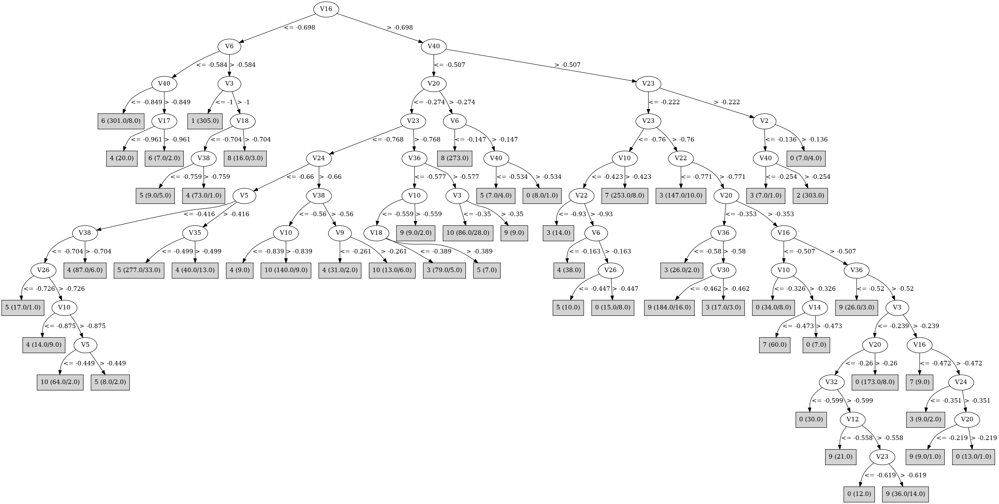

# J48

# SimpleCart Decision Tree

V23 < -0.185

* V3 < -0.9325000000000001

*   * V6 < -0.4965

*   *   * V40 < -0.8545: 6(326.0/7.0)

*   *   * V40 >= -0.8545: 4(20.0/7.0)

*   * V6 >= -0.4965: 1(349.0/6.0)

* V3 >= -0.9325000000000001

*   * V23 < -1.088

*   *   * V2 < -0.668: 4(9.0/10.0)

*   *   * V2 >= -0.668: 8(289.0/0.0)

*   * V23 >= -1.088

*   *   * V40 < -0.5385

*   *   *   * V26 < -0.4815

*   *   *   *   * V5 < -0.413

*   *   *   *   *   * V38 < -0.7024999999999999

*   *   *   *   *   *   * V10 < -0.8745

*   *   *   *   *   *   *   * V3 < -0.8145

*   *   *   *   *   *   *   *   * V22 < -0.8280000000000001: 4(21.0/2.0)

*   *   *   *   *   *   *   *   * V22 >= -0.8280000000000001: 6(9.0/0.0)

*   *   *   *   *   *   *   * V3 >= -0.8145: 5(12.0/0.0)

*   *   *   *   *   *   * V10 >= -0.8745

*   *   *   *   *   *   *   * V5 < -0.449: 10(70.0/7.0)

*   *   *   *   *   *   *   * V5 >= -0.449: 5(18.0/2.0)

*   *   *   *   *   * V38 >= -0.7024999999999999: 4(148.0/8.0)

*   *   *   *   * V5 >= -0.413

*   *   *   *   *   * V33 < -0.525

*   *   *   *   *   *   * V30 < -0.7795000000000001: 5(263.0/26.0)

*   *   *   *   *   *   * V30 >= -0.7795000000000001: 3(15.0/0.0)

*   *   *   *   *   * V33 >= -0.525: 4(24.0/2.0)

*   *   *   * V26 >= -0.4815

*   *   *   *   * V30 < -1.0615: 8(39.0/0.0)

*   *   *   *   * V30 >= -1.0615

*   *   *   *   *   * V23 < -0.6585000000000001

*   *   *   *   *   *   * V10 < -0.8214999999999999: 4(21.0/7.0)

*   *   *   *   *   *   * V10 >= -0.8214999999999999

*   *   *   *   *   *   *   * V5 < -0.288

*   *   *   *   *   *   *   *   * V40 < -0.5874999999999999: 10(186.0/8.0)

*   *   *   *   *   *   *   *   * V40 >= -0.5874999999999999

*   *   *   *   *   *   *   *   *   * V30 < -0.8075000000000001: 4(9.0/1.0)

*   *   *   *   *   *   *   *   *   * V30 >= -0.8075000000000001: 10(9.0/7.0)

*   *   *   *   *   *   *   * V5 >= -0.288

*   *   *   *   *   *   *   *   * V10 < -0.582: 5(32.0/7.0)

*   *   *   *   *   *   *   *   * V10 >= -0.582

*   *   *   *   *   *   *   *   *   * V28 < -0.388

*   *   *   *   *   *   *   *   *   *   * V14 < -0.587: 9(4.0/5.0)

*   *   *   *   *   *   *   *   *   *   * V14 >= -0.587: 10(28.0/2.0)

*   *   *   *   *   *   *   *   *   * V28 >= -0.388: 9(13.0/1.0)

*   *   *   *   *   * V23 >= -0.6585000000000001

*   *   *   *   *   *   * V17 < -0.642: 3(38.0/0.0)

*   *   *   *   *   *   * V17 >= -0.642: 10(6.0/5.0)

*   *   * V40 >= -0.5385

*   *   *   * V10 < -0.3075

*   *   *   *   * V20 < -0.3405

*   *   *   *   *   * V36 < -0.569

*   *   *   *   *   *   * V16 < -0.4975: 3(154.0/4.0)

*   *   *   *   *   *   * V16 >= -0.4975: 3(7.0/7.0)

*   *   *   *   *   * V36 >= -0.569

*   *   *   *   *   *   * V23 < -0.779

*   *   *   *   *   *   *   * V3 < -0.5365: 4(67.0/3.0)

*   *   *   *   *   *   *   * V3 >= -0.5365

*   *   *   *   *   *   *   *   * V25 < -0.577: 5(15.0/1.0)

*   *   *   *   *   *   *   *   * V25 >= -0.577: 7(6.0/11.0)

*   *   *   *   *   *   * V23 >= -0.779

*   *   *   *   *   *   *   * V27 < -0.829: 3(25.0/1.0)

*   *   *   *   *   *   *   * V27 >= -0.829

*   *   *   *   *   *   *   *   * V30 < -0.416: 9(203.0/40.0)

*   *   *   *   *   *   *   *   * V30 >= -0.416: 3(20.0/0.0)

*   *   *   *   * V20 >= -0.3405

*   *   *   *   *   * V24 < -0.596

*   *   *   *   *   *   * V23 < -0.762: 7(4.0/4.0)

*   *   *   *   *   *   * V23 >= -0.762: 3(31.0/1.0)

*   *   *   *   *   * V24 >= -0.596

*   *   *   *   *   *   * V30 < -0.579

*   *   *   *   *   *   *   * V23 < -0.782: 7(12.0/3.0)

*   *   *   *   *   *   *   * V23 >= -0.782: 0(243.0/26.0)

*   *   *   *   *   *   * V30 >= -0.579

*   *   *   *   *   *   *   * V36 < -0.4275: 9(22.0/9.0)

*   *   *   *   *   *   *   * V36 >= -0.4275: 0(28.0/5.0)

*   *   *   * V10 >= -0.3075

*   *   *   *   * V34 < -0.5375000000000001

*   *   *   *   *   * V23 < -0.61

*   *   *   *   *   *   * V16 < -0.4505: 7(332.0/3.0)

*   *   *   *   *   *   * V16 >= -0.4505: 0(4.0/5.0)

*   *   *   *   *   * V23 >= -0.61: 3(7.0/1.0)

*   *   *   *   * V34 >= -0.5375000000000001

*   *   *   *   *   * V18 < -0.2945: 9(43.0/6.0)

*   *   *   *   *   * V18 >= -0.2945

*   *   *   *   *   *   * V40 < -0.3585: 9(14.0/0.0)

*   *   *   *   *   *   * V40 >= -0.3585: 0(39.0/12.0)

V23 >= -0.185: 2(346.0/8.0)

# PART

Decision list:

conditions|predicted class
---|---
V16 <= -0.698 AND V6 <= -0.584 AND V40 <= -0.846| 6 (287.0/6.0)
V40 > -0.541 AND V23 > -0.187| 2 (297.0/7.0)
V40 > -0.546 AND V23 <= -0.761 AND V10 > -0.424 AND V12 <= -0.357 AND V19 > -0.461 AND V1 <= -0.97 AND V1 > -1.331 AND V10 > -0.371| 7 (228.0)
V23 > -0.786 AND V24 <= -0.595 AND V12 > -0.677 AND V40 > -0.607| 3 (199.0/14.0)
V23 > -0.772 AND V33 <= -0.459 AND V36 <= -0.618 AND V3 > -1.044 AND V16 <= -0.5| 3 (44.0/2.0)
V23 > -0.772 AND V40 <= -0.535 AND V33 > -0.529 AND V36 > -0.53| 10 (43.0/2.0)
V23 > -0.771 AND V33 <= -0.503 AND V5 > -0.299 AND V1 > -1.176| 5 (12.0)
V23 > -0.771 AND V20 <= -0.347 AND V5 > -0.38 AND V30 <= -0.462| 9 (231.0/25.0)
V20 > -0.358 AND V23 <= -0.944| 8 (273.0)
V3 <= -1.02| 1 (292.0/2.0)
V25 <= -0.461 AND V5 > -0.346 AND V1 <= -1.06 AND V1 > -1.313 AND V10 <= -0.58| 5 (228.0/19.0)
V20 > -0.375 AND V16 <= -0.509 AND V23 > -0.579 AND V1 <= -0.885| 3 (5.0)
V20 > -0.375 AND V16 <= -0.509 AND V10 <= -0.267| 0 (49.0/17.0)
V20 > -0.36 AND V16 > -0.509 AND V10 <= -0.206 AND V22 > -0.794 AND V20 > -0.295 AND V23 <= -0.375| 0 (218.0/13.0)
V20 <= -0.422 AND V30 > -0.865 AND V28 <= -0.474 AND V27 > -0.97 AND V38 <= -0.527| 10 (167.0/13.0)
V30 <= -0.809 AND V32 > -0.848 AND V1 > -1.308 AND V20 <= -0.527 AND V6 > -0.676 AND V39 > -0.701| 4 (222.0/7.0)
V38 <= -0.565 AND V10 <= -0.912 AND V3 <= -0.817| 4 (33.0/6.0)
V40 <= -0.63 AND V24 <= -0.787 AND V32 <= -0.846 AND V5 > -0.519| 5 (71.0/4.0)
V38 <= -0.565 AND V1 > -1.305 AND V35 <= -0.466 AND V16 > -0.73 AND V6 > -0.54 AND V10 > -0.837| 10 (58.0)
V6 <= -0.27 AND V34 > -0.855| 4 (13.0/1.0)
V28 <= -0.651 AND V2 <= -0.767 AND V2 <= -0.923| 10 (10.0)
V20 <= -0.36 AND V7 > -0.736 AND V27 <= -0.411 AND V10 <= -0.43| 3 (43.0/6.0)
V16 <= -0.512 AND V18 > -0.491 AND V1 <= -1.008| 7 (47.0)
V37 <= -0.739 AND V22 > -0.788| 0 (21.0)
V37 <= -0.821 AND V2 > -0.767| 4 (3.0)
V20 <= -0.14 AND V4 > -0.369 AND V12 <= -0.018 AND V16 > -0.454 AND V22 > -0.701 AND V20 <= -0.165 AND V25 > -0.46| 9 (50.0/1.0)
V23 > -0.426 AND V1 <= -0.612| 3 (12.0/3.0)
V12 <= -0.539 AND V1 > -1.234| 9 (10.0)
V27 > -0.593 AND V13 > -0.248| 0 (21.0/6.0)
V10 > -0.253| 7 (13.0)
V1 > -1.206| 9 (6.0/2.0)
| 5 (3.0/1.0)

# JRip

Decision list:

conditions|predicted class
---|---
(V23 <= -1.104) and (V2 >= -0.667)|8 (280.0/0.0)
(V12 >= -0.339) and (V23 <= -0.962)|8 (46.0/0.0)
(V29 >= -0.616) and (V2 <= -0.585) and (V10 >= -0.713) and (V40 <= -0.65) and (V5 <= -0.274)|10 (152.0/0.0)
(V40 <= -0.532) and (V24 >= -0.593) and (V36 >= -0.503) and (V30 >= -0.801) and (V10 >= -0.679)|10 (48.0/0.0)
(V40 <= -0.594) and (V10 >= -0.827) and (V8 <= -0.595) and (V30 >= -0.94) and (V1 <= -0.931)|10 (54.0/0.0)
(V40 <= -0.578) and (V24 >= -0.6) and (V2 <= -0.468) and (V16 >= -0.592) and (V1 >= -1.075)|10 (32.0/0.0)
(V32 <= -0.933) and (V30 >= -1.04) and (V2 <= -0.853) and (V2 >= -0.994)|10 (21.0/0.0)
(V1 >= -1.151) and (V32 <= -0.778) and (V9 >= -0.523) and (V2 <= -0.674)|10 (11.0/0.0)
(V1 >= -1.032) and (V32 <= -0.59) and (V10 >= -0.66) and (V7 <= -0.543) and (V12 >= -0.638)|10 (8.0/0.0)
(V16 >= -0.423) and (V18 <= -0.412) and (V14 >= -0.484)|10 (5.0/0.0)
(V2 <= -0.665) and (V15 >= -0.504) and (V3 <= -0.564) and (V1 >= -1.195) and (V9 >= -0.383)|10 (4.0/0.0)
(V6 <= -0.584) and (V40 <= -0.885) and (V27 >= -0.953)|6 (264.0/0.0)
(V6 <= -0.687) and (V27 >= -1.075)|6 (71.0/0.0)
(V6 <= -0.574) and (V22 >= -0.763) and (V3 <= -0.875)|6 (8.0/0.0)
(V24 <= -0.591) and (V22 <= -0.822) and (V23 >= -0.731)|3 (159.0/0.0)
(V2 >= -0.423) and (V17 <= -0.636) and (V16 <= -0.494) and (V30 >= -0.608)|3 (62.0/0.0)
(V23 >= -0.821) and (V36 <= -0.58) and (V40 >= -0.6) and (V22 <= -0.687) and (V16 <= -0.53)|3 (66.0/0.0)
(V23 >= -0.558) and (V24 <= -0.455) and (V1 >= -1.112)|3 (24.0/0.0)
(V5 >= -0.039) and (V10 <= -0.402) and (V17 <= -0.542)|3 (9.0/0.0)
(V1 <= -1.269) and (V23 >= -0.916) and (V27 <= -0.997)|3 (13.0/0.0)
(V2 >= -0.208) and (V32 <= -0.329) and (V23 >= -0.378)|3 (6.0/0.0)
(V27 <= -0.812) and (V23 >= -0.811) and (V22 <= -0.914) and (V1 <= -1.223)|3 (5.0/0.0)
(V23 >= -0.763) and (V20 <= -0.297) and (V32 >= -0.609) and (V12 <= -0.536) and (V33 <= -0.158)|9 (166.0/0.0)
(V1 >= -0.93) and (V20 <= -0.255) and (V10 >= -0.398) and (V18 <= -0.345) and (V25 >= -0.507)|9 (49.0/0.0)
(V34 >= -0.495) and (V26 <= -0.113) and (V6 >= -0.011) and (V36 <= -0.464)|9 (27.0/0.0)
(V23 >= -0.771) and (V20 <= -0.355) and (V10 >= -0.607) and (V15 <= -0.394) and (V10 <= -0.345)|9 (36.0/0.0)
(V1 >= -1.003) and (V16 >= -0.467) and (V38 >= -0.4) and (V20 <= -0.295) and (V23 <= -0.284)|9 (23.0/0.0)
(V30 >= -0.698) and (V20 <= -0.213) and (V16 >= -0.405) and (V26 <= -0.113) and (V9 >= -0.142)|9 (11.0/0.0)
(V30 >= -0.698) and (V19 <= -0.344) and (V26 <= -0.258) and (V37 >= -0.765) and (V8 <= -0.304)|9 (12.0/0.0)
(V7 >= -0.202) and (V17 <= -0.51) and (V1 >= -0.686)|9 (5.0/0.0)
(V30 >= -0.805) and (V19 <= -0.344) and (V12 <= -0.652) and (V4 >= -0.384)|9 (7.0/0.0)
(V23 >= -0.616) and (V19 <= -0.344) and (V26 <= -0.195) and (V2 >= -0.451)|9 (7.0/0.0)
(V3 <= -1.022) and (V2 >= -0.917)|1 (349.0/0.0)
(V23 >= -0.769) and (V23 <= -0.222) and (V10 <= -0.295) and (V10 >= -0.552) and (V19 >= -0.334) and (V16 >= -0.521)|0 (181.0/0.0)
(V23 <= -0.203) and (V23 >= -0.678) and (V22 >= -0.542) and (V36 >= -0.478)|0 (54.0/0.0)
(V23 >= -0.782) and (V40 <= -0.273) and (V10 >= -0.576) and (V10 <= -0.327) and (V13 >= -0.332) and (V37 <= -0.643)|0 (81.0/0.0)
(V2 >= -0.406) and (V40 <= -0.198) and (V36 >= -0.429) and (V4 >= -0.202)|0 (14.0/0.0)
(V26 >= -0.321) and (V39 <= -0.448) and (V22 <= -0.707)|0 (7.0/0.0)
(V2 >= -0.469) and (V18 <= -0.309) and (V19 >= -0.308) and (V3 <= -0.317)|0 (5.0/0.0)
(V30 >= -0.278) and (V14 <= -0.424)|2 (312.0/0.0)
(V23 >= -0.132) and (V1 <= -0.219)|2 (39.0/0.0)
(V6 <= -0.235) and (V35 >= -0.604) and (V3 <= -0.621)|4 (238.0/0.0)
(V6 <= -0.426) and (V1 <= -1.224) and (V22 >= -1.09)|4 (40.0/0.0)
(V6 <= -0.167) and (V1 >= -1.152) and (V23 <= -0.882) and (V23 >= -1.008)|4 (31.0/0.0)
(V6 <= -0.167) and (V34 >= -0.613) and (V18 <= -0.405)|4 (18.0/0.0)
(V3 <= -0.854) and (V32 >= -0.87) and (V12 <= -0.767)|4 (15.0/0.0)
(V3 <= -0.522) and (V33 >= -0.524) and (V36 >= -0.541) and (V23 <= -0.839)|4 (10.0/0.0)
(V10 >= -0.425) and (V24 <= -0.372) and (V23 <= -0.627)|7 (366.0/0.0)
|5 (399.0/29.0)

# Decision Table

Non matches covered by Majority class

v23|v25|target
---|---|---
(-0.6265--0.4965]|(-0.093-inf)|0
(-0.185-inf)|(-0.093-inf)|2
(-0.4965--0.185]|(-0.093-inf)|0
(-0.6975--0.6265]|(-0.2235--0.093]|0
(-0.185-inf)|(-0.2235--0.093]|2
(-0.6265--0.4965]|(-0.2235--0.093]|0
(-0.4965--0.185]|(-0.2235--0.093]|9
(-0.185-inf)|(-0.3445--0.2235]|0
(-0.8195--0.7675]|(-0.3445--0.2235]|7
(-0.8605--0.8195]|(-0.3445--0.2235]|7
(-0.7675--0.6975]|(-0.3445--0.2235]|7
(-0.6975--0.6265]|(-0.3445--0.2235]|0
(-0.6265--0.4965]|(-0.3445--0.2235]|9
(-0.4965--0.185]|(-0.3445--0.2235]|3
(-1.2025--1.1125]|(-0.4095--0.3445]|0
(-0.8605--0.8195]|(-0.4095--0.3445]|7
(-0.9385--0.8605]|(-0.4095--0.3445]|7
(-0.4965--0.185]|(-0.4095--0.3445]|3
(-0.7675--0.6975]|(-0.4095--0.3445]|7
(-0.8195--0.7675]|(-0.4095--0.3445]|7
(-0.6265--0.4965]|(-0.4095--0.3445]|9
(-0.6975--0.6265]|(-0.4095--0.3445]|0
(-1.1125--1.0625]|(-0.4095--0.3445]|8
(-0.9965--0.9385]|(-0.4095--0.3445]|8
(-1.0625--0.9965]|(-0.4095--0.3445]|8
(-0.9385--0.8605]|(-0.4735--0.4095]|7
(-0.9965--0.9385]|(-0.4735--0.4095]|7
(-0.8605--0.8195]|(-0.4735--0.4095]|7
(-0.4965--0.185]|(-0.4735--0.4095]|3
(-0.8195--0.7675]|(-0.4735--0.4095]|7
(-0.6265--0.4965]|(-0.4735--0.4095]|3
(-0.7675--0.6975]|(-0.4735--0.4095]|0
(-1.236--1.2025]|(-0.4735--0.4095]|8
(-1.1125--1.0625]|(-0.4735--0.4095]|8
(-inf--1.236]|(-0.4735--0.4095]|8
(-1.2025--1.1125]|(-0.4735--0.4095]|8
(-1.0625--0.9965]|(-0.4735--0.4095]|8
(-0.6975--0.6265]|(-0.4735--0.4095]|9
(-1.0625--0.9965]|(-0.5165--0.4735]|0
(-0.9965--0.9385]|(-0.5165--0.4735]|7
(-0.9385--0.8605]|(-0.5165--0.4735]|7
(-0.8605--0.8195]|(-0.5165--0.4735]|7
(-0.6265--0.4965]|(-0.5165--0.4735]|3
(-0.8195--0.7675]|(-0.5165--0.4735]|10
(-0.6975--0.6265]|(-0.5165--0.4735]|3
(-1.1125--1.0625]|(-0.5165--0.4735]|8
(-1.236--1.2025]|(-0.5165--0.4735]|8
(-1.2025--1.1125]|(-0.5165--0.4735]|8
(-inf--1.236]|(-0.5165--0.4735]|8
(-0.7675--0.6975]|(-0.5165--0.4735]|9
(-0.9965--0.9385]|(-0.5805--0.5165]|7
(-0.9385--0.8605]|(-0.5805--0.5165]|10
(-0.6265--0.4965]|(-0.5805--0.5165]|3
(-0.6975--0.6265]|(-0.5805--0.5165]|3
(-1.236--1.2025]|(-0.5805--0.5165]|8
(-inf--1.236]|(-0.5805--0.5165]|8
(-1.2025--1.1125]|(-0.5805--0.5165]|8
(-0.7675--0.6975]|(-0.5805--0.5165]|3
(-0.8195--0.7675]|(-0.5805--0.5165]|10
(-0.8605--0.8195]|(-0.5805--0.5165]|10
(-1.1125--1.0625]|(-0.6275--0.5805]|0
(-inf--1.236]|(-0.6275--0.5805]|0
(-1.0625--0.9965]|(-0.6275--0.5805]|6
(-0.9965--0.9385]|(-0.6275--0.5805]|4
(-0.6975--0.6265]|(-0.6275--0.5805]|3
(-0.7675--0.6975]|(-0.6275--0.5805]|3
(-0.8605--0.8195]|(-0.6275--0.5805]|5
(-0.9385--0.8605]|(-0.6275--0.5805]|4
(-0.8195--0.7675]|(-0.6275--0.5805]|5
(-0.6975--0.6265]|(-0.6875--0.6275]|0
(-1.1125--1.0625]|(-0.6875--0.6275]|6
(-1.0625--0.9965]|(-0.6875--0.6275]|6
(-0.9965--0.9385]|(-0.6875--0.6275]|4
(-0.7675--0.6975]|(-0.6875--0.6275]|3
(-0.8195--0.7675]|(-0.6875--0.6275]|3
(-0.8605--0.8195]|(-0.6875--0.6275]|5
(-0.9385--0.8605]|(-0.6875--0.6275]|5
(-1.2025--1.1125]|(-0.7355--0.6875]|6
(-1.1125--1.0625]|(-0.7355--0.6875]|6
(-1.0625--0.9965]|(-0.7355--0.6875]|4
(-0.7675--0.6975]|(-0.7355--0.6875]|0
(-0.8195--0.7675]|(-0.7355--0.6875]|1
(-0.9965--0.9385]|(-0.7355--0.6875]|4
(-0.8605--0.8195]|(-0.7355--0.6875]|5
(-0.9385--0.8605]|(-0.7355--0.6875]|5
(-1.236--1.2025]|(-0.8295--0.7355]|6
(-1.2025--1.1125]|(-0.8295--0.7355]|6
(-1.1125--1.0625]|(-0.8295--0.7355]|6
(-0.8195--0.7675]|(-0.8295--0.7355]|3
(-0.8605--0.8195]|(-0.8295--0.7355]|1
(-1.0625--0.9965]|(-0.8295--0.7355]|4
(-0.9385--0.8605]|(-0.8295--0.7355]|1
(-0.9965--0.9385]|(-0.8295--0.7355]|5
(-1.236--1.2025]|(-0.9055--0.8295]|6
(-1.2025--1.1125]|(-0.9055--0.8295]|6
(-1.1125--1.0625]|(-0.9055--0.8295]|4
(-0.9385--0.8605]|(-0.9055--0.8295]|1
(-0.9965--0.9385]|(-0.9055--0.8295]|1
(-1.0625--0.9965]|(-0.9055--0.8295]|5
(-1.236--1.2025]|(-inf--0.9055]|6
(-1.2025--1.1125]|(-inf--0.9055]|1
(-0.9965--0.9385]|(-inf--0.9055]|1
(-1.0625--0.9965]|(-inf--0.9055]|1
(-1.1125--1.0625]|(-inf--0.9055]|1

