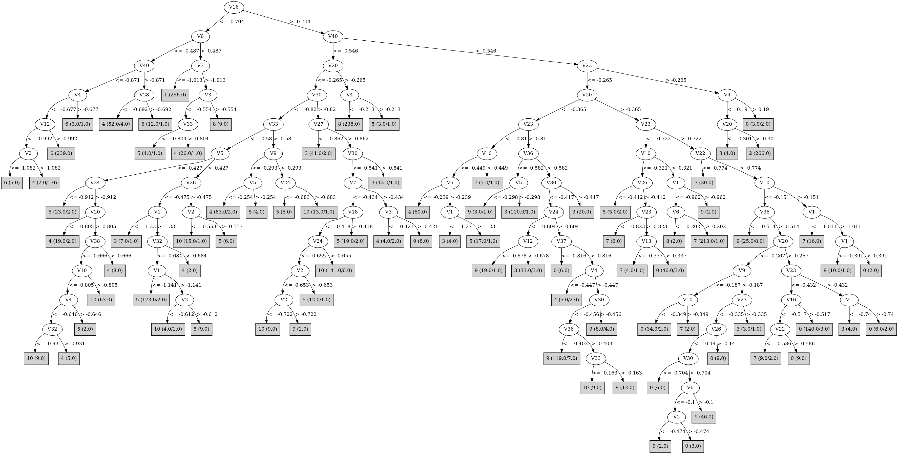

# J48

# SimpleCart Decision Tree

V23 < -0.2025

* V3 < -0.9444999999999999

*   * V6 < -0.5005

*   *   * V40 < -0.8494999999999999

*   *   *   * V12 < -0.9915

*   *   *   *   * V3 < -1.076: 6(11.0/0.0)

*   *   *   *   * V3 >= -1.076: 4(6.0/0.0)

*   *   *   * V12 >= -0.9915: 6(314.0/2.0)

*   *   * V40 >= -0.8494999999999999

*   *   *   * V12 < -0.859: 4(11.0/0.0)

*   *   *   * V12 >= -0.859: 6(5.0/1.0)

*   * V6 >= -0.5005

*   *   * V3 < -1.0065: 1(342.0/0.0)

*   *   * V3 >= -1.0065: 4(4.0/0.0)

* V3 >= -0.9444999999999999

*   * V30 < -1.0510000000000002

*   *   * V3 < -0.624

*   *   *   * V24 < -0.9795: 5(18.0/0.0)

*   *   *   * V24 >= -0.9795

*   *   *   *   * V27 < -0.862: 4(27.0/0.0)

*   *   *   *   * V27 >= -0.862: 6(8.0/0.0)

*   *   * V3 >= -0.624: 8(317.0/0.0)

*   * V30 >= -1.0510000000000002

*   *   * V40 < -0.5455000000000001

*   *   *   * V26 < -0.4815

*   *   *   *   * V6 < -0.2855

*   *   *   *   *   * V38 < -0.701

*   *   *   *   *   *   * V5 < -0.455

*   *   *   *   *   *   *   * V10 < -0.8745

*   *   *   *   *   *   *   *   * V22 < -0.8414999999999999

*   *   *   *   *   *   *   *   *   * V22 < -1.0234999999999999: 5(2.0/1.0)

*   *   *   *   *   *   *   *   *   * V22 >= -1.0234999999999999: 4(16.0/0.0)

*   *   *   *   *   *   *   *   * V22 >= -0.8414999999999999: 6(8.0/0.0)

*   *   *   *   *   *   *   * V10 >= -0.8745

*   *   *   *   *   *   *   *   * V24 < -0.9115

*   *   *   *   *   *   *   *   *   * V2 < -0.8885000000000001: 10(5.0/0.0)

*   *   *   *   *   *   *   *   *   * V2 >= -0.8885000000000001: 5(6.0/0.0)

*   *   *   *   *   *   *   *   * V24 >= -0.9115

*   *   *   *   *   *   *   *   *   * V1 < -1.3239999999999998: 4(2.0/1.0)

*   *   *   *   *   *   *   *   *   * V1 >= -1.3239999999999998: 10(63.0/1.0)

*   *   *   *   *   *   * V5 >= -0.455

*   *   *   *   *   *   *   * V1 < -1.2115: 5(28.0/0.0)

*   *   *   *   *   *   *   * V1 >= -1.2115: 10(5.0/0.0)

*   *   *   *   *   * V38 >= -0.701

*   *   *   *   *   *   * V27 < -0.7004999999999999: 4(130.0/4.0)

*   *   *   *   *   *   * V27 >= -0.7004999999999999: 6(3.0/0.0)

*   *   *   *   * V6 >= -0.2855

*   *   *   *   *   * V33 < -0.5275000000000001

*   *   *   *   *   *   * V30 < -0.782

*   *   *   *   *   *   *   * V1 < -1.326: 3(8.0/1.0)

*   *   *   *   *   *   *   * V1 >= -1.326

*   *   *   *   *   *   *   *   * V10 < -0.597

*   *   *   *   *   *   *   *   *   * V2 < -0.7715000000000001: 10(4.0/1.0)

*   *   *   *   *   *   *   *   *   * V2 >= -0.7715000000000001

*   *   *   *   *   *   *   *   *   *   * V1 < -1.0585

*   *   *   *   *   *   *   *   *   *   *   * V35 < -0.498: 5(243.0/6.0)

*   *   *   *   *   *   *   *   *   *   *   * V35 >= -0.498: 4(2.0/1.0)

*   *   *   *   *   *   *   *   *   *   * V1 >= -1.0585: 4(2.0/1.0)

*   *   *   *   *   *   *   *   * V10 >= -0.597: 10(5.0/1.0)

*   *   *   *   *   *   * V30 >= -0.782: 3(14.0/1.0)

*   *   *   *   *   * V33 >= -0.5275000000000001

*   *   *   *   *   *   * V9 < -0.2825: 4(17.0/0.0)

*   *   *   *   *   *   * V9 >= -0.2825: 3(3.0/1.0)

*   *   *   * V26 >= -0.4815

*   *   *   *   * V2 < -0.5415000000000001

*   *   *   *   *   * V30 < -0.8865000000000001

*   *   *   *   *   *   * V33 < -0.636

*   *   *   *   *   *   *   * V10 < -0.6915: 4(2.0/1.0)

*   *   *   *   *   *   *   * V10 >= -0.6915: 10(3.0/0.0)

*   *   *   *   *   *   * V33 >= -0.636: 4(21.0/0.0)

*   *   *   *   *   * V30 >= -0.8865000000000001

*   *   *   *   *   *   * V27 < -0.8925000000000001: 3(12.0/2.0)

*   *   *   *   *   *   * V27 >= -0.8925000000000001

*   *   *   *   *   *   *   * V20 < -0.7344999999999999: 4(5.0/2.0)

*   *   *   *   *   *   *   * V20 >= -0.7344999999999999

*   *   *   *   *   *   *   *   * V23 < -0.599

*   *   *   *   *   *   *   *   *   * V40 < -0.5754999999999999: 10(213.0/8.0)

*   *   *   *   *   *   *   *   *   * V40 >= -0.5754999999999999

*   *   *   *   *   *   *   *   *   *   * V1 < -1.013: 9(3.0/2.0)

*   *   *   *   *   *   *   *   *   *   * V1 >= -1.013: 10(3.0/0.0)

*   *   *   *   *   *   *   *   * V23 >= -0.599: 3(3.0/0.0)

*   *   *   *   * V2 >= -0.5415000000000001

*   *   *   *   *   * V16 < -0.567

*   *   *   *   *   *   * V33 < -0.48850000000000005: 3(28.0/0.0)

*   *   *   *   *   *   * V33 >= -0.48850000000000005: 4(2.0/1.0)

*   *   *   *   *   * V16 >= -0.567

*   *   *   *   *   *   * V32 < -0.6575: 5(34.0/2.0)

*   *   *   *   *   *   * V32 >= -0.6575

*   *   *   *   *   *   *   * V1 < -1.0379999999999998: 8(16.0/0.0)

*   *   *   *   *   *   *   * V1 >= -1.0379999999999998

*   *   *   *   *   *   *   *   * V3 < -0.385

*   *   *   *   *   *   *   *   *   * V30 < -0.755

*   *   *   *   *   *   *   *   *   *   * V3 < -0.5195000000000001: 4(5.0/0.0)

*   *   *   *   *   *   *   *   *   *   * V3 >= -0.5195000000000001: 10(5.0/1.0)

*   *   *   *   *   *   *   *   *   * V30 >= -0.755: 10(24.0/3.0)

*   *   *   *   *   *   *   *   * V3 >= -0.385: 9(11.0/1.0)

*   *   * V40 >= -0.5455000000000001

*   *   *   * V10 < -0.3075

*   *   *   *   * V20 < -0.3405

*   *   *   *   *   * V36 < -0.5754999999999999

*   *   *   *   *   *   * V22 < -0.643

*   *   *   *   *   *   *   * V23 < -0.9035: 5(2.0/1.0)

*   *   *   *   *   *   *   * V23 >= -0.9035: 3(162.0/3.0)

*   *   *   *   *   *   * V22 >= -0.643: 9(6.0/2.0)

*   *   *   *   *   * V36 >= -0.5754999999999999

*   *   *   *   *   *   * V30 < -0.8234999999999999

*   *   *   *   *   *   *   * V3 < -0.535: 4(72.0/1.0)

*   *   *   *   *   *   *   * V3 >= -0.535

*   *   *   *   *   *   *   *   * V26 < -0.5425: 5(13.0/0.0)

*   *   *   *   *   *   *   *   * V26 >= -0.5425

*   *   *   *   *   *   *   *   *   * V10 < -0.419: 4(6.0/0.0)

*   *   *   *   *   *   *   *   *   * V10 >= -0.419: 7(6.0/0.0)

*   *   *   *   *   *   * V30 >= -0.8234999999999999

*   *   *   *   *   *   *   * V30 < -0.42

*   *   *   *   *   *   *   *   * V27 < -0.8634999999999999: 3(28.0/1.0)

*   *   *   *   *   *   *   *   * V27 >= -0.8634999999999999

*   *   *   *   *   *   *   *   *   * V14 < -0.5894999999999999

*   *   *   *   *   *   *   *   *   *   * V32 < -0.6705000000000001

*   *   *   *   *   *   *   *   *   *   *   * V22 < -0.7965

*   *   *   *   *   *   *   *   *   *   *   *   * V6 < -0.134: 5(2.0/2.0)

*   *   *   *   *   *   *   *   *   *   *   *   * V6 >= -0.134: 9(3.0/0.0)

*   *   *   *   *   *   *   *   *   *   *   * V22 >= -0.7965: 0(5.0/0.0)

*   *   *   *   *   *   *   *   *   *   * V32 >= -0.6705000000000001: 9(135.0/4.0)

*   *   *   *   *   *   *   *   *   * V14 >= -0.5894999999999999

*   *   *   *   *   *   *   *   *   *   * V24 < -0.592

*   *   *   *   *   *   *   *   *   *   *   * V23 < -0.6525000000000001: 5(5.0/0.0)

*   *   *   *   *   *   *   *   *   *   *   * V23 >= -0.6525000000000001: 3(10.0/0.0)

*   *   *   *   *   *   *   *   *   *   * V24 >= -0.592

*   *   *   *   *   *   *   *   *   *   *   * V23 < -0.655

*   *   *   *   *   *   *   *   *   *   *   *   * V20 < -0.4105

*   *   *   *   *   *   *   *   *   *   *   *   *   * V3 < -0.633: 4(4.0/0.0)

*   *   *   *   *   *   *   *   *   *   *   *   *   * V3 >= -0.633: 10(13.0/2.0)

*   *   *   *   *   *   *   *   *   *   *   *   * V20 >= -0.4105

*   *   *   *   *   *   *   *   *   *   *   *   *   * V6 < -0.07450000000000001: 0(9.0/0.0)

*   *   *   *   *   *   *   *   *   *   *   *   *   * V6 >= -0.07450000000000001: 9(4.0/1.0)

*   *   *   *   *   *   *   *   *   *   *   * V23 >= -0.655

*   *   *   *   *   *   *   *   *   *   *   *   * V36 < -0.3275: 9(50.0/9.0)

*   *   *   *   *   *   *   *   *   *   *   *   * V36 >= -0.3275: 10(4.0/2.0)

*   *   *   *   *   *   *   * V30 >= -0.42: 3(28.0/0.0)

*   *   *   *   * V20 >= -0.3405

*   *   *   *   *   * V22 < -0.7735000000000001

*   *   *   *   *   *   * V23 < -0.7635000000000001: 7(2.0/3.0)

*   *   *   *   *   *   * V23 >= -0.7635000000000001: 3(30.0/0.0)

*   *   *   *   *   * V22 >= -0.7735000000000001

*   *   *   *   *   *   * V30 < -0.579

*   *   *   *   *   *   *   * V16 < -0.551: 7(12.0/2.0)

*   *   *   *   *   *   *   * V16 >= -0.551

*   *   *   *   *   *   *   *   * V14 < -0.6325000000000001: 9(6.0/0.0)

*   *   *   *   *   *   *   *   * V14 >= -0.6325000000000001

*   *   *   *   *   *   *   *   *   * V10 < -0.3265

*   *   *   *   *   *   *   *   *   *   * V33 < -0.449: 5(2.0/1.0)

*   *   *   *   *   *   *   *   *   *   * V33 >= -0.449: 0(234.0/17.0)

*   *   *   *   *   *   *   *   *   * V10 >= -0.3265

*   *   *   *   *   *   *   *   *   *   * V8 < -0.303: 7(5.0/0.0)

*   *   *   *   *   *   *   *   *   *   * V8 >= -0.303

*   *   *   *   *   *   *   *   *   *   *   * V20 < -0.28: 9(3.0/0.0)

*   *   *   *   *   *   *   *   *   *   *   * V20 >= -0.28: 0(8.0/0.0)

*   *   *   *   *   *   * V30 >= -0.579

*   *   *   *   *   *   *   * V36 < -0.3795

*   *   *   *   *   *   *   *   * V30 < -0.417

*   *   *   *   *   *   *   *   *   * V20 < -0.2525: 9(27.0/1.0)

*   *   *   *   *   *   *   *   *   * V20 >= -0.2525: 0(4.0/2.0)

*   *   *   *   *   *   *   *   * V30 >= -0.417: 3(7.0/2.0)

*   *   *   *   *   *   *   * V36 >= -0.3795: 0(21.0/1.0)

*   *   *   * V10 >= -0.3075

*   *   *   *   * V34 < -0.5375000000000001

*   *   *   *   *   * V24 < -0.6725000000000001: 3(8.0/1.0)

*   *   *   *   *   * V24 >= -0.6725000000000001

*   *   *   *   *   *   * V16 < -0.45: 7(307.0/1.0)

*   *   *   *   *   *   * V16 >= -0.45: 0(5.0/3.0)

*   *   *   *   * V34 >= -0.5375000000000001

*   *   *   *   *   * V20 < -0.2715

*   *   *   *   *   *   * V8 < 0.0225: 9(42.0/0.0)

*   *   *   *   *   *   * V8 >= 0.0225: 0(4.0/2.0)

*   *   *   *   *   * V20 >= -0.2715

*   *   *   *   *   *   * V10 < -0.0965

*   *   *   *   *   *   *   * V22 < -0.6345000000000001: 3(4.0/0.0)

*   *   *   *   *   *   *   * V22 >= -0.6345000000000001: 0(45.0/9.0)

*   *   *   *   *   *   * V10 >= -0.0965

*   *   *   *   *   *   *   * V20 < -0.134: 9(9.0/0.0)

*   *   *   *   *   *   *   * V20 >= -0.134: 0(1.0/2.0)

V23 >= -0.2025

* V20 < -0.2465: 3(5.0/1.0)

* V20 >= -0.2465: 2(350.0/1.0)

# PART

Decision list:

conditions|predicted class
---|---
V3 <= -0.833 AND V6 <= -0.584 AND V40 <= -0.845 AND V12 > -0.992| 6 (330.0/2.0)
V40 <= -0.546 AND V3 <= -1.022 AND V9 > -0.747| 1 (342.0)
V20 > -0.341 AND V33 <= -0.481 AND V24 > -0.506| 8 (334.0/1.0)
V20 > -0.354 AND V23 > -0.236 AND V2 <= -0.17| 2 (352.0)
V40 <= -0.546 AND V20 <= -0.777 AND V38 > -0.777 AND V3 <= -0.728 AND V6 > -0.681 AND V40 > -0.787| 4 (112.0/1.0)
V40 <= -0.546 AND V30 > -0.82 AND V27 > -0.862 AND V23 <= -0.584 AND V5 <= -0.23 AND V40 <= -0.576 AND V1 > -1.094| 10 (151.0/4.0)
V10 > -0.577 AND V27 <= -0.865 AND V30 > -0.831| 3 (66.0)
V10 > -0.577 AND V20 > -0.354 AND V23 <= -0.715 AND V10 > -0.321| 7 (287.0/3.0)
V30 <= -0.798 AND V33 > -0.528 AND V10 <= -0.449 AND V5 <= -0.24 AND V23 <= -0.848| 4 (134.0)
V33 <= -0.478 AND V23 > -0.762 AND V16 <= -0.492 AND V30 > -0.772| 3 (137.0)
V33 <= -0.478 AND V13 <= -0.795 AND V39 > -0.821 AND V22 <= -0.875| 4 (29.0)
V33 <= -0.478 AND V13 > -0.809 AND V5 > -0.423 AND V10 <= -0.612 AND V40 <= -0.578 AND V1 <= -1.136 AND V1 > -1.326| 5 (265.0/7.0)
V33 <= -0.478 AND V13 > -0.809 AND V40 <= -0.627 AND V24 <= -0.912 AND V5 > -0.507| 5 (34.0/3.0)
V39 <= -0.525 AND V13 > -0.809 AND V18 <= -0.385 AND V3 <= -0.523 AND V30 > -0.903 AND V40 <= -0.639 AND V36 > -0.676| 10 (105.0)
V9 <= -0.382 AND V13 > -0.809 AND V38 <= -0.753 AND V10 > -0.824| 10 (40.0)
V9 <= -0.382 AND V13 > -0.802 AND V39 > -0.721 AND V10 <= -0.704| 4 (53.0/4.0)
V33 > -0.455 AND V20 > -0.352 AND V22 <= -0.776 AND V37 > -0.709| 3 (16.0)
V33 > -0.455 AND V20 > -0.352 AND V16 > -0.512 AND V30 <= -0.579 AND V10 <= -0.199 AND V14 > -0.615 AND V16 <= -0.362 AND V18 > -0.357| 0 (178.0/3.0)
V33 > -0.455 AND V20 <= -0.365 AND V16 <= -0.616 AND V30 <= -0.692| 7 (11.0/2.0)
V33 > -0.455 AND V20 <= -0.365 AND V30 > -0.565 AND V27 <= -0.405 AND V12 > -0.509| 3 (57.0)
V33 > -0.455 AND V20 <= -0.365 AND V30 > -0.816 AND V22 <= -0.758 AND V12 > -0.694| 3 (27.0/2.0)
V33 > -0.455 AND V20 <= -0.365 AND V30 > -0.816 AND V36 <= -0.441 AND V12 <= -0.599| 9 (124.0)
V33 > -0.45 AND V13 <= -0.401 AND V30 <= -0.691 AND V32 > -0.577| 4 (11.0)
V33 > -0.45 AND V20 <= -0.411 AND V24 > -0.59 AND V37 > -0.738 AND V36 <= -0.468| 9 (30.0)
V33 > -0.45 AND V20 <= -0.411 AND V24 > -0.59 AND V40 > -0.447| 9 (26.0/2.0)
V33 > -0.45 AND V20 <= -0.411 AND V27 > -0.715| 10 (25.0/2.0)
V33 > -0.45 AND V16 <= -0.503 AND V23 <= -0.593 AND V10 > -0.366 AND V22 <= -0.556| 7 (32.0)
V33 > -0.45 AND V13 > -0.34 AND V37 <= -0.763| 0 (54.0/2.0)
V33 > -0.45 AND V32 > -0.644 AND V24 <= -0.511 AND V23 <= -0.59| 9 (15.0/2.0)
V24 > -0.512 AND V40 > -0.547 AND V23 <= -0.382 AND V2 > -0.562 AND V26 <= -0.078 AND V16 > -0.504 AND V30 > -0.664 AND V36 <= -0.386 AND V6 > -0.109| 9 (95.0/4.0)
V24 > -0.512 AND V40 > -0.514 AND V23 <= -0.388 AND V2 > -0.577 AND V19 > -0.401 AND V10 <= -0.172 AND V26 > -0.205| 0 (72.0/1.0)
V5 <= -0.426 AND V10 <= -0.901| 6 (24.0/2.0)
V10 <= -0.577 AND V8 > -0.565 AND V1 > -1.25 AND V6 > -0.23 AND V30 <= -0.55 AND V3 > -0.579| 5 (70.0/3.0)
V40 <= -0.55 AND V1 > -1.33 AND V40 <= -0.578 AND V10 > -0.713| 10 (24.0/3.0)
V33 <= -0.49 AND V6 > -0.438 AND V23 > -0.853| 3 (30.0/2.0)
V26 <= -0.491 AND V3 > -0.802 AND V1 > -1.3| 5 (9.0/1.0)
V5 > -0.369 AND V36 > -0.583 AND V30 <= -0.567 AND V12 > -0.627 AND V32 <= -0.474 AND V40 <= -0.254 AND V13 > -0.333| 0 (33.0)
V29 > -0.103 AND V36 > -0.285| 0 (10.0)
V14 > -0.825 AND V19 <= -0.223 AND V36 > -0.583 AND V23 > -0.608 AND V22 > -0.501| 9 (20.0/1.0)
V14 > -0.825 AND V23 > -0.499| 3 (24.0/3.0)
V36 <= -0.583 AND V3 <= -0.802| 10 (8.0)
V36 > -0.583 AND V19 <= -0.322 AND V1 > -1.173 AND V23 > -0.702| 9 (17.0/2.0)
V36 > -0.583 AND V18 > -0.511 AND V1 <= -1.001| 7 (16.0/3.0)
V36 <= -0.583| 3 (8.0)
V36 <= -0.463| 9 (7.0)
| 10 (6.0/2.0)

# JRip

Decision list:

conditions|predicted class
---|---
(V23 >= -0.77) and (V20 <= -0.263) and (V34 >= -0.595) and (V12 <= -0.568) and (V32 >= -0.587) and (V1 >= -1.176)|9 (108.0/0.0)
(V23 >= -0.763) and (V20 <= -0.263) and (V33 >= -0.393) and (V19 <= -0.415) and (V12 <= -0.628) and (V34 >= -0.635)|9 (40.0/0.0)
(V34 >= -0.506) and (V3 >= -0.412) and (V26 <= -0.133) and (V28 >= -0.385) and (V20 <= -0.277)|9 (55.0/0.0)
(V33 >= -0.487) and (V20 <= -0.255) and (V32 >= -0.502) and (V12 <= -0.468) and (V28 >= -0.439)|9 (28.0/0.0)
(V33 >= -0.487) and (V20 <= -0.263) and (V16 >= -0.504) and (V9 >= -0.2) and (V14 <= -0.541) and (V27 >= -0.72) and (V4 >= -0.268)|9 (18.0/0.0)
(V7 >= -0.364) and (V20 <= -0.191) and (V16 >= -0.402) and (V3 >= -0.284) and (V18 <= -0.255)|9 (18.0/0.0)
(V33 >= -0.487) and (V23 >= -0.809) and (V12 <= -0.696) and (V3 >= -0.649)|9 (23.0/0.0)
(V17 >= -0.51) and (V23 <= -0.962)|8 (297.0/0.0)
(V30 <= -1.134) and (V2 >= -0.667)|8 (30.0/0.0)
(V10 >= -0.333) and (V23 <= -0.672) and (V16 <= -0.487)|7 (283.0/0.0)
(V10 >= -0.425) and (V23 <= -0.768) and (V1 <= -1.175) and (V4 <= -0.27)|7 (24.0/0.0)
(V23 <= -0.623) and (V10 >= -0.169) and (V1 <= -1.023)|7 (20.0/0.0)
(V10 >= -0.425) and (V8 <= -0.361) and (V16 <= -0.52)|7 (11.0/2.0)
(V26 <= -0.759) and (V32 >= -0.869) and (V3 <= -1.032)|1 (261.0/0.0)
(V3 <= -1.035) and (V6 >= -0.486)|1 (80.0/0.0)
(V19 <= -0.628) and (V38 >= -0.643) and (V5 >= -0.657)|4 (128.0/0.0)
(V30 <= -0.845) and (V6 <= -0.184) and (V33 >= -0.539)|4 (80.0/0.0)
(V20 <= -0.655) and (V39 >= -0.721) and (V9 <= -0.555) and (V27 <= -0.859) and (V10 <= -0.805)|4 (70.0/0.0)
(V20 <= -0.616) and (V35 >= -0.567) and (V30 <= -0.894) and (V24 >= -0.8) and (V39 >= -0.615)|4 (19.0/0.0)
(V30 <= -0.781) and (V33 >= -0.447) and (V3 <= -0.55) and (V38 >= -0.555)|4 (14.0/0.0)
(V20 <= -0.692) and (V35 >= -0.62) and (V23 <= -1)|4 (11.0/3.0)
(V6 <= -0.584) and (V27 >= -0.942)|6 (272.0/0.0)
(V13 <= -0.884) and (V40 <= -0.959)|6 (72.0/0.0)
(V20 >= -0.359) and (V23 <= -0.419) and (V24 >= -0.546) and (V40 >= -0.451) and (V6 <= -0.048) and (V10 <= -0.334)|0 (182.0/0.0)
(V23 <= -0.345) and (V24 >= -0.449) and (V20 >= -0.241) and (V36 >= -0.466) and (V22 >= -0.569)|0 (70.0/0.0)
(V20 >= -0.41) and (V29 >= -0.449) and (V40 >= -0.565) and (V30 <= -0.648) and (V38 <= -0.387) and (V35 >= -0.452)|0 (48.0/0.0)
(V36 >= -0.478) and (V23 <= -0.426) and (V20 >= -0.408) and (V26 >= -0.185) and (V8 >= -0.212)|0 (16.0/0.0)
(V20 >= -0.41) and (V30 <= -0.582) and (V36 >= -0.478) and (V16 <= -0.476) and (V10 >= -0.492)|0 (13.0/0.0)
(V20 >= -0.41) and (V23 <= -0.625) and (V26 >= -0.356) and (V40 >= -0.565) and (V37 <= -0.767)|0 (8.0/0.0)
(V23 >= -0.234) and (V20 >= -0.237) and (V1 <= -0.171)|2 (351.0/0.0)
(V5 <= -0.341) and (V26 >= -0.58) and (V10 >= -0.809) and (V39 <= -0.589) and (V8 <= -0.419)|10 (177.0/0.0)
(V24 >= -0.594) and (V40 <= -0.514) and (V12 <= -0.501) and (V16 >= -0.615)|10 (102.0/0.0)
(V5 <= -0.477) and (V10 >= -0.859) and (V22 >= -1.093)|10 (32.0/0.0)
(V1 >= -0.877) and (V23 <= -0.497) and (V2 <= -0.399)|10 (22.0/0.0)
(V16 >= -0.441) and (V19 <= -0.377) and (V5 <= -0.212)|10 (11.0/3.0)
(V30 >= -0.75) and (V22 <= -0.775) and (V23 >= -0.746)|3 (210.0/0.0)
(V23 >= -0.596) and (V24 <= -0.438) and (V1 >= -1.08)|3 (82.0/0.0)
(V40 >= -0.608) and (V1 <= -1.233) and (V36 <= -0.587)|3 (35.0/0.0)
(V40 >= -0.491) and (V30 >= -0.346) and (V40 <= -0.258)|3 (13.0/0.0)
(V30 >= -0.822) and (V27 <= -0.868) and (V9 >= -0.375)|3 (16.0/0.0)
|5 (500.0/130.0)

# Decision Table

Non matches covered by IB1

v11|v21|v24|v29|v31|target
---|---|---|---|---|---
(-0.5925-inf)|(-0.5925-inf)|(0.179-inf)|(-0.0855-inf)|(-0.5925-inf)|0
(-0.5925-inf)|(-0.5925-inf)|(-0.2635-0.179]|(-0.0855-inf)|(-0.5925-inf)|2
(-0.5925-inf)|(-0.5925-inf)|(0.179-inf)|(-0.1775--0.0855]|(-0.5925-inf)|0
(-0.9795--0.5925]|(-0.9795--0.5925]|(0.179-inf)|(-0.0855-inf)|(-0.9795--0.5925]|0
(-0.5925-inf)|(-0.5925-inf)|(-0.2635-0.179]|(-0.1775--0.0855]|(-0.5925-inf)|0
(-0.9795--0.5925]|(-0.9795--0.5925]|(-0.2635-0.179]|(-0.0855-inf)|(-0.9795--0.5925]|2
(-0.5925-inf)|(-0.5925-inf)|(-0.2635-0.179]|(-0.2805--0.1775]|(-0.5925-inf)|9
(-0.9795--0.5925]|(-0.9795--0.5925]|(-0.3045--0.2635]|(-0.0855-inf)|(-0.9795--0.5925]|3
(-0.5925-inf)|(-0.5925-inf)|(-0.3045--0.2635]|(-0.2805--0.1775]|(-0.5925-inf)|0
(-0.9795--0.5925]|(-0.9795--0.5925]|(-0.2635-0.179]|(-0.1775--0.0855]|(-0.9795--0.5925]|0
(-0.5925-inf)|(-0.5925-inf)|(-0.2635-0.179]|(-0.4095--0.2805]|(-0.5925-inf)|9
(-0.9795--0.5925]|(-0.9795--0.5925]|(-0.3045--0.2635]|(-0.1775--0.0855]|(-0.9795--0.5925]|3
(-1.0795--0.9795]|(-1.0795--0.9795]|(-0.2635-0.179]|(-0.0855-inf)|(-1.0795--0.9795]|2
(-0.9795--0.5925]|(-0.9795--0.5925]|(-0.2635-0.179]|(-0.2805--0.1775]|(-0.9795--0.5925]|0
(-0.5925-inf)|(-0.5925-inf)|(-0.3045--0.2635]|(-0.4095--0.2805]|(-0.5925-inf)|0
(-0.9795--0.5925]|(-0.9795--0.5925]|(-0.3715--0.3045]|(-0.1775--0.0855]|(-0.9795--0.5925]|3
(-1.0795--0.9795]|(-1.0795--0.9795]|(-0.3045--0.2635]|(-0.0855-inf)|(-1.0795--0.9795]|2
(-1.0795--0.9795]|(-1.0795--0.9795]|(-0.2635-0.179]|(-0.1775--0.0855]|(-1.0795--0.9795]|2
(-0.5925-inf)|(-0.5925-inf)|(-0.3715--0.3045]|(-0.4095--0.2805]|(-0.5925-inf)|0
(-0.9795--0.5925]|(-0.9795--0.5925]|(-0.3045--0.2635]|(-0.2805--0.1775]|(-0.9795--0.5925]|9
(-0.5925-inf)|(-0.5925-inf)|(-0.3045--0.2635]|(-0.4605--0.4095]|(-0.5925-inf)|4
(-0.9795--0.5925]|(-0.9795--0.5925]|(-0.4435--0.3715]|(-0.1775--0.0855]|(-0.9795--0.5925]|0
(-1.0795--0.9795]|(-1.0795--0.9795]|(-0.3715--0.3045]|(-0.0855-inf)|(-1.0795--0.9795]|2
(-0.9795--0.5925]|(-0.9795--0.5925]|(-0.2635-0.179]|(-0.4095--0.2805]|(-0.9795--0.5925]|0
(-0.9795--0.5925]|(-0.9795--0.5925]|(-0.3715--0.3045]|(-0.2805--0.1775]|(-0.9795--0.5925]|9
(-1.1335--1.0795]|(-1.1335--1.0795]|(-0.2635-0.179]|(-0.0855-inf)|(-1.1335--1.0795]|2
(-0.9795--0.5925]|(-0.9795--0.5925]|(-0.3045--0.2635]|(-0.4095--0.2805]|(-0.9795--0.5925]|0
(-1.1335--1.0795]|(-1.1335--1.0795]|(-0.3045--0.2635]|(-0.0855-inf)|(-1.1335--1.0795]|2
(-1.0795--0.9795]|(-1.0795--0.9795]|(-0.3715--0.3045]|(-0.1775--0.0855]|(-1.0795--0.9795]|0
(-0.9795--0.5925]|(-0.9795--0.5925]|(-0.4435--0.3715]|(-0.2805--0.1775]|(-0.9795--0.5925]|3
(-1.0795--0.9795]|(-1.0795--0.9795]|(-0.3045--0.2635]|(-0.2805--0.1775]|(-1.0795--0.9795]|2
(-1.1335--1.0795]|(-1.1335--1.0795]|(-0.2635-0.179]|(-0.1775--0.0855]|(-1.1335--1.0795]|2
(-0.9795--0.5925]|(-0.9795--0.5925]|(-0.3715--0.3045]|(-0.4095--0.2805]|(-0.9795--0.5925]|9
(-0.5925-inf)|(-0.5925-inf)|(-0.3715--0.3045]|(-0.5585--0.4605]|(-0.5925-inf)|4
(-0.9795--0.5925]|(-0.9795--0.5925]|(-0.4925--0.4435]|(-0.2805--0.1775]|(-0.9795--0.5925]|3
(-1.0795--0.9795]|(-1.0795--0.9795]|(-0.3715--0.3045]|(-0.2805--0.1775]|(-1.0795--0.9795]|0
(-1.2575--1.1335]|(-1.2575--1.1335]|(-0.2635-0.179]|(-0.0855-inf)|(-1.2575--1.1335]|2
(-0.9795--0.5925]|(-0.9795--0.5925]|(-0.4435--0.3715]|(-0.4095--0.2805]|(-0.9795--0.5925]|9
(-0.9795--0.5925]|(-0.9795--0.5925]|(-0.5935--0.4925]|(-0.2805--0.1775]|(-0.9795--0.5925]|0
(-1.0795--0.9795]|(-1.0795--0.9795]|(-0.3045--0.2635]|(-0.4095--0.2805]|(-1.0795--0.9795]|0
(-0.9795--0.5925]|(-0.9795--0.5925]|(-0.3715--0.3045]|(-0.4605--0.4095]|(-0.9795--0.5925]|10
(-1.1335--1.0795]|(-1.1335--1.0795]|(-0.4435--0.3715]|(-0.0855-inf)|(-1.1335--1.0795]|0
(-1.0795--0.9795]|(-1.0795--0.9795]|(-0.4435--0.3715]|(-0.2805--0.1775]|(-1.0795--0.9795]|7
(-1.2575--1.1335]|(-1.2575--1.1335]|(-0.3045--0.2635]|(-0.0855-inf)|(-1.2575--1.1335]|2
(-0.9795--0.5925]|(-0.9795--0.5925]|(-0.4925--0.4435]|(-0.4095--0.2805]|(-0.9795--0.5925]|3
(-1.0795--0.9795]|(-1.0795--0.9795]|(-0.3715--0.3045]|(-0.4095--0.2805]|(-1.0795--0.9795]|0
(-1.2575--1.1335]|(-1.2575--1.1335]|(-0.2635-0.179]|(-0.1775--0.0855]|(-1.2575--1.1335]|2
(-0.9795--0.5925]|(-0.9795--0.5925]|(-0.4435--0.3715]|(-0.4605--0.4095]|(-0.9795--0.5925]|10
(-1.0795--0.9795]|(-1.0795--0.9795]|(-0.4925--0.4435]|(-0.2805--0.1775]|(-1.0795--0.9795]|9
(-1.1335--1.0795]|(-1.1335--1.0795]|(-0.4435--0.3715]|(-0.1775--0.0855]|(-1.1335--1.0795]|0
(-1.2575--1.1335]|(-1.2575--1.1335]|(-0.3715--0.3045]|(-0.0855-inf)|(-1.2575--1.1335]|2
(-0.9795--0.5925]|(-0.9795--0.5925]|(-0.5935--0.4925]|(-0.4095--0.2805]|(-0.9795--0.5925]|3
(-0.9795--0.5925]|(-0.9795--0.5925]|(-0.3715--0.3045]|(-0.5585--0.4605]|(-0.9795--0.5925]|0
(-0.9795--0.5925]|(-0.9795--0.5925]|(-0.3045--0.2635]|(-0.5935--0.5585]|(-0.9795--0.5925]|0
(-0.9795--0.5925]|(-0.9795--0.5925]|(-0.4925--0.4435]|(-0.4605--0.4095]|(-0.9795--0.5925]|10
(-1.1335--1.0795]|(-1.1335--1.0795]|(-0.3715--0.3045]|(-0.2805--0.1775]|(-1.1335--1.0795]|0
(-1.0795--0.9795]|(-1.0795--0.9795]|(-0.4435--0.3715]|(-0.4095--0.2805]|(-1.0795--0.9795]|0
(-1.3095--1.2575]|(-1.3095--1.2575]|(-0.2635-0.179]|(-0.0855-inf)|(-1.3095--1.2575]|2
(-1.2575--1.1335]|(-1.2575--1.1335]|(-0.3045--0.2635]|(-0.1775--0.0855]|(-1.2575--1.1335]|2
(-1.1335--1.0795]|(-1.1335--1.0795]|(-0.3045--0.2635]|(-0.4095--0.2805]|(-1.1335--1.0795]|0
(-1.0795--0.9795]|(-1.0795--0.9795]|(-0.5935--0.4925]|(-0.2805--0.1775]|(-1.0795--0.9795]|0
(-1.0795--0.9795]|(-1.0795--0.9795]|(-0.3715--0.3045]|(-0.4605--0.4095]|(-1.0795--0.9795]|8
(-0.9795--0.5925]|(-0.9795--0.5925]|(-0.6485--0.5935]|(-0.4095--0.2805]|(-0.9795--0.5925]|3
(-0.9795--0.5925]|(-0.9795--0.5925]|(-0.4435--0.3715]|(-0.5585--0.4605]|(-0.9795--0.5925]|4
(-1.0795--0.9795]|(-1.0795--0.9795]|(-0.3045--0.2635]|(-0.5585--0.4605]|(-1.0795--0.9795]|8
(-1.3095--1.2575]|(-1.3095--1.2575]|(-0.3045--0.2635]|(-0.0855-inf)|(-1.3095--1.2575]|0
(-0.9795--0.5925]|(-0.9795--0.5925]|(-0.3715--0.3045]|(-0.5935--0.5585]|(-0.9795--0.5925]|8
(-1.1335--1.0795]|(-1.1335--1.0795]|(-0.4435--0.3715]|(-0.2805--0.1775]|(-1.1335--1.0795]|9
(-1.2575--1.1335]|(-1.2575--1.1335]|(-0.3715--0.3045]|(-0.1775--0.0855]|(-1.2575--1.1335]|2
(-1.0795--0.9795]|(-1.0795--0.9795]|(-0.4925--0.4435]|(-0.4095--0.2805]|(-1.0795--0.9795]|9
(-0.9795--0.5925]|(-0.9795--0.5925]|(-0.5935--0.4925]|(-0.4605--0.4095]|(-0.9795--0.5925]|10
(-1.1335--1.0795]|(-1.1335--1.0795]|(-0.3715--0.3045]|(-0.4095--0.2805]|(-1.1335--1.0795]|0
(-1.0795--0.9795]|(-1.0795--0.9795]|(-0.4435--0.3715]|(-0.4605--0.4095]|(-1.0795--0.9795]|0
(-1.3095--1.2575]|(-1.3095--1.2575]|(-0.2635-0.179]|(-0.1775--0.0855]|(-1.3095--1.2575]|2
(-0.9795--0.5925]|(-0.9795--0.5925]|(-0.4925--0.4435]|(-0.5585--0.4605]|(-0.9795--0.5925]|10
(-1.2575--1.1335]|(-1.2575--1.1335]|(-0.4435--0.3715]|(-0.1775--0.0855]|(-1.2575--1.1335]|0
(-1.1335--1.0795]|(-1.1335--1.0795]|(-0.3045--0.2635]|(-0.4605--0.4095]|(-1.1335--1.0795]|8
(-1.0795--0.9795]|(-1.0795--0.9795]|(-0.3715--0.3045]|(-0.5585--0.4605]|(-1.0795--0.9795]|8
(-0.9795--0.5925]|(-0.9795--0.5925]|(-0.6485--0.5935]|(-0.4605--0.4095]|(-0.9795--0.5925]|3
(-1.0795--0.9795]|(-1.0795--0.9795]|(-0.5935--0.4925]|(-0.4095--0.2805]|(-1.0795--0.9795]|9
(-0.9795--0.5925]|(-0.9795--0.5925]|(-0.3715--0.3045]|(-0.6905--0.5935]|(-0.9795--0.5925]|8
(-1.0795--0.9795]|(-1.0795--0.9795]|(-0.3045--0.2635]|(-0.5935--0.5585]|(-1.0795--0.9795]|0
(-1.0795--0.9795]|(-1.0795--0.9795]|(-0.4925--0.4435]|(-0.4605--0.4095]|(-1.0795--0.9795]|0
(-1.1335--1.0795]|(-1.1335--1.0795]|(-0.4435--0.3715]|(-0.4095--0.2805]|(-1.1335--1.0795]|0
(-1.3095--1.2575]|(-1.3095--1.2575]|(-0.3045--0.2635]|(-0.1775--0.0855]|(-1.3095--1.2575]|2
(-0.9795--0.5925]|(-0.9795--0.5925]|(-0.5935--0.4925]|(-0.5585--0.4605]|(-0.9795--0.5925]|10
(-0.9795--0.5925]|(-0.9795--0.5925]|(-0.6855--0.6485]|(-0.4605--0.4095]|(-0.9795--0.5925]|0
(-1.2575--1.1335]|(-1.2575--1.1335]|(-0.3045--0.2635]|(-0.4095--0.2805]|(-1.2575--1.1335]|8
(-1.0795--0.9795]|(-1.0795--0.9795]|(-0.4435--0.3715]|(-0.5585--0.4605]|(-1.0795--0.9795]|8
(-1.1335--1.0795]|(-1.1335--1.0795]|(-0.3715--0.3045]|(-0.4605--0.4095]|(-1.1335--1.0795]|8
(-1.0795--0.9795]|(-1.0795--0.9795]|(-0.6485--0.5935]|(-0.4095--0.2805]|(-1.0795--0.9795]|3
(-1.3095--1.2575]|(-1.3095--1.2575]|(-0.3715--0.3045]|(-0.1775--0.0855]|(-1.3095--1.2575]|2
(-1.0795--0.9795]|(-1.0795--0.9795]|(-0.3715--0.3045]|(-0.5935--0.5585]|(-1.0795--0.9795]|8
(-1.1335--1.0795]|(-1.1335--1.0795]|(-0.4925--0.4435]|(-0.4095--0.2805]|(-1.1335--1.0795]|7
(-1.2575--1.1335]|(-1.2575--1.1335]|(-0.4435--0.3715]|(-0.2805--0.1775]|(-1.2575--1.1335]|0
(-0.9795--0.5925]|(-0.9795--0.5925]|(-0.6485--0.5935]|(-0.5585--0.4605]|(-0.9795--0.5925]|3
(-1.0795--0.9795]|(-1.0795--0.9795]|(-0.5935--0.4925]|(-0.4605--0.4095]|(-1.0795--0.9795]|10
(-1.0795--0.9795]|(-1.0795--0.9795]|(-0.6855--0.6485]|(-0.4095--0.2805]|(-1.0795--0.9795]|0
(-0.9795--0.5925]|(-0.9795--0.5925]|(-0.5935--0.4925]|(-0.5935--0.5585]|(-0.9795--0.5925]|0
(-1.2575--1.1335]|(-1.2575--1.1335]|(-0.3715--0.3045]|(-0.4095--0.2805]|(-1.2575--1.1335]|8
(-1.2575--1.1335]|(-1.2575--1.1335]|(-0.4925--0.4435]|(-0.2805--0.1775]|(-1.2575--1.1335]|0
(-1.0795--0.9795]|(-1.0795--0.9795]|(-0.6485--0.5935]|(-0.4605--0.4095]|(-1.0795--0.9795]|3
(-1.0795--0.9795]|(-1.0795--0.9795]|(-0.4435--0.3715]|(-0.5935--0.5585]|(-1.0795--0.9795]|8
(-1.1335--1.0795]|(-1.1335--1.0795]|(-0.3715--0.3045]|(-0.5585--0.4605]|(-1.1335--1.0795]|8
(-0.9795--0.5925]|(-0.9795--0.5925]|(-0.6855--0.6485]|(-0.5585--0.4605]|(-0.9795--0.5925]|3
(-1.1335--1.0795]|(-1.1335--1.0795]|(-0.5935--0.4925]|(-0.4095--0.2805]|(-1.1335--1.0795]|9
(-1.0795--0.9795]|(-1.0795--0.9795]|(-0.3715--0.3045]|(-0.6905--0.5935]|(-1.0795--0.9795]|8
(-1.2575--1.1335]|(-1.2575--1.1335]|(-0.4435--0.3715]|(-0.4095--0.2805]|(-1.2575--1.1335]|7
(-1.1335--1.0795]|(-1.1335--1.0795]|(-0.4925--0.4435]|(-0.4605--0.4095]|(-1.1335--1.0795]|7
(-0.9795--0.5925]|(-0.9795--0.5925]|(-0.6485--0.5935]|(-0.5935--0.5585]|(-0.9795--0.5925]|10
(-1.0795--0.9795]|(-1.0795--0.9795]|(-0.5935--0.4925]|(-0.5585--0.4605]|(-1.0795--0.9795]|10
(-1.1335--1.0795]|(-1.1335--1.0795]|(-0.4435--0.3715]|(-0.5585--0.4605]|(-1.1335--1.0795]|8
(-1.2575--1.1335]|(-1.2575--1.1335]|(-0.3715--0.3045]|(-0.4605--0.4095]|(-1.2575--1.1335]|8
(-0.9795--0.5925]|(-0.9795--0.5925]|(-0.5935--0.4925]|(-0.6905--0.5935]|(-0.9795--0.5925]|6
(-1.0795--0.9795]|(-1.0795--0.9795]|(-0.6855--0.6485]|(-0.4605--0.4095]|(-1.0795--0.9795]|3
(-1.1335--1.0795]|(-1.1335--1.0795]|(-0.6485--0.5935]|(-0.4095--0.2805]|(-1.1335--1.0795]|3
(-1.0795--0.9795]|(-1.0795--0.9795]|(-0.4435--0.3715]|(-0.6905--0.5935]|(-1.0795--0.9795]|0
(-0.9795--0.5925]|(-0.9795--0.5925]|(-0.6855--0.6485]|(-0.5935--0.5585]|(-0.9795--0.5925]|0
(-1.1335--1.0795]|(-1.1335--1.0795]|(-0.3715--0.3045]|(-0.5935--0.5585]|(-1.1335--1.0795]|0
(-1.2575--1.1335]|(-1.2575--1.1335]|(-0.4925--0.4435]|(-0.4095--0.2805]|(-1.2575--1.1335]|0
(-1.1335--1.0795]|(-1.1335--1.0795]|(-0.5935--0.4925]|(-0.4605--0.4095]|(-1.1335--1.0795]|9
(-1.0795--0.9795]|(-1.0795--0.9795]|(-0.6485--0.5935]|(-0.5585--0.4605]|(-1.0795--0.9795]|10
(-1.2575--1.1335]|(-1.2575--1.1335]|(-0.4435--0.3715]|(-0.4605--0.4095]|(-1.2575--1.1335]|8
(-0.9795--0.5925]|(-0.9795--0.5925]|(-0.6485--0.5935]|(-0.6905--0.5935]|(-0.9795--0.5925]|4
(-1.0795--0.9795]|(-1.0795--0.9795]|(-0.7895--0.6855]|(-0.4605--0.4095]|(-1.0795--0.9795]|0
(-1.0795--0.9795]|(-1.0795--0.9795]|(-0.5935--0.4925]|(-0.5935--0.5585]|(-1.0795--0.9795]|0
(-1.1335--1.0795]|(-1.1335--1.0795]|(-0.6485--0.5935]|(-0.4605--0.4095]|(-1.1335--1.0795]|3
(-1.1335--1.0795]|(-1.1335--1.0795]|(-0.4435--0.3715]|(-0.5935--0.5585]|(-1.1335--1.0795]|8
(-1.2575--1.1335]|(-1.2575--1.1335]|(-0.3715--0.3045]|(-0.5585--0.4605]|(-1.2575--1.1335]|8
(-1.2575--1.1335]|(-1.2575--1.1335]|(-0.5935--0.4925]|(-0.4095--0.2805]|(-1.2575--1.1335]|7
(-1.0795--0.9795]|(-1.0795--0.9795]|(-0.6855--0.6485]|(-0.5585--0.4605]|(-1.0795--0.9795]|3
(-0.9795--0.5925]|(-0.9795--0.5925]|(-0.6855--0.6485]|(-0.6905--0.5935]|(-0.9795--0.5925]|4
(-1.1335--1.0795]|(-1.1335--1.0795]|(-0.5935--0.4925]|(-0.5585--0.4605]|(-1.1335--1.0795]|4
(-1.2575--1.1335]|(-1.2575--1.1335]|(-0.4925--0.4435]|(-0.4605--0.4095]|(-1.2575--1.1335]|7
(-1.0795--0.9795]|(-1.0795--0.9795]|(-0.6485--0.5935]|(-0.5935--0.5585]|(-1.0795--0.9795]|10
(-1.0795--0.9795]|(-1.0795--0.9795]|(-0.5935--0.4925]|(-0.6905--0.5935]|(-1.0795--0.9795]|0
(-1.2575--1.1335]|(-1.2575--1.1335]|(-0.4435--0.3715]|(-0.5585--0.4605]|(-1.2575--1.1335]|8
(-0.9795--0.5925]|(-0.9795--0.5925]|(-0.6485--0.5935]|(-0.8195--0.6905]|(-0.9795--0.5925]|4
(-1.0795--0.9795]|(-1.0795--0.9795]|(-0.7895--0.6855]|(-0.5585--0.4605]|(-1.0795--0.9795]|3
(-1.2575--1.1335]|(-1.2575--1.1335]|(-0.6485--0.5935]|(-0.4095--0.2805]|(-1.2575--1.1335]|3
(-1.1335--1.0795]|(-1.1335--1.0795]|(-0.6855--0.6485]|(-0.4605--0.4095]|(-1.1335--1.0795]|3
(-0.9795--0.5925]|(-0.9795--0.5925]|(-0.7895--0.6855]|(-0.6905--0.5935]|(-0.9795--0.5925]|0
(-1.3095--1.2575]|(-1.3095--1.2575]|(-0.4925--0.4435]|(-0.4095--0.2805]|(-1.3095--1.2575]|7
(-1.2575--1.1335]|(-1.2575--1.1335]|(-0.5935--0.4925]|(-0.4605--0.4095]|(-1.2575--1.1335]|7
(-1.1335--1.0795]|(-1.1335--1.0795]|(-0.6485--0.5935]|(-0.5585--0.4605]|(-1.1335--1.0795]|10
(-1.0795--0.9795]|(-1.0795--0.9795]|(-0.6855--0.6485]|(-0.5935--0.5585]|(-1.0795--0.9795]|10
(-0.9795--0.5925]|(-0.9795--0.5925]|(-0.6855--0.6485]|(-0.8195--0.6905]|(-0.9795--0.5925]|0
(-1.1335--1.0795]|(-1.1335--1.0795]|(-0.7895--0.6855]|(-0.4605--0.4095]|(-1.1335--1.0795]|3
(-1.3095--1.2575]|(-1.3095--1.2575]|(-0.4435--0.3715]|(-0.4605--0.4095]|(-1.3095--1.2575]|8
(-1.2575--1.1335]|(-1.2575--1.1335]|(-0.4925--0.4435]|(-0.5585--0.4605]|(-1.2575--1.1335]|8
(-1.0795--0.9795]|(-1.0795--0.9795]|(-0.6485--0.5935]|(-0.6905--0.5935]|(-1.0795--0.9795]|4
(-1.2575--1.1335]|(-1.2575--1.1335]|(-0.6855--0.6485]|(-0.4095--0.2805]|(-1.2575--1.1335]|3
(-1.3095--1.2575]|(-1.3095--1.2575]|(-0.3715--0.3045]|(-0.5585--0.4605]|(-1.3095--1.2575]|0
(-1.3095--1.2575]|(-1.3095--1.2575]|(-0.5935--0.4925]|(-0.4095--0.2805]|(-1.3095--1.2575]|7
(-1.2575--1.1335]|(-1.2575--1.1335]|(-0.6485--0.5935]|(-0.4605--0.4095]|(-1.2575--1.1335]|7
(-1.1335--1.0795]|(-1.1335--1.0795]|(-0.6855--0.6485]|(-0.5585--0.4605]|(-1.1335--1.0795]|5
(-0.9795--0.5925]|(-0.9795--0.5925]|(-0.7895--0.6855]|(-0.8195--0.6905]|(-0.9795--0.5925]|0
(-1.0795--0.9795]|(-1.0795--0.9795]|(-0.6855--0.6485]|(-0.6905--0.5935]|(-1.0795--0.9795]|4
(-1.1335--1.0795]|(-1.1335--1.0795]|(-0.6485--0.5935]|(-0.5935--0.5585]|(-1.1335--1.0795]|4
(-1.2575--1.1335]|(-1.2575--1.1335]|(-0.5935--0.4925]|(-0.5585--0.4605]|(-1.2575--1.1335]|7
(-1.0795--0.9795]|(-1.0795--0.9795]|(-0.6485--0.5935]|(-0.8195--0.6905]|(-1.0795--0.9795]|0
(-1.3095--1.2575]|(-1.3095--1.2575]|(-0.4435--0.3715]|(-0.5585--0.4605]|(-1.3095--1.2575]|8
(-1.2575--1.1335]|(-1.2575--1.1335]|(-0.6855--0.6485]|(-0.4605--0.4095]|(-1.2575--1.1335]|3
(-1.1335--1.0795]|(-1.1335--1.0795]|(-0.7895--0.6855]|(-0.5585--0.4605]|(-1.1335--1.0795]|3
(-1.3095--1.2575]|(-1.3095--1.2575]|(-0.5935--0.4925]|(-0.4605--0.4095]|(-1.3095--1.2575]|7
(-1.0795--0.9795]|(-1.0795--0.9795]|(-0.7895--0.6855]|(-0.6905--0.5935]|(-1.0795--0.9795]|4
(-1.1335--1.0795]|(-1.1335--1.0795]|(-0.6855--0.6485]|(-0.5935--0.5585]|(-1.1335--1.0795]|10
(-1.2575--1.1335]|(-1.2575--1.1335]|(-0.6485--0.5935]|(-0.5585--0.4605]|(-1.2575--1.1335]|7
(-1.3095--1.2575]|(-1.3095--1.2575]|(-0.4925--0.4435]|(-0.5585--0.4605]|(-1.3095--1.2575]|0
(-1.0795--0.9795]|(-1.0795--0.9795]|(-0.6855--0.6485]|(-0.8195--0.6905]|(-1.0795--0.9795]|6
(-1.1335--1.0795]|(-1.1335--1.0795]|(-0.6485--0.5935]|(-0.6905--0.5935]|(-1.1335--1.0795]|6
(-1.2575--1.1335]|(-1.2575--1.1335]|(-0.7895--0.6855]|(-0.4605--0.4095]|(-1.2575--1.1335]|3
(-1.3095--1.2575]|(-1.3095--1.2575]|(-0.6485--0.5935]|(-0.4605--0.4095]|(-1.3095--1.2575]|0
(-inf--1.3095]|(-inf--1.3095]|(-0.5935--0.4925]|(-0.4095--0.2805]|(-inf--1.3095]|0
(-1.1335--1.0795]|(-1.1335--1.0795]|(-0.7895--0.6855]|(-0.5935--0.5585]|(-1.1335--1.0795]|5
(-1.2575--1.1335]|(-1.2575--1.1335]|(-0.6855--0.6485]|(-0.5585--0.4605]|(-1.2575--1.1335]|3
(-1.3095--1.2575]|(-1.3095--1.2575]|(-0.5935--0.4925]|(-0.5585--0.4605]|(-1.3095--1.2575]|0
(-1.0795--0.9795]|(-1.0795--0.9795]|(-0.7895--0.6855]|(-0.8195--0.6905]|(-1.0795--0.9795]|4
(-1.1335--1.0795]|(-1.1335--1.0795]|(-0.6855--0.6485]|(-0.6905--0.5935]|(-1.1335--1.0795]|4
(-1.2575--1.1335]|(-1.2575--1.1335]|(-0.6485--0.5935]|(-0.5935--0.5585]|(-1.2575--1.1335]|4
(-1.2575--1.1335]|(-1.2575--1.1335]|(-0.7895--0.6855]|(-0.5585--0.4605]|(-1.2575--1.1335]|3
(-1.0795--0.9795]|(-1.0795--0.9795]|(-0.8335--0.7895]|(-0.8195--0.6905]|(-1.0795--0.9795]|1
(-inf--1.3095]|(-inf--1.3095]|(-0.5935--0.4925]|(-0.4605--0.4095]|(-inf--1.3095]|7
(-1.3095--1.2575]|(-1.3095--1.2575]|(-0.6485--0.5935]|(-0.5585--0.4605]|(-1.3095--1.2575]|7
(-1.2575--1.1335]|(-1.2575--1.1335]|(-0.6855--0.6485]|(-0.5935--0.5585]|(-1.2575--1.1335]|4
(-1.1335--1.0795]|(-1.1335--1.0795]|(-0.7895--0.6855]|(-0.6905--0.5935]|(-1.1335--1.0795]|4
(-1.2575--1.1335]|(-1.2575--1.1335]|(-0.6485--0.5935]|(-0.6905--0.5935]|(-1.2575--1.1335]|6
(-1.1335--1.0795]|(-1.1335--1.0795]|(-0.6855--0.6485]|(-0.8195--0.6905]|(-1.1335--1.0795]|6
(-1.3095--1.2575]|(-1.3095--1.2575]|(-0.6855--0.6485]|(-0.5585--0.4605]|(-1.3095--1.2575]|0
(-1.0795--0.9795]|(-1.0795--0.9795]|(-0.9085--0.8335]|(-0.8195--0.6905]|(-1.0795--0.9795]|1
(-1.2575--1.1335]|(-1.2575--1.1335]|(-0.7895--0.6855]|(-0.5935--0.5585]|(-1.2575--1.1335]|3
(-inf--1.3095]|(-inf--1.3095]|(-0.5935--0.4925]|(-0.5585--0.4605]|(-inf--1.3095]|7
(-1.2575--1.1335]|(-1.2575--1.1335]|(-0.6855--0.6485]|(-0.6905--0.5935]|(-1.2575--1.1335]|6
(-1.1335--1.0795]|(-1.1335--1.0795]|(-0.7895--0.6855]|(-0.8195--0.6905]|(-1.1335--1.0795]|4
(-1.2575--1.1335]|(-1.2575--1.1335]|(-0.8335--0.7895]|(-0.5935--0.5585]|(-1.2575--1.1335]|3
(-1.3095--1.2575]|(-1.3095--1.2575]|(-0.7895--0.6855]|(-0.5585--0.4605]|(-1.3095--1.2575]|3
(-1.1335--1.0795]|(-1.1335--1.0795]|(-0.8335--0.7895]|(-0.8195--0.6905]|(-1.1335--1.0795]|0
(-1.0795--0.9795]|(-1.0795--0.9795]|(-0.9085--0.8335]|(-0.8845--0.8195]|(-1.0795--0.9795]|1
(-inf--1.3095]|(-inf--1.3095]|(-0.6485--0.5935]|(-0.5585--0.4605]|(-inf--1.3095]|7
(-1.3095--1.2575]|(-1.3095--1.2575]|(-0.6855--0.6485]|(-0.5935--0.5585]|(-1.3095--1.2575]|7
(-1.2575--1.1335]|(-1.2575--1.1335]|(-0.7895--0.6855]|(-0.6905--0.5935]|(-1.2575--1.1335]|5
(-1.3095--1.2575]|(-1.3095--1.2575]|(-0.8335--0.7895]|(-0.5585--0.4605]|(-1.3095--1.2575]|0
(-1.2575--1.1335]|(-1.2575--1.1335]|(-0.6855--0.6485]|(-0.8195--0.6905]|(-1.2575--1.1335]|6
(-1.0795--0.9795]|(-1.0795--0.9795]|(-0.9925--0.9085]|(-0.8845--0.8195]|(-1.0795--0.9795]|1
(-1.1335--1.0795]|(-1.1335--1.0795]|(-0.9085--0.8335]|(-0.8195--0.6905]|(-1.1335--1.0795]|1
(-1.3095--1.2575]|(-1.3095--1.2575]|(-0.7895--0.6855]|(-0.5935--0.5585]|(-1.3095--1.2575]|3
(-1.2575--1.1335]|(-1.2575--1.1335]|(-0.8335--0.7895]|(-0.6905--0.5935]|(-1.2575--1.1335]|5
(-1.2575--1.1335]|(-1.2575--1.1335]|(-0.7895--0.6855]|(-0.8195--0.6905]|(-1.2575--1.1335]|6
(-1.1335--1.0795]|(-1.1335--1.0795]|(-0.9925--0.9085]|(-0.8195--0.6905]|(-1.1335--1.0795]|1
(-1.3095--1.2575]|(-1.3095--1.2575]|(-0.8335--0.7895]|(-0.5935--0.5585]|(-1.3095--1.2575]|0
(-1.2575--1.1335]|(-1.2575--1.1335]|(-0.9085--0.8335]|(-0.6905--0.5935]|(-1.2575--1.1335]|3
(-1.0795--0.9795]|(-1.0795--0.9795]|(-0.9925--0.9085]|(-inf--0.8845]|(-1.0795--0.9795]|0
(-1.1335--1.0795]|(-1.1335--1.0795]|(-0.9085--0.8335]|(-0.8845--0.8195]|(-1.1335--1.0795]|1
(-1.3095--1.2575]|(-1.3095--1.2575]|(-0.7895--0.6855]|(-0.6905--0.5935]|(-1.3095--1.2575]|4
(-1.2575--1.1335]|(-1.2575--1.1335]|(-0.8335--0.7895]|(-0.8195--0.6905]|(-1.2575--1.1335]|5
(-1.2575--1.1335]|(-1.2575--1.1335]|(-0.7895--0.6855]|(-0.8845--0.8195]|(-1.2575--1.1335]|6
(-1.1335--1.0795]|(-1.1335--1.0795]|(-0.9925--0.9085]|(-0.8845--0.8195]|(-1.1335--1.0795]|1
(-inf--1.3095]|(-inf--1.3095]|(-0.7895--0.6855]|(-0.5935--0.5585]|(-inf--1.3095]|3
(-1.3095--1.2575]|(-1.3095--1.2575]|(-0.8335--0.7895]|(-0.6905--0.5935]|(-1.3095--1.2575]|3
(-1.2575--1.1335]|(-1.2575--1.1335]|(-0.9085--0.8335]|(-0.8195--0.6905]|(-1.2575--1.1335]|5
(-1.2575--1.1335]|(-1.2575--1.1335]|(-0.8335--0.7895]|(-0.8845--0.8195]|(-1.2575--1.1335]|6
(-1.3095--1.2575]|(-1.3095--1.2575]|(-0.7895--0.6855]|(-0.8195--0.6905]|(-1.3095--1.2575]|6
(-inf--1.3095]|(-inf--1.3095]|(-0.8335--0.7895]|(-0.5935--0.5585]|(-inf--1.3095]|0
(-1.3095--1.2575]|(-1.3095--1.2575]|(-0.9085--0.8335]|(-0.6905--0.5935]|(-1.3095--1.2575]|3
(-1.2575--1.1335]|(-1.2575--1.1335]|(-0.9925--0.9085]|(-0.8195--0.6905]|(-1.2575--1.1335]|1
(-1.1335--1.0795]|(-1.1335--1.0795]|(-0.9925--0.9085]|(-inf--0.8845]|(-1.1335--1.0795]|1
(-inf--1.3095]|(-inf--1.3095]|(-0.7895--0.6855]|(-0.6905--0.5935]|(-inf--1.3095]|10
(-1.3095--1.2575]|(-1.3095--1.2575]|(-0.8335--0.7895]|(-0.8195--0.6905]|(-1.3095--1.2575]|6
(-1.2575--1.1335]|(-1.2575--1.1335]|(-0.9085--0.8335]|(-0.8845--0.8195]|(-1.2575--1.1335]|6
(-inf--1.3095]|(-inf--1.3095]|(-0.8335--0.7895]|(-0.6905--0.5935]|(-inf--1.3095]|3
(-1.2575--1.1335]|(-1.2575--1.1335]|(-0.9925--0.9085]|(-0.8845--0.8195]|(-1.2575--1.1335]|1
(-1.3095--1.2575]|(-1.3095--1.2575]|(-0.9085--0.8335]|(-0.8195--0.6905]|(-1.3095--1.2575]|5
(-1.3095--1.2575]|(-1.3095--1.2575]|(-0.8335--0.7895]|(-0.8845--0.8195]|(-1.3095--1.2575]|0
(-inf--1.3095]|(-inf--1.3095]|(-0.7895--0.6855]|(-0.8195--0.6905]|(-inf--1.3095]|6
(-1.2575--1.1335]|(-1.2575--1.1335]|(-0.9085--0.8335]|(-inf--0.8845]|(-1.2575--1.1335]|0
(-1.2575--1.1335]|(-1.2575--1.1335]|(-inf--0.9925]|(-0.8845--0.8195]|(-1.2575--1.1335]|1
(-inf--1.3095]|(-inf--1.3095]|(-0.9085--0.8335]|(-0.6905--0.5935]|(-inf--1.3095]|3
(-1.3095--1.2575]|(-1.3095--1.2575]|(-0.9925--0.9085]|(-0.8195--0.6905]|(-1.3095--1.2575]|5
(-1.2575--1.1335]|(-1.2575--1.1335]|(-0.9925--0.9085]|(-inf--0.8845]|(-1.2575--1.1335]|1
(-1.3095--1.2575]|(-1.3095--1.2575]|(-0.9085--0.8335]|(-0.8845--0.8195]|(-1.3095--1.2575]|6
(-inf--1.3095]|(-inf--1.3095]|(-0.8335--0.7895]|(-0.8195--0.6905]|(-inf--1.3095]|6
(-1.2575--1.1335]|(-1.2575--1.1335]|(-inf--0.9925]|(-inf--0.8845]|(-1.2575--1.1335]|1
(-inf--1.3095]|(-inf--1.3095]|(-0.9085--0.8335]|(-0.8195--0.6905]|(-inf--1.3095]|6
(-1.3095--1.2575]|(-1.3095--1.2575]|(-0.9925--0.9085]|(-0.8845--0.8195]|(-1.3095--1.2575]|5
(-inf--1.3095]|(-inf--1.3095]|(-0.9925--0.9085]|(-0.8195--0.6905]|(-inf--1.3095]|3
(-1.3095--1.2575]|(-1.3095--1.2575]|(-0.9925--0.9085]|(-inf--0.8845]|(-1.3095--1.2575]|1
(-inf--1.3095]|(-inf--1.3095]|(-0.9085--0.8335]|(-0.8845--0.8195]|(-inf--1.3095]|6
(-1.3095--1.2575]|(-1.3095--1.2575]|(-inf--0.9925]|(-inf--0.8845]|(-1.3095--1.2575]|1
(-inf--1.3095]|(-inf--1.3095]|(-0.9925--0.9085]|(-0.8845--0.8195]|(-inf--1.3095]|5
(-inf--1.3095]|(-inf--1.3095]|(-inf--0.9925]|(-0.8845--0.8195]|(-inf--1.3095]|0
(-inf--1.3095]|(-inf--1.3095]|(-0.9925--0.9085]|(-inf--0.8845]|(-inf--1.3095]|6
(-inf--1.3095]|(-inf--1.3095]|(-inf--0.9925]|(-inf--0.8845]|(-inf--1.3095]|1

