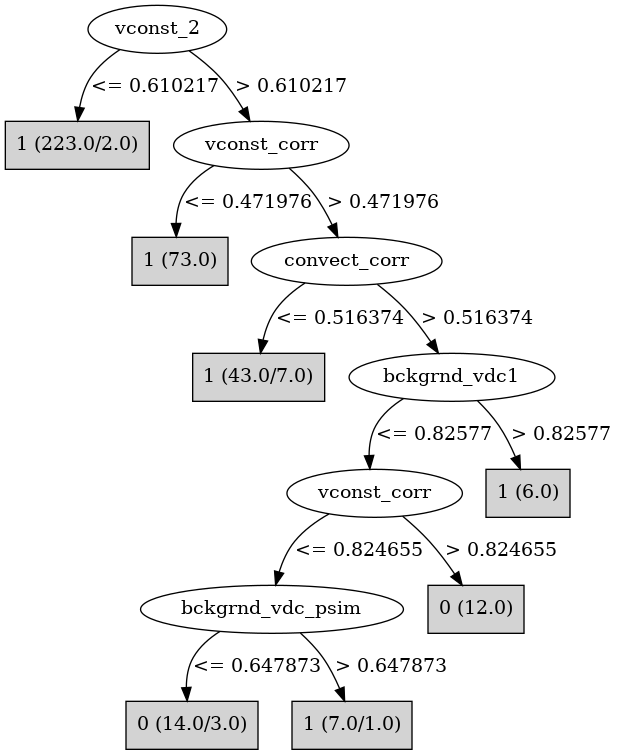

# J48

# SimpleCart Decision Tree

vconst_corr < 0.8431195: 1(312.0/15.0)

vconst_corr >= 0.8431195

* vconst_2 < 0.6062555000000001: 1(26.0/1.0)

* vconst_2 >= 0.6062555000000001

*   * bckgrnd_vdc1 < 0.5145535: 0(13.0/0.0)

*   * bckgrnd_vdc1 >= 0.5145535: 1(7.0/4.0)

# PART

Decision list:

conditions|predicted class
---|---
vconst_2 <= 0.609583| 1 (223.0/2.0)
vconst_corr <= 0.470853| 1 (73.0)
convect_corr <= 0.515342| 1 (43.0/7.0)
bckgrnd_vdc1 <= 0.455999| 0 (21.0/3.0)
vconst_5 <= 0.541093| 0 (10.0/4.0)
| 1 (8.0)

# JRip

Decision list:

conditions|predicted class
---|---
(vconst_2 >= 0.610852) and (vconst_corr >= 0.561778) and (convect_corr >= 0.517406) and (bckgrnd_vdc1 <= 0.551627) and (vertical_decay_scale >= 0.488698)|0 (15.0/0.0)
(vconst_corr >= 0.845014) and (vconst_2 >= 0.736501) and (vconst_5 >= 0.312785)|0 (8.0/0.0)
(vconst_2 >= 0.546623) and (vconst_corr >= 0.582796) and (bckgrnd_vdc1 <= 0.406325) and (vconst_4 <= 0.446702) and (efficiency_factor <= 0.696245)|0 (6.0/0.0)
|1 (349.0/4.0)

# Decision Table

Non matches covered by Majority class

vconst_corr|vconst_2|efficiency_factor|target
---|---|---|---
(0.560146-inf)|(0.610217-inf)|all|1
(-inf-0.560146]|(0.610217-inf)|all|1
(0.560146-inf)|(-inf-0.610217]|all|1
(-inf-0.560146]|(-inf-0.610217]|all|1

