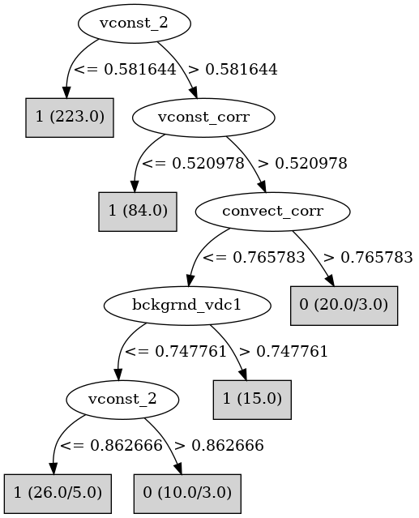

# J48

# SimpleCart Decision Tree

vconst_2 < 0.582851: 1(223.0/0.0)

vconst_2 >= 0.582851

* vconst_corr < 0.6700094999999999: 1(101.0/5.0)

* vconst_corr >= 0.6700094999999999

*   * convect_corr < 0.7536655000000001: 1(23.0/9.0)

*   * convect_corr >= 0.7536655000000001: 0(15.0/2.0)

# PART

Decision list:

conditions|predicted class
---|---
vconst_2 <= 0.581644| 1 (201.0)
vconst_corr <= 0.520978| 1 (77.0)
convect_corr <= 0.765783 AND ah_bolus > 0.401805| 1 (21.0/1.0)
bckgrnd_vdc1 <= 0.82154 AND convect_corr > 0.765783| 0 (16.0)
bckgrnd_vdc1 <= 0.722111 AND tidal_mix_max > 0.419848| 0 (9.0/2.0)
| 1 (17.0/2.0)

# JRip

Decision list:

conditions|predicted class
---|---
(vconst_2 >= 0.584058) and (vconst_corr >= 0.675577) and (convect_corr >= 0.771615) and (bckgrnd_vdc1 <= 0.810977)|0 (15.0/0.0)
|1 (363.0/14.0)

# Decision Table

Non matches covered by IB1

vconst_corr|vconst_2|vconst_5|convect_corr|target
---|---|---|---|---
(0.525184-inf)|(0.582851-inf)|all|(0.40862-inf)|0
(-inf-0.525184]|(0.582851-inf)|all|(0.40862-inf)|1
(0.525184-inf)|(-inf-0.582851]|all|(0.40862-inf)|1
(-inf-0.525184]|(-inf-0.582851]|all|(0.40862-inf)|1
(0.525184-inf)|(0.582851-inf)|all|(-inf-0.40862]|1
(-inf-0.525184]|(0.582851-inf)|all|(-inf-0.40862]|1
(0.525184-inf)|(-inf-0.582851]|all|(-inf-0.40862]|1
(-inf-0.525184]|(-inf-0.582851]|all|(-inf-0.40862]|1

