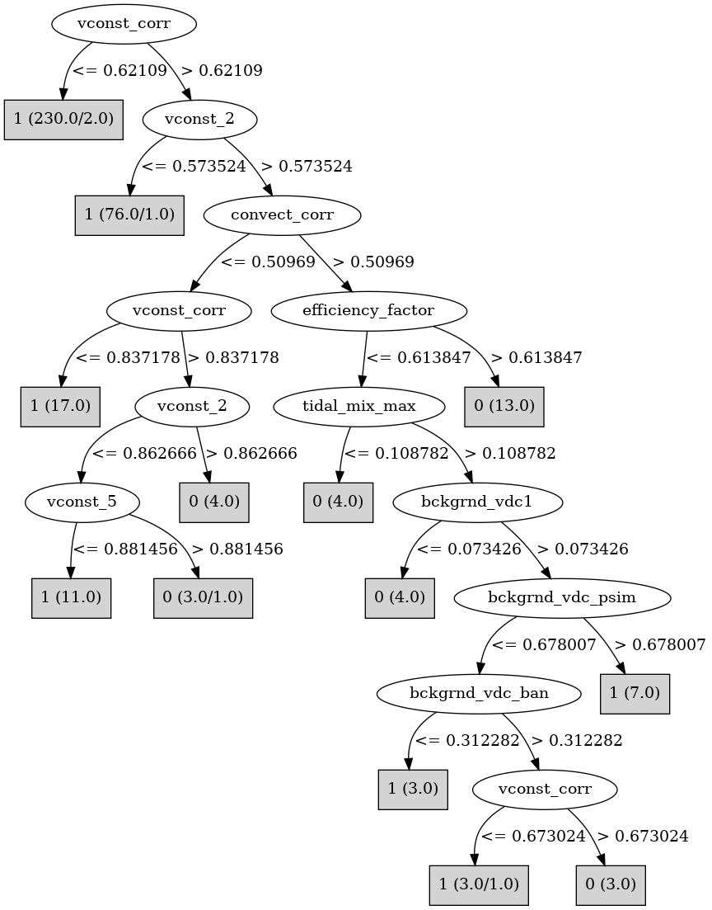

# J48

# SimpleCart Decision Tree

vconst_corr < 0.6229385000000001

* bckgrnd_vdc_ban < 0.007516: 0(1.0/1.0)

* bckgrnd_vdc_ban >= 0.007516

*   * ah_corr < 0.981771: 1(224.0/0.0)

*   * ah_corr >= 0.981771: 1(3.0/1.0)

vconst_corr >= 0.6229385000000001

* vconst_2 < 0.6062555000000001: 1(79.0/2.0)

* vconst_2 >= 0.6062555000000001

*   * convect_corr < 0.5114970000000001

*   *   * bckgrnd_vdc_psim < 0.2547205

*   *   *   * bckgrnd_vdc1 < 0.4053075: 0(4.0/0.0)

*   *   *   * bckgrnd_vdc1 >= 0.4053075: 1(5.0/1.0)

*   *   * bckgrnd_vdc_psim >= 0.2547205: 1(22.0/1.0)

*   * convect_corr >= 0.5114970000000001

*   *   * bckgrnd_vdc1 < 0.836217

*   *   *   * vconst_5 < 0.653446

*   *   *   *   * vconst_2 < 0.640618: 1(2.0/1.0)

*   *   *   *   * vconst_2 >= 0.640618: 0(19.0/0.0)

*   *   *   * vconst_5 >= 0.653446

*   *   *   *   * vconst_2 < 0.6794125: 0(3.0/0.0)

*   *   *   *   * vconst_2 >= 0.6794125: 1(4.0/1.0)

*   *   * bckgrnd_vdc1 >= 0.836217: 1(4.0/0.0)

# PART

Decision list:

conditions|predicted class
---|---
vconst_corr <= 0.622939 AND bckgrnd_vdc_psim > 0.069506| 1 (212.0)
vconst_2 <= 0.577953 AND efficiency_factor <= 0.876291| 1 (75.0)
convect_corr <= 0.639027 AND vconst_2 <= 0.972965 AND vconst_5 <= 0.970385 AND vconst_corr <= 0.853263| 1 (33.0)
vconst_7 <= 0.960806 AND bckgrnd_vdc_psim <= 0.963983 AND bckgrnd_vdc1 <= 0.457998 AND vconst_2 > 0.311847 AND bckgrnd_vdc_eq <= 0.892428| 0 (26.0)
vconst_2 <= 0.901801 AND slm_corr > 0.132632 AND bckgrnd_vdc1 <= 0.740982| 1 (19.0)
vconst_2 > 0.736072| 0 (6.0)
vconst_corr > 0.639782| 1 (5.0)
| 0 (2.0)

# JRip

Decision list:

conditions|predicted class
---|---
(vconst_corr >= 0.624787) and (vconst_2 >= 0.610852) and (convect_corr >= 0.530425)|0 (32.0/9.0)
(vconst_corr >= 0.845014) and (vconst_2 >= 0.867315)|0 (5.0/0.0)
|1 (341.0/6.0)

# Decision Table

Non matches covered by IB1

vconst_corr|vconst_2|vconst_4|vconst_5|convect_corr|bckgrnd_vdc1|target
---|---|---|---|---|---|---
(0.622939-inf)|(0.578791-inf)|all|all|all|(0.450037-inf)|1
(-inf-0.622939]|(0.578791-inf)|all|all|all|(0.450037-inf)|1
(0.622939-inf)|(-inf-0.578791]|all|all|all|(0.450037-inf)|1
(-inf-0.622939]|(-inf-0.578791]|all|all|all|(0.450037-inf)|1
(0.622939-inf)|(0.578791-inf)|all|all|all|(-inf-0.450037]|0
(-inf-0.622939]|(0.578791-inf)|all|all|all|(-inf-0.450037]|1
(-inf-0.622939]|(-inf-0.578791]|all|all|all|(-inf-0.450037]|1
(0.622939-inf)|(-inf-0.578791]|all|all|all|(-inf-0.450037]|1

