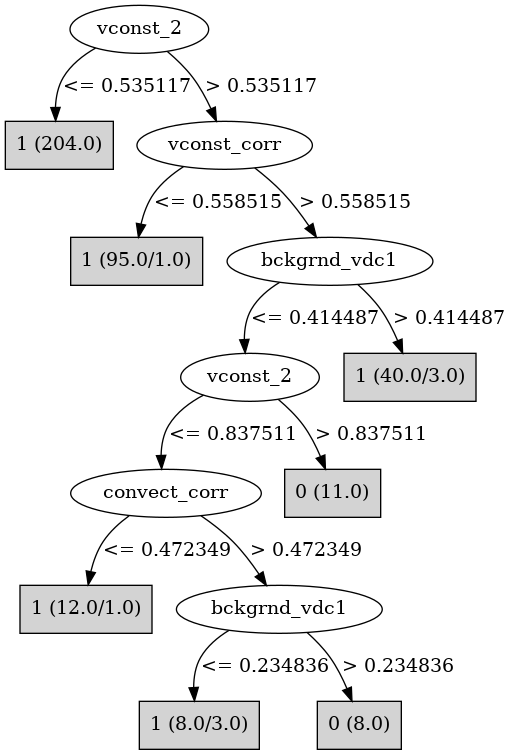

# J48

# SimpleCart Decision Tree

vconst_corr < 0.9031695

* vconst_2 < 0.7406835

*   * vconst_corr < 0.8777360000000001

*   *   * vconst_3 < 0.9592245: 1(234.0/0.0)

*   *   * vconst_3 >= 0.9592245: 1(10.0/1.0)

*   * vconst_corr >= 0.8777360000000001: 1(7.0/1.0)

* vconst_2 >= 0.7406835

*   * vconst_corr < 0.55586: 1(59.0/1.0)

*   * vconst_corr >= 0.55586

*   *   * convect_corr < 0.460766: 1(17.0/1.0)

*   *   * convect_corr >= 0.460766

*   *   *   * bckgrnd_vdc1 < 0.460161: 0(10.0/0.0)

*   *   *   * bckgrnd_vdc1 >= 0.460161: 1(5.0/1.0)

vconst_corr >= 0.9031695

* vconst_2 < 0.5849395: 1(14.0/1.0)

* vconst_2 >= 0.5849395

*   * convect_corr < 0.40192950000000005: 1(5.0/2.0)

*   * convect_corr >= 0.40192950000000005: 0(9.0/0.0)

# PART

Decision list:

conditions|predicted class
---|---
vconst_2 <= 0.535117| 1 (177.0)
vconst_corr <= 0.558515| 1 (88.0/1.0)
bckgrnd_vdc1 <= 0.414487| 0 (33.0/14.0)
| 1 (33.0/3.0)

# JRip

Decision list:

conditions|predicted class
---|---
(vconst_2 >= 0.678215) and (vconst_corr >= 0.561778) and (convect_corr >= 0.479588) and (bckgrnd_vdc1 <= 0.412961)|0 (16.0/1.0)
(vconst_corr >= 0.868261) and (vconst_2 >= 0.867315)|0 (4.0/0.0)
(vconst_corr >= 0.937126) and (vconst_2 >= 0.597218)|0 (7.0/3.0)
|1 (351.0/4.0)

# Decision Table

Non matches covered by IB1

vconst_corr|vconst_2|vconst_5|vconst_7|tidal_mix_max|vertical_decay_scale|convect_corr|bckgrnd_vdc1|bckgrnd_vdc_ban|bckgrnd_vdc_eq|bckgrnd_vdc_psim|target
---|---|---|---|---|---|---|---|---|---|---|---
(-inf-0.560713]|(0.54087-inf)|all|all|all|all|all|(0.413724-inf)|all|all|all|1
(0.560713-inf)|(0.54087-inf)|all|all|all|all|all|(0.413724-inf)|all|all|all|1
(-inf-0.560713]|(-inf-0.54087]|all|all|all|all|all|(0.413724-inf)|all|all|all|1
(0.560713-inf)|(-inf-0.54087]|all|all|all|all|all|(0.413724-inf)|all|all|all|1
(0.560713-inf)|(0.54087-inf)|all|all|all|all|all|(-inf-0.413724]|all|all|all|0
(-inf-0.560713]|(0.54087-inf)|all|all|all|all|all|(-inf-0.413724]|all|all|all|1
(0.560713-inf)|(-inf-0.54087]|all|all|all|all|all|(-inf-0.413724]|all|all|all|1
(-inf-0.560713]|(-inf-0.54087]|all|all|all|all|all|(-inf-0.413724]|all|all|all|1

