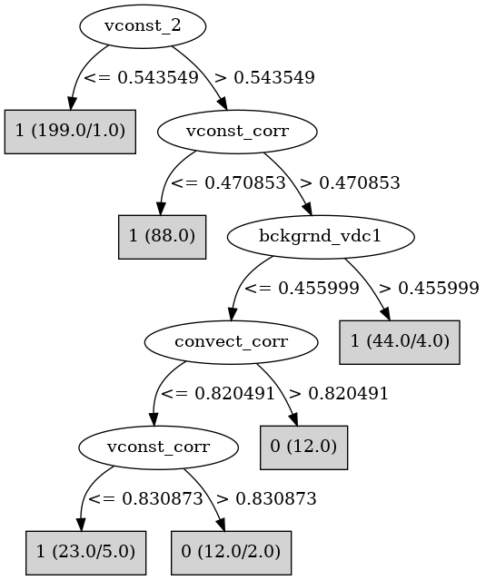

# J48

# SimpleCart Decision Tree

vconst_corr < 0.842644

* vconst_2 < 0.7406835: 1(233.0/2.0)

* vconst_2 >= 0.7406835

*   * vconst_corr < 0.471976: 1(55.0/0.0)

*   * vconst_corr >= 0.471976

*   *   * convect_corr < 0.6141995: 1(16.0/1.0)

*   *   * convect_corr >= 0.6141995

*   *   *   * bckgrnd_vdc_psim < 0.6478735: 0(12.0/2.0)

*   *   *   * bckgrnd_vdc_psim >= 0.6478735: 1(4.0/0.0)

vconst_corr >= 0.842644

* vconst_2 < 0.5442775: 1(24.0/0.0)

* vconst_2 >= 0.5442775

*   * bckgrnd_vdc1 < 0.457998: 0(16.0/2.0)

*   * bckgrnd_vdc1 >= 0.457998: 1(10.0/1.0)

# PART

Decision list:

conditions|predicted class
---|---
vconst_2 <= 0.545086| 1 (199.0/1.0)
vconst_corr <= 0.471976| 1 (88.0)
bckgrnd_vdc1 > 0.4568175 AND slm_corr > 0.202163| 1 (35.0)
convect_corr <= 0.516374 AND vconst_corr <= 0.726325| 1 (10.0)
bckgrnd_vdc1 <= 0.7514475 AND vertical_decay_scale > 0.6148515| 0 (16.0)
| 0 (30.0/15.0)

# JRip

Decision list:

conditions|predicted class
---|---
(vconst_2 >= 0.584058) and (vconst_corr >= 0.526239) and (convect_corr >= 0.613884) and (bckgrnd_vdc1 <= 0.412961)|0 (19.0/2.0)
(vconst_2 >= 0.862666) and (vconst_corr >= 0.526239) and (vconst_3 >= 0.580561)|0 (6.0/0.0)
|1 (353.0/9.0)

# Decision Table

Non matches covered by IB1

vconst_corr|vconst_2|ah_corr|convect_corr|bckgrnd_vdc1|bckgrnd_vdc_psim|target
---|---|---|---|---|---|---
(-inf-0.525184]|(0.545086-inf)|all|(0.517138-inf)|(0.45008-inf)|all|1
(0.525184-inf)|(0.545086-inf)|all|(0.517138-inf)|(0.45008-inf)|all|1
(-inf-0.525184]|(-inf-0.545086]|all|(0.517138-inf)|(0.45008-inf)|all|1
(0.525184-inf)|(-inf-0.545086]|all|(0.517138-inf)|(0.45008-inf)|all|1
(-inf-0.525184]|(0.545086-inf)|all|(-inf-0.517138]|(0.45008-inf)|all|1
(0.525184-inf)|(0.545086-inf)|all|(-inf-0.517138]|(0.45008-inf)|all|1
(0.525184-inf)|(0.545086-inf)|all|(0.517138-inf)|(-inf-0.45008]|all|0
(-inf-0.525184]|(0.545086-inf)|all|(0.517138-inf)|(-inf-0.45008]|all|1
(0.525184-inf)|(-inf-0.545086]|all|(-inf-0.517138]|(0.45008-inf)|all|1
(-inf-0.525184]|(-inf-0.545086]|all|(-inf-0.517138]|(0.45008-inf)|all|1
(0.525184-inf)|(-inf-0.545086]|all|(0.517138-inf)|(-inf-0.45008]|all|1
(-inf-0.525184]|(-inf-0.545086]|all|(0.517138-inf)|(-inf-0.45008]|all|1
(-inf-0.525184]|(0.545086-inf)|all|(-inf-0.517138]|(-inf-0.45008]|all|1
(0.525184-inf)|(0.545086-inf)|all|(-inf-0.517138]|(-inf-0.45008]|all|1
(0.525184-inf)|(-inf-0.545086]|all|(-inf-0.517138]|(-inf-0.45008]|all|1
(-inf-0.525184]|(-inf-0.545086]|all|(-inf-0.517138]|(-inf-0.45008]|all|1

