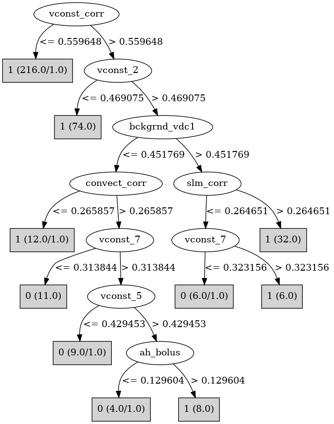

# J48

# SimpleCart Decision Tree

vconst_corr < 0.8420225

* vconst_4 < 0.055738499999999996: 1(15.0/5.0)

* vconst_4 >= 0.055738499999999996: 1(294.0/7.0)

vconst_corr >= 0.8420225

* vconst_2 < 0.5442775: 1(28.0/1.0)

* vconst_2 >= 0.5442775

*   * convect_corr < 0.40192950000000005: 1(8.0/1.0)

*   * convect_corr >= 0.40192950000000005: 0(15.0/4.0)

# PART

Decision list:

conditions|predicted class
---|---
vconst_corr <= 0.560713| 1 (216.0/1.0)
vconst_2 <= 0.4756905| 1 (74.0)
bckgrnd_vdc1 > 0.4558495 AND slm_corr > 0.267071| 1 (32.0)
convect_corr > 0.2659825 AND vconst_4 <= 0.7674479999999999 AND vconst_7 <= 0.316745| 0 (17.0/1.0)
vconst_2 <= 0.8378019999999999 AND vertical_decay_scale <= 0.4194| 1 (15.0)
slm_corr > 0.215057 AND slm_corr <= 0.6095865| 0 (11.0/1.0)
vconst_corr <= 0.832598| 1 (10.0)
| 0 (3.0/1.0)

# JRip

Decision list:

conditions|predicted class
---|---
(vconst_corr >= 0.561778) and (vconst_2 >= 0.546623) and (convect_corr >= 0.479588) and (bckgrnd_vdc1 <= 0.536835)|0 (25.0/5.0)
(vconst_corr >= 0.728289) and (vconst_2 >= 0.736501) and (vconst_7 <= 0.578352)|0 (8.0/1.0)
|1 (345.0/2.0)

# Decision Table

Non matches covered by Majority class

vconst_corr|vconst_2|bckgrnd_vdc1|bckgrnd_vdc_eq|target
---|---|---|---|---
(0.560713-inf)|(0.481878-inf)|(0.449666-inf)|all|1
(-inf-0.560713]|(0.481878-inf)|(0.449666-inf)|all|1
(0.560713-inf)|(-inf-0.481878]|(0.449666-inf)|all|1
(-inf-0.560713]|(-inf-0.481878]|(0.449666-inf)|all|1
(0.560713-inf)|(0.481878-inf)|(-inf-0.449666]|all|0
(-inf-0.560713]|(0.481878-inf)|(-inf-0.449666]|all|1
(-inf-0.560713]|(-inf-0.481878]|(-inf-0.449666]|all|1
(0.560713-inf)|(-inf-0.481878]|(-inf-0.449666]|all|1

