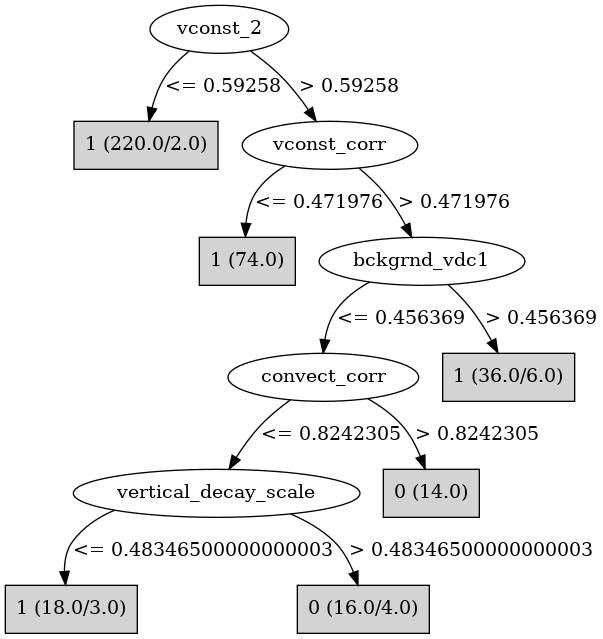

# J48

# SimpleCart Decision Tree

vconst_2 < 0.59258: 1(218.0/2.0)

vconst_2 >= 0.59258

* vconst_corr < 0.519093: 1(80.0/1.0)

* vconst_corr >= 0.519093

*   * bckgrnd_vdc1 < 0.4575495

*   *   * convect_corr < 0.5228835000000001: 1(13.0/6.0)

*   *   * convect_corr >= 0.5228835000000001: 0(22.0/4.0)

*   * bckgrnd_vdc1 >= 0.4575495: 1(26.0/6.0)

# PART

Decision list:

conditions|predicted class
---|---
vconst_2 <= 0.587942| 1 (145.0/2.0)
vconst_corr <= 0.470853| 1 (49.0)
bckgrnd_vdc1 > 0.441679| 1 (25.0/3.0)
convect_corr > 0.522634| 0 (18.0/3.0)
| 1 (15.0/4.0)

# JRip

Decision list:

conditions|predicted class
---|---
(vconst_corr >= 0.526239) and (convect_corr >= 0.624722) and (bckgrnd_vdc1 <= 0.412961) and (vconst_2 >= 0.642815)|0 (15.0/0.0)
(vconst_corr >= 0.845014) and (vconst_2 >= 0.867315)|0 (8.0/0.0)
(vconst_2 >= 0.597218) and (vconst_corr >= 0.675577) and (vertical_decay_scale >= 0.51517) and (bckgrnd_vdc1 <= 0.420295) and (efficiency_factor <= 0.755481)|0 (7.0/0.0)
|1 (348.0/7.0)

# Decision Table

Non matches covered by Majority class

vconst_corr|vconst_2|vconst_7|bckgrnd_vdc1|bckgrnd_vdc_eq|target
---|---|---|---|---|---
(0.560713-inf)|(0.59258-inf)|all|(0.449218-inf)|all|1
(-inf-0.560713]|(0.59258-inf)|all|(0.449218-inf)|all|1
(-inf-0.560713]|(-inf-0.59258]|all|(0.449218-inf)|all|1
(0.560713-inf)|(-inf-0.59258]|all|(0.449218-inf)|all|1
(0.560713-inf)|(0.59258-inf)|all|(-inf-0.449218]|all|0
(-inf-0.560713]|(0.59258-inf)|all|(-inf-0.449218]|all|1
(-inf-0.560713]|(-inf-0.59258]|all|(-inf-0.449218]|all|1
(0.560713-inf)|(-inf-0.59258]|all|(-inf-0.449218]|all|1

