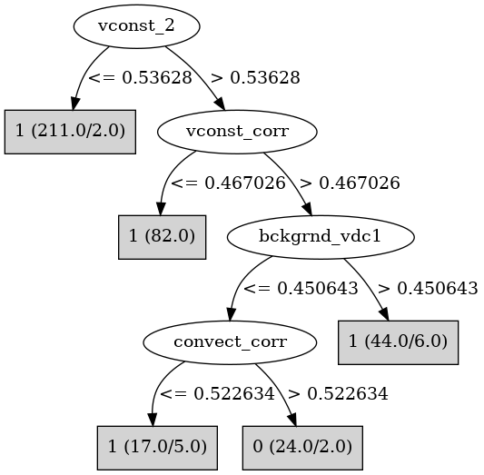

# J48

# SimpleCart Decision Tree

vconst_corr < 0.9031695

* vconst_2 < 0.7386195: 1(249.0/5.0)

* vconst_2 >= 0.7386195

*   * vconst_corr < 0.5216000000000001: 1(56.0/1.0)

*   * vconst_corr >= 0.5216000000000001

*   *   * convect_corr < 0.6141995: 1(15.0/3.0)

*   *   * convect_corr >= 0.6141995: 0(12.0/2.0)

vconst_corr >= 0.9031695

* vconst_2 < 0.5783594999999999: 1(18.0/1.0)

* vconst_2 >= 0.5783594999999999: 0(13.0/3.0)

# PART

Decision list:

conditions|predicted class
---|---
vconst_2 <= 0.53628| 1 (211.0/2.0)
vconst_corr <= 0.467026| 1 (82.0)
bckgrnd_vdc1 > 0.450643| 1 (44.0/6.0)
convect_corr > 0.522634| 0 (24.0/2.0)
| 1 (17.0/5.0)

# JRip

Decision list:

conditions|predicted class
---|---
(vconst_2 >= 0.621174) and (vconst_corr >= 0.526239) and (convect_corr >= 0.641261) and (ah_bolus >= 0.549631)|0 (14.0/0.0)
(vconst_corr >= 0.84282) and (vconst_2 >= 0.867315)|0 (7.0/0.0)
(vconst_corr >= 0.582796) and (vconst_2 >= 0.546623) and (bckgrnd_vdc1 <= 0.449517) and (bckgrnd_vdc_eq <= 0.391056)|0 (7.0/0.0)
|1 (350.0/7.0)

# Decision Table

Non matches covered by Majority class

vconst_corr|vconst_2|vconst_5|vconst_7|ah_corr|ah_bolus|slm_corr|efficiency_factor|bckgrnd_vdc1|bckgrnd_vdc_eq|prandtl|target
---|---|---|---|---|---|---|---|---|---|---|---
(0.525184-inf)|(0.541451-inf)|all|all|all|all|all|all|(0.449666-inf)|all|all|1
(-inf-0.525184]|(0.541451-inf)|all|all|all|all|all|all|(0.449666-inf)|all|all|1
(-inf-0.525184]|(-inf-0.541451]|all|all|all|all|all|all|(0.449666-inf)|all|all|1
(0.525184-inf)|(-inf-0.541451]|all|all|all|all|all|all|(0.449666-inf)|all|all|1
(0.525184-inf)|(0.541451-inf)|all|all|all|all|all|all|(-inf-0.449666]|all|all|0
(-inf-0.525184]|(0.541451-inf)|all|all|all|all|all|all|(-inf-0.449666]|all|all|1
(0.525184-inf)|(-inf-0.541451]|all|all|all|all|all|all|(-inf-0.449666]|all|all|1
(-inf-0.525184]|(-inf-0.541451]|all|all|all|all|all|all|(-inf-0.449666]|all|all|1

