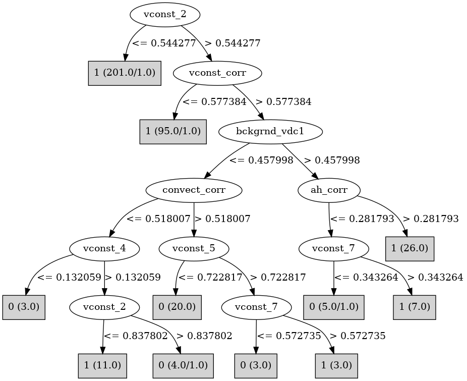

# J48

# SimpleCart Decision Tree

: 1(343.0/35.0)

# PART

Decision list:

conditions|predicted class
---|---
vconst_2 <= 0.541932| 1 (201.0/1.0)
vconst_corr <= 0.574971| 1 (95.0/1.0)
bckgrnd_vdc1 > 0.457226| 1 (38.0/4.0)
convect_corr > 0.517406| 0 (26.0/3.0)
vconst_2 <= 0.782256| 1 (9.0/1.0)
| 0 (9.0/4.0)

# JRip

Decision list:

conditions|predicted class
---|---
(vconst_2 >= 0.584058) and (vconst_corr >= 0.616469) and (convect_corr >= 0.517406) and (bckgrnd_vdc1 <= 0.408746)|0 (20.0/1.0)
(vconst_corr >= 0.851386) and (vconst_2 >= 0.736501)|0 (10.0/3.0)
|1 (348.0/9.0)

# Decision Table

Non matches covered by IB1

vconst_corr|vconst_2|vconst_3|vconst_4|vconst_7|ah_bolus|efficiency_factor|vertical_decay_scale|convect_corr|bckgrnd_vdc1|bckgrnd_vdc_ban|bckgrnd_vdc_eq|bckgrnd_vdc_psim|target
---|---|---|---|---|---|---|---|---|---|---|---|---|---
(-inf-0.581588]|(0.544277-inf)|all|all|all|all|all|all|(-inf-0.517138]|(-inf-0.449666]|all|all|all|1
(0.581588-inf)|(0.544277-inf)|all|all|all|all|all|all|(-inf-0.517138]|(-inf-0.449666]|all|all|all|1
(0.581588-inf)|(-inf-0.544277]|all|all|all|all|all|all|(-inf-0.517138]|(-inf-0.449666]|all|all|all|1
(-inf-0.581588]|(-inf-0.544277]|all|all|all|all|all|all|(-inf-0.517138]|(-inf-0.449666]|all|all|all|1
(-inf-0.581588]|(0.544277-inf)|all|all|all|all|all|all|(0.517138-inf)|(0.449666-inf)|all|all|all|1
(0.581588-inf)|(0.544277-inf)|all|all|all|all|all|all|(0.517138-inf)|(0.449666-inf)|all|all|all|1
(-inf-0.581588]|(-inf-0.544277]|all|all|all|all|all|all|(0.517138-inf)|(0.449666-inf)|all|all|all|1
(0.581588-inf)|(-inf-0.544277]|all|all|all|all|all|all|(0.517138-inf)|(0.449666-inf)|all|all|all|1
(-inf-0.581588]|(0.544277-inf)|all|all|all|all|all|all|(-inf-0.517138]|(0.449666-inf)|all|all|all|1
(0.581588-inf)|(0.544277-inf)|all|all|all|all|all|all|(-inf-0.517138]|(0.449666-inf)|all|all|all|1
(0.581588-inf)|(0.544277-inf)|all|all|all|all|all|all|(0.517138-inf)|(-inf-0.449666]|all|all|all|0
(-inf-0.581588]|(-inf-0.544277]|all|all|all|all|all|all|(-inf-0.517138]|(0.449666-inf)|all|all|all|1
(0.581588-inf)|(-inf-0.544277]|all|all|all|all|all|all|(-inf-0.517138]|(0.449666-inf)|all|all|all|1
(-inf-0.581588]|(0.544277-inf)|all|all|all|all|all|all|(0.517138-inf)|(-inf-0.449666]|all|all|all|1
(0.581588-inf)|(-inf-0.544277]|all|all|all|all|all|all|(0.517138-inf)|(-inf-0.449666]|all|all|all|1
(-inf-0.581588]|(-inf-0.544277]|all|all|all|all|all|all|(0.517138-inf)|(-inf-0.449666]|all|all|all|1

