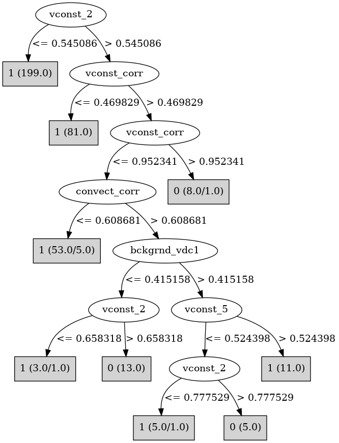

# J48

# SimpleCart Decision Tree

: 1(346.0/32.0)

# PART

Decision list:

conditions|predicted class
---|---
vconst_2 <= 0.543549| 1 (199.0)
vconst_corr <= 0.469471| 1 (81.0)
convect_corr <= 0.608544 AND vconst_corr <= 0.830873| 1 (38.0/1.0)
bckgrnd_vdc1 <= 0.414487 AND bckgrnd_vdc_eq <= 0.582468| 0 (15.0)
vconst_2 <= 0.860625 AND vconst_5 <= 0.49455| 1 (17.0/6.0)
vconst_2 <= 0.856036| 1 (16.0)
| 0 (12.0/2.0)

# JRip

Decision list:

conditions|predicted class
---|---
(vconst_2 >= 0.597218) and (vconst_corr >= 0.616469) and (convect_corr >= 0.613884) and (vconst_5 <= 0.375868) and (vconst_3 >= 0.126606)|0 (13.0/0.0)
(vconst_2 >= 0.862666) and (vconst_corr >= 0.851386)|0 (6.0/0.0)
(vconst_2 >= 0.546623) and (vconst_corr >= 0.473099) and (bckgrnd_vdc1 <= 0.412961) and (vertical_decay_scale >= 0.488698) and (ah_corr >= 0.346303)|0 (7.0/0.0)
(vconst_2 >= 0.751089) and (convect_corr >= 0.643533) and (vconst_corr >= 0.473099) and (vconst_5 <= 0.553195)|0 (3.0/0.0)
(vconst_corr >= 0.908603) and (bckgrnd_vdc_eq <= 0.254057) and (vconst_corr <= 0.939356)|0 (2.0/0.0)
|1 (347.0/1.0)

# Decision Table

Non matches covered by IB1

vconst_corr|vconst_2|vconst_4|vconst_5|vconst_7|ah_corr|ah_bolus|slm_corr|efficiency_factor|tidal_mix_max|vertical_decay_scale|convect_corr|bckgrnd_vdc1|bckgrnd_vdc_ban|bckgrnd_vdc_eq|bckgrnd_vdc_psim|prandtl|target
---|---|---|---|---|---|---|---|---|---|---|---|---|---|---|---|---|---
(-inf-0.471285]|(0.545086-inf)|all|all|all|all|all|all|all|all|all|(0.517138-inf)|all|all|all|all|all|1
(0.471285-inf)|(0.545086-inf)|all|all|all|all|all|all|all|all|all|(0.517138-inf)|all|all|all|all|all|0
(-inf-0.471285]|(-inf-0.545086]|all|all|all|all|all|all|all|all|all|(0.517138-inf)|all|all|all|all|all|1
(0.471285-inf)|(-inf-0.545086]|all|all|all|all|all|all|all|all|all|(0.517138-inf)|all|all|all|all|all|1
(-inf-0.471285]|(0.545086-inf)|all|all|all|all|all|all|all|all|all|(-inf-0.517138]|all|all|all|all|all|1
(0.471285-inf)|(0.545086-inf)|all|all|all|all|all|all|all|all|all|(-inf-0.517138]|all|all|all|all|all|1
(-inf-0.471285]|(-inf-0.545086]|all|all|all|all|all|all|all|all|all|(-inf-0.517138]|all|all|all|all|all|1
(0.471285-inf)|(-inf-0.545086]|all|all|all|all|all|all|all|all|all|(-inf-0.517138]|all|all|all|all|all|1

